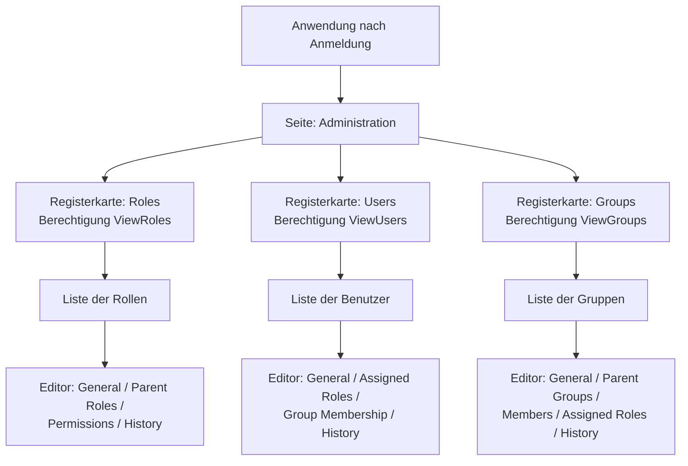
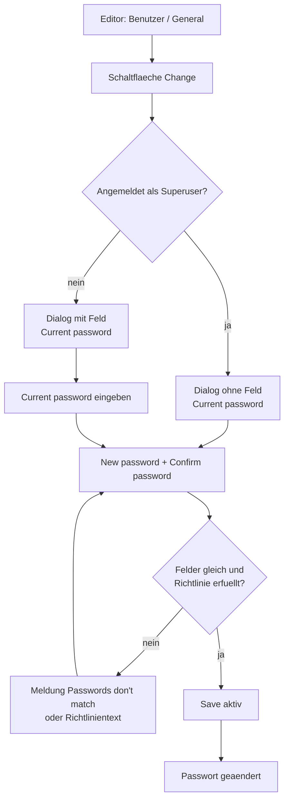
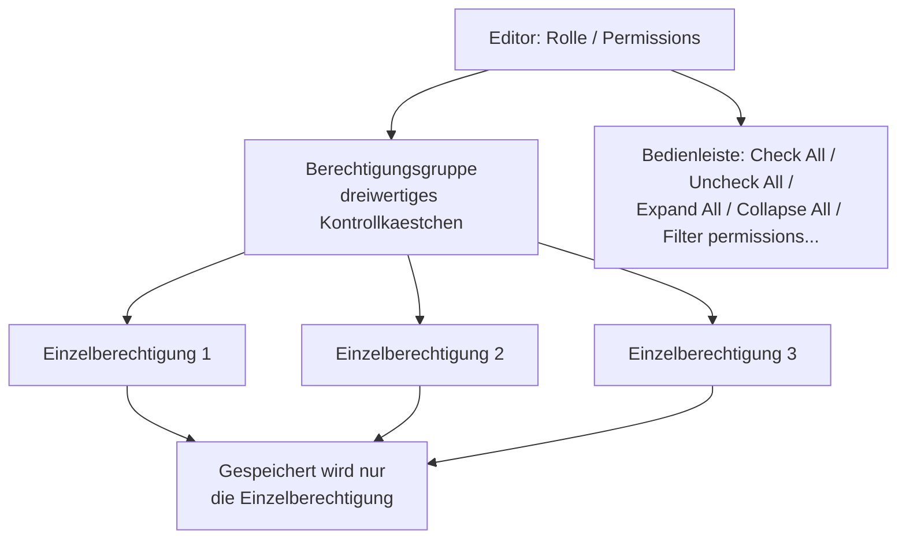
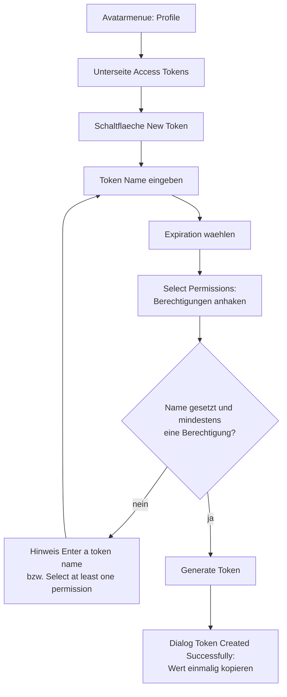
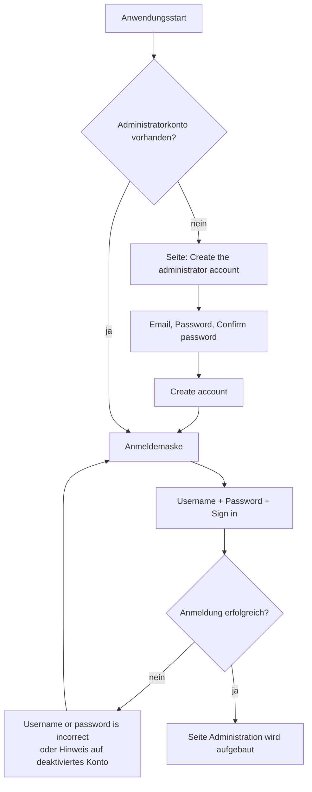

# Puma – Dokumentation der Administrationsoberfläche

Reine Oberflächenbeschreibung der Benutzerverwaltung

---

## Inhaltsverzeichnis

1. [Über dieses Dokument](#1-über-dieses-dokument)
2. [Aufbau der Administrationsseite](#2-aufbau-der-administrationsseite)
3. [Gemeinsame Bedienelemente](#3-gemeinsame-bedienelemente)
4. [Registerkarte „Users“ (Benutzer)](#4-registerkarte-users-benutzer)
5. [Registerkarte „Roles“ (Rollen)](#5-registerkarte-roles-rollen)
6. [Registerkarte „Groups“ (Gruppen)](#6-registerkarte-groups-gruppen)
7. [Profilseite (Selbstbedienung)](#7-profilseite-selbstbedienung)
8. [Anmeldung und Erstinbetriebnahme](#8-anmeldung-und-erstinbetriebnahme)
9. [Meldungen der Oberfläche](#9-meldungen-der-oberfläche)
10. [Berechtigungsreferenz der Oberfläche](#10-berechtigungsreferenz-der-oberfläche)
11. [Nicht in der Oberfläche enthalten](#11-nicht-in-der-oberfläche-enthalten)

---

## 1. Über dieses Dokument

### 1.1 Zweck

Dieses Dokument beschreibt ausschließlich die **Administrationsoberfläche**, mit der Benutzer, Rollen und Gruppen eines Puma-Servers gepflegt werden. Es benennt jede Seite, jede Liste, jedes Eingabefeld und jede Schaltfläche und erklärt, was die Bedienelemente bewirken und unter welchen Bedingungen sie sichtbar oder bedienbar sind.

Konzepte, Serverbetrieb, SDK-Integration, LDAP-Anbindung und Sicherheitsrichtlinien sind **nicht** Gegenstand dieses Dokuments. Sie sind im [Benutzerhandbuch](../Benutzerhandbuch/Benutzerhandbuch_DE.md) beschrieben.

### 1.2 Zielgruppe

Administratoren und Anwender, die die Benutzerverwaltung im Client bedienen.

### 1.3 Herkunft der Oberfläche

Die Oberfläche ist kein Bestandteil von Puma selbst, sondern wird als fertige QML-Komponente aus dem Repository `ImagingTools/ImtCore` bezogen (Modul `Qml/imtauthgui`). Puma bindet sie über die Komposition `Impl/AuthClientSdk/AdministrationWidget.acc` ein, die die Einstiegsdatei `qrc:/qml/imtauthgui/AdministrationUi.qml` lädt. Jede Anwendung, die diese Komponente einbindet, zeigt daher dieselben Seiten und dieselben Beschriftungen.

### 1.4 Hinweis zu den Beschriftungen

Alle in diesem Dokument zitierten Beschriftungen sind die **englischen Originaltexte** der Oberfläche, so wie sie ohne installiertes Sprachpaket erscheinen. Sie sind übersetzbar; ist für die Anwendung eine Übersetzung hinterlegt, erscheinen die Texte in der jeweiligen Landessprache. Die Struktur der Seiten bleibt davon unberührt.

---

## 2. Aufbau der Administrationsseite

### 2.1 Einstieg

Die Administrationsseite trägt den Seitentitel **„Administration“**. Sie wird erst **nach erfolgreicher Anmeldung** aufgebaut; vor der Anmeldung zeigt die Anwendung an ihrer Stelle die Anmeldemaske (siehe Kapitel 8).

Die Seite besteht aus drei Registerkarten, die in dieser Reihenfolge angelegt werden:

| Reihenfolge | Registerkarte | Symbol | Erforderliche Berechtigung |
| --- | --- | --- | --- |
| 1 | **Roles** | Rollensymbol | `ViewRoles` |
| 2 | **Users** | Kontosymbol | `ViewUsers` |
| 3 | **Groups** | Mehrbenutzersymbol | `ViewGroups` |

Eine Registerkarte wird **gar nicht angezeigt**, wenn die zugehörige Ansichtsberechtigung fehlt – sie erscheint nicht ausgegraut, sondern entfällt vollständig. Fehlen alle drei Berechtigungen, bleibt die Administrationsseite leer.

Der Superuser (Anmeldename `su`) erhält bei jeder Berechtigungsprüfung der Oberfläche eine Zusage; für ihn sind daher stets alle Registerkarten sichtbar.

### 2.2 Struktur

*Abbildung 1: Seitenstruktur der Administrationsoberfläche – drei berechtigungsabhängige Registerkarten mit je einer Liste und einem mehrseitigen Editor.*

### 2.3 Zwei-Bereiche-Muster

Jede Registerkarte folgt demselben Muster:

1. **Listenbereich** – eine Tabelle aller Objekte der jeweiligen Sammlung mit Befehlsleiste, Suche, Sortierung und Filtern.
2. **Editorbereich** – ein mehrseitiger Editor, der sich durch Doppelklick auf eine Zeile oder über den Befehl **Edit** öffnet. Mehrere Objekte können gleichzeitig geöffnet sein; jedes geöffnete Objekt erhält einen eigenen Reiter.

Die Listenansicht selbst trägt innerhalb der Registerkarte noch einmal den Titel der Sammlung (**„Roles“**, **„Users“**, **„Groups“**).

---

## 3. Gemeinsame Bedienelemente

Alle drei Registerkarten verwenden dieselben Listen- und Editorbausteine. Sie werden hier einmal beschrieben und in den Kapiteln 4 bis 6 nur noch um die jeweiligen Besonderheiten ergänzt.

### 3.1 Befehlsleiste der Liste

| Befehl | Position | Aktivierungsbedingung | Wirkung |
| --- | --- | --- | --- |
| **New** | links | immer, sofern die Anlegeberechtigung vorliegt | Legt ein neues Objekt an und öffnet den Editor. Die Beschriftung nennt den Objekttyp, z. B. **„New User“**, **„New Role“**, **„New Group“**. |
| **Edit** | links | genau **eine** Zeile ausgewählt | Öffnet das gewählte Objekt im Editor. |
| **Remove** | links | **mindestens eine** Zeile ausgewählt | Löscht die gewählten Objekte nach Rückfrage. |
| **Export** | rechts | genau eine Zeile ausgewählt | Schreibt das gewählte Objekt in eine Datei. |
| **Revision** | rechts | genau eine Zeile ausgewählt | Öffnet die Revisionsansicht. Erfordert die Berechtigung `ViewRevisions`; ohne Auswahl ist der Befehl deaktiviert. |

Ein Befehl, für den die nötige Berechtigung fehlt, steht nicht zur Verfügung. Die je Sammlung erforderlichen Berechtigungen sind in Kapitel 10 zusammengefasst.

### 3.2 Rückfrage beim Löschen

Vor dem Löschen erscheint ein Bestätigungsdialog. Für Rollen lautet er **„Deleting a role“** / **„Delete the selected role ?“**, für Benutzer und Gruppen wird der allgemeine Text **„Deleting a selected element“** / **„Remove selected item from the collection ?“** verwendet. Wird der gesamte Filterbestand gelöscht, lautet die Rückfrage **„Deleting elements“** / **„Delete all items with the current filter ?“**.

### 3.3 Suchen, Sortieren, Filtern

- Jede Liste besitzt ein Suchfeld über der Tabelle.
- Sortierbare Spalten sind durch Klick auf die Spaltenüberschrift sortierbar; welche Spalten sortierbar sind, ist in den Kapiteln 4 bis 6 angegeben.
- Spalten mit Filterfunktion bieten ein Filtermenü in der Spaltenüberschrift.

### 3.4 Aktualisierungshinweis

Die Listen werden vom Server versorgt. Ändert ein anderer Arbeitsplatz denselben Datenbestand, blendet die Liste den Hinweis **„This table has been modified from another computer“** mit der Schaltfläche **„Update“** ein. Erst nach Betätigen von **Update** zeigt die Tabelle den aktuellen Stand.

### 3.5 Editor

Der Editor belegt den rechten Bereich der Registerkarte und besteht aus:

- einer **Seitenliste am linken Rand** mit den Unterseiten des Objekts (z. B. *General*, *Assigned Roles*),
- dem **Inhaltsbereich** der gewählten Unterseite,
- den Dokumentbefehlen **Save**, **Undo**, **Redo** und **Close**.

Änderungen werden erst mit **Save** an den Server übertragen. **Save**, **Undo** und **Redo** erfordern eine der Änderungsberechtigungen der jeweiligen Sammlung.

### 3.6 Auswahlfelder für Zuordnungen

Rollen-, Gruppen- und Mitgliederzuordnungen verwenden überall dasselbe Bedienelement: eine Liste der bereits zugeordneten Einträge mit Zähler, darunter eine Schaltfläche zum Hinzufügen (z. B. **„Add Role“**). Die Schaltfläche öffnet eine **durchsuchbare Auswahlliste**; die Auswahl erfolgt also nicht über Kontrollkästchen in einer Gesamtliste. Bereits zugeordnete Einträge lassen sich einzeln wieder entfernen.

### 3.7 Historie

Besitzt der angemeldete Benutzer die Berechtigung `ViewRevisions`, enthält jeder Editor zusätzlich die Unterseite **„History“**. Ihre Überschrift nennt die Anzahl der Revisionen in Klammern, z. B. `History (7)`. Ohne diese Berechtigung fehlt die Unterseite.

---

## 4. Registerkarte „Users“ (Benutzer)

### 4.1 Liste der Benutzer

| Spalte | Beschriftung | Sortierbar | Filterbar | Inhalt |
| --- | --- | --- | --- | --- |
| `name` | **Name** | ja | ja | Anzeigename des Benutzers. Standardsortierung: aufsteigend nach dieser Spalte. |
| `mail` | **Email** | ja | ja | Hinterlegte E-Mail-Adresse. |
| `systemName` | **System Name** | ja | ja | Name des externen Anmeldesystems; bei internen Konten leer. |
| `roles` | **Roles** | nein | nein | Zusammenfassung der zugewiesenen Rollen. |
| `groups` | **Groups** | nein | nein | Zusammenfassung der Gruppenmitgliedschaften. |
| `lastConnection` | **Last Connection** | ja | nein | Zeitpunkt der letzten Anmeldung. |

**Spalten „Roles“ und „Groups“:** Statt der vollständigen Aufzählung zeigt die Zelle **„View roles(N)“** bzw. **„View groups(N)“** mit der Anzahl in Klammern, bei leerer Zuordnung **„No roles“** bzw. **„No groups“**. Der Tooltip listet die einzelnen Rollen bzw. Gruppen auf und nennt den Benutzernamen.

**Filter „System Info“:** Die Spalte `systemName` bietet den Filter **„System Info“** mit den beiden Optionen **„Internal“** und **„LDAP“**. Damit lässt sich die Liste auf intern verwaltete bzw. auf über ein Verzeichnis angemeldete Konten einschränken. Dies ist die einzige LDAP-bezogene Bedienmöglichkeit der Oberfläche.

### 4.2 Befehle

Es gelten die Befehle aus Abschnitt 3.1. Der Anlegebefehl heißt **„New User“**. Die erforderlichen Berechtigungen sind `AddUser` (New), `ViewUsers` und `ChangeUser` (Edit) sowie `RemoveUser` (Remove).

### 4.3 Editor – Unterseiten

| Unterseite | Titel in der Seitenliste | Anzeigebedingung |
| --- | --- | --- |
| General | **General** | immer |
| Roles | **Assigned Roles** | immer |
| Groups | **Group Membership** | immer |
| History | **History** | nur mit `ViewRevisions` |

### 4.4 Unterseite „General“

Die Seite gliedert sich in den Abschnitt **„General“** mit den Stammdaten und – sofern zutreffend – den Abschnitt **„System Information“**.

| Feld | Beschriftung | Platzhalter | Pflicht | Sichtbarkeit / Besonderheit |
| --- | --- | --- | --- | --- |
| Anmeldename | **Username** | „Enter the username“ | ja – Fehlertext **„Please enter the username“** | **Schreibgeschützt**, sobald das Konto einem externen System zugeordnet ist. |
| Anzeigename | **Name** | „Enter the name“ | ja – Fehlertext **„Please enter the name“** | – |
| E-Mail | **Email Address** | „Enter the email“ | ja – Fehlertext **„Please enter the email“** | Wird gegen ein E-Mail-Muster geprüft. |
| Kontostatus | **Account enabled**, Erläuterung **„Disabled accounts cannot log in“** | – | – | Schalter. **Nur für den Superuser sichtbar**; für alle anderen Anmeldungen fehlt der Schalter vollständig. |
| Passwort | **Password** | „Enter the password“ | ja | **Nur beim Anlegen eines neuen Benutzers sichtbar.** Schreibgeschützt, wenn das Konto an ein aktives externes System gebunden ist. |
| Passwortwiederholung | **Confirm password** | „Confirm password“ | ja – Fehlertext **„Please enter the password“** | Nur zusammen mit dem Feld *Password*. |
| Passwortänderung | **Change password** mit Schaltfläche **„Change“** | – | – | **Nur bei bestehenden Benutzern sichtbar**; entfällt vollständig für Konten eines externen Systems. |

Stimmen die beiden Passwortfelder nicht überein oder bleibt das neue Passwort leer, erscheint der Hinweis **„Passwords don't match“**. Verstößt das Passwort gegen die Passwortrichtlinie, nennt die Oberfläche die verletzte Regel im Klartext (siehe Abschnitt 9.2).

**Abschnitt „System Information“:** Eine einspaltige Tabelle mit der Spaltenüberschrift **„System Name“**, in der sich genau ein Eintrag auswählen lässt. Der Abschnitt wird ausgeblendet, wenn dem Konto höchstens ein Anmeldesystem zugeordnet ist.

### 4.5 Unterseite „Assigned Roles“

Überschrift **„Assigned Roles“**, darunter das Auswahlfeld mit der Bezeichnung **„Roles“** und der Schaltfläche **„Add Role“**. Die Anzahl der zugewiesenen Rollen wird mit angezeigt. Die Auswahlliste ist nach Rollennamen durchsuchbar und sortiert und zeigt ausschließlich Rollen des aktuellen Produkts.

### 4.6 Unterseite „Group Membership“

Überschrift **„Group Membership“**, darunter das Auswahlfeld **„Groups“** mit der Schaltfläche **„Add Group“** und Anzeige der Anzahl.

### 4.7 Dialog „Change Password“

*Abbildung 2: Ablauf des Dialogs „Change Password“ – der Superuser wird nicht nach dem bisherigen Passwort gefragt.*

Der Dialog trägt den Titel **„Change Password“** und enthält die Schaltflächen **„Save“** und **„Cancel“**. **Save** bleibt so lange deaktiviert, bis die Eingaben vollständig und gültig sind.

Die Felder erscheinen in dieser Reihenfolge:

1. **Current password**, Platzhalter „Enter the current password“ – **entfällt für den Superuser**.
2. **New password**, Platzhalter „Enter the new password“.
3. **Confirm password**, Platzhalter „Confirm password“.

Die Felder für das neue Passwort bleiben schreibgeschützt, solange das bisherige Passwort nicht eingegeben wurde. Unterhalb der Felder zeigt die Oberfläche fortlaufend die geltenden Passwortanforderungen an.

---

## 5. Registerkarte „Roles“ (Rollen)

### 5.1 Liste der Rollen

| Spalte | Beschriftung | Sortierbar | Inhalt |
| --- | --- | --- | --- |
| `roleName` | **Role Name** | ja | Sprechender Name der Rolle. |
| `roleId` | **Role-ID** | ja | Technische Kennung der Rolle. |
| `roleDescription` | **Description** | ja | Freitextbeschreibung. |

### 5.2 Befehle

Der Anlegebefehl heißt **„New Role“**. Erforderliche Berechtigungen: `AddRole` (New), `ViewRoles` und `ChangeRole` (Edit), `RemoveRole` (Remove). Die Löschrückfrage lautet **„Deleting a role“** / **„Delete the selected role ?“**.

### 5.3 Editor – Unterseiten

| Unterseite | Titel in der Seitenliste | Anzeigebedingung |
| --- | --- | --- |
| General | **General** | immer |
| ParentRoles | **Parent Roles** | immer |
| Permission | **Permissions** | immer |
| History | **History** | nur mit `ViewRevisions` |

### 5.4 Unterseite „General“

| Feld | Beschriftung | Platzhalter | Besonderheit |
| --- | --- | --- | --- |
| Rollenname | **Role Name** | „Enter the role name“ | Pflichtfeld. |
| Rollenkennung | **Role-ID** | – | **Schreibgeschützt.** Die Kennung wird automatisch aus dem Rollennamen gebildet, indem alle Leerzeichen entfernt werden. |
| Beschreibung | **Description** | „Enter the description“ | Optional. |

### 5.5 Unterseite „Parent Roles“

Überschrift **„Parent Roles“**, Auswahlfeld **„Parent Roles“** mit der Schaltfläche **„Add Parent Role“**. Die bearbeitete Rolle selbst erscheint nicht in der Auswahlliste. Tiefer liegende Zyklen werden erst beim Speichern vom Server zurückgewiesen.

### 5.6 Unterseite „Permissions“

Die Berechtigungen werden als **zweistufiger Baum mit dreiwertigen Kontrollkästchen** dargestellt:

- Spalte **„Permission“** – Name der Berechtigungsgruppe bzw. der einzelnen Berechtigung.
- Spalte **„Description“** – Erläuterungstext.

Die oberste Ebene bilden **Berechtigungsgruppen**: vom Server gelieferte fachliche Sammelüberschriften, unter denen die einzelnen Berechtigungen einsortiert sind. Wird eine Gruppe angehakt, werden alle enthaltenen Berechtigungen ausgewählt; sind nur einzelne Einträge ausgewählt, zeigt die Gruppe den Zwischenzustand. **Gespeichert werden ausschließlich die einzelnen Berechtigungen**, nicht die Gruppen selbst.

Untergeordnete Berechtigungen werden nicht als tiefere Baumebene, sondern als Pfad im Namen dargestellt, z. B. `Edit Sensor / Change Sensor / Change Production Status`.

Über der Tabelle steht eine Bedienleiste mit den Schaltflächen **„Check All“**, **„Uncheck All“**, **„Expand All“** und **„Collapse All“** sowie einem Suchfeld mit dem Platzhalter **„Filter permissions...“**, das Name und Beschreibung durchsucht.

Die angebotene Berechtigungsliste wird je Produkt ermittelt; Berechtigungen anderer Produkte erscheinen nicht.

*Abbildung 3: Aufbau der Berechtigungsauswahl im Rolleneditor – Gruppen dienen der Übersicht, gespeichert werden die einzelnen Berechtigungen.*

---

## 6. Registerkarte „Groups“ (Gruppen)

### 6.1 Liste der Gruppen

| Spalte | Beschriftung | Sortierbar | Inhalt |
| --- | --- | --- | --- |
| `name` | **Group Name** | ja | Name der Gruppe. |
| `description` | **Description** | ja | Freitextbeschreibung. |

### 6.2 Befehle

Der Anlegebefehl heißt **„New Group“**. Erforderliche Berechtigungen: `AddGroup` (New), `ViewGroups` und `ChangeGroup` (Edit), `RemoveGroup` (Remove).

### 6.3 Editor – Unterseiten

| Unterseite | Titel in der Seitenliste | Anzeigebedingung |
| --- | --- | --- |
| General | **General** | immer |
| ParentGroups | **Parent Groups** | immer |
| Users | **Members** | immer |
| Roles | **Assigned Roles** | immer |
| History | **History** | nur mit `ViewRevisions` |

### 6.4 Felder und Zuordnungen

| Unterseite | Inhalt |
| --- | --- |
| **General** | Felder **„Group Name“** (Platzhalter „Enter the name“) und **„Description“** (Platzhalter „Enter the description“). |
| **Parent Groups** | Auswahlfeld **„Parent Groups“** mit Schaltfläche **„Add Parent Group“**; die bearbeitete Gruppe selbst steht nicht zur Auswahl. |
| **Members** | Auswahlfeld **„Users“** mit Schaltfläche **„Add User“**; durchsuchbare Auswahl über die Benutzersammlung mit Anzeige der Mitgliederzahl. |
| **Assigned Roles** | Auswahlfeld **„Roles“** mit Schaltfläche **„Add Role“**; produktbezogen. |

---

## 7. Profilseite (Selbstbedienung)

### 7.1 Aufruf und Abgrenzung

Die Profilseite wird über das **Avatarsymbol** in der Kopfzeile geöffnet. Das Menü enthält den Eintrag **„Profile“**, die Liste der Organisationen – die aktuelle mit dem Zusatz **„(current)“**, stellvertretend genutzte mit **„(delegated)“**, ersatzweise **„No organization“** – sowie **„Logout“**. Der Dialog trägt den Titel **„Profile“** und zeigt oben Initialen, Anzeigenamen (ersatzweise **„My Account“**) und E-Mail-Adresse.

Die Profilseite ist die Selbstbedienungsansicht jedes Benutzers und **nicht Teil der Administrationsseite**. Sie unterscheidet sich von dieser wie folgt:

| Merkmal | Administrationsseite | Profilseite |
| --- | --- | --- |
| Anmeldename ändern | ja | nein |
| Kontostatus schalten | ja (nur Superuser) | nein |
| Rollen und Gruppen zuweisen | ja | nein – nur lesende Anzeige |
| Passwort ohne Kenntnis des alten setzen | ja (Superuser) | nein |
| Persönliche Zugriffstoken verwalten | nein | ja |

### 7.2 Unterseiten

| Unterseite | Beschriftung |
| --- | --- |
| Allgemein | **General** |
| Organisationen | **Organizations** |
| Zugriffstoken | **Access Tokens** |
| Rollen und Berechtigungen | **Roles & Permissions** |

### 7.3 Unterseite „General“

- Feld **„Name“** (Platzhalter „Enter the name“) und Feld **„Email Address“** (Platzhalter „Enter the email“, Prüfung gegen ein E-Mail-Muster).
- Schaltfläche **„Save“**, die erst aktiv wird, wenn Name oder E-Mail vom gespeicherten Stand abweichen. Rückmeldungen: **„Profile saved“** bzw. **„Unable to save the profile.“**
- Abschnitt **„Password“** – **nur für intern verwaltete Konten sichtbar**; bei Konten eines externen Systems entfällt er. Im zugeklappten Zustand zeigt er Platzhalterpunkte und die Schaltfläche **„Change“**. Aufgeklappt enthält er die Felder **„Current password“** (Platzhalter „Enter your current password“, entfällt für den Superuser), **„New password“** (Platzhalter „Enter a new password“) und **„Confirm new password“** (Platzhalter „Re-enter the new password“), darunter die geltenden Passwortanforderungen sowie die Schaltflächen **„Update password“** und **„Cancel“**. Während der Übertragung lautet die Beschriftung **„Changing password…“**. Rückmeldungen: **„Password changed“** bzw. **„Unable to change the password. Check your current password and try again.“**

### 7.4 Unterseite „Roles & Permissions“

Rein lesende Ansicht mit drei umrandeten Tabellen **„Roles“**, **„Groups“** und **„Permissions“**, jeweils mit den Spalten **„Name“** und **„Description“**. Leere Abschnitte werden ausgeblendet; ist gar nichts zugewiesen, erscheint **„No roles, groups or permissions are assigned.“**

Für den Superuser wird stattdessen der Hinweis **„You have full access“** mit der Erläuterung **„As a superuser, every permission is already granted to you, so no roles, groups or individual permissions are listed here — there is nothing more to add.“** angezeigt.

### 7.5 Unterseite „Access Tokens“ (persönliche Zugriffstoken)

Die Verwaltung persönlicher Zugriffstoken befindet sich **ausschließlich hier**, nicht in der Administrationsseite. Jeder Benutzer verwaltet nur seine eigenen Token.

**Kopfbereich:** Überschrift **„Access tokens“**, Erläuterung **„Tokens let scripts and integrations authenticate as you.“**, Schaltfläche **„New Token“**.

**Tabelle:** Spalten **Name**, **Description**, **Expires At**, **Revoked** sowie eine Aktionsspalte. In der Spalte *Expires At* steht das Ablaufdatum oder **„No Expiration“**. Die Aktionsspalte bietet je Zeile das Löschen (Tooltip **„Delete Token“**) und das Widerrufen (Tooltip **„Revoke Token“**; bereits widerrufene Token zeigen den Tooltip **„Revoked“** und sind nicht mehr bedienbar).

Ist noch kein Token vorhanden, erscheint **„You don't have any access tokens yet. Create one to let a script or integration authenticate as you.“**

**Rückfrage beim Löschen:** **„Are you sure you want to delete this token?“** mit dem Hinweis **„Any applications or scripts using this token will no longer be able to access the API. You cannot undo this action.“** Rückmeldungen: **„Token deleted“**, **„Token revoked“** bzw. **„Unable to complete the request.“**

**Dialog „New Personal Access Token“:**

| Element | Beschriftung | Hinweis |
| --- | --- | --- |
| Name | **Token Name**, Platzhalter „e.g. CI/CD Pipeline, API Client...“ | Pflichtfeld. |
| Gültigkeit | **Expiration** | Auswahl **„7 Days“**, **„30 Days“**, **„60 Days“**, **„90 Days“**, **„No Expiration“**. |
| Beschreibung | **Description (optional)**, Platzhalter „What will this token be used for?“ | Optional. |
| Berechtigungsumfang | **„Select Permissions“** mit dem Zusatz **„— grant only the access this token needs“** | Verwendet dieselbe Berechtigungstabelle wie der Rolleneditor (Abschnitt 5.6). Sind keine Berechtigungen verfügbar, erscheint **„No permissions available to assign to this token.“** |
| Schaltflächen | **„Generate Token“**, **„Cancel“** | **Generate Token** ist zunächst deaktiviert. Die Hinweise **„Enter a token name to continue“** und **„Select at least one permission“** nennen den fehlenden Schritt. |

Nach dem Anlegen erscheint der Dialog **„Token Created Successfully“** mit dem Text **„Please copy and save the token:“**, einem schreibgeschützten Anzeigefeld, einer Kopierschaltfläche (Tooltips **„Copy the token“** und **„The token is copied“**) und der Schaltfläche **„OK“**. Der Tokenwert wird **nur an dieser Stelle** angezeigt.

*Abbildung 4: Anlegen eines persönlichen Zugriffstokens auf der Profilseite – der Tokenwert wird nur einmalig angezeigt.*

---

## 8. Anmeldung und Erstinbetriebnahme

### 8.1 Anmeldemaske

Die Anmeldemaske ist als Karte aufgebaut und enthält von oben nach unten:

1. Überschrift **„Welcome to“** gefolgt vom Anwendungsnamen; ist kein Name hinterlegt, lautet sie **„Welcome“**.
2. Feld **„Username“** mit dem Platzhalter **„Enter your username“**.
3. Feld **„Password“** mit dem Platzhalter **„Enter your password“**. Die Eingabe ist verdeckt; eine Schaltfläche am Feldrand blendet das Passwort ein und wieder aus.
4. Kontrollkästchen **„Remember me“** (standardmäßig aktiv, merkt sich den zuletzt verwendeten Anmeldenamen) und – sofern die Kennwortwiederherstellung verfügbar ist – der Verweis **„Forgot password?“**.
5. Schaltfläche **„Sign in“**. Sie ist nur aktiv, wenn beide Felder ausgefüllt sind und keine Anfrage läuft; während der Anmeldung zeigt sie eine Fortschrittsanzeige.
6. Verweis **„Sign up“** – nur sichtbar, wenn die Selbstregistrierung freigeschaltet ist. Er öffnet den Dialog **„Sign up“** mit den Schaltflächen **„Sign up“** und **„Close“**, der dieselben Stammdatenfelder wie der Benutzereditor enthält.

**Fehlgeschlagene Anmeldung:** Das Passwortfeld wird geleert, der Anmeldename bleibt stehen, und es erscheint die Meldung des Servers, ersatzweise **„Username or password is incorrect“**. Ist das Konto deaktiviert, lautet die Meldung **„This account has been deactivated. Please contact your administrator.“**

### 8.2 Kennwortwiederherstellung

Der Dialog **„Password Recovery“** führt in vier Schritten durch die Wiederherstellung. Neben **„Cancel“** trägt die Hauptschaltfläche je Schritt eine andere Beschriftung.

| Schritt | Inhalt | Hauptschaltfläche |
| --- | --- | --- |
| 1 | Feld **„Email“** (Platzhalter „Enter the email“) mit der Erläuterung **„Enter the email address that was specified on your account, a code will be sent to it“**; Fehlertext **„Please enter the valid email“**. | **„Check the email“** |
| 2 | Schreibgeschütztes Feld **„Username“** mit der Rückfrage **„For this email this account has been found, is that you?“**. Wird verneint, erscheint **„Check the email you entered“**, und der Dialog kehrt zu Schritt 1 zurück. | **„Yes“** |
| 3 | Feld **„Code“** (Platzhalter „Enter the code“) mit der Erläuterung **„Please enter the code sent to your email“**; erneutes Anfordern über **„Send the code again“** mit der Schaltfläche **„Send“** und einer Wartezeit von 60 Sekunden. | **„Check the code“** |
| 4 | Felder für das neue Passwort ohne Abfrage des bisherigen Passworts. Erfolgsmeldung **„Password changed successfully“**. | **„Change password“** |

### 8.3 Erstinbetriebnahme des Superusers

Besitzt der Server noch kein Administratorkonto, legt sich die Seite zur Einrichtung des Superusers über die Anwendung.

- Überschrift **„Create the administrator account“**, Erläuterung **„This server doesn't have one yet. Set a name and password below - you'll sign in with them right after.“**
- Eingabefelder in dieser Reihenfolge: **Username** (fest auf `su` gesetzt und **schreibgeschützt**), **Name** (mit `superuser` vorbelegt), **Email Address**, **Password**, **Confirm password**. Die Eingabemarke steht zu Beginn im Feld *Email Address*.
- Der Schalter *Account enabled* ist hier nicht vorhanden.
- Schaltfläche **„Create account“**. Sie wird erst aktiv, wenn die E-Mail-Adresse gültig ist, die Wiederholung ausgefüllt ist und beide Passwortfelder übereinstimmen.
- Schlägt die Anlage fehl, erscheint ein Fehlerband unterhalb des Formulars mit der Servermeldung, ersatzweise **„Unable to create the administrator account“** oder **„Unable to reach server“**.

*Abbildung 5: Weg von der Erstinbetriebnahme über die Anmeldung bis zur Administrationsseite.*

---

## 9. Meldungen der Oberfläche

### 9.1 Meldungen bei der Bearbeitung

| Situation | Meldung |
| --- | --- |
| Anmeldename leer | **Please enter the username** |
| Anzeigename leer | **Please enter the name** |
| E-Mail leer oder ungültig | **Please enter the email** |
| Passwortwiederholung leer oder abweichend | **Passwords don't match** |
| Anmeldename bereits vergeben | **Username already exists** |
| Rollenkennung bereits vergeben | **Role with ID: '…' already exists** |
| Gruppenname bereits vergeben | **Group Name '…' already exists** |
| Superuser bereits eingerichtet | **Superuser already exists** |
| Profil konnte nicht gespeichert werden | **Unable to save the profile.** |
| Passwort konnte nicht geändert werden | **Unable to change the password.** |

### 9.2 Meldungen der Passwortrichtlinie

Die Oberfläche setzt die vom Server gemeldeten Regeln zu einem Satz nach dem Muster **„The password must contain …“** zusammen. Als Bestandteile treten auf:

- **at least N characters** – Mindestlänge,
- **at most N characters** – Höchstlänge,
- **a lowercase letter**, **an uppercase letter**, **a digit**, **a special character** – geforderte Zeichenklassen,
- **a password different from the login** – Passwort darf nicht dem Anmeldenamen entsprechen,
- **a password that is not commonly used** – Sperrliste häufiger Passwörter,
- **a password different from the last N ones** bzw. **a password that was not used before** – Wiederverwendungssperre.

Derselbe Satz dient auch als laufender Hinweis unterhalb der Passwortfelder.

Weitere Rückmeldungen des Servers:

| Ursache | Meldung |
| --- | --- |
| Bisheriges Passwort falsch | **The current password is not correct.** |
| Mindestalter des Passworts noch nicht erreicht | **The password was changed too recently and cannot be changed again yet.** |
| Konto wird extern verwaltet | **This account is managed by an external system, its password cannot be changed here.** |
| Konto existiert nicht mehr | **This account no longer exists.** |
| Server- oder Speicherfehler | **The password could not be changed. Please try again later.** |

---

## 10. Berechtigungsreferenz der Oberfläche

### 10.1 Berechtigungen je Sammlung

| Sammlung | Anzeigen | Anlegen | Ändern | Löschen |
| --- | --- | --- | --- | --- |
| Benutzer | `ViewUsers` | `AddUser` | `ChangeUser` | `RemoveUser` |
| Rollen | `ViewRoles` | `AddRole` | `ChangeRole` | `RemoveRole` |
| Gruppen | `ViewGroups` | `AddGroup` | `ChangeGroup` | `RemoveGroup` |

Für Benutzer existieren zusätzlich die Berechtigungen `RestoreUser`, `ExportUser` und `ImportUser`.

### 10.2 Übergreifende Berechtigungen

| Berechtigung | Wirkung in der Oberfläche |
| --- | --- |
| `ViewRevisions` | Blendet die Unterseite **History** in allen Editoren und den Befehl **Revision** in allen Listen ein. |

### 10.3 Sonderstellung des Superusers

Der Superuser gilt in jeder Berechtigungsprüfung der Oberfläche als berechtigt. Zusätzlich gilt für ihn:

- Der Schalter **Account enabled** ist ausschließlich für ihn sichtbar.
- In den Passwortdialogen entfällt für ihn die Abfrage des bisherigen Passworts.
- Auf der Profilseite erscheint statt der Rollen- und Berechtigungstabellen der Hinweis **„You have full access“**.

---

## 11. Nicht in der Oberfläche enthalten

Die folgenden Funktionen sind bewusst als Lücke benannt, damit sie nicht an falscher Stelle gesucht werden:

| Funktion | Stand |
| --- | --- |
| **Entsperren eines gesperrten Kontos** | Es existiert **keine** Bedienmöglichkeit. Das Entsperren erfolgt ausschließlich über die Serverschnittstelle. |
| **Konfiguration der LDAP-Anbindung** | Es existiert **keine** Konfigurationsseite. Die Oberfläche bietet lediglich den Listenfilter **„Internal“/„LDAP“** (Abschnitt 4.1); eingerichtet wird die Anbindung in der Serverkonfiguration. |
| **Verwaltung fremder Zugriffstoken** | Die Tokenverwaltung ist auf die eigenen Token des angemeldeten Benutzers beschränkt (Abschnitt 7.5); eine administrative Übersicht über alle Token gibt es nicht. |
| **Bearbeiten des Anmeldenamens externer Konten** | Das Feld **Username** ist bei Konten eines externen Systems schreibgeschützt. |
| **Passwortpflege externer Konten** | Der Abschnitt **Password** und die Schaltfläche **Change password** entfallen bei extern verwalteten Konten. |

---

*Ende der Dokumentation der Administrationsoberfläche*
