# Puma – Administration UI Documentation

Pure user interface reference for user management

---

## Table of Contents

1. [About this document](#1-about-this-document)
2. [Structure of the administration page](#2-structure-of-the-administration-page)
3. [Common controls](#3-common-controls)
4. [“Users” tab](#4-users-tab)
5. [“Roles” tab](#5-roles-tab)
6. [“Groups” tab](#6-groups-tab)
7. [Profile page (self-service)](#7-profile-page-self-service)
8. [Sign-in and first start](#8-sign-in-and-first-start)
9. [Messages shown by the user interface](#9-messages-shown-by-the-user-interface)
10. [Permission reference of the user interface](#10-permission-reference-of-the-user-interface)
11. [Not part of the user interface](#11-not-part-of-the-user-interface)

---

## 1. About this document

### 1.1 Purpose

This document describes the **administration user interface** used to maintain the users, roles and groups of a Puma server, and nothing else. It names every page, list, input field and button and explains what each control does and under which conditions it is visible or operable.

Concepts, server operation, SDK integration, LDAP connectivity and security policies are **not** covered here. They are described in the [user manual](../Benutzerhandbuch/Benutzerhandbuch_EN.md).

### 1.2 Audience

Administrators and users who operate the user management in the client.

### 1.3 Origin of the user interface

The user interface is not part of Puma itself. It is a ready-made QML component taken from the `ImagingTools/ImtCore` repository (module `Qml/imtauthgui`). Puma embeds it through the composition `Impl/AuthClientSdk/AdministrationWidget.acc`, which loads the entry file `qrc:/qml/imtauthgui/AdministrationUi.qml`. Every application that embeds this component therefore shows the same pages with the same labels.

### 1.4 Note on the labels

All labels quoted in this document are the **original English texts** of the user interface as they appear without an installed language pack. They are translatable; if a translation is provided for the application, the texts appear in the respective language. The structure of the pages is unaffected.

### 1.5 Note on the screenshots

The screenshots in this document are true-to-layout reproductions of the user interface, derived from the QML definitions of the `Qml/imtauthgui` module. They show the arrangement, the labels and the states of the controls; the users, roles, groups and tokens shown are freely chosen sample data. Colours, fonts and icons follow the appearance of the respective application and may therefore differ from the screenshots.

---

## 2. Structure of the administration page

### 2.1 Entry point

The administration page carries the page title **“Administration”**. It is only built **after a successful sign-in**; before that the application shows the sign-in screen in its place (see chapter 8).

The page consists of three tabs, created in this order:

| Order | Tab | Icon | Required permission |
| --- | --- | --- | --- |
| 1 | **Roles** | role icon | `ViewRoles` |
| 2 | **Users** | account icon | `ViewUsers` |
| 3 | **Groups** | multi-user icon | `ViewGroups` |

A tab is **not displayed at all** if the corresponding view permission is missing – it does not appear greyed out, it is omitted entirely. If all three permissions are missing, the administration page remains empty.

The superuser (login name `su`) passes every permission check of the user interface, so all three tabs are always visible for that account.

### 2.2 Structure

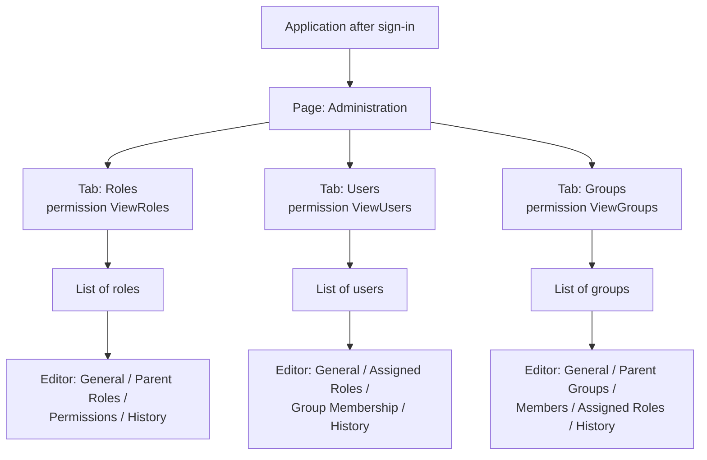

*Figure 1: Page structure of the administration user interface – three permission-dependent tabs, each with a list and a multi-page editor.*

### 2.3 Two-area pattern

Every tab follows the same pattern:

1. **List area** – a table of all objects of the collection with a command bar, search, sorting and filters.
2. **Editor area** – a multi-page editor opened by double-clicking a row or through the **Edit** command. Several objects can be open at the same time; each open object gets its own tab.

Inside the tab the list view carries the name of the collection once more (**“Roles”**, **“Users”**, **“Groups”**).

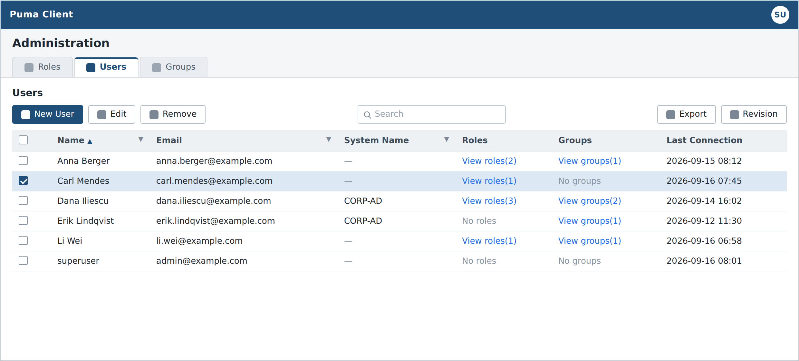

*Screenshot 1: Administration page, “Users” tab – tab bar, command bar, search field and user list.*

---

## 3. Common controls

All three tabs use the same list and editor building blocks. They are described once here and only supplemented with specifics in chapters 4 to 6.

### 3.1 Command bar of the list

| Command | Position | Enabling condition | Effect |
| --- | --- | --- | --- |
| **New** | left | always, provided the create permission is granted | Creates a new object and opens the editor. The label names the object type, e.g. **“New User”**, **“New Role”**, **“New Group”**. |
| **Edit** | left | exactly **one** row selected | Opens the selected object in the editor. |
| **Remove** | left | **at least one** row selected | Deletes the selected objects after a confirmation. |
| **Export** | right | exactly one row selected | Writes the selected object to a file. |
| **Revision** | right | exactly one row selected | Opens the revision view. Requires the permission `ViewRevisions`; without a selection the command is disabled. |

A command for which the required permission is missing is not available. The permissions required per collection are summarised in chapter 10.

### 3.2 Delete confirmation

A confirmation dialog appears before deleting. For roles it reads **“Deleting a role”** / **“Delete the selected role ?”**; for users and groups the generic text **“Deleting a selected element”** / **“Remove selected item from the collection ?”** is used. When the whole filtered set is deleted, the question is **“Deleting elements”** / **“Delete all items with the current filter ?”**.

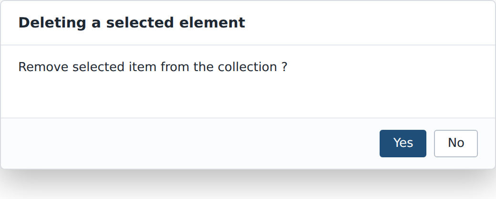

*Screenshot 2: Confirmation shown before a selected element is deleted.*

### 3.3 Search, sort, filter

- Every list has a search field above the table.
- Sortable columns are sorted by clicking the column header; which columns are sortable is stated in chapters 4 to 6.
- Columns with a filter function offer a filter menu in the column header.

### 3.4 Refresh notice

The lists are served by the server. If another workstation changes the same data, the list shows the notice **“This table has been modified from another computer”** together with an **“Update”** button. The table only shows the current state after **Update** has been pressed.

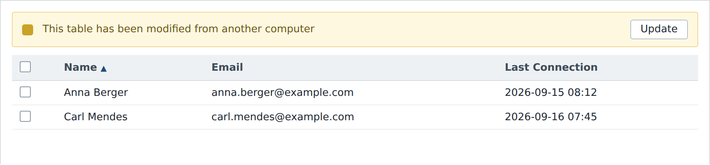

*Screenshot 3: Refresh notice above a list, with the “Update” button.*

### 3.5 Editor

The editor occupies the right-hand area of the tab and consists of:

- a **page list on the left edge** with the sub-pages of the object (e.g. *General*, *Assigned Roles*),
- the **content area** of the selected sub-page,
- the document commands **Save**, **Undo**, **Redo** and **Close**.

Changes are only sent to the server with **Save**. **Save**, **Undo** and **Redo** require one of the change permissions of the respective collection.

### 3.6 Selection controls for assignments

Role, group and member assignments use the same control everywhere: a list of the already assigned entries with a counter and, below it, a button for adding (e.g. **“Add Role”**). The button opens a **searchable pick list**; the selection is therefore not made through check boxes in an overall list. Assigned entries can be removed individually.

### 3.7 History

If the signed-in user holds the permission `ViewRevisions`, every editor additionally contains the sub-page **“History”**. Its heading states the number of revisions in parentheses, e.g. `History (7)`. Without this permission the sub-page is absent.

---

## 4. “Users” tab

### 4.1 List of users

| Column | Label | Sortable | Filterable | Content |
| --- | --- | --- | --- | --- |
| `name` | **Name** | yes | yes | Display name of the user. Default sorting: ascending by this column. |
| `mail` | **Email** | yes | yes | Stored email address. |
| `systemName` | **System Name** | yes | yes | Name of the external authentication system; empty for internal accounts. |
| `roles` | **Roles** | no | no | Summary of the assigned roles. |
| `groups` | **Groups** | no | no | Summary of the group memberships. |
| `lastConnection` | **Last Connection** | yes | no | Time of the last sign-in. |

**Columns “Roles” and “Groups”:** Instead of the full enumeration the cell shows **“View roles(N)”** or **“View groups(N)”** with the count in parentheses, or **“No roles”** / **“No groups”** when nothing is assigned. The tooltip lists the individual roles or groups and names the user.

**Filter “System Info”:** The column `systemName` offers the filter **“System Info”** with the two options **“Internal”** and **“LDAP”**. The list can thus be restricted to internally managed accounts or to accounts signing in through a directory. This is the only LDAP-related control in the user interface.

### 4.2 Commands

The commands from section 3.1 apply. The create command is called **“New User”**. The required permissions are `AddUser` (New), `ViewUsers` and `ChangeUser` (Edit) as well as `RemoveUser` (Remove).

### 4.3 Editor – sub-pages

| Sub-page | Title in the page list | Display condition |
| --- | --- | --- |
| General | **General** | always |
| Roles | **Assigned Roles** | always |
| Groups | **Group Membership** | always |
| History | **History** | only with `ViewRevisions` |

### 4.4 Sub-page “General”

The page is divided into the section **“General”** with the master data and – where applicable – the section **“System Information”**.

| Field | Label | Placeholder | Mandatory | Visibility / particularity |
| --- | --- | --- | --- | --- |
| Login name | **Username** | “Enter the username” | yes – error text **“Please enter the username”** | **Read-only** as soon as the account is bound to an external system. |
| Display name | **Name** | “Enter the name” | yes – error text **“Please enter the name”** | – |
| Email | **Email Address** | “Enter the email” | yes – error text **“Please enter the email”** | Checked against an email pattern. |
| Account state | **Account enabled**, description **“Disabled accounts cannot log in”** | – | – | Switch. **Visible for the superuser only**; for every other sign-in the switch is absent. |
| Password | **Password** | “Enter the password” | yes | **Visible only when creating a new user.** Read-only if the account is bound to an active external system. |
| Password repetition | **Confirm password** | “Confirm password” | yes – error text **“Please enter the password”** | Only together with the *Password* field. |
| Password change | **Change password** with button **“Change”** | – | – | **Visible for existing users only**; omitted entirely for accounts of an external system. |

If the two password fields differ or the new password is left empty, the hint **“Passwords don't match”** appears. If the password violates the password policy, the user interface names the violated rule in plain text (see section 9.2).

**Section “System Information”:** A single-column table with the column header **“System Name”** in which exactly one entry can be selected. The section is hidden if the account is bound to at most one authentication system.

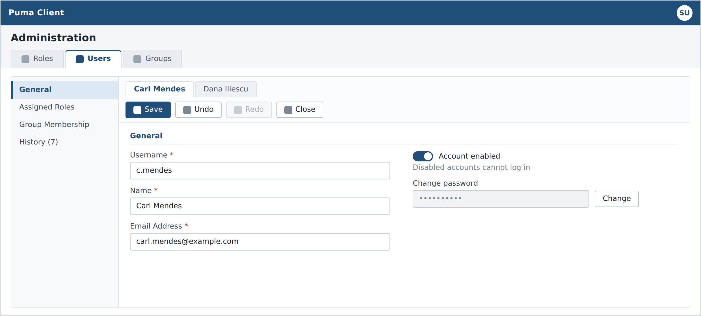

*Screenshot 4: User editor, sub-page “General” with the master data, the superuser-only “Account enabled” switch and the “Change” button.*

### 4.5 Sub-page “Assigned Roles”

Heading **“Assigned Roles”**, below it the selection control labelled **“Roles”** with the button **“Add Role”**. The number of assigned roles is shown as well. The pick list is searchable and sorted by role name and only contains roles of the current product.

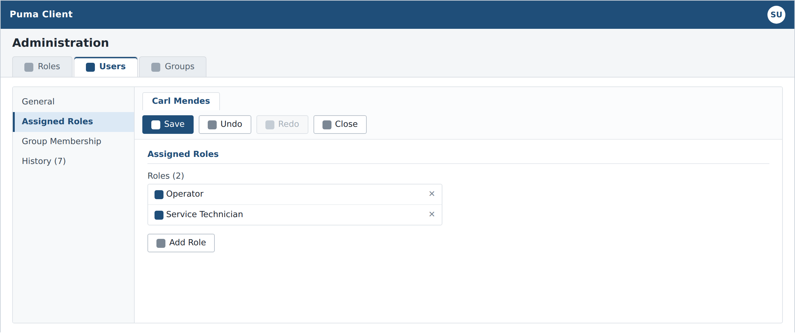

*Screenshot 5: User editor, sub-page “Assigned Roles” with the list of assigned roles and the “Add Role” button.*

### 4.6 Sub-page “Group Membership”

Heading **“Group Membership”**, below it the selection control **“Groups”** with the button **“Add Group”** and the count.

### 4.7 “Change Password” dialog

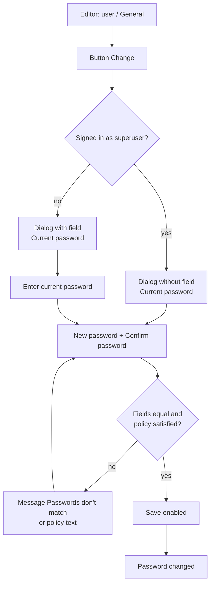

*Figure 2: Flow of the “Change Password” dialog – the superuser is not asked for the previous password.*

The dialog carries the title **“Change Password”** and contains the buttons **“Save”** and **“Cancel”**. **Save** stays disabled until the entries are complete and valid.

The fields appear in this order:

1. **Current password**, placeholder “Enter the current password” – **omitted for the superuser**.
2. **New password**, placeholder “Enter the new password”.
3. **Confirm password**, placeholder “Confirm password”.

The fields for the new password stay read-only as long as the previous password has not been entered. Below the fields the user interface continuously shows the applicable password requirements.

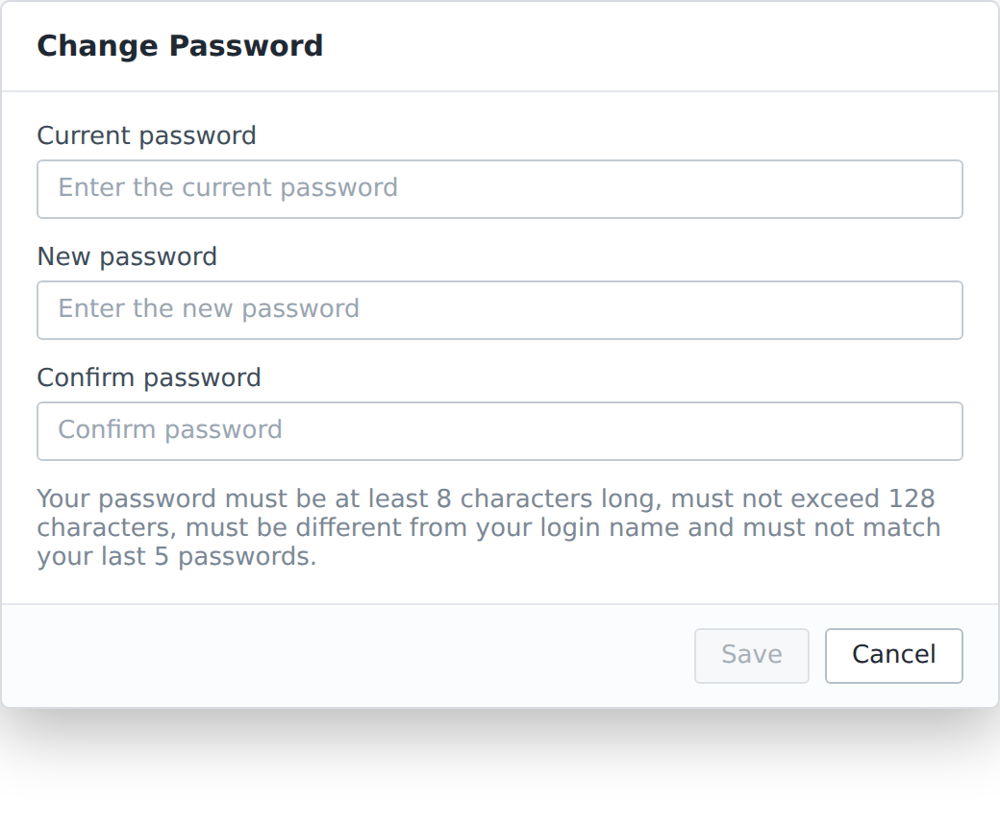

*Screenshot 6: “Change Password” dialog with the three password fields and the applicable password requirements.*

---

## 5. “Roles” tab

### 5.1 List of roles

| Column | Label | Sortable | Content |
| --- | --- | --- | --- |
| `roleName` | **Role Name** | yes | Descriptive name of the role. |
| `roleId` | **Role-ID** | yes | Technical identifier of the role. |
| `roleDescription` | **Description** | yes | Free-text description. |

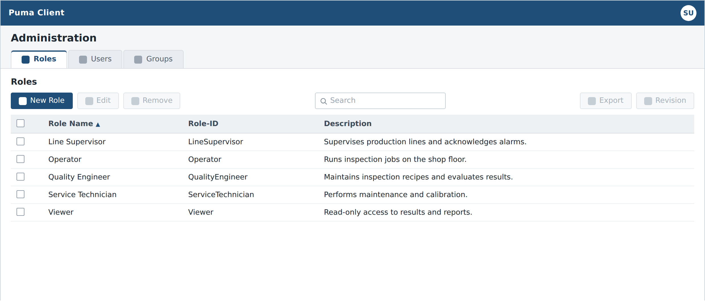

*Screenshot 7: Administration page, “Roles” tab – without a selection, Edit, Remove, Export and Revision are disabled.*

### 5.2 Commands

The create command is called **“New Role”**. Required permissions: `AddRole` (New), `ViewRoles` and `ChangeRole` (Edit), `RemoveRole` (Remove). The delete confirmation reads **“Deleting a role”** / **“Delete the selected role ?”**.

### 5.3 Editor – sub-pages

| Sub-page | Title in the page list | Display condition |
| --- | --- | --- |
| General | **General** | always |
| ParentRoles | **Parent Roles** | always |
| Permission | **Permissions** | always |
| History | **History** | only with `ViewRevisions` |

### 5.4 Sub-page “General”

| Field | Label | Placeholder | Particularity |
| --- | --- | --- | --- |
| Role name | **Role Name** | “Enter the role name” | Mandatory field. |
| Role identifier | **Role-ID** | – | **Read-only.** The identifier is derived automatically from the role name by removing all whitespace. |
| Description | **Description** | “Enter the description” | Optional. |

### 5.5 Sub-page “Parent Roles”

Heading **“Parent Roles”**, selection control **“Parent Roles”** with the button **“Add Parent Role”**. The edited role itself does not appear in the pick list. Deeper cycles are rejected by the server when saving.

### 5.6 Sub-page “Permissions”

The permissions are presented as a **two-level tree with tri-state check boxes**:

- Column **“Permission”** – name of the permission group or of the individual permission.
- Column **“Description”** – explanatory text.

The top level is formed by **permission groups**: functional headings delivered by the server under which the individual permissions are sorted. Checking a group selects all contained permissions; if only individual entries are selected, the group shows the intermediate state. **Only the individual permissions are saved**, not the groups themselves.

Nested permissions are not shown as a deeper tree level but as a path in the name, e.g. `Edit Sensor / Change Sensor / Change Production Status`.

Above the table there is a control bar with the buttons **“Check All”**, **“Uncheck All”**, **“Expand All”** and **“Collapse All”**, plus a search field with the placeholder **“Filter permissions...”** that searches name and description.

The offered permission list is determined per product; permissions of other products do not appear.

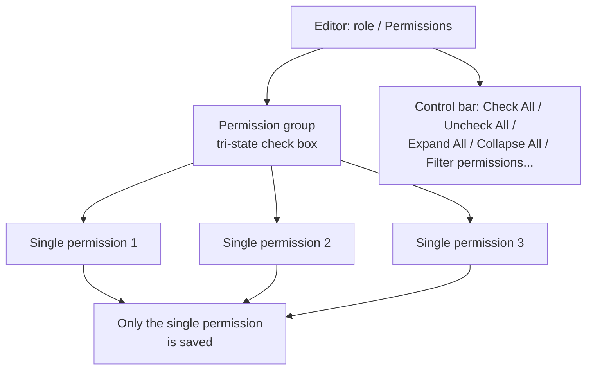

*Figure 3: Structure of the permission selection in the role editor – groups provide the overview, the individual permissions are saved.*

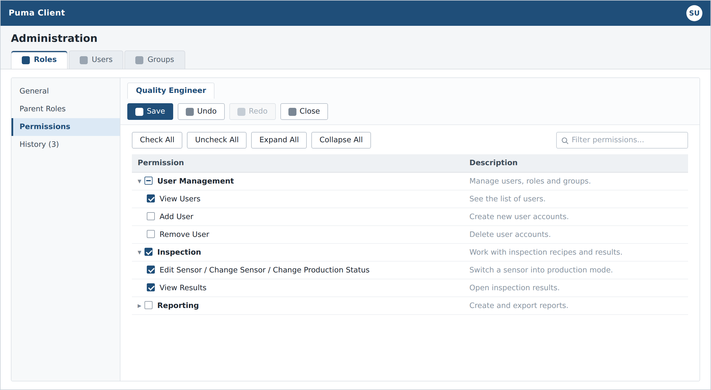

*Screenshot 8: Role editor, sub-page “Permissions” with the two-level tree, tri-state check boxes and the control bar.*

---

## 6. “Groups” tab

### 6.1 List of groups

| Column | Label | Sortable | Content |
| --- | --- | --- | --- |
| `name` | **Group Name** | yes | Name of the group. |
| `description` | **Description** | yes | Free-text description. |

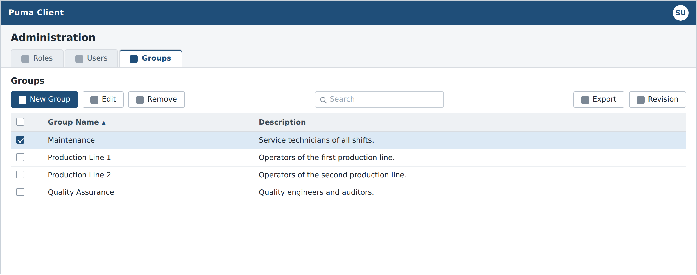

*Screenshot 9: Administration page, “Groups” tab with the group list.*

### 6.2 Commands

The create command is called **“New Group”**. Required permissions: `AddGroup` (New), `ViewGroups` and `ChangeGroup` (Edit), `RemoveGroup` (Remove).

### 6.3 Editor – sub-pages

| Sub-page | Title in the page list | Display condition |
| --- | --- | --- |
| General | **General** | always |
| ParentGroups | **Parent Groups** | always |
| Users | **Members** | always |
| Roles | **Assigned Roles** | always |
| History | **History** | only with `ViewRevisions` |

### 6.4 Fields and assignments

| Sub-page | Content |
| --- | --- |
| **General** | Fields **“Group Name”** (placeholder “Enter the name”) and **“Description”** (placeholder “Enter the description”). |
| **Parent Groups** | Selection control **“Parent Groups”** with the button **“Add Parent Group”**; the edited group itself is not offered. |
| **Members** | Selection control **“Users”** with the button **“Add User”**; searchable selection over the user collection with the member count. |
| **Assigned Roles** | Selection control **“Roles”** with the button **“Add Role”**; product-scoped. |

---

## 7. Profile page (self-service)

### 7.1 Opening and delimitation

The profile page is opened through the **avatar icon** in the header. The menu contains the entry **“Profile”**, the list of organizations – the current one marked **“(current)”**, delegated ones marked **“(delegated)”**, otherwise **“No organization”** – as well as **“Logout”**. The dialog carries the title **“Profile”** and shows initials, display name (fallback **“My Account”**) and email address at the top.

The profile page is the self-service view of every user and is **not part of the administration page**. It differs from it as follows:

| Feature | Administration page | Profile page |
| --- | --- | --- |
| Change login name | yes | no |
| Switch account state | yes (superuser only) | no |
| Assign roles and groups | yes | no – read-only display |
| Set a password without knowing the old one | yes (superuser) | no |
| Manage personal access tokens | no | yes |

### 7.2 Sub-pages

| Sub-page | Label |
| --- | --- |
| General | **General** |
| Organizations | **Organizations** |
| Access tokens | **Access Tokens** |
| Roles and permissions | **Roles & Permissions** |

### 7.3 Sub-page “General”

- Field **“Name”** (placeholder “Enter the name”) and field **“Email Address”** (placeholder “Enter the email”, checked against an email pattern).
- Button **“Save”**, which only becomes active when name or email differ from the stored state. Feedback: **“Profile saved”** or **“Unable to save the profile.”**
- Section **“Password”** – **visible for internally managed accounts only**; it is omitted for accounts of an external system. In the collapsed state it shows placeholder dots and the button **“Change”**. Expanded it contains the fields **“Current password”** (placeholder “Enter your current password”, omitted for the superuser), **“New password”** (placeholder “Enter a new password”) and **“Confirm new password”** (placeholder “Re-enter the new password”), below them the applicable password requirements and the buttons **“Update password”** and **“Cancel”**. While the request is running the label reads **“Changing password…”**. Feedback: **“Password changed”** or **“Unable to change the password. Check your current password and try again.”**

### 7.4 Sub-page “Roles & Permissions”

A purely read-only view with three bordered tables **“Roles”**, **“Groups”** and **“Permissions”**, each with the columns **“Name”** and **“Description”**. Empty sections are hidden; if nothing at all is assigned, **“No roles, groups or permissions are assigned.”** appears.

For the superuser the notice **“You have full access”** is shown instead, with the explanation **“As a superuser, every permission is already granted to you, so no roles, groups or individual permissions are listed here — there is nothing more to add.”**

### 7.5 Sub-page “Access Tokens” (personal access tokens)

The management of personal access tokens resides **here only**, not in the administration page. Every user manages their own tokens only.

**Header area:** heading **“Access tokens”**, explanation **“Tokens let scripts and integrations authenticate as you.”**, button **“New Token”**.

**Table:** columns **Name**, **Description**, **Expires At**, **Revoked** and an action column. The *Expires At* column shows the expiry date or **“No Expiration”**. The action column offers deleting (tooltip **“Delete Token”**) and revoking (tooltip **“Revoke Token”**; already revoked tokens show the tooltip **“Revoked”** and can no longer be operated).

If no token exists yet, **“You don't have any access tokens yet. Create one to let a script or integration authenticate as you.”** appears.

**Delete confirmation:** **“Are you sure you want to delete this token?”** with the note **“Any applications or scripts using this token will no longer be able to access the API. You cannot undo this action.”** Feedback: **“Token deleted”**, **“Token revoked”** or **“Unable to complete the request.”**

**“New Personal Access Token” dialog:**

| Element | Label | Note |
| --- | --- | --- |
| Name | **Token Name**, placeholder “e.g. CI/CD Pipeline, API Client...” | Mandatory field. |
| Validity | **Expiration** | Choice of **“7 Days”**, **“30 Days”**, **“60 Days”**, **“90 Days”**, **“No Expiration”**. |
| Description | **Description (optional)**, placeholder “What will this token be used for?” | Optional. |
| Scope | **“Select Permissions”** with the addition **“— grant only the access this token needs”** | Uses the same permission table as the role editor (section 5.6). If no permissions are available, **“No permissions available to assign to this token.”** appears. |
| Buttons | **“Generate Token”**, **“Cancel”** | **Generate Token** is disabled initially. The hints **“Enter a token name to continue”** and **“Select at least one permission”** name the missing step. |

After creation the dialog **“Token Created Successfully”** appears with the text **“Please copy and save the token:”**, a read-only value field, a copy button (tooltips **“Copy the token”** and **“The token is copied”**) and the button **“OK”**. The token value is shown **at this point only**.

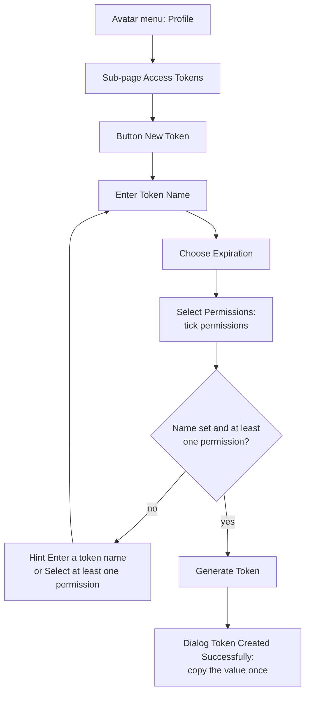

*Figure 4: Creating a personal access token on the profile page – the token value is shown only once.*

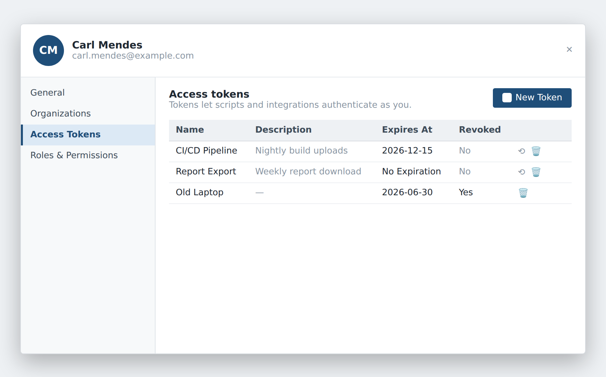

*Screenshot 10: Profile page, sub-page “Access Tokens” with the token table and the per-row actions.*

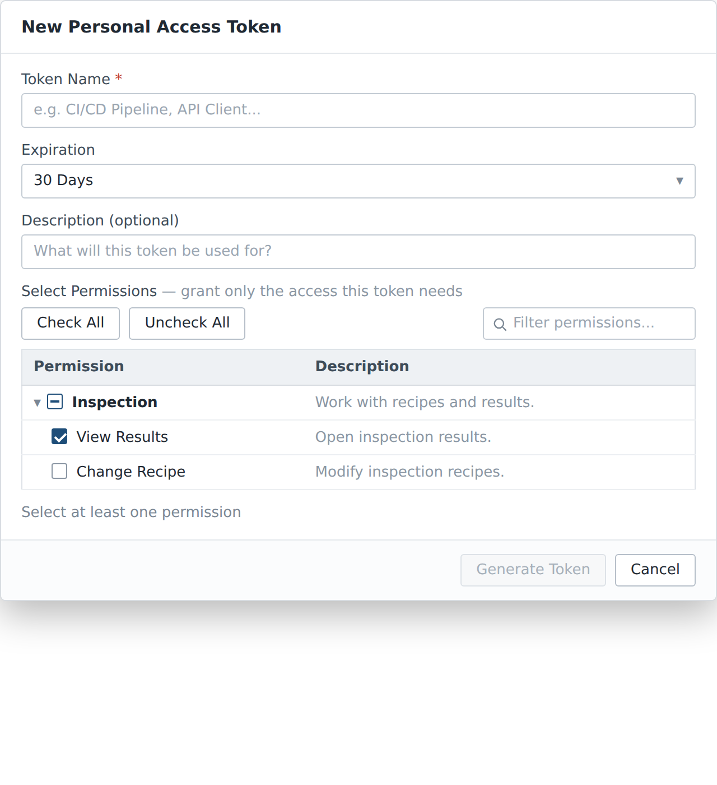

*Screenshot 11: “New Personal Access Token” dialog – “Generate Token” stays disabled until a name and at least one permission are set.*

---

## 8. Sign-in and first start

### 8.1 Sign-in screen

The sign-in screen is laid out as a card and contains, from top to bottom:

1. Heading **“Welcome to”** followed by the application name; if no name is set it reads **“Welcome”**.
2. Field **“Username”** with the placeholder **“Enter your username”**.
3. Field **“Password”** with the placeholder **“Enter your password”**. The entry is masked; a button at the edge of the field reveals and hides the password.
4. Check box **“Remember me”** (active by default, remembers the last used login name) and – if password recovery is available – the link **“Forgot password?”**.
5. Button **“Sign in”**. It is only enabled when both fields are filled and no request is in flight; during sign-in it shows a progress indicator.
6. Link **“Sign up”** – only visible if self-registration is enabled. It opens the dialog **“Sign up”** with the buttons **“Sign up”** and **“Close”**, containing the same master data fields as the user editor.

**Failed sign-in:** The password field is cleared, the login name is kept, and the server message is shown, with the fallback **“Username or password is incorrect”**. If the account is disabled, the message reads **“This account has been deactivated. Please contact your administrator.”**

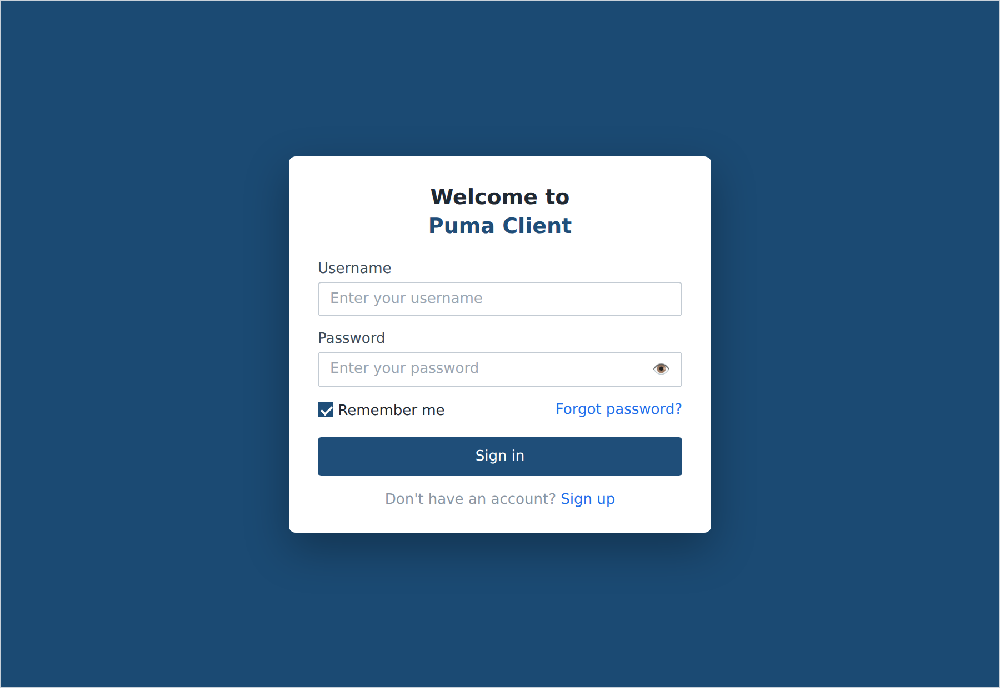

*Screenshot 12: Sign-in screen with “Username”, “Password”, “Remember me” and “Sign in”.*

### 8.2 Password recovery

The dialog **“Password Recovery”** guides through the recovery in four steps. Besides **“Cancel”** the primary button carries a different label in each step.

| Step | Content | Primary button |
| --- | --- | --- |
| 1 | Field **“Email”** (placeholder “Enter the email”) with the explanation **“Enter the email address that was specified on your account, a code will be sent to it”**; error text **“Please enter the valid email”**. | **“Check the email”** |
| 2 | Read-only field **“Username”** with the question **“For this email this account has been found, is that you?”**. If answered negatively, **“Check the email you entered”** appears and the dialog returns to step 1. | **“Yes”** |
| 3 | Field **“Code”** (placeholder “Enter the code”) with the explanation **“Please enter the code sent to your email”**; requesting again via **“Send the code again”** with the button **“Send”** and a waiting period of 60 seconds. | **“Check the code”** |
| 4 | Fields for the new password without asking for the previous one. Success message **“Password changed successfully”**. | **“Change password”** |

### 8.3 First start of the superuser

If the server does not have an administrator account yet, the superuser setup page is laid over the application.

- Heading **“Create the administrator account”**, explanation **“This server doesn't have one yet. Set a name and password below - you'll sign in with them right after.”**
- Input fields in this order: **Username** (fixed to `su` and **read-only**), **Name** (pre-filled with `superuser`), **Email Address**, **Password**, **Confirm password**. The caret starts in the *Email Address* field.
- The *Account enabled* switch is not present here.
- Button **“Create account”**. It only becomes enabled when the email address is valid, the repetition is filled and both password fields match.
- If creation fails, an error banner appears below the form showing the server message, with the fallbacks **“Unable to create the administrator account”** or **“Unable to reach server”**.

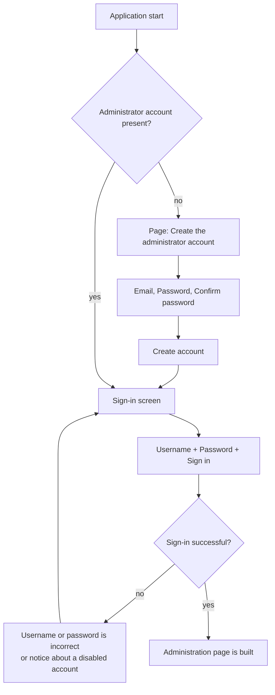

*Figure 5: Path from the first start through sign-in to the administration page.*

*Screenshot 13: First start: the “Create the administrator account” page with the read-only user name `su`.*

---

## 9. Messages shown by the user interface

### 9.1 Messages during editing

| Situation | Message |
| --- | --- |
| Login name empty | **Please enter the username** |
| Display name empty | **Please enter the name** |
| Email empty or invalid | **Please enter the email** |
| Password repetition empty or different | **Passwords don't match** |
| Login name already taken | **Username already exists** |
| Role identifier already taken | **Role with ID: '…' already exists** |
| Group name already taken | **Group Name '…' already exists** |
| Superuser already set up | **Superuser already exists** |
| Profile could not be saved | **Unable to save the profile.** |
| Password could not be changed | **Unable to change the password.** |

### 9.2 Password policy messages

The user interface assembles the rules reported by the server into a sentence following the pattern **“The password must contain …”**. The following fragments occur:

- **at least N characters** – minimum length,
- **at most N characters** – maximum length,
- **a lowercase letter**, **an uppercase letter**, **a digit**, **a special character** – required character classes,
- **a password different from the login** – the password must not equal the login name,
- **a password that is not commonly used** – block list of common passwords,
- **a password different from the last N ones** or **a password that was not used before** – reuse restriction.

The same sentence also serves as the live hint below the password fields.

Further server feedback:

| Cause | Message |
| --- | --- |
| Previous password incorrect | **The current password is not correct.** |
| Minimum password age not reached | **The password was changed too recently and cannot be changed again yet.** |
| Account is managed externally | **This account is managed by an external system, its password cannot be changed here.** |
| Account no longer exists | **This account no longer exists.** |
| Server or storage error | **The password could not be changed. Please try again later.** |

---

## 10. Permission reference of the user interface

### 10.1 Permissions per collection

| Collection | View | Create | Change | Delete |
| --- | --- | --- | --- | --- |
| Users | `ViewUsers` | `AddUser` | `ChangeUser` | `RemoveUser` |
| Roles | `ViewRoles` | `AddRole` | `ChangeRole` | `RemoveRole` |
| Groups | `ViewGroups` | `AddGroup` | `ChangeGroup` | `RemoveGroup` |

For users the permissions `RestoreUser`, `ExportUser` and `ImportUser` exist in addition.

### 10.2 Cross-cutting permissions

| Permission | Effect in the user interface |
| --- | --- |
| `ViewRevisions` | Shows the sub-page **History** in every editor and the command **Revision** in every list. |

### 10.3 Special position of the superuser

The superuser passes every permission check of the user interface. In addition:

- The **Account enabled** switch is visible for the superuser only.
- In the password dialogs the superuser is not asked for the previous password.
- On the profile page the notice **“You have full access”** replaces the role and permission tables.

---

## 11. Not part of the user interface

The following functions are listed deliberately as gaps so that they are not looked for in the wrong place:

| Function | State |
| --- | --- |
| **Unlocking a locked account** | There is **no** control for this. Unlocking is only possible through the server interface. |
| **Configuring the LDAP connection** | There is **no** configuration page. The user interface only offers the list filter **“Internal”/“LDAP”** (section 4.1); the connection is set up in the server configuration. |
| **Managing other users' access tokens** | Token management is limited to the signed-in user's own tokens (section 7.5); there is no administrative overview of all tokens. |
| **Editing the login name of external accounts** | The **Username** field is read-only for accounts of an external system. |
| **Maintaining passwords of external accounts** | The **Password** section and the **Change password** button are omitted for externally managed accounts. |

---

*End of the administration UI documentation*
