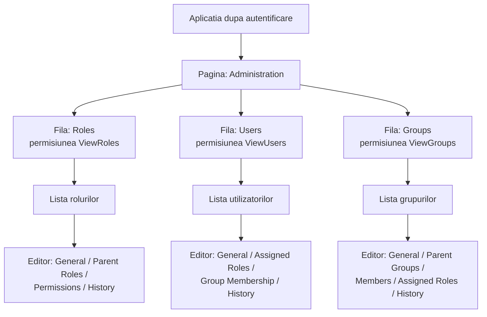
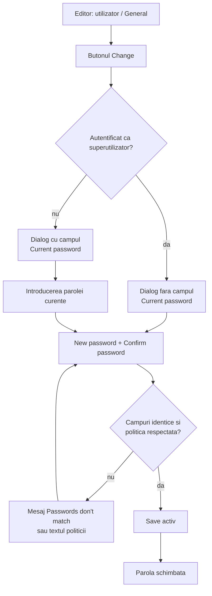
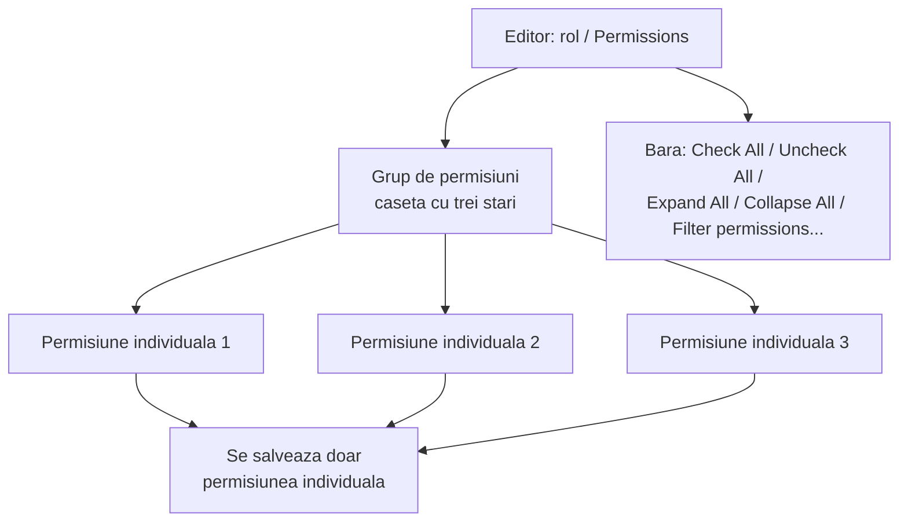
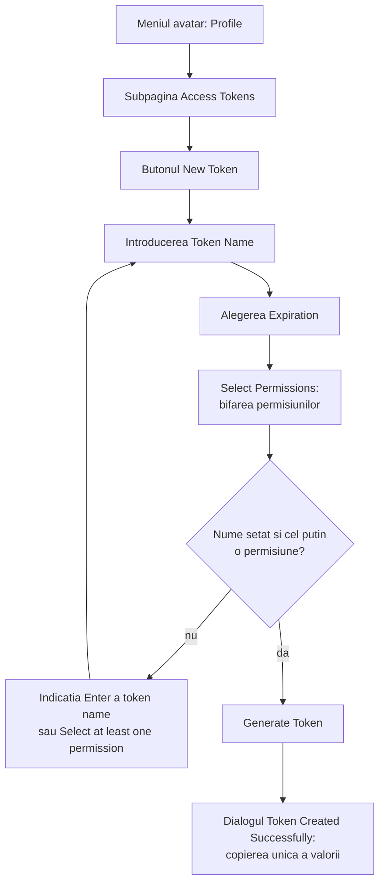
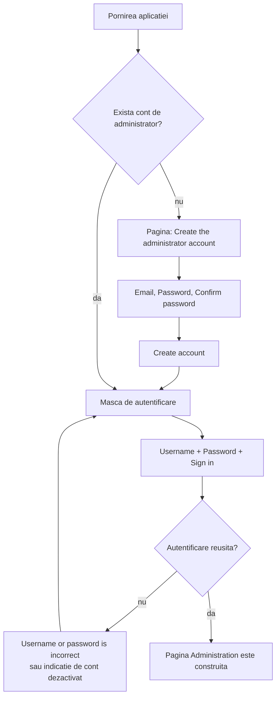

# Puma – Documentația interfeței de administrare

Descriere pură a interfeței de administrare a utilizatorilor

---

## Cuprins

1. [Despre acest document](#1-despre-acest-document)
2. [Structura paginii de administrare](#2-structura-paginii-de-administrare)
3. [Elemente de comandă comune](#3-elemente-de-comandă-comune)
4. [Fila „Users” (utilizatori)](#4-fila-users-utilizatori)
5. [Fila „Roles” (roluri)](#5-fila-roles-roluri)
6. [Fila „Groups” (grupuri)](#6-fila-groups-grupuri)
7. [Pagina de profil (autoservire)](#7-pagina-de-profil-autoservire)
8. [Autentificare și prima pornire](#8-autentificare-și-prima-pornire)
9. [Mesajele interfeței](#9-mesajele-interfeței)
10. [Referință de permisiuni a interfeței](#10-referință-de-permisiuni-a-interfeței)
11. [Ce nu conține interfața](#11-ce-nu-conține-interfața)

---

## 1. Despre acest document

### 1.1 Scop

Acest document descrie exclusiv **interfața de administrare** cu care se întrețin utilizatorii, rolurile și grupurile unui server Puma. Numește fiecare pagină, listă, câmp de introducere și buton și explică ce fac elementele de comandă și în ce condiții sunt vizibile sau utilizabile.

Conceptele, exploatarea serverului, integrarea prin SDK, conectarea LDAP și politicile de securitate **nu** fac obiectul acestui document. Ele sunt descrise în [manualul utilizatorului](../Benutzerhandbuch/Benutzerhandbuch_RO.md).

### 1.2 Public-țintă

Administratorii și utilizatorii care operează administrarea utilizatorilor în client.

### 1.3 Proveniența interfeței

Interfața nu face parte din Puma însuși, ci este preluată ca o componentă QML gata realizată din depozitul `ImagingTools/ImtCore` (modulul `Qml/imtauthgui`). Puma o integrează prin compoziția `Impl/AuthClientSdk/AdministrationWidget.acc`, care încarcă fișierul de intrare `qrc:/qml/imtauthgui/AdministrationUi.qml`. Orice aplicație care integrează această componentă afișează deci aceleași pagini și aceleași etichete.

### 1.4 Observație privind etichetele

Toate etichetele citate în acest document sunt **textele originale în limba engleză** ale interfeței, așa cum apar fără un pachet de limbă instalat. Ele pot fi traduse; dacă pentru aplicație există o traducere, textele apar în limba respectivă. Structura paginilor nu este afectată.

---

## 2. Structura paginii de administrare

### 2.1 Punctul de intrare

Pagina de administrare poartă titlul **„Administration”**. Ea se construiește abia **după autentificarea reușită**; înainte de aceasta aplicația afișează în locul ei masca de autentificare (vezi capitolul 8).

Pagina este formată din trei file, create în această ordine:

| Ordine | Filă | Pictogramă | Permisiune necesară |
| --- | --- | --- | --- |
| 1 | **Roles** | pictogramă de rol | `ViewRoles` |
| 2 | **Users** | pictogramă de cont | `ViewUsers` |
| 3 | **Groups** | pictogramă multiutilizator | `ViewGroups` |

O filă **nu este afișată deloc** dacă lipsește permisiunea de vizualizare corespunzătoare – nu apare estompată, ci lipsește complet. Dacă lipsesc toate trei permisiunile, pagina de administrare rămâne goală.

Superutilizatorul (nume de autentificare `su`) trece de fiecare verificare de permisiuni a interfeței; pentru el toate filele sunt deci întotdeauna vizibile.

### 2.2 Structura

*Figura 1: Structura paginilor interfeței de administrare – trei file dependente de permisiuni, fiecare cu o listă și un editor cu mai multe pagini.*

### 2.3 Modelul cu două zone

Fiecare filă urmează același model:

1. **Zona listei** – un tabel cu toate obiectele colecției, cu bară de comenzi, căutare, sortare și filtre.
2. **Zona editorului** – un editor cu mai multe pagini, deschis prin dublu clic pe un rând sau prin comanda **Edit**. Mai multe obiecte pot fi deschise simultan; fiecare obiect deschis primește o filă proprie.

În interiorul filei, vizualizarea listei poartă încă o dată numele colecției (**„Roles”**, **„Users”**, **„Groups”**).

---

## 3. Elemente de comandă comune

Toate cele trei file folosesc aceleași elemente de listă și de editor. Ele sunt descrise o singură dată aici, iar în capitolele 4–6 sunt completate doar cu particularitățile respective.

### 3.1 Bara de comenzi a listei

| Comandă | Poziție | Condiție de activare | Efect |
| --- | --- | --- | --- |
| **New** | stânga | întotdeauna, dacă există permisiunea de creare | Creează un obiect nou și deschide editorul. Eticheta numește tipul obiectului, de ex. **„New User”**, **„New Role”**, **„New Group”**. |
| **Edit** | stânga | exact **un** rând selectat | Deschide obiectul selectat în editor. |
| **Remove** | stânga | **cel puțin un** rând selectat | Șterge obiectele selectate după confirmare. |
| **Export** | dreapta | exact un rând selectat | Scrie obiectul selectat într-un fișier. |
| **Revision** | dreapta | exact un rând selectat | Deschide vizualizarea reviziilor. Necesită permisiunea `ViewRevisions`; fără selecție comanda este dezactivată. |

O comandă pentru care lipsește permisiunea necesară nu este disponibilă. Permisiunile necesare pentru fiecare colecție sunt rezumate în capitolul 10.

### 3.2 Confirmarea la ștergere

Înainte de ștergere apare un dialog de confirmare. Pentru roluri acesta este **„Deleting a role”** / **„Delete the selected role ?”**, pentru utilizatori și grupuri se folosește textul general **„Deleting a selected element”** / **„Remove selected item from the collection ?”**. Dacă se șterge întregul set filtrat, întrebarea este **„Deleting elements”** / **„Delete all items with the current filter ?”**.

### 3.3 Căutare, sortare, filtrare

- Fiecare listă are un câmp de căutare deasupra tabelului.
- Coloanele sortabile se sortează prin clic pe antetul coloanei; ce coloane sunt sortabile se indică în capitolele 4–6.
- Coloanele cu funcție de filtrare oferă un meniu de filtre în antetul coloanei.

### 3.4 Indicația de actualizare

Listele sunt alimentate de server. Dacă un alt post de lucru modifică aceleași date, lista afișează indicația **„This table has been modified from another computer”** împreună cu butonul **„Update”**. Abia după acționarea butonului **Update** tabelul arată starea actuală.

### 3.5 Editorul

Editorul ocupă zona din dreapta a filei și este format din:

- o **listă de pagini pe marginea din stânga**, cu subpaginile obiectului (de ex. *General*, *Assigned Roles*),
- **zona de conținut** a subpaginii selectate,
- comenzile de document **Save**, **Undo**, **Redo** și **Close**.

Modificările sunt transmise serverului abia cu **Save**. **Save**, **Undo** și **Redo** necesită una dintre permisiunile de modificare ale colecției respective.

### 3.6 Câmpuri de selecție pentru atribuiri

Atribuirile de roluri, grupuri și membri folosesc peste tot același element: o listă a intrărilor deja atribuite, cu contor, iar dedesubt un buton de adăugare (de ex. **„Add Role”**). Butonul deschide o **listă de selecție în care se poate căuta**; selecția nu se face deci prin casete de bifare într-o listă globală. Intrările atribuite pot fi eliminate individual.

### 3.7 Istoric

Dacă utilizatorul autentificat deține permisiunea `ViewRevisions`, fiecare editor conține suplimentar subpagina **„History”**. Titlul ei indică numărul de revizii între paranteze, de ex. `History (7)`. Fără această permisiune subpagina lipsește.

---

## 4. Fila „Users” (utilizatori)

### 4.1 Lista utilizatorilor

| Coloană | Etichetă | Sortabilă | Filtrabilă | Conținut |
| --- | --- | --- | --- | --- |
| `name` | **Name** | da | da | Numele afișat al utilizatorului. Sortare implicită: crescător după această coloană. |
| `mail` | **Email** | da | da | Adresa de e-mail memorată. |
| `systemName` | **System Name** | da | da | Numele sistemului extern de autentificare; gol pentru conturile interne. |
| `roles` | **Roles** | nu | nu | Rezumatul rolurilor atribuite. |
| `groups` | **Groups** | nu | nu | Rezumatul apartenențelor la grupuri. |
| `lastConnection` | **Last Connection** | da | nu | Momentul ultimei autentificări. |

**Coloanele „Roles” și „Groups”:** În locul enumerării complete, celula afișează **„View roles(N)”** respectiv **„View groups(N)”** cu numărul între paranteze, sau **„No roles”** / **„No groups”** când nu este nimic atribuit. Sfatul contextual enumeră rolurile sau grupurile și numește utilizatorul.

**Filtrul „System Info”:** Coloana `systemName` oferă filtrul **„System Info”** cu cele două opțiuni **„Internal”** și **„LDAP”**. Astfel lista poate fi restrânsă la conturile administrate intern sau la cele care se autentifică printr-un serviciu de directoare. Aceasta este singura posibilitate de operare legată de LDAP din interfață.

### 4.2 Comenzi

Se aplică comenzile din secțiunea 3.1. Comanda de creare se numește **„New User”**. Permisiunile necesare sunt `AddUser` (New), `ViewUsers` și `ChangeUser` (Edit), precum și `RemoveUser` (Remove).

### 4.3 Editor – subpagini

| Subpagină | Titlu în lista de pagini | Condiție de afișare |
| --- | --- | --- |
| General | **General** | întotdeauna |
| Roles | **Assigned Roles** | întotdeauna |
| Groups | **Group Membership** | întotdeauna |
| History | **History** | doar cu `ViewRevisions` |

### 4.4 Subpagina „General”

Pagina se împarte în secțiunea **„General”** cu datele de bază și – dacă este cazul – secțiunea **„System Information”**.

| Câmp | Etichetă | Text substituent | Obligatoriu | Vizibilitate / particularitate |
| --- | --- | --- | --- | --- |
| Nume de autentificare | **Username** | „Enter the username” | da – text de eroare **„Please enter the username”** | **Protejat la scriere** de îndată ce contul este legat de un sistem extern. |
| Nume afișat | **Name** | „Enter the name” | da – text de eroare **„Please enter the name”** | – |
| E-mail | **Email Address** | „Enter the email” | da – text de eroare **„Please enter the email”** | Verificat față de un tipar de e-mail. |
| Starea contului | **Account enabled**, explicație **„Disabled accounts cannot log in”** | – | – | Comutator. **Vizibil doar pentru superutilizator**; pentru toate celelalte autentificări comutatorul lipsește complet. |
| Parolă | **Password** | „Enter the password” | da | **Vizibil doar la crearea unui utilizator nou.** Protejat la scriere dacă contul este legat de un sistem extern activ. |
| Repetarea parolei | **Confirm password** | „Confirm password” | da – text de eroare **„Please enter the password”** | Doar împreună cu câmpul *Password*. |
| Schimbarea parolei | **Change password** cu butonul **„Change”** | – | – | **Vizibil doar pentru utilizatorii existenți**; lipsește complet pentru conturile unui sistem extern. |

Dacă cele două câmpuri de parolă nu coincid sau parola nouă rămâne goală, apare indicația **„Passwords don't match”**. Dacă parola încalcă politica de parole, interfața numește regula încălcată în clar (vezi secțiunea 9.2).

**Secțiunea „System Information”:** Un tabel cu o singură coloană, cu antetul **„System Name”**, în care se poate selecta exact o intrare. Secțiunea este ascunsă dacă contul este legat de cel mult un sistem de autentificare.

### 4.5 Subpagina „Assigned Roles”

Titlul **„Assigned Roles”**, dedesubt câmpul de selecție cu denumirea **„Roles”** și butonul **„Add Role”**. Se afișează și numărul rolurilor atribuite. Lista de selecție permite căutarea după numele rolului, este sortată după acesta și conține doar rolurile produsului curent.

### 4.6 Subpagina „Group Membership”

Titlul **„Group Membership”**, dedesubt câmpul de selecție **„Groups”** cu butonul **„Add Group”** și afișarea numărului.

### 4.7 Dialogul „Change Password”

*Figura 2: Desfășurarea dialogului „Change Password” – superutilizatorului nu i se cere parola anterioară.*

Dialogul poartă titlul **„Change Password”** și conține butoanele **„Save”** și **„Cancel”**. **Save** rămâne dezactivat până când datele sunt complete și valide.

Câmpurile apar în această ordine:

1. **Current password**, text substituent „Enter the current password” – **lipsește pentru superutilizator**.
2. **New password**, text substituent „Enter the new password”.
3. **Confirm password**, text substituent „Confirm password”.

Câmpurile pentru parola nouă rămân protejate la scriere cât timp parola anterioară nu a fost introdusă. Sub câmpuri interfața afișează permanent cerințele valabile pentru parolă.

---

## 5. Fila „Roles” (roluri)

### 5.1 Lista rolurilor

| Coloană | Etichetă | Sortabilă | Conținut |
| --- | --- | --- | --- |
| `roleName` | **Role Name** | da | Numele descriptiv al rolului. |
| `roleId` | **Role-ID** | da | Identificatorul tehnic al rolului. |
| `roleDescription` | **Description** | da | Descriere în text liber. |

### 5.2 Comenzi

Comanda de creare se numește **„New Role”**. Permisiuni necesare: `AddRole` (New), `ViewRoles` și `ChangeRole` (Edit), `RemoveRole` (Remove). Întrebarea la ștergere este **„Deleting a role”** / **„Delete the selected role ?”**.

### 5.3 Editor – subpagini

| Subpagină | Titlu în lista de pagini | Condiție de afișare |
| --- | --- | --- |
| General | **General** | întotdeauna |
| ParentRoles | **Parent Roles** | întotdeauna |
| Permission | **Permissions** | întotdeauna |
| History | **History** | doar cu `ViewRevisions` |

### 5.4 Subpagina „General”

| Câmp | Etichetă | Text substituent | Particularitate |
| --- | --- | --- | --- |
| Numele rolului | **Role Name** | „Enter the role name” | Câmp obligatoriu. |
| Identificatorul rolului | **Role-ID** | – | **Protejat la scriere.** Identificatorul se formează automat din numele rolului, prin eliminarea tuturor spațiilor. |
| Descriere | **Description** | „Enter the description” | Opțional. |

### 5.5 Subpagina „Parent Roles”

Titlul **„Parent Roles”**, câmpul de selecție **„Parent Roles”** cu butonul **„Add Parent Role”**. Rolul editat nu apare în lista de selecție. Ciclurile mai adânci sunt respinse de server la salvare.

### 5.6 Subpagina „Permissions”

Permisiunile sunt prezentate ca un **arbore cu două niveluri și casete de bifare cu trei stări**:

- Coloana **„Permission”** – numele grupului de permisiuni sau al permisiunii individuale.
- Coloana **„Description”** – text explicativ.

Nivelul superior este format din **grupuri de permisiuni**: titluri colective, livrate de server, sub care sunt sortate permisiunile individuale. La bifarea unui grup se selectează toate permisiunile conținute; dacă sunt selectate doar intrări individuale, grupul afișează starea intermediară. **Se salvează exclusiv permisiunile individuale**, nu grupurile.

Permisiunile subordonate nu sunt afișate ca un nivel de arbore mai adânc, ci ca o cale în nume, de ex. `Edit Sensor / Change Sensor / Change Production Status`.

Deasupra tabelului se află o bară cu butoanele **„Check All”**, **„Uncheck All”**, **„Expand All”** și **„Collapse All”**, precum și un câmp de căutare cu textul substituent **„Filter permissions...”**, care caută în nume și descriere.

Lista de permisiuni oferită se determină pentru fiecare produs; permisiunile altor produse nu apar.

*Figura 3: Structura selecției permisiunilor în editorul de roluri – grupurile servesc la orientare, se salvează permisiunile individuale.*

---

## 6. Fila „Groups” (grupuri)

### 6.1 Lista grupurilor

| Coloană | Etichetă | Sortabilă | Conținut |
| --- | --- | --- | --- |
| `name` | **Group Name** | da | Numele grupului. |
| `description` | **Description** | da | Descriere în text liber. |

### 6.2 Comenzi

Comanda de creare se numește **„New Group”**. Permisiuni necesare: `AddGroup` (New), `ViewGroups` și `ChangeGroup` (Edit), `RemoveGroup` (Remove).

### 6.3 Editor – subpagini

| Subpagină | Titlu în lista de pagini | Condiție de afișare |
| --- | --- | --- |
| General | **General** | întotdeauna |
| ParentGroups | **Parent Groups** | întotdeauna |
| Users | **Members** | întotdeauna |
| Roles | **Assigned Roles** | întotdeauna |
| History | **History** | doar cu `ViewRevisions` |

### 6.4 Câmpuri și atribuiri

| Subpagină | Conținut |
| --- | --- |
| **General** | Câmpurile **„Group Name”** (text substituent „Enter the name”) și **„Description”** (text substituent „Enter the description”). |
| **Parent Groups** | Câmpul de selecție **„Parent Groups”** cu butonul **„Add Parent Group”**; grupul editat nu este oferit. |
| **Members** | Câmpul de selecție **„Users”** cu butonul **„Add User”**; selecție cu căutare din colecția de utilizatori, cu afișarea numărului de membri. |
| **Assigned Roles** | Câmpul de selecție **„Roles”** cu butonul **„Add Role”**; legat de produs. |

---

## 7. Pagina de profil (autoservire)

### 7.1 Deschidere și delimitare

Pagina de profil se deschide prin **pictograma avatar** din antet. Meniul conține intrarea **„Profile”**, lista organizațiilor – cea curentă cu adaosul **„(current)”**, cele delegate cu **„(delegated)”**, altfel **„No organization”** – precum și **„Logout”**. Dialogul poartă titlul **„Profile”** și afișează în partea de sus inițialele, numele afișat (altfel **„My Account”**) și adresa de e-mail.

Pagina de profil este vizualizarea de autoservire a fiecărui utilizator și **nu face parte din pagina de administrare**. Se deosebește de aceasta astfel:

| Caracteristică | Pagina de administrare | Pagina de profil |
| --- | --- | --- |
| Modificarea numelui de autentificare | da | nu |
| Comutarea stării contului | da (doar superutilizator) | nu |
| Atribuirea de roluri și grupuri | da | nu – doar afișare în citire |
| Setarea parolei fără a o cunoaște pe cea veche | da (superutilizator) | nu |
| Gestionarea jetoanelor personale de acces | nu | da |

### 7.2 Subpagini

| Subpagină | Etichetă |
| --- | --- |
| General | **General** |
| Organizații | **Organizations** |
| Jetoane de acces | **Access Tokens** |
| Roluri și permisiuni | **Roles & Permissions** |

### 7.3 Subpagina „General”

- Câmpul **„Name”** (text substituent „Enter the name”) și câmpul **„Email Address”** (text substituent „Enter the email”, verificare față de un tipar de e-mail).
- Butonul **„Save”**, care devine activ abia când numele sau e-mailul diferă de starea salvată. Mesaje: **„Profile saved”** respectiv **„Unable to save the profile.”**
- Secțiunea **„Password”** – **vizibilă doar pentru conturile administrate intern**; pentru conturile unui sistem extern lipsește. În starea restrânsă afișează puncte substituente și butonul **„Change”**. Extinsă, conține câmpurile **„Current password”** (text substituent „Enter your current password”, lipsește pentru superutilizator), **„New password”** (text substituent „Enter a new password”) și **„Confirm new password”** (text substituent „Re-enter the new password”), dedesubt cerințele valabile pentru parolă, precum și butoanele **„Update password”** și **„Cancel”**. În timpul transmiterii eticheta este **„Changing password…”**. Mesaje: **„Password changed”** respectiv **„Unable to change the password. Check your current password and try again.”**

### 7.4 Subpagina „Roles & Permissions”

Vizualizare strict în citire, cu trei tabele încadrate **„Roles”**, **„Groups”** și **„Permissions”**, fiecare cu coloanele **„Name”** și **„Description”**. Secțiunile goale sunt ascunse; dacă nu este atribuit nimic apare **„No roles, groups or permissions are assigned.”**

Pentru superutilizator se afișează în schimb indicația **„You have full access”** cu explicația **„As a superuser, every permission is already granted to you, so no roles, groups or individual permissions are listed here — there is nothing more to add.”**

### 7.5 Subpagina „Access Tokens” (jetoane personale de acces)

Gestionarea jetoanelor personale de acces se află **exclusiv aici**, nu în pagina de administrare. Fiecare utilizator își gestionează doar propriile jetoane.

**Antet:** titlul **„Access tokens”**, explicația **„Tokens let scripts and integrations authenticate as you.”**, butonul **„New Token”**.

**Tabel:** coloanele **Name**, **Description**, **Expires At**, **Revoked**, precum și o coloană de acțiuni. În coloana *Expires At* se află data expirării sau **„No Expiration”**. Coloana de acțiuni oferă pe fiecare rând ștergerea (sfat contextual **„Delete Token”**) și revocarea (sfat contextual **„Revoke Token”**; jetoanele deja revocate afișează sfatul **„Revoked”** și nu mai pot fi operate).

Dacă nu există încă niciun jeton apare **„You don't have any access tokens yet. Create one to let a script or integration authenticate as you.”**

**Confirmarea la ștergere:** **„Are you sure you want to delete this token?”** cu indicația **„Any applications or scripts using this token will no longer be able to access the API. You cannot undo this action.”** Mesaje: **„Token deleted”**, **„Token revoked”** respectiv **„Unable to complete the request.”**

**Dialogul „New Personal Access Token”:**

| Element | Etichetă | Observație |
| --- | --- | --- |
| Nume | **Token Name**, text substituent „e.g. CI/CD Pipeline, API Client...” | Câmp obligatoriu. |
| Valabilitate | **Expiration** | Alegere între **„7 Days”**, **„30 Days”**, **„60 Days”**, **„90 Days”**, **„No Expiration”**. |
| Descriere | **Description (optional)**, text substituent „What will this token be used for?” | Opțional. |
| Domeniul de permisiuni | **„Select Permissions”** cu adaosul **„— grant only the access this token needs”** | Folosește același tabel de permisiuni ca editorul de roluri (secțiunea 5.6). Dacă nu sunt disponibile permisiuni apare **„No permissions available to assign to this token.”** |
| Butoane | **„Generate Token”**, **„Cancel”** | **Generate Token** este inițial dezactivat. Indicațiile **„Enter a token name to continue”** și **„Select at least one permission”** numesc pasul lipsă. |

După creare apare dialogul **„Token Created Successfully”** cu textul **„Please copy and save the token:”**, un câmp de afișare protejat la scriere, un buton de copiere (sfaturi contextuale **„Copy the token”** și **„The token is copied”**) și butonul **„OK”**. Valoarea jetonului este afișată **doar în acest loc**.

*Figura 4: Crearea unui jeton personal de acces pe pagina de profil – valoarea jetonului este afișată o singură dată.*

---

## 8. Autentificare și prima pornire

### 8.1 Masca de autentificare

Masca de autentificare este construită ca un card și conține, de sus în jos:

1. Titlul **„Welcome to”** urmat de numele aplicației; dacă nu este stabilit niciun nume, acesta este **„Welcome”**.
2. Câmpul **„Username”** cu textul substituent **„Enter your username”**.
3. Câmpul **„Password”** cu textul substituent **„Enter your password”**. Introducerea este mascată; un buton de la marginea câmpului afișează și ascunde parola.
4. Caseta de bifare **„Remember me”** (activă implicit, reține ultimul nume de autentificare folosit) și – dacă recuperarea parolei este disponibilă – legătura **„Forgot password?”**.
5. Butonul **„Sign in”**. Este activ doar când ambele câmpuri sunt completate și nu este nicio cerere în curs; în timpul autentificării afișează un indicator de progres.
6. Legătura **„Sign up”** – vizibilă doar dacă autoînregistrarea este activată. Deschide dialogul **„Sign up”** cu butoanele **„Sign up”** și **„Close”**, care conține aceleași câmpuri de date de bază ca editorul de utilizatori.

**Autentificare eșuată:** Câmpul parolei se golește, numele de autentificare rămâne, iar mesajul serverului este afișat, altfel **„Username or password is incorrect”**. Dacă contul este dezactivat, mesajul este **„This account has been deactivated. Please contact your administrator.”**

### 8.2 Recuperarea parolei

Dialogul **„Password Recovery”** conduce prin recuperare în patru pași. Pe lângă **„Cancel”**, butonul principal are în fiecare pas altă etichetă.

| Pas | Conținut | Buton principal |
| --- | --- | --- |
| 1 | Câmpul **„Email”** (text substituent „Enter the email”) cu explicația **„Enter the email address that was specified on your account, a code will be sent to it”**; text de eroare **„Please enter the valid email”**. | **„Check the email”** |
| 2 | Câmpul protejat la scriere **„Username”** cu întrebarea **„For this email this account has been found, is that you?”**. Dacă răspunsul este negativ apare **„Check the email you entered”**, iar dialogul revine la pasul 1. | **„Yes”** |
| 3 | Câmpul **„Code”** (text substituent „Enter the code”) cu explicația **„Please enter the code sent to your email”**; solicitare nouă prin **„Send the code again”** cu butonul **„Send”** și o așteptare de 60 de secunde. | **„Check the code”** |
| 4 | Câmpuri pentru parola nouă, fără solicitarea celei anterioare. Mesaj de succes **„Password changed successfully”**. | **„Change password”** |

### 8.3 Prima pornire a superutilizatorului

Dacă serverul nu are încă un cont de administrator, pagina de creare a superutilizatorului se suprapune peste aplicație.

- Titlul **„Create the administrator account”**, explicația **„This server doesn't have one yet. Set a name and password below - you'll sign in with them right after.”**
- Câmpuri de introducere în această ordine: **Username** (fixat pe `su` și **protejat la scriere**), **Name** (precompletat cu `superuser`), **Email Address**, **Password**, **Confirm password**. Cursorul se află inițial în câmpul *Email Address*.
- Comutatorul *Account enabled* nu este prezent aici.
- Butonul **„Create account”**. Devine activ abia când adresa de e-mail este validă, repetarea este completată și ambele câmpuri de parolă coincid.
- Dacă crearea eșuează, sub formular apare o bandă de eroare cu mesajul serverului, altfel **„Unable to create the administrator account”** sau **„Unable to reach server”**.

*Figura 5: Drumul de la prima pornire, prin autentificare, până la pagina de administrare.*

---

## 9. Mesajele interfeței

### 9.1 Mesaje la editare

| Situație | Mesaj |
| --- | --- |
| Nume de autentificare gol | **Please enter the username** |
| Nume afișat gol | **Please enter the name** |
| E-mail gol sau invalid | **Please enter the email** |
| Repetarea parolei goală sau diferită | **Passwords don't match** |
| Nume de autentificare deja folosit | **Username already exists** |
| Identificator de rol deja folosit | **Role with ID: '…' already exists** |
| Nume de grup deja folosit | **Group Name '…' already exists** |
| Superutilizator deja creat | **Superuser already exists** |
| Profilul nu a putut fi salvat | **Unable to save the profile.** |
| Parola nu a putut fi schimbată | **Unable to change the password.** |

### 9.2 Mesajele politicii de parole

Interfața compune regulile raportate de server într-o propoziție după modelul **„The password must contain …”**. Apar următoarele componente:

- **at least N characters** – lungimea minimă,
- **at most N characters** – lungimea maximă,
- **a lowercase letter**, **an uppercase letter**, **a digit**, **a special character** – clasele de caractere cerute,
- **a password different from the login** – parola nu poate fi identică cu numele de autentificare,
- **a password that is not commonly used** – listă de blocare a parolelor frecvente,
- **a password different from the last N ones** respectiv **a password that was not used before** – blocarea reutilizării.

Aceeași propoziție servește și ca indicație permanentă sub câmpurile de parolă.

Alte mesaje ale serverului:

| Cauză | Mesaj |
| --- | --- |
| Parola anterioară greșită | **The current password is not correct.** |
| Vârsta minimă a parolei neatinsă | **The password was changed too recently and cannot be changed again yet.** |
| Contul este administrat extern | **This account is managed by an external system, its password cannot be changed here.** |
| Contul nu mai există | **This account no longer exists.** |
| Eroare de server sau de stocare | **The password could not be changed. Please try again later.** |

---

## 10. Referință de permisiuni a interfeței

### 10.1 Permisiuni pe colecție

| Colecție | Vizualizare | Creare | Modificare | Ștergere |
| --- | --- | --- | --- | --- |
| Utilizatori | `ViewUsers` | `AddUser` | `ChangeUser` | `RemoveUser` |
| Roluri | `ViewRoles` | `AddRole` | `ChangeRole` | `RemoveRole` |
| Grupuri | `ViewGroups` | `AddGroup` | `ChangeGroup` | `RemoveGroup` |

Pentru utilizatori există suplimentar permisiunile `RestoreUser`, `ExportUser` și `ImportUser`.

### 10.2 Permisiuni transversale

| Permisiune | Efect în interfață |
| --- | --- |
| `ViewRevisions` | Afișează subpagina **History** în toate editoarele și comanda **Revision** în toate listele. |

### 10.3 Poziția specială a superutilizatorului

Superutilizatorul trece de fiecare verificare de permisiuni a interfeței. În plus:

- Comutatorul **Account enabled** este vizibil exclusiv pentru el.
- În dialogurile de parolă nu i se cere parola anterioară.
- Pe pagina de profil, indicația **„You have full access”** înlocuiește tabelele de roluri și permisiuni.

---

## 11. Ce nu conține interfața

Următoarele funcții sunt menționate în mod deliberat ca lipsuri, pentru a nu fi căutate în locul greșit:

| Funcție | Situație |
| --- | --- |
| **Deblocarea unui cont blocat** | **Nu** există niciun element de comandă. Deblocarea se face exclusiv prin interfața serverului. |
| **Configurarea conectării LDAP** | **Nu** există nicio pagină de configurare. Interfața oferă doar filtrul de listă **„Internal”/„LDAP”** (secțiunea 4.1); conectarea se stabilește în configurația serverului. |
| **Gestionarea jetoanelor altor utilizatori** | Gestionarea jetoanelor este limitată la jetoanele proprii ale utilizatorului autentificat (secțiunea 7.5); nu există o privire de ansamblu administrativă asupra tuturor jetoanelor. |
| **Editarea numelui de autentificare al conturilor externe** | Câmpul **Username** este protejat la scriere pentru conturile unui sistem extern. |
| **Întreținerea parolelor conturilor externe** | Secțiunea **Password** și butonul **Change password** lipsesc pentru conturile administrate extern. |

---

*Sfârșitul documentației interfeței de administrare*
