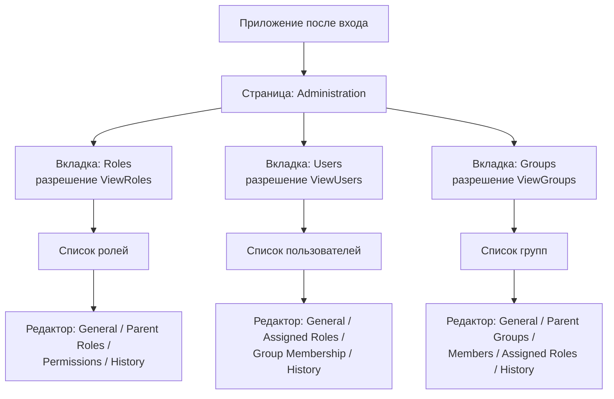
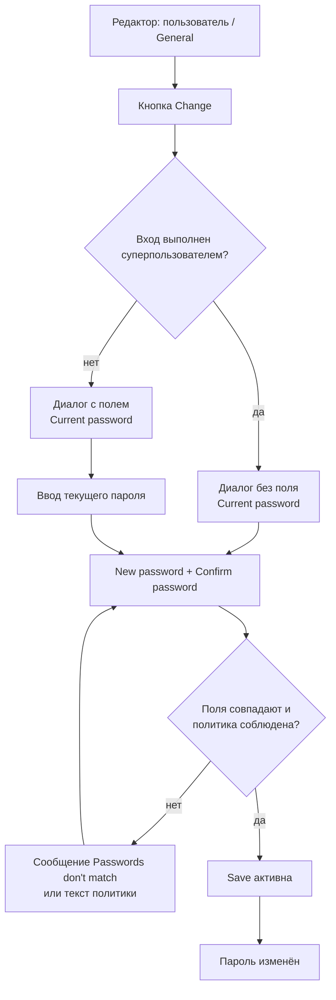
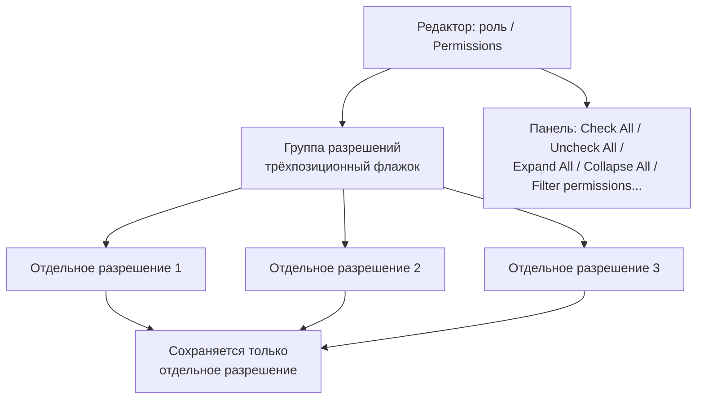
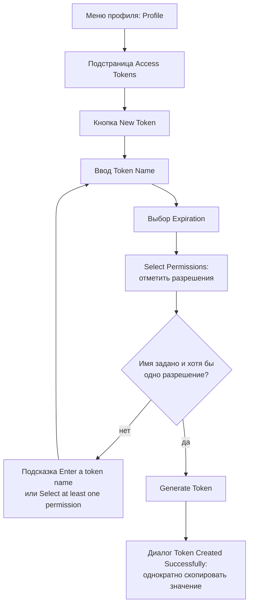
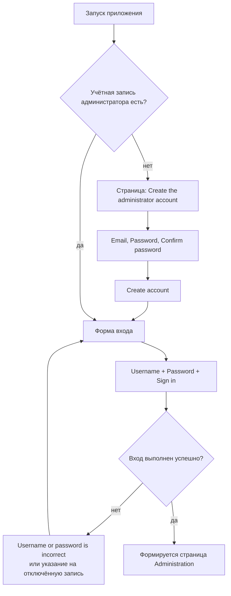

# Puma – Документация интерфейса администрирования

Описание исключительно пользовательского интерфейса управления пользователями

---

## Содержание

1. [О настоящем документе](#1-о-настоящем-документе)
2. [Строение страницы администрирования](#2-строение-страницы-администрирования)
3. [Общие элементы управления](#3-общие-элементы-управления)
4. [Вкладка «Users» (пользователи)](#4-вкладка-users-пользователи)
5. [Вкладка «Roles» (роли)](#5-вкладка-roles-роли)
6. [Вкладка «Groups» (группы)](#6-вкладка-groups-группы)
7. [Страница профиля (самообслуживание)](#7-страница-профиля-самообслуживание)
8. [Вход и первый запуск](#8-вход-и-первый-запуск)
9. [Сообщения интерфейса](#9-сообщения-интерфейса)
10. [Справочник разрешений интерфейса](#10-справочник-разрешений-интерфейса)
11. [Чего нет в интерфейсе](#11-чего-нет-в-интерфейсе)

---

## 1. О настоящем документе

### 1.1 Назначение

Настоящий документ описывает исключительно **интерфейс администрирования**, с помощью которого ведутся пользователи, роли и группы сервера Puma. Он называет каждую страницу, каждый список, каждое поле ввода и каждую кнопку и поясняет, что делают элементы управления и при каких условиях они видимы или доступны.

Понятия, эксплуатация сервера, интеграция через SDK, подключение LDAP и политики безопасности **не** рассматриваются. Они описаны в [руководстве пользователя](../Benutzerhandbuch/Benutzerhandbuch_RU.md).

### 1.2 Целевая аудитория

Администраторы и пользователи, работающие с управлением пользователями в клиенте.

### 1.3 Происхождение интерфейса

Интерфейс не является частью самого Puma, а берётся как готовый QML-компонент из репозитория `ImagingTools/ImtCore` (модуль `Qml/imtauthgui`). Puma встраивает его через композицию `Impl/AuthClientSdk/AdministrationWidget.acc`, которая загружает точку входа `qrc:/qml/imtauthgui/AdministrationUi.qml`. Поэтому любое приложение, встраивающее этот компонент, показывает одни и те же страницы с одними и теми же надписями.

### 1.4 Примечание о надписях

Все приведённые в документе надписи — это **оригинальные английские тексты** интерфейса в том виде, в каком они отображаются без установленного языкового пакета. Они переводимы; если для приложения есть перевод, тексты отображаются на соответствующем языке. Структура страниц при этом не меняется.

### 1.5 Примечание к иллюстрациям

Снимки экрана в настоящем документе — это точные по компоновке воспроизведения интерфейса, полученные из QML-определений модуля `Qml/imtauthgui`. Они показывают расположение, надписи и состояние элементов управления; показанные пользователи, роли, группы и токены являются произвольными примерами. Цвета, шрифты и значки соответствуют оформлению конкретного приложения и поэтому могут отличаться от иллюстраций.

---

## 2. Строение страницы администрирования

### 2.1 Точка входа

Страница администрирования имеет заголовок **«Administration»**. Она формируется только **после успешного входа**; до входа приложение показывает вместо неё форму входа (см. главу 8).

Страница состоит из трёх вкладок, создаваемых в следующем порядке:

| Порядок | Вкладка | Значок | Необходимое разрешение |
| --- | --- | --- | --- |
| 1 | **Roles** | значок роли | `ViewRoles` |
| 2 | **Users** | значок учётной записи | `ViewUsers` |
| 3 | **Groups** | значок группы пользователей | `ViewGroups` |

Вкладка **не отображается вовсе**, если соответствующее разрешение на просмотр отсутствует — она не становится неактивной, а полностью исчезает. При отсутствии всех трёх разрешений страница администрирования остаётся пустой.

Суперпользователь (имя входа `su`) проходит любую проверку разрешений в интерфейсе, поэтому для него всегда видны все вкладки.

### 2.2 Структура

*Рисунок 1: Структура страниц интерфейса администрирования — три зависящие от разрешений вкладки, каждая со списком и многостраничным редактором.*

### 2.3 Схема из двух областей

Каждая вкладка построена одинаково:

1. **Область списка** — таблица всех объектов коллекции с панелью команд, поиском, сортировкой и фильтрами.
2. **Область редактора** — многостраничный редактор, открываемый двойным щелчком по строке или командой **Edit**. Одновременно может быть открыто несколько объектов; каждый открытый объект получает собственную вкладку.

Внутри вкладки представление списка ещё раз носит название коллекции (**«Roles»**, **«Users»**, **«Groups»**).

*Снимок 1: Страница администрирования, вкладка «Users» — строка вкладок, панель команд, поле поиска и список пользователей.*

---

## 3. Общие элементы управления

Все три вкладки используют одни и те же элементы списка и редактора. Здесь они описаны один раз, а в главах 4–6 дополняются лишь особенностями.

### 3.1 Панель команд списка

| Команда | Положение | Условие доступности | Действие |
| --- | --- | --- | --- |
| **New** | слева | всегда, если есть разрешение на создание | Создаёт новый объект и открывает редактор. В надписи указан тип объекта, например **«New User»**, **«New Role»**, **«New Group»**. |
| **Edit** | слева | выбрана ровно **одна** строка | Открывает выбранный объект в редакторе. |
| **Remove** | слева | выбрана **хотя бы одна** строка | Удаляет выбранные объекты после подтверждения. |
| **Export** | справа | выбрана ровно одна строка | Записывает выбранный объект в файл. |
| **Revision** | справа | выбрана ровно одна строка | Открывает представление ревизий. Требуется разрешение `ViewRevisions`; без выбора команда неактивна. |

Команда, для которой нет необходимого разрешения, недоступна. Разрешения по коллекциям сведены в главе 10.

### 3.2 Подтверждение удаления

Перед удалением выводится диалог подтверждения. Для ролей он гласит **«Deleting a role»** / **«Delete the selected role ?»**, для пользователей и групп используется общий текст **«Deleting a selected element»** / **«Remove selected item from the collection ?»**. При удалении всего отфильтрованного набора вопрос звучит **«Deleting elements»** / **«Delete all items with the current filter ?»**.

*Снимок 2: Подтверждение перед удалением выбранного элемента.*

### 3.3 Поиск, сортировка, фильтрация

- Над таблицей каждого списка есть поле поиска.
- Сортируемые столбцы сортируются щелчком по заголовку; какие столбцы сортируемы, указано в главах 4–6.
- Столбцы с функцией фильтрации предлагают меню фильтра в заголовке столбца.

### 3.4 Уведомление об обновлении

Списки наполняются сервером. Если те же данные изменены с другого рабочего места, список показывает уведомление **«This table has been modified from another computer»** с кнопкой **«Update»**. Только после нажатия **Update** таблица показывает актуальное состояние.

*Снимок 3: Уведомление об обновлении над списком с кнопкой «Update».*

### 3.5 Редактор

Редактор занимает правую часть вкладки и состоит из:

- **списка страниц у левого края** с подстраницами объекта (например, *General*, *Assigned Roles*),
- **области содержимого** выбранной подстраницы,
- команд документа **Save**, **Undo**, **Redo** и **Close**.

Изменения передаются на сервер только по команде **Save**. **Save**, **Undo** и **Redo** требуют одного из разрешений на изменение соответствующей коллекции.

### 3.6 Поля выбора для назначений

Назначение ролей, групп и участников повсюду выполняется одним и тем же элементом: список уже назначенных записей со счётчиком, а под ним кнопка добавления (например, **«Add Role»**). Кнопка открывает **список выбора с поиском**; выбор, таким образом, не выполняется флажками в общем списке. Назначенные записи можно удалять по отдельности.

### 3.7 История

Если у вошедшего пользователя есть разрешение `ViewRevisions`, каждый редактор дополнительно содержит подстраницу **«History»**. В её заголовке указано число ревизий в скобках, например `History (7)`. Без этого разрешения подстраница отсутствует.

---

## 4. Вкладка «Users» (пользователи)

### 4.1 Список пользователей

| Столбец | Надпись | Сортировка | Фильтр | Содержимое |
| --- | --- | --- | --- | --- |
| `name` | **Name** | да | да | Отображаемое имя пользователя. Сортировка по умолчанию: по возрастанию этого столбца. |
| `mail` | **Email** | да | да | Сохранённый адрес электронной почты. |
| `systemName` | **System Name** | да | да | Имя внешней системы аутентификации; для внутренних учётных записей пусто. |
| `roles` | **Roles** | нет | нет | Сводка назначенных ролей. |
| `groups` | **Groups** | нет | нет | Сводка членства в группах. |
| `lastConnection` | **Last Connection** | да | нет | Время последнего входа. |

**Столбцы «Roles» и «Groups»:** Вместо полного перечисления ячейка показывает **«View roles(N)»** или **«View groups(N)»** с количеством в скобках, а при отсутствии назначений — **«No roles»** / **«No groups»**. Всплывающая подсказка перечисляет отдельные роли или группы и называет пользователя.

**Фильтр «System Info»:** Столбец `systemName` предлагает фильтр **«System Info»** с двумя вариантами **«Internal»** и **«LDAP»**. Так список можно ограничить учётными записями, управляемыми внутренне, либо входящими через службу каталогов. Это единственный элемент интерфейса, связанный с LDAP.

### 4.2 Команды

Действуют команды из раздела 3.1. Команда создания называется **«New User»**. Необходимые разрешения: `AddUser` (New), `ViewUsers` и `ChangeUser` (Edit), а также `RemoveUser` (Remove).

### 4.3 Редактор — подстраницы

| Подстраница | Заголовок в списке страниц | Условие отображения |
| --- | --- | --- |
| General | **General** | всегда |
| Roles | **Assigned Roles** | всегда |
| Groups | **Group Membership** | всегда |
| History | **History** | только с `ViewRevisions` |

### 4.4 Подстраница «General»

Страница делится на раздел **«General»** с основными данными и — при необходимости — раздел **«System Information»**.

| Поле | Надпись | Подсказка | Обязательное | Видимость / особенность |
| --- | --- | --- | --- | --- |
| Имя входа | **Username** | «Enter the username» | да — текст ошибки **«Please enter the username»** | **Только для чтения**, как только учётная запись привязана к внешней системе. |
| Отображаемое имя | **Name** | «Enter the name» | да — текст ошибки **«Please enter the name»** | – |
| Эл. почта | **Email Address** | «Enter the email» | да — текст ошибки **«Please enter the email»** | Проверяется по шаблону адреса. |
| Состояние записи | **Account enabled**, пояснение **«Disabled accounts cannot log in»** | – | – | Переключатель. **Виден только суперпользователю**; при любом другом входе переключатель отсутствует полностью. |
| Пароль | **Password** | «Enter the password» | да | **Виден только при создании нового пользователя.** Только для чтения, если запись привязана к активной внешней системе. |
| Повтор пароля | **Confirm password** | «Confirm password» | да — текст ошибки **«Please enter the password»** | Только вместе с полем *Password*. |
| Смена пароля | **Change password** с кнопкой **«Change»** | – | – | **Виден только для существующих пользователей**; полностью отсутствует для учётных записей внешней системы. |

Если поля пароля не совпадают или новый пароль оставлен пустым, выводится сообщение **«Passwords don't match»**. При нарушении политики паролей интерфейс называет нарушенное правило в явном виде (см. раздел 9.2).

**Раздел «System Information»:** Таблица из одного столбца с заголовком **«System Name»**, в которой можно выбрать ровно одну запись. Раздел скрыт, если с учётной записью связана не более чем одна система аутентификации.

*Снимок 4: Редактор пользователя, подстраница «General» с основными данными, переключателем «Account enabled», видимым только суперпользователю, и кнопкой «Change».*

### 4.5 Подстраница «Assigned Roles»

Заголовок **«Assigned Roles»**, ниже поле выбора с обозначением **«Roles»** и кнопкой **«Add Role»**. Отображается также число назначенных ролей. Список выбора допускает поиск по имени роли, отсортирован по нему и содержит только роли текущего продукта.

*Снимок 5: Редактор пользователя, подстраница «Assigned Roles» со списком назначенных ролей и кнопкой «Add Role».*

### 4.6 Подстраница «Group Membership»

Заголовок **«Group Membership»**, ниже поле выбора **«Groups»** с кнопкой **«Add Group»** и указанием количества.

### 4.7 Диалог «Change Password»

*Рисунок 2: Ход диалога «Change Password» — у суперпользователя прежний пароль не запрашивается.*

Диалог имеет заголовок **«Change Password»** и содержит кнопки **«Save»** и **«Cancel»**. **Save** остаётся неактивной, пока данные не будут полными и корректными.

Поля следуют в таком порядке:

1. **Current password**, подсказка «Enter the current password» — **отсутствует у суперпользователя**.
2. **New password**, подсказка «Enter the new password».
3. **Confirm password**, подсказка «Confirm password».

Поля нового пароля остаются недоступными для ввода, пока не введён прежний пароль. Под полями интерфейс постоянно показывает действующие требования к паролю.

*Снимок 6: Диалог «Change Password» с тремя полями пароля и действующими требованиями к паролю.*

---

## 5. Вкладка «Roles» (роли)

### 5.1 Список ролей

| Столбец | Надпись | Сортировка | Содержимое |
| --- | --- | --- | --- |
| `roleName` | **Role Name** | да | Понятное название роли. |
| `roleId` | **Role-ID** | да | Технический идентификатор роли. |
| `roleDescription` | **Description** | да | Описание в свободной форме. |

*Снимок 7: Страница администрирования, вкладка «Roles» — без выбора команды Edit, Remove, Export и Revision недоступны.*

### 5.2 Команды

Команда создания называется **«New Role»**. Необходимые разрешения: `AddRole` (New), `ViewRoles` и `ChangeRole` (Edit), `RemoveRole` (Remove). Вопрос при удалении: **«Deleting a role»** / **«Delete the selected role ?»**.

### 5.3 Редактор — подстраницы

| Подстраница | Заголовок в списке страниц | Условие отображения |
| --- | --- | --- |
| General | **General** | всегда |
| ParentRoles | **Parent Roles** | всегда |
| Permission | **Permissions** | всегда |
| History | **History** | только с `ViewRevisions` |

### 5.4 Подстраница «General»

| Поле | Надпись | Подсказка | Особенность |
| --- | --- | --- | --- |
| Название роли | **Role Name** | «Enter the role name» | Обязательное поле. |
| Идентификатор роли | **Role-ID** | – | **Только для чтения.** Идентификатор автоматически образуется из названия роли удалением всех пробелов. |
| Описание | **Description** | «Enter the description» | Необязательно. |

### 5.5 Подстраница «Parent Roles»

Заголовок **«Parent Roles»**, поле выбора **«Parent Roles»** с кнопкой **«Add Parent Role»**. Редактируемая роль в списке выбора не появляется. Более глубокие циклы отклоняются сервером при сохранении.

### 5.6 Подстраница «Permissions»

Разрешения представлены в виде **двухуровневого дерева с трёхпозиционными флажками**:

- Столбец **«Permission»** — название группы разрешений либо отдельного разрешения.
- Столбец **«Description»** — пояснительный текст.

Верхний уровень образуют **группы разрешений**: предоставляемые сервером смысловые заголовки, под которыми распределены отдельные разрешения. При установке флажка на группе выбираются все входящие разрешения; если выбраны лишь отдельные записи, группа показывает промежуточное состояние. **Сохраняются исключительно отдельные разрешения**, а не сами группы.

Подчинённые разрешения отображаются не отдельным уровнем дерева, а путём в названии, например `Edit Sensor / Change Sensor / Change Production Status`.

Над таблицей расположена панель с кнопками **«Check All»**, **«Uncheck All»**, **«Expand All»** и **«Collapse All»**, а также поле поиска с подсказкой **«Filter permissions...»**, выполняющее поиск по названию и описанию.

Предлагаемый список разрешений определяется для каждого продукта; разрешения других продуктов не отображаются.

*Рисунок 3: Строение выбора разрешений в редакторе ролей — группы служат для обзора, сохраняются отдельные разрешения.*

*Снимок 8: Редактор роли, подстраница «Permissions» с двухуровневым деревом, трёхпозиционными флажками и панелью управления.*

---

## 6. Вкладка «Groups» (группы)

### 6.1 Список групп

| Столбец | Надпись | Сортировка | Содержимое |
| --- | --- | --- | --- |
| `name` | **Group Name** | да | Название группы. |
| `description` | **Description** | да | Описание в свободной форме. |

*Снимок 9: Страница администрирования, вкладка «Groups» со списком групп.*

### 6.2 Команды

Команда создания называется **«New Group»**. Необходимые разрешения: `AddGroup` (New), `ViewGroups` и `ChangeGroup` (Edit), `RemoveGroup` (Remove).

### 6.3 Редактор — подстраницы

| Подстраница | Заголовок в списке страниц | Условие отображения |
| --- | --- | --- |
| General | **General** | всегда |
| ParentGroups | **Parent Groups** | всегда |
| Users | **Members** | всегда |
| Roles | **Assigned Roles** | всегда |
| History | **History** | только с `ViewRevisions` |

### 6.4 Поля и назначения

| Подстраница | Содержимое |
| --- | --- |
| **General** | Поля **«Group Name»** (подсказка «Enter the name») и **«Description»** (подсказка «Enter the description»). |
| **Parent Groups** | Поле выбора **«Parent Groups»** с кнопкой **«Add Parent Group»**; редактируемая группа не предлагается. |
| **Members** | Поле выбора **«Users»** с кнопкой **«Add User»**; выбор с поиском по коллекции пользователей с указанием числа участников. |
| **Assigned Roles** | Поле выбора **«Roles»** с кнопкой **«Add Role»**; в рамках продукта. |

---

## 7. Страница профиля (самообслуживание)

### 7.1 Вызов и разграничение

Страница профиля открывается по **значку профиля** в верхней части окна. Меню содержит пункт **«Profile»**, список организаций — текущая с пометкой **«(current)»**, используемые по доверенности с пометкой **«(delegated)»**, иначе **«No organization»** — а также **«Logout»**. Диалог имеет заголовок **«Profile»** и показывает вверху инициалы, отображаемое имя (иначе **«My Account»**) и адрес электронной почты.

Страница профиля — это представление самообслуживания каждого пользователя, и она **не является частью страницы администрирования**. Отличия:

| Признак | Страница администрирования | Страница профиля |
| --- | --- | --- |
| Изменение имени входа | да | нет |
| Переключение состояния записи | да (только суперпользователь) | нет |
| Назначение ролей и групп | да | нет — только просмотр |
| Установка пароля без знания старого | да (суперпользователь) | нет |
| Управление личными токенами доступа | нет | да |

### 7.2 Подстраницы

| Подстраница | Надпись |
| --- | --- |
| Общее | **General** |
| Организации | **Organizations** |
| Токены доступа | **Access Tokens** |
| Роли и разрешения | **Roles & Permissions** |

### 7.3 Подстраница «General»

- Поле **«Name»** (подсказка «Enter the name») и поле **«Email Address»** (подсказка «Enter the email», проверка по шаблону адреса).
- Кнопка **«Save»**, становящаяся активной лишь при отличии имени или адреса от сохранённого состояния. Сообщения: **«Profile saved»** либо **«Unable to save the profile.»**
- Раздел **«Password»** — **виден только для внутренне управляемых учётных записей**; для записей внешней системы он отсутствует. В свёрнутом виде показывает точки-заполнители и кнопку **«Change»**. В развёрнутом содержит поля **«Current password»** (подсказка «Enter your current password», отсутствует у суперпользователя), **«New password»** (подсказка «Enter a new password») и **«Confirm new password»** (подсказка «Re-enter the new password»), ниже — действующие требования к паролю, а также кнопки **«Update password»** и **«Cancel»**. Во время передачи надпись меняется на **«Changing password…»**. Сообщения: **«Password changed»** либо **«Unable to change the password. Check your current password and try again.»**

### 7.4 Подстраница «Roles & Permissions»

Представление только для чтения с тремя таблицами в рамке — **«Roles»**, **«Groups»** и **«Permissions»**, каждая со столбцами **«Name»** и **«Description»**. Пустые разделы скрываются; если не назначено ничего, выводится **«No roles, groups or permissions are assigned.»**

Суперпользователю вместо этого выводится сообщение **«You have full access»** с пояснением **«As a superuser, every permission is already granted to you, so no roles, groups or individual permissions are listed here — there is nothing more to add.»**

### 7.5 Подстраница «Access Tokens» (личные токены доступа)

Управление личными токенами доступа находится **только здесь**, а не на странице администрирования. Каждый пользователь управляет только своими токенами.

**Шапка:** заголовок **«Access tokens»**, пояснение **«Tokens let scripts and integrations authenticate as you.»**, кнопка **«New Token»**.

**Таблица:** столбцы **Name**, **Description**, **Expires At**, **Revoked**, а также столбец действий. В столбце *Expires At* указана дата истечения либо **«No Expiration»**. Столбец действий предлагает в каждой строке удаление (подсказка **«Delete Token»**) и отзыв (подсказка **«Revoke Token»**; для уже отозванных токенов выводится подсказка **«Revoked»**, и они недоступны).

Если токенов ещё нет, выводится **«You don't have any access tokens yet. Create one to let a script or integration authenticate as you.»**

**Подтверждение удаления:** **«Are you sure you want to delete this token?»** с пояснением **«Any applications or scripts using this token will no longer be able to access the API. You cannot undo this action.»** Сообщения: **«Token deleted»**, **«Token revoked»** либо **«Unable to complete the request.»**

**Диалог «New Personal Access Token»:**

| Элемент | Надпись | Примечание |
| --- | --- | --- |
| Имя | **Token Name**, подсказка «e.g. CI/CD Pipeline, API Client...» | Обязательное поле. |
| Срок действия | **Expiration** | Выбор из **«7 Days»**, **«30 Days»**, **«60 Days»**, **«90 Days»**, **«No Expiration»**. |
| Описание | **Description (optional)**, подсказка «What will this token be used for?» | Необязательно. |
| Объём разрешений | **«Select Permissions»** с дополнением **«— grant only the access this token needs»** | Используется та же таблица разрешений, что и в редакторе ролей (раздел 5.6). При отсутствии доступных разрешений выводится **«No permissions available to assign to this token.»** |
| Кнопки | **«Generate Token»**, **«Cancel»** | **Generate Token** сначала неактивна. Подсказки **«Enter a token name to continue»** и **«Select at least one permission»** называют недостающий шаг. |

После создания появляется диалог **«Token Created Successfully»** с текстом **«Please copy and save the token:»**, полем только для чтения, кнопкой копирования (подсказки **«Copy the token»** и **«The token is copied»**) и кнопкой **«OK»**. Значение токена показывается **только здесь**.

*Рисунок 4: Создание личного токена доступа на странице профиля — значение токена показывается только один раз.*

*Снимок 10: Страница профиля, подстраница «Access Tokens» с таблицей токенов и действиями в каждой строке.*

*Снимок 11: Диалог «New Personal Access Token» — кнопка «Generate Token» остаётся недоступной, пока не заданы имя и хотя бы одно разрешение.*

---

## 8. Вход и первый запуск

### 8.1 Форма входа

Форма входа оформлена как карточка и содержит сверху вниз:

1. Заголовок **«Welcome to»** с названием приложения; если название не задано — **«Welcome»**.
2. Поле **«Username»** с подсказкой **«Enter your username»**.
3. Поле **«Password»** с подсказкой **«Enter your password»**. Ввод скрыт; кнопка у края поля показывает и скрывает пароль.
4. Флажок **«Remember me»** (включён по умолчанию, запоминает последнее использованное имя входа) и — если доступно восстановление пароля — ссылка **«Forgot password?»**.
5. Кнопка **«Sign in»**. Активна только при заполненных полях и отсутствии выполняющегося запроса; во время входа отображает индикатор выполнения.
6. Ссылка **«Sign up»** — видна, только если разрешена самостоятельная регистрация. Открывает диалог **«Sign up»** с кнопками **«Sign up»** и **«Close»**, содержащий те же поля основных данных, что и редактор пользователя.

**Неудачный вход:** Поле пароля очищается, имя входа сохраняется, и выводится сообщение сервера, иначе — **«Username or password is incorrect»**. Если учётная запись отключена, сообщение гласит **«This account has been deactivated. Please contact your administrator.»**

*Снимок 12: Форма входа с полями «Username», «Password», флажком «Remember me» и кнопкой «Sign in».*

### 8.2 Восстановление пароля

Диалог **«Password Recovery»** проводит через восстановление за четыре шага. Помимо **«Cancel»**, основная кнопка на каждом шаге имеет свою надпись.

| Шаг | Содержание | Основная кнопка |
| --- | --- | --- |
| 1 | Поле **«Email»** (подсказка «Enter the email») с пояснением **«Enter the email address that was specified on your account, a code will be sent to it»**; текст ошибки **«Please enter the valid email»**. | **«Check the email»** |
| 2 | Поле только для чтения **«Username»** с вопросом **«For this email this account has been found, is that you?»**. При отрицательном ответе выводится **«Check the email you entered»**, и диалог возвращается к шагу 1. | **«Yes»** |
| 3 | Поле **«Code»** (подсказка «Enter the code») с пояснением **«Please enter the code sent to your email»**; повторный запрос через **«Send the code again»** с кнопкой **«Send»** и ожиданием 60 секунд. | **«Check the code»** |
| 4 | Поля нового пароля без запроса прежнего. Сообщение об успехе **«Password changed successfully»**. | **«Change password»** |

### 8.3 Первый запуск и создание суперпользователя

Если у сервера ещё нет учётной записи администратора, поверх приложения выводится страница её создания.

- Заголовок **«Create the administrator account»**, пояснение **«This server doesn't have one yet. Set a name and password below - you'll sign in with them right after.»**
- Поля ввода в следующем порядке: **Username** (жёстко задано `su`, **только для чтения**), **Name** (предзаполнено значением `superuser`), **Email Address**, **Password**, **Confirm password**. Курсор изначально находится в поле *Email Address*.
- Переключателя *Account enabled* здесь нет.
- Кнопка **«Create account»**. Становится активной лишь при корректном адресе электронной почты, заполненном повторе и совпадении обоих полей пароля.
- При неудаче под формой появляется полоса ошибки с сообщением сервера, иначе — **«Unable to create the administrator account»** либо **«Unable to reach server»**.

*Рисунок 5: Путь от первого запуска через вход к странице администрирования.*

*Снимок 13: Первый запуск: страница «Create the administrator account» с защищённым от записи именем `su`.*

---

## 9. Сообщения интерфейса

### 9.1 Сообщения при редактировании

| Ситуация | Сообщение |
| --- | --- |
| Имя входа не заполнено | **Please enter the username** |
| Отображаемое имя не заполнено | **Please enter the name** |
| Адрес почты пуст или некорректен | **Please enter the email** |
| Повтор пароля пуст или отличается | **Passwords don't match** |
| Имя входа уже занято | **Username already exists** |
| Идентификатор роли уже занят | **Role with ID: '…' already exists** |
| Название группы уже занято | **Group Name '…' already exists** |
| Суперпользователь уже создан | **Superuser already exists** |
| Профиль не удалось сохранить | **Unable to save the profile.** |
| Пароль не удалось изменить | **Unable to change the password.** |

### 9.2 Сообщения политики паролей

Интерфейс объединяет сообщённые сервером правила в предложение по образцу **«The password must contain …»**. Встречаются следующие составляющие:

- **at least N characters** — минимальная длина,
- **at most N characters** — максимальная длина,
- **a lowercase letter**, **an uppercase letter**, **a digit**, **a special character** — требуемые классы символов,
- **a password different from the login** — пароль не должен совпадать с именем входа,
- **a password that is not commonly used** — список запрещённых распространённых паролей,
- **a password different from the last N ones** либо **a password that was not used before** — запрет повторного использования.

То же предложение служит постоянной подсказкой под полями пароля.

Прочие ответы сервера:

| Причина | Сообщение |
| --- | --- |
| Прежний пароль неверен | **The current password is not correct.** |
| Минимальный срок действия пароля не истёк | **The password was changed too recently and cannot be changed again yet.** |
| Учётная запись управляется извне | **This account is managed by an external system, its password cannot be changed here.** |
| Учётной записи больше нет | **This account no longer exists.** |
| Ошибка сервера или хранилища | **The password could not be changed. Please try again later.** |

---

## 10. Справочник разрешений интерфейса

### 10.1 Разрешения по коллекциям

| Коллекция | Просмотр | Создание | Изменение | Удаление |
| --- | --- | --- | --- | --- |
| Пользователи | `ViewUsers` | `AddUser` | `ChangeUser` | `RemoveUser` |
| Роли | `ViewRoles` | `AddRole` | `ChangeRole` | `RemoveRole` |
| Группы | `ViewGroups` | `AddGroup` | `ChangeGroup` | `RemoveGroup` |

Для пользователей дополнительно существуют разрешения `RestoreUser`, `ExportUser` и `ImportUser`.

### 10.2 Сквозные разрешения

| Разрешение | Действие в интерфейсе |
| --- | --- |
| `ViewRevisions` | Показывает подстраницу **History** во всех редакторах и команду **Revision** во всех списках. |

### 10.3 Особое положение суперпользователя

Суперпользователь проходит любую проверку разрешений в интерфейсе. Кроме того:

- Переключатель **Account enabled** виден исключительно ему.
- В диалогах пароля у него не запрашивается прежний пароль.
- На странице профиля вместо таблиц ролей и разрешений выводится сообщение **«You have full access»**.

---

## 11. Чего нет в интерфейсе

Следующие функции намеренно названы как отсутствующие, чтобы их не искали не там:

| Функция | Состояние |
| --- | --- |
| **Разблокировка заблокированной учётной записи** | Элемент управления **отсутствует**. Разблокировка выполняется исключительно через серверный интерфейс. |
| **Настройка подключения LDAP** | Страницы настройки **нет**. Интерфейс предлагает лишь фильтр списка **«Internal»/«LDAP»** (раздел 4.1); подключение настраивается в конфигурации сервера. |
| **Управление чужими токенами доступа** | Управление токенами ограничено собственными токенами вошедшего пользователя (раздел 7.5); административного обзора всех токенов нет. |
| **Изменение имени входа внешних учётных записей** | Поле **Username** доступно только для чтения для записей внешней системы. |
| **Ведение паролей внешних учётных записей** | Раздел **Password** и кнопка **Change password** отсутствуют для внешне управляемых записей. |

---

*Конец документации интерфейса администрирования*
