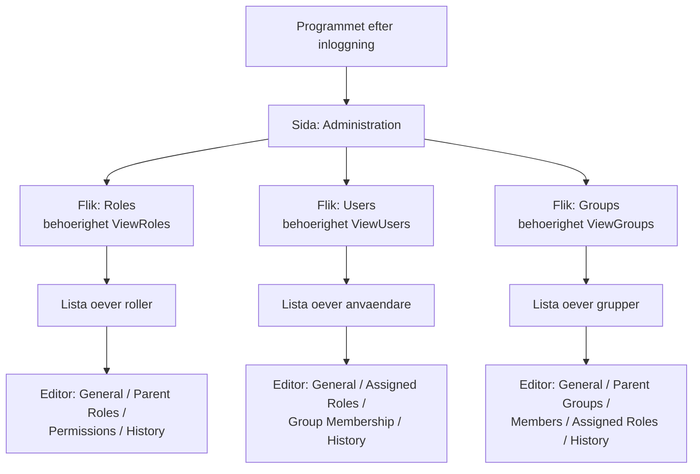
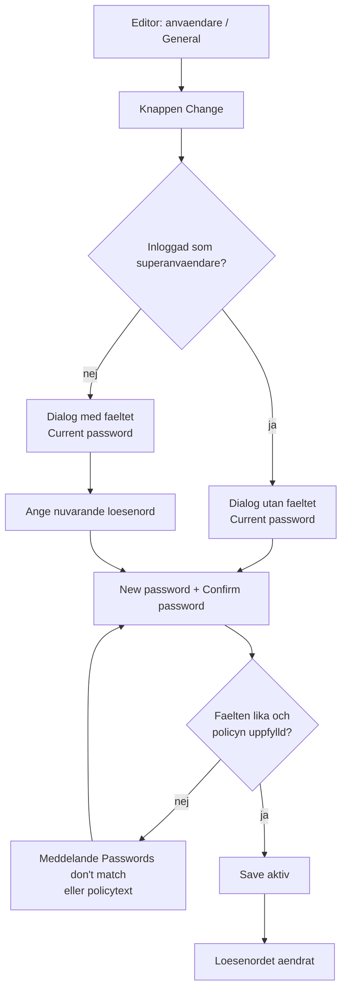
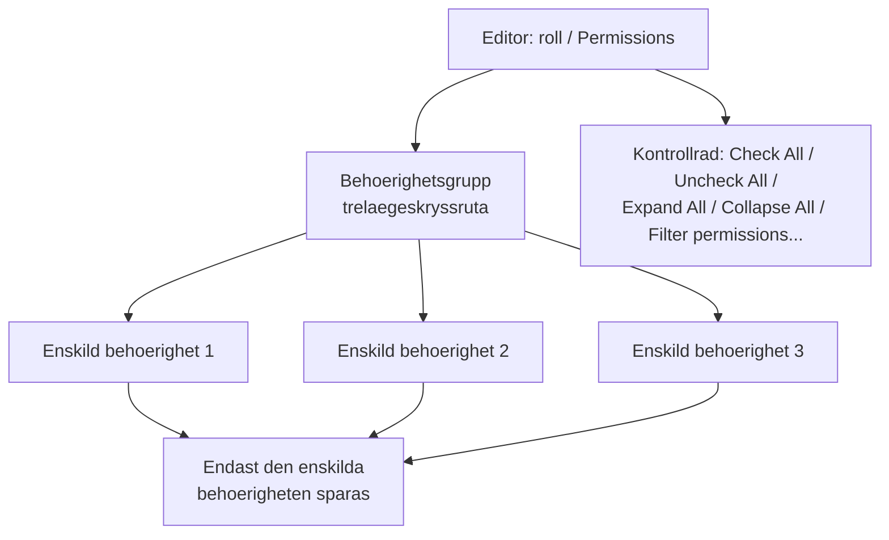
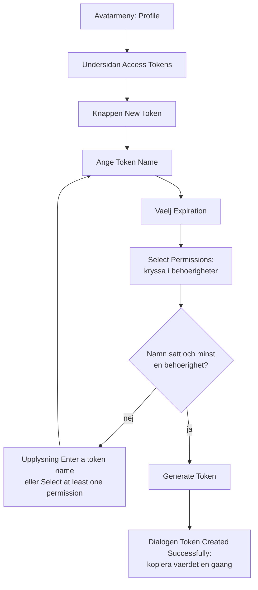
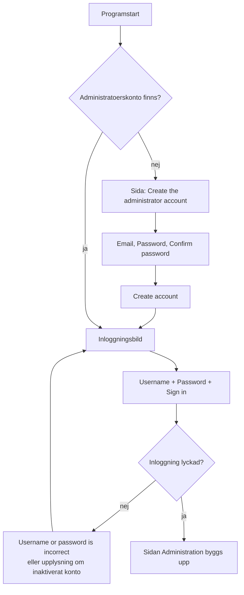

# Puma – Dokumentation av administrationsgränssnittet

Ren gränssnittsbeskrivning av användarhanteringen

---

## Innehållsförteckning

1. [Om detta dokument](#1-om-detta-dokument)
2. [Administrationssidans uppbyggnad](#2-administrationssidans-uppbyggnad)
3. [Gemensamma kontroller](#3-gemensamma-kontroller)
4. [Fliken ”Users” (användare)](#4-fliken-users-användare)
5. [Fliken ”Roles” (roller)](#5-fliken-roles-roller)
6. [Fliken ”Groups” (grupper)](#6-fliken-groups-grupper)
7. [Profilsidan (självbetjäning)](#7-profilsidan-självbetjäning)
8. [Inloggning och första start](#8-inloggning-och-första-start)
9. [Meddelanden i gränssnittet](#9-meddelanden-i-gränssnittet)
10. [Behörighetsreferens för gränssnittet](#10-behörighetsreferens-för-gränssnittet)
11. [Ingår inte i gränssnittet](#11-ingår-inte-i-gränssnittet)

---

## 1. Om detta dokument

### 1.1 Syfte

Detta dokument beskriver uteslutande det **administrationsgränssnitt** som används för att underhålla användare, roller och grupper på en Puma-server. Det namnger varje sida, lista, inmatningsfält och knapp och förklarar vad kontrollerna gör och under vilka villkor de är synliga eller användbara.

Begrepp, serverdrift, SDK-integration, LDAP-anslutning och säkerhetspolicyer behandlas **inte** här. De beskrivs i [användarhandboken](../Benutzerhandbuch/Benutzerhandbuch_SV.md).

### 1.2 Målgrupp

Administratörer och användare som arbetar med användarhanteringen i klienten.

### 1.3 Gränssnittets ursprung

Gränssnittet är inte en del av Puma självt utan hämtas som en färdig QML-komponent från förrådet `ImagingTools/ImtCore` (modulen `Qml/imtauthgui`). Puma bäddar in den via kompositionen `Impl/AuthClientSdk/AdministrationWidget.acc`, som laddar startfilen `qrc:/qml/imtauthgui/AdministrationUi.qml`. Varje program som bäddar in komponenten visar därför samma sidor och samma etiketter.

### 1.4 Om etiketterna

Alla etiketter som citeras i detta dokument är gränssnittets **engelska originaltexter**, så som de visas utan installerat språkpaket. De går att översätta; finns en översättning för programmet visas texterna på respektive språk. Sidornas struktur påverkas inte.

---

## 2. Administrationssidans uppbyggnad

### 2.1 Ingång

Administrationssidan har sidtiteln **”Administration”**. Den byggs upp först **efter lyckad inloggning**; dessförinnan visar programmet inloggningsbilden i dess ställe (se kapitel 8).

Sidan består av tre flikar som skapas i denna ordning:

| Ordning | Flik | Ikon | Nödvändig behörighet |
| --- | --- | --- | --- |
| 1 | **Roles** | rollikon | `ViewRoles` |
| 2 | **Users** | kontoikon | `ViewUsers` |
| 3 | **Groups** | fleranvändarikon | `ViewGroups` |

En flik **visas inte alls** om motsvarande visningsbehörighet saknas – den blir inte nedtonad utan uteblir helt. Saknas alla tre behörigheterna förblir administrationssidan tom.

Superanvändaren (inloggningsnamn `su`) godkänns i varje behörighetskontroll i gränssnittet; för denne är därför alltid alla flikar synliga.

### 2.2 Struktur

*Figur 1: Administrationsgränssnittets sidstruktur – tre behörighetsberoende flikar med vardera en lista och en flersidig editor.*

### 2.3 Tvådelat mönster

Varje flik följer samma mönster:

1. **Listdel** – en tabell över alla objekt i samlingen med kommandorad, sökning, sortering och filter.
2. **Editordel** – en flersidig editor som öppnas genom dubbelklick på en rad eller via kommandot **Edit**. Flera objekt kan vara öppna samtidigt; varje öppnat objekt får en egen flik.

Inuti fliken bär listvyn ännu en gång samlingens namn (**”Roles”**, **”Users”**, **”Groups”**).

---

## 3. Gemensamma kontroller

Alla tre flikar använder samma list- och editorbyggstenar. De beskrivs en gång här och kompletteras i kapitel 4 till 6 endast med det som är särskilt.

### 3.1 Listans kommandorad

| Kommando | Placering | Villkor för aktivering | Verkan |
| --- | --- | --- | --- |
| **New** | vänster | alltid, förutsatt att skapandebehörighet finns | Skapar ett nytt objekt och öppnar editorn. Etiketten nämner objekttypen, t.ex. **”New User”**, **”New Role”**, **”New Group”**. |
| **Edit** | vänster | exakt **en** rad markerad | Öppnar det markerade objektet i editorn. |
| **Remove** | vänster | **minst en** rad markerad | Raderar de markerade objekten efter bekräftelse. |
| **Export** | höger | exakt en rad markerad | Skriver det markerade objektet till en fil. |
| **Revision** | höger | exakt en rad markerad | Öppnar revisionsvyn. Kräver behörigheten `ViewRevisions`; utan markering är kommandot inaktiverat. |

Ett kommando som saknar nödvändig behörighet är inte tillgängligt. Behörigheterna per samling sammanfattas i kapitel 10.

### 3.2 Bekräftelse vid radering

Före radering visas en bekräftelsedialog. För roller lyder den **”Deleting a role”** / **”Delete the selected role ?”**, för användare och grupper används den generella texten **”Deleting a selected element”** / **”Remove selected item from the collection ?”**. Raderas hela det filtrerade beståndet lyder frågan **”Deleting elements”** / **”Delete all items with the current filter ?”**.

### 3.3 Sök, sortera, filtrera

- Varje lista har ett sökfält ovanför tabellen.
- Sorterbara kolumner sorteras genom klick på kolumnrubriken; vilka kolumner som är sorterbara anges i kapitel 4 till 6.
- Kolumner med filterfunktion erbjuder en filtermeny i kolumnrubriken.

### 3.4 Uppdateringsnotis

Listorna försörjs av servern. Ändrar en annan arbetsplats samma data visar listan notisen **”This table has been modified from another computer”** med knappen **”Update”**. Först efter att **Update** använts visar tabellen aktuellt läge.

### 3.5 Editor

Editorn upptar flikens högra del och består av:

- en **sidlista vid vänsterkanten** med objektets undersidor (t.ex. *General*, *Assigned Roles*),
- **innehållsytan** för den valda undersidan,
- dokumentkommandona **Save**, **Undo**, **Redo** och **Close**.

Ändringar överförs till servern först med **Save**. **Save**, **Undo** och **Redo** kräver någon av samlingens ändringsbehörigheter.

### 3.6 Urvalskontroller för tilldelningar

Roll-, grupp- och medlemstilldelningar använder överallt samma kontroll: en lista över redan tilldelade poster med räknare och därunder en knapp för att lägga till (t.ex. **”Add Role”**). Knappen öppnar en **sökbar urvalslista**; valet görs alltså inte via kryssrutor i en samlad lista. Tilldelade poster kan tas bort en och en.

### 3.7 Historik

Har den inloggade användaren behörigheten `ViewRevisions` innehåller varje editor dessutom undersidan **”History”**. Rubriken anger antalet revisioner inom parentes, t.ex. `History (7)`. Utan behörigheten saknas undersidan.

---

## 4. Fliken ”Users” (användare)

### 4.1 Lista över användare

| Kolumn | Etikett | Sorterbar | Filtrerbar | Innehåll |
| --- | --- | --- | --- | --- |
| `name` | **Name** | ja | ja | Användarens visningsnamn. Standardsortering: stigande efter denna kolumn. |
| `mail` | **Email** | ja | ja | Lagrad e-postadress. |
| `systemName` | **System Name** | ja | ja | Namn på det externa inloggningssystemet; tomt för interna konton. |
| `roles` | **Roles** | nej | nej | Sammanfattning av tilldelade roller. |
| `groups` | **Groups** | nej | nej | Sammanfattning av gruppmedlemskapen. |
| `lastConnection` | **Last Connection** | ja | nej | Tidpunkt för senaste inloggning. |

**Kolumnerna ”Roles” och ”Groups”:** I stället för hela uppräkningen visar cellen **”View roles(N)”** respektive **”View groups(N)”** med antalet inom parentes, eller **”No roles”** / **”No groups”** när inget är tilldelat. Verktygstipset listar de enskilda rollerna eller grupperna och nämner användarnamnet.

**Filtret ”System Info”:** Kolumnen `systemName` erbjuder filtret **”System Info”** med de två alternativen **”Internal”** och **”LDAP”**. Därmed kan listan begränsas till internt förvaltade konton eller till konton som loggar in via en katalogtjänst. Detta är gränssnittets enda LDAP-relaterade kontroll.

### 4.2 Kommandon

Kommandona i avsnitt 3.1 gäller. Skapandekommandot heter **”New User”**. Nödvändiga behörigheter är `AddUser` (New), `ViewUsers` och `ChangeUser` (Edit) samt `RemoveUser` (Remove).

### 4.3 Editor – undersidor

| Undersida | Titel i sidlistan | Visningsvillkor |
| --- | --- | --- |
| General | **General** | alltid |
| Roles | **Assigned Roles** | alltid |
| Groups | **Group Membership** | alltid |
| History | **History** | endast med `ViewRevisions` |

### 4.4 Undersidan ”General”

Sidan delas i avsnittet **”General”** med stamdata och – i förekommande fall – avsnittet **”System Information”**.

| Fält | Etikett | Platshållare | Obligatoriskt | Synlighet / särdrag |
| --- | --- | --- | --- | --- |
| Inloggningsnamn | **Username** | ”Enter the username” | ja – feltext **”Please enter the username”** | **Skrivskyddat** så snart kontot är bundet till ett externt system. |
| Visningsnamn | **Name** | ”Enter the name” | ja – feltext **”Please enter the name”** | – |
| E-post | **Email Address** | ”Enter the email” | ja – feltext **”Please enter the email”** | Kontrolleras mot ett e-postmönster. |
| Kontostatus | **Account enabled**, förklaring **”Disabled accounts cannot log in”** | – | – | Reglage. **Synligt endast för superanvändaren**; för alla andra inloggningar saknas reglaget helt. |
| Lösenord | **Password** | ”Enter the password” | ja | **Synligt endast när en ny användare skapas.** Skrivskyddat om kontot är bundet till ett aktivt externt system. |
| Lösenordsupprepning | **Confirm password** | ”Confirm password” | ja – feltext **”Please enter the password”** | Endast tillsammans med fältet *Password*. |
| Lösenordsbyte | **Change password** med knappen **”Change”** | – | – | **Synligt endast för befintliga användare**; uteblir helt för konton i ett externt system. |

Skiljer sig de båda lösenordsfälten åt eller lämnas det nya lösenordet tomt visas texten **”Passwords don't match”**. Bryter lösenordet mot lösenordspolicyn anger gränssnittet den överträdda regeln i klartext (se avsnitt 9.2).

**Avsnittet ”System Information”:** En enkolumnstabell med kolumnrubriken **”System Name”** där exakt en post kan väljas. Avsnittet döljs om kontot är bundet till högst ett inloggningssystem.

### 4.5 Undersidan ”Assigned Roles”

Rubrik **”Assigned Roles”**, därunder urvalskontrollen med beteckningen **”Roles”** och knappen **”Add Role”**. Antalet tilldelade roller visas också. Urvalslistan är sökbar och sorterad efter rollnamn och innehåller endast roller för den aktuella produkten.

### 4.6 Undersidan ”Group Membership”

Rubrik **”Group Membership”**, därunder urvalskontrollen **”Groups”** med knappen **”Add Group”** och antalet.

### 4.7 Dialogen ”Change Password”

*Figur 2: Förlopp i dialogen ”Change Password” – superanvändaren tillfrågas inte om det tidigare lösenordet.*

Dialogen har titeln **”Change Password”** och innehåller knapparna **”Save”** och **”Cancel”**. **Save** förblir inaktiverad tills uppgifterna är fullständiga och giltiga.

Fälten visas i denna ordning:

1. **Current password**, platshållare ”Enter the current password” – **uteblir för superanvändaren**.
2. **New password**, platshållare ”Enter the new password”.
3. **Confirm password**, platshållare ”Confirm password”.

Fälten för det nya lösenordet förblir skrivskyddade så länge det tidigare lösenordet inte angetts. Under fälten visar gränssnittet fortlöpande de gällande lösenordskraven.

---

## 5. Fliken ”Roles” (roller)

### 5.1 Lista över roller

| Kolumn | Etikett | Sorterbar | Innehåll |
| --- | --- | --- | --- |
| `roleName` | **Role Name** | ja | Rollens beskrivande namn. |
| `roleId` | **Role-ID** | ja | Rollens tekniska identifierare. |
| `roleDescription` | **Description** | ja | Fritextbeskrivning. |

### 5.2 Kommandon

Skapandekommandot heter **”New Role”**. Nödvändiga behörigheter: `AddRole` (New), `ViewRoles` och `ChangeRole` (Edit), `RemoveRole` (Remove). Raderingsfrågan lyder **”Deleting a role”** / **”Delete the selected role ?”**.

### 5.3 Editor – undersidor

| Undersida | Titel i sidlistan | Visningsvillkor |
| --- | --- | --- |
| General | **General** | alltid |
| ParentRoles | **Parent Roles** | alltid |
| Permission | **Permissions** | alltid |
| History | **History** | endast med `ViewRevisions` |

### 5.4 Undersidan ”General”

| Fält | Etikett | Platshållare | Särdrag |
| --- | --- | --- | --- |
| Rollnamn | **Role Name** | ”Enter the role name” | Obligatoriskt fält. |
| Rollidentifierare | **Role-ID** | – | **Skrivskyddat.** Identifieraren bildas automatiskt ur rollnamnet genom att alla blanksteg tas bort. |
| Beskrivning | **Description** | ”Enter the description” | Valfritt. |

### 5.5 Undersidan ”Parent Roles”

Rubrik **”Parent Roles”**, urvalskontrollen **”Parent Roles”** med knappen **”Add Parent Role”**. Den redigerade rollen visas inte i urvalslistan. Djupare cykler avvisas av servern vid sparandet.

### 5.6 Undersidan ”Permissions”

Behörigheterna visas som ett **tvånivåträd med trelägeskryssrutor**:

- Kolumnen **”Permission”** – namn på behörighetsgruppen respektive den enskilda behörigheten.
- Kolumnen **”Description”** – förklarande text.

Den översta nivån utgörs av **behörighetsgrupper**: fackliga samlingsrubriker som levereras av servern och under vilka de enskilda behörigheterna sorteras in. Kryssas en grupp i väljs alla ingående behörigheter; är endast enskilda poster valda visar gruppen mellanläget. **Endast de enskilda behörigheterna sparas**, inte grupperna själva.

Underordnade behörigheter visas inte som en djupare trädnivå utan som en sökväg i namnet, t.ex. `Edit Sensor / Change Sensor / Change Production Status`.

Ovanför tabellen finns en kontrollrad med knapparna **”Check All”**, **”Uncheck All”**, **”Expand All”** och **”Collapse All”** samt ett sökfält med platshållaren **”Filter permissions...”** som söker i namn och beskrivning.

Den erbjudna behörighetslistan tas fram per produkt; behörigheter för andra produkter visas inte.

*Figur 3: Behörighetsurvalets uppbyggnad i rolleditorn – grupper ger överblick, de enskilda behörigheterna sparas.*

---

## 6. Fliken ”Groups” (grupper)

### 6.1 Lista över grupper

| Kolumn | Etikett | Sorterbar | Innehåll |
| --- | --- | --- | --- |
| `name` | **Group Name** | ja | Gruppens namn. |
| `description` | **Description** | ja | Fritextbeskrivning. |

### 6.2 Kommandon

Skapandekommandot heter **”New Group”**. Nödvändiga behörigheter: `AddGroup` (New), `ViewGroups` och `ChangeGroup` (Edit), `RemoveGroup` (Remove).

### 6.3 Editor – undersidor

| Undersida | Titel i sidlistan | Visningsvillkor |
| --- | --- | --- |
| General | **General** | alltid |
| ParentGroups | **Parent Groups** | alltid |
| Users | **Members** | alltid |
| Roles | **Assigned Roles** | alltid |
| History | **History** | endast med `ViewRevisions` |

### 6.4 Fält och tilldelningar

| Undersida | Innehåll |
| --- | --- |
| **General** | Fälten **”Group Name”** (platshållare ”Enter the name”) och **”Description”** (platshållare ”Enter the description”). |
| **Parent Groups** | Urvalskontrollen **”Parent Groups”** med knappen **”Add Parent Group”**; den redigerade gruppen erbjuds inte. |
| **Members** | Urvalskontrollen **”Users”** med knappen **”Add User”**; sökbart urval ur användarsamlingen med antal medlemmar. |
| **Assigned Roles** | Urvalskontrollen **”Roles”** med knappen **”Add Role”**; produktbunden. |

---

## 7. Profilsidan (självbetjäning)

### 7.1 Öppning och avgränsning

Profilsidan öppnas via **avatarikonen** i sidhuvudet. Menyn innehåller posten **”Profile”**, listan över organisationer – den aktuella med tillägget **”(current)”**, delegerade med **”(delegated)”**, annars **”No organization”** – samt **”Logout”**. Dialogen har titeln **”Profile”** och visar överst initialer, visningsnamn (annars **”My Account”**) och e-postadress.

Profilsidan är varje användares självbetjäningsvy och är **inte en del av administrationssidan**. Den skiljer sig från denna enligt följande:

| Egenskap | Administrationssidan | Profilsidan |
| --- | --- | --- |
| Ändra inloggningsnamn | ja | nej |
| Växla kontostatus | ja (endast superanvändare) | nej |
| Tilldela roller och grupper | ja | nej – endast läsande visning |
| Sätta lösenord utan att känna det gamla | ja (superanvändare) | nej |
| Hantera personliga åtkomsttoken | nej | ja |

### 7.2 Undersidor

| Undersida | Etikett |
| --- | --- |
| Allmänt | **General** |
| Organisationer | **Organizations** |
| Åtkomsttoken | **Access Tokens** |
| Roller och behörigheter | **Roles & Permissions** |

### 7.3 Undersidan ”General”

- Fältet **”Name”** (platshållare ”Enter the name”) och fältet **”Email Address”** (platshållare ”Enter the email”, kontroll mot ett e-postmönster).
- Knappen **”Save”**, som blir aktiv först när namn eller e-post avviker från sparat läge. Återkoppling: **”Profile saved”** respektive **”Unable to save the profile.”**
- Avsnittet **”Password”** – **synligt endast för internt förvaltade konton**; för konton i ett externt system uteblir det. I hopfällt läge visas platshållarpunkter och knappen **”Change”**. Utfällt innehåller det fälten **”Current password”** (platshållare ”Enter your current password”, uteblir för superanvändaren), **”New password”** (platshållare ”Enter a new password”) och **”Confirm new password”** (platshållare ”Re-enter the new password”), därunder de gällande lösenordskraven samt knapparna **”Update password”** och **”Cancel”**. Under överföringen lyder etiketten **”Changing password…”**. Återkoppling: **”Password changed”** respektive **”Unable to change the password. Check your current password and try again.”**

### 7.4 Undersidan ”Roles & Permissions”

Rent läsande vy med tre inramade tabeller **”Roles”**, **”Groups”** och **”Permissions”**, var och en med kolumnerna **”Name”** och **”Description”**. Tomma avsnitt döljs; är ingenting alls tilldelat visas **”No roles, groups or permissions are assigned.”**

För superanvändaren visas i stället texten **”You have full access”** med förklaringen **”As a superuser, every permission is already granted to you, so no roles, groups or individual permissions are listed here — there is nothing more to add.”**

### 7.5 Undersidan ”Access Tokens” (personliga åtkomsttoken)

Hanteringen av personliga åtkomsttoken finns **endast här**, inte på administrationssidan. Varje användare hanterar bara sina egna token.

**Sidhuvud:** rubriken **”Access tokens”**, förklaringen **”Tokens let scripts and integrations authenticate as you.”**, knappen **”New Token”**.

**Tabell:** kolumnerna **Name**, **Description**, **Expires At**, **Revoked** samt en åtgärdskolumn. I kolumnen *Expires At* står utgångsdatumet eller **”No Expiration”**. Åtgärdskolumnen erbjuder radering (verktygstips **”Delete Token”**) och återkallande (verktygstips **”Revoke Token”**; redan återkallade token visar verktygstipset **”Revoked”** och kan inte längre användas).

Finns ännu inget token visas **”You don't have any access tokens yet. Create one to let a script or integration authenticate as you.”**

**Bekräftelse vid radering:** **”Are you sure you want to delete this token?”** med upplysningen **”Any applications or scripts using this token will no longer be able to access the API. You cannot undo this action.”** Återkoppling: **”Token deleted”**, **”Token revoked”** respektive **”Unable to complete the request.”**

**Dialogen ”New Personal Access Token”:**

| Element | Etikett | Anmärkning |
| --- | --- | --- |
| Namn | **Token Name**, platshållare ”e.g. CI/CD Pipeline, API Client...” | Obligatoriskt fält. |
| Giltighet | **Expiration** | Val mellan **”7 Days”**, **”30 Days”**, **”60 Days”**, **”90 Days”**, **”No Expiration”**. |
| Beskrivning | **Description (optional)**, platshållare ”What will this token be used for?” | Valfritt. |
| Behörighetsomfång | **”Select Permissions”** med tillägget **”— grant only the access this token needs”** | Använder samma behörighetstabell som rolleditorn (avsnitt 5.6). Finns inga behörigheter visas **”No permissions available to assign to this token.”** |
| Knappar | **”Generate Token”**, **”Cancel”** | **Generate Token** är först inaktiverad. Texterna **”Enter a token name to continue”** och **”Select at least one permission”** anger vad som saknas. |

Efter skapandet visas dialogen **”Token Created Successfully”** med texten **”Please copy and save the token:”**, ett skrivskyddat visningsfält, en kopieringsknapp (verktygstips **”Copy the token”** och **”The token is copied”**) och knappen **”OK”**. Tokenvärdet visas **endast här**.

*Figur 4: Skapande av ett personligt åtkomsttoken på profilsidan – tokenvärdet visas endast en gång.*

---

## 8. Inloggning och första start

### 8.1 Inloggningsbild

Inloggningsbilden är uppbyggd som ett kort och innehåller uppifrån och ned:

1. Rubriken **”Welcome to”** följd av programnamnet; finns inget namn lyder den **”Welcome”**.
2. Fältet **”Username”** med platshållaren **”Enter your username”**.
3. Fältet **”Password”** med platshållaren **”Enter your password”**. Inmatningen är dold; en knapp vid fältkanten visar och döljer lösenordet.
4. Kryssrutan **”Remember me”** (aktiv som standard, minns det senast använda inloggningsnamnet) och – om lösenordsåterställning är tillgänglig – länken **”Forgot password?”**.
5. Knappen **”Sign in”**. Den är aktiv endast när båda fälten är ifyllda och ingen förfrågan pågår; under inloggningen visas en förloppsindikator.
6. Länken **”Sign up”** – synlig endast om självregistrering är aktiverad. Den öppnar dialogen **”Sign up”** med knapparna **”Sign up”** och **”Close”**, innehållande samma stamdatafält som användareditorn.

**Misslyckad inloggning:** Lösenordsfältet töms, inloggningsnamnet står kvar och serverns meddelande visas, annars **”Username or password is incorrect”**. Är kontot inaktiverat lyder meddelandet **”This account has been deactivated. Please contact your administrator.”**

### 8.2 Lösenordsåterställning

Dialogen **”Password Recovery”** leder genom återställningen i fyra steg. Vid sidan av **”Cancel”** bär huvudknappen olika etikett i varje steg.

| Steg | Innehåll | Huvudknapp |
| --- | --- | --- |
| 1 | Fältet **”Email”** (platshållare ”Enter the email”) med förklaringen **”Enter the email address that was specified on your account, a code will be sent to it”**; feltext **”Please enter the valid email”**. | **”Check the email”** |
| 2 | Skrivskyddat fält **”Username”** med frågan **”For this email this account has been found, is that you?”**. Besvaras den nekande visas **”Check the email you entered”** och dialogen återgår till steg 1. | **”Yes”** |
| 3 | Fältet **”Code”** (platshållare ”Enter the code”) med förklaringen **”Please enter the code sent to your email”**; ny begäran via **”Send the code again”** med knappen **”Send”** och en väntetid på 60 sekunder. | **”Check the code”** |
| 4 | Fält för det nya lösenordet utan fråga om det tidigare. Bekräftelse **”Password changed successfully”**. | **”Change password”** |

### 8.3 Första start av superanvändaren

Saknar servern ännu ett administratörskonto läggs sidan för att skapa superanvändaren över programmet.

- Rubriken **”Create the administrator account”**, förklaringen **”This server doesn't have one yet. Set a name and password below - you'll sign in with them right after.”**
- Inmatningsfält i denna ordning: **Username** (fast satt till `su` och **skrivskyddat**), **Name** (förifyllt med `superuser`), **Email Address**, **Password**, **Confirm password**. Markören står inledningsvis i fältet *Email Address*.
- Reglaget *Account enabled* finns inte här.
- Knappen **”Create account”**. Den blir aktiv först när e-postadressen är giltig, upprepningen är ifylld och båda lösenordsfälten stämmer överens.
- Misslyckas skapandet visas ett felband under formuläret med serverns meddelande, annars **”Unable to create the administrator account”** eller **”Unable to reach server”**.

*Figur 5: Vägen från första start via inloggning till administrationssidan.*

---

## 9. Meddelanden i gränssnittet

### 9.1 Meddelanden vid redigering

| Situation | Meddelande |
| --- | --- |
| Inloggningsnamn tomt | **Please enter the username** |
| Visningsnamn tomt | **Please enter the name** |
| E-post tom eller ogiltig | **Please enter the email** |
| Lösenordsupprepning tom eller avvikande | **Passwords don't match** |
| Inloggningsnamnet redan upptaget | **Username already exists** |
| Rollidentifieraren redan upptagen | **Role with ID: '…' already exists** |
| Gruppnamnet redan upptaget | **Group Name '…' already exists** |
| Superanvändaren redan upprättad | **Superuser already exists** |
| Profilen kunde inte sparas | **Unable to save the profile.** |
| Lösenordet kunde inte ändras | **Unable to change the password.** |

### 9.2 Meddelanden från lösenordspolicyn

Gränssnittet sätter samman de regler som servern rapporterar till en mening enligt mönstret **”The password must contain …”**. Följande beståndsdelar förekommer:

- **at least N characters** – minsta längd,
- **at most N characters** – största längd,
- **a lowercase letter**, **an uppercase letter**, **a digit**, **a special character** – krävda teckenklasser,
- **a password different from the login** – lösenordet får inte vara lika med inloggningsnamnet,
- **a password that is not commonly used** – spärrlista över vanliga lösenord,
- **a password different from the last N ones** respektive **a password that was not used before** – återanvändningsspärr.

Samma mening används också som löpande upplysning under lösenordsfälten.

Ytterligare återkoppling från servern:

| Orsak | Meddelande |
| --- | --- |
| Tidigare lösenord felaktigt | **The current password is not correct.** |
| Lösenordets minsta ålder inte uppnådd | **The password was changed too recently and cannot be changed again yet.** |
| Kontot förvaltas externt | **This account is managed by an external system, its password cannot be changed here.** |
| Kontot finns inte längre | **This account no longer exists.** |
| Server- eller lagringsfel | **The password could not be changed. Please try again later.** |

---

## 10. Behörighetsreferens för gränssnittet

### 10.1 Behörigheter per samling

| Samling | Visa | Skapa | Ändra | Radera |
| --- | --- | --- | --- | --- |
| Användare | `ViewUsers` | `AddUser` | `ChangeUser` | `RemoveUser` |
| Roller | `ViewRoles` | `AddRole` | `ChangeRole` | `RemoveRole` |
| Grupper | `ViewGroups` | `AddGroup` | `ChangeGroup` | `RemoveGroup` |

För användare finns dessutom behörigheterna `RestoreUser`, `ExportUser` och `ImportUser`.

### 10.2 Övergripande behörigheter

| Behörighet | Verkan i gränssnittet |
| --- | --- |
| `ViewRevisions` | Visar undersidan **History** i alla editorer och kommandot **Revision** i alla listor. |

### 10.3 Superanvändarens särställning

Superanvändaren godkänns i varje behörighetskontroll i gränssnittet. Dessutom gäller:

- Reglaget **Account enabled** är synligt endast för superanvändaren.
- I lösenordsdialogerna tillfrågas superanvändaren inte om det tidigare lösenordet.
- På profilsidan ersätter texten **”You have full access”** roll- och behörighetstabellerna.

---

## 11. Ingår inte i gränssnittet

Följande funktioner anges medvetet som luckor så att de inte eftersöks på fel plats:

| Funktion | Läge |
| --- | --- |
| **Låsa upp ett spärrat konto** | Det finns **ingen** kontroll för detta. Upplåsning sker endast via servergränssnittet. |
| **Konfigurera LDAP-anslutningen** | Det finns **ingen** konfigurationssida. Gränssnittet erbjuder endast listfiltret **”Internal”/”LDAP”** (avsnitt 4.1); anslutningen ställs in i serverkonfigurationen. |
| **Hantera andras åtkomsttoken** | Tokenhanteringen är begränsad till den inloggade användarens egna token (avsnitt 7.5); någon administrativ översikt över alla token finns inte. |
| **Redigera inloggningsnamn för externa konton** | Fältet **Username** är skrivskyddat för konton i ett externt system. |
| **Underhålla lösenord för externa konton** | Avsnittet **Password** och knappen **Change password** uteblir för externt förvaltade konton. |

---

*Slut på dokumentationen av administrationsgränssnittet*
