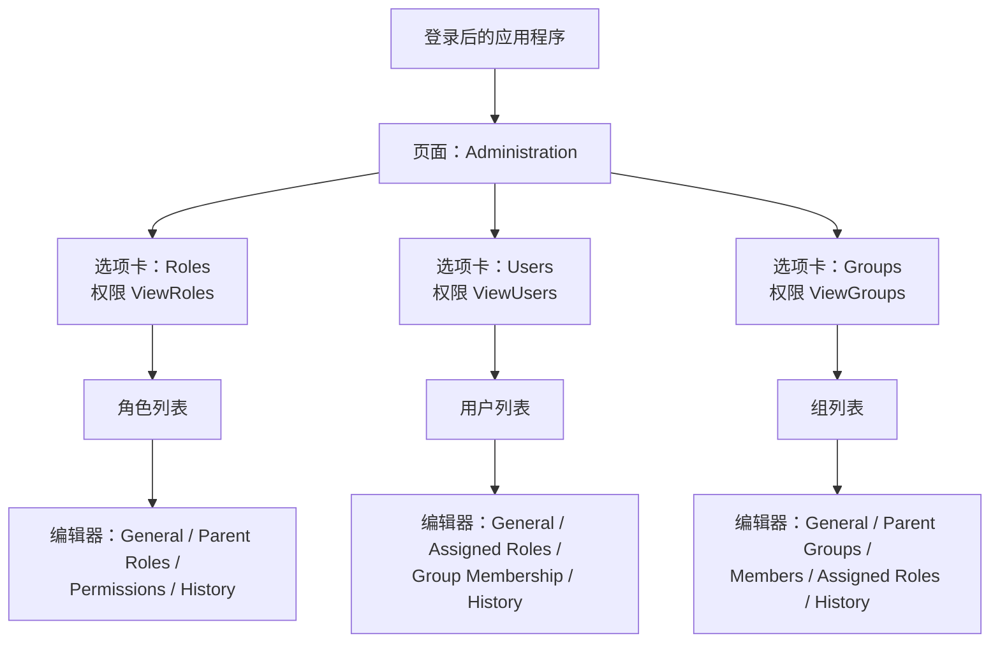
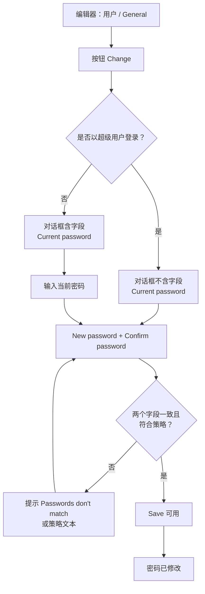
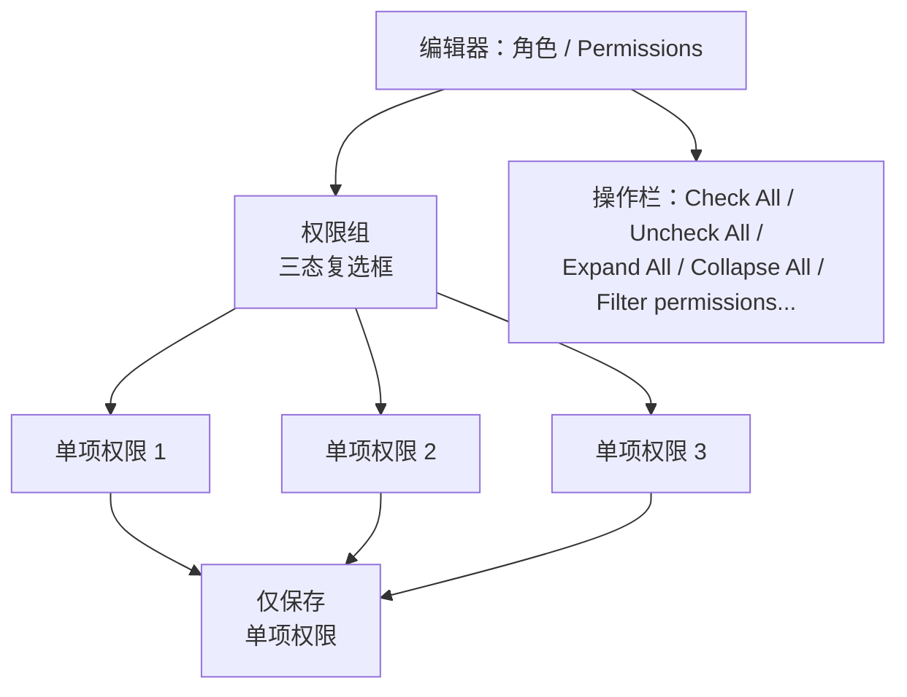
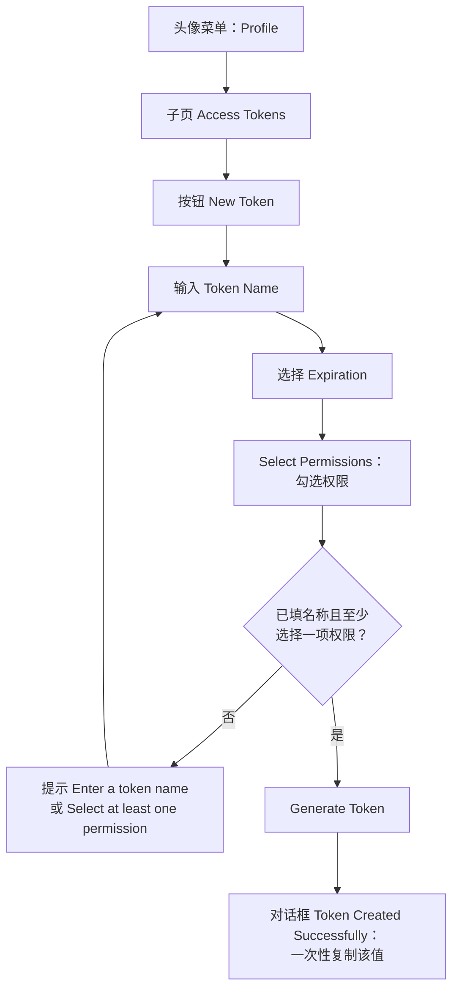
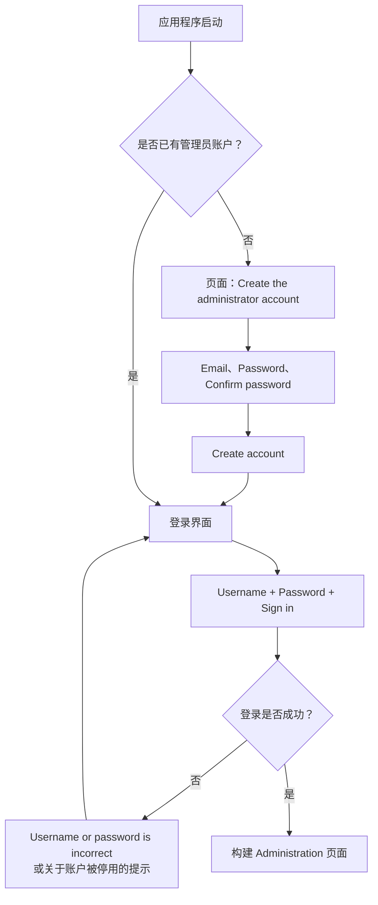

# Puma – 管理界面文档

仅针对用户管理界面的说明

---

## 目录

1. [关于本文档](#1-关于本文档)
2. [管理页面的结构](#2-管理页面的结构)
3. [通用操作元素](#3-通用操作元素)
4. [“Users”（用户）选项卡](#4-users用户选项卡)
5. [“Roles”（角色）选项卡](#5-roles角色选项卡)
6. [“Groups”（组）选项卡](#6-groups组选项卡)
7. [个人资料页（自助服务）](#7-个人资料页自助服务)
8. [登录与首次启动](#8-登录与首次启动)
9. [界面提示信息](#9-界面提示信息)
10. [界面权限参考](#10-界面权限参考)
11. [界面中不包含的内容](#11-界面中不包含的内容)

---

## 1. 关于本文档

### 1.1 目的

本文档仅描述用于维护 Puma 服务器用户、角色和组的**管理界面**。文档逐一说明每个页面、每个列表、每个输入字段和每个按钮，解释各操作元素的作用以及它们在什么条件下可见或可用。

概念、服务器运行、SDK 集成、LDAP 接入和安全策略**不在**本文档范围内，相关内容参见[用户手册](../Benutzerhandbuch/Benutzerhandbuch_ZH.md)。

### 1.2 适用读者

在客户端中操作用户管理的管理员和用户。

### 1.3 界面的来源

该界面并非 Puma 自身的组成部分，而是取自 `ImagingTools/ImtCore` 仓库的现成 QML 组件（模块 `Qml/imtauthgui`）。Puma 通过组合 `Impl/AuthClientSdk/AdministrationWidget.acc` 将其嵌入，该组合加载入口文件 `qrc:/qml/imtauthgui/AdministrationUi.qml`。因此，凡是嵌入该组件的应用程序都会显示相同的页面和相同的标签。

### 1.4 关于标签的说明

本文档中引用的所有标签均为界面的**英文原文**，即未安装语言包时显示的文本。这些文本可翻译；若应用程序提供了译文，则以相应语言显示。页面结构不受影响。

---

## 2. 管理页面的结构

### 2.1 入口

管理页面的页面标题为 **“Administration”**。它只在**成功登录之后**才会构建；在登录之前，应用程序在其位置显示登录界面（见第 8 章）。

页面由三个选项卡组成，按以下顺序创建：

| 顺序 | 选项卡 | 图标 | 所需权限 |
| --- | --- | --- | --- |
| 1 | **Roles** | 角色图标 | `ViewRoles` |
| 2 | **Users** | 账户图标 | `ViewUsers` |
| 3 | **Groups** | 多用户图标 | `ViewGroups` |

如果缺少相应的查看权限，选项卡**根本不会显示**——它不会变灰，而是完全不出现。若三项权限全部缺失，管理页面保持空白。

超级用户（登录名 `su`）可通过界面的任何权限检查，因此对其始终显示全部选项卡。

### 2.2 结构

*图 1：管理界面的页面结构——三个依赖权限的选项卡，每个均包含一个列表和一个多页编辑器。*

### 2.3 两区域模式

每个选项卡都遵循相同的模式：

1. **列表区**——该集合中所有对象的表格，带命令栏、搜索、排序和筛选。
2. **编辑器区**——多页编辑器，通过双击某一行或使用 **Edit** 命令打开。可以同时打开多个对象；每个打开的对象都有自己的标签。

在选项卡内部，列表视图会再次显示该集合的名称（**“Roles”**、**“Users”**、**“Groups”**）。

---

## 3. 通用操作元素

三个选项卡使用相同的列表和编辑器构件。这里统一说明一次，第 4 至 6 章仅补充各自的特殊之处。

### 3.1 列表的命令栏

| 命令 | 位置 | 启用条件 | 作用 |
| --- | --- | --- | --- |
| **New** | 左侧 | 只要具备创建权限即始终可用 | 新建对象并打开编辑器。标签中包含对象类型，例如 **“New User”**、**“New Role”**、**“New Group”**。 |
| **Edit** | 左侧 | 恰好选中**一**行 | 在编辑器中打开选中的对象。 |
| **Remove** | 左侧 | 至少选中**一**行 | 确认后删除选中的对象。 |
| **Export** | 右侧 | 恰好选中一行 | 将选中的对象写入文件。 |
| **Revision** | 右侧 | 恰好选中一行 | 打开修订视图。需要权限 `ViewRevisions`；未选中任何行时该命令不可用。 |

缺少所需权限的命令不会提供。各集合所需的权限汇总于第 10 章。

### 3.2 删除确认

删除前会出现确认对话框。对于角色，其文本为 **“Deleting a role”** / **“Delete the selected role ?”**；对于用户和组，使用通用文本 **“Deleting a selected element”** / **“Remove selected item from the collection ?”**。若删除整个筛选结果，提示为 **“Deleting elements”** / **“Delete all items with the current filter ?”**。

### 3.3 搜索、排序、筛选

- 每个列表在表格上方均有搜索框。
- 可排序的列通过点击列标题排序；哪些列可排序见第 4 至 6 章。
- 具备筛选功能的列在列标题中提供筛选菜单。

### 3.4 更新提示

列表数据由服务器提供。若其他工作站修改了相同的数据，列表会显示提示 **“This table has been modified from another computer”** 及按钮 **“Update”**。只有点击 **Update** 之后，表格才显示最新状态。

### 3.5 编辑器

编辑器占据选项卡的右侧区域，包括：

- 左边缘的**页面列表**，列出对象的子页（例如 *General*、*Assigned Roles*），
- 所选子页的**内容区**，
- 文档命令 **Save**、**Undo**、**Redo** 和 **Close**。

修改只有通过 **Save** 才会传送到服务器。**Save**、**Undo** 和 **Redo** 需要相应集合的某一项修改权限。

### 3.6 用于分配的选择控件

角色、组和成员的分配在各处使用同一控件：已分配条目的列表并显示计数，其下方是添加按钮（例如 **“Add Role”**）。该按钮打开一个**可搜索的选择列表**；因此分配并不是在整体列表中通过复选框完成。已分配的条目可以逐个移除。

### 3.7 历史记录

若登录用户拥有权限 `ViewRevisions`，每个编辑器还会包含子页 **“History”**。其标题在括号中给出修订数量，例如 `History (7)`。没有该权限时该子页不存在。

---

## 4. “Users”（用户）选项卡

### 4.1 用户列表

| 列 | 标签 | 可排序 | 可筛选 | 内容 |
| --- | --- | --- | --- | --- |
| `name` | **Name** | 是 | 是 | 用户的显示名称。默认排序：按该列升序。 |
| `mail` | **Email** | 是 | 是 | 已登记的电子邮件地址。 |
| `systemName` | **System Name** | 是 | 是 | 外部认证系统的名称；内部账户为空。 |
| `roles` | **Roles** | 否 | 否 | 已分配角色的汇总。 |
| `groups` | **Groups** | 否 | 否 | 组成员关系的汇总。 |
| `lastConnection` | **Last Connection** | 是 | 否 | 最近一次登录的时间。 |

**“Roles”和“Groups”列：** 单元格不列出全部内容，而是显示 **“View roles(N)”** 或 **“View groups(N)”**，括号内为数量；未分配时显示 **“No roles”** / **“No groups”**。工具提示会列出各个角色或组，并给出用户名。

**“System Info”筛选器：** `systemName` 列提供筛选器 **“System Info”**，含 **“Internal”** 和 **“LDAP”** 两个选项。据此可将列表限制为内部管理的账户或通过目录服务登录的账户。这是界面中唯一与 LDAP 相关的操作。

### 4.2 命令

适用第 3.1 节中的命令。创建命令名为 **“New User”**。所需权限为 `AddUser`（New）、`ViewUsers` 与 `ChangeUser`（Edit）以及 `RemoveUser`（Remove）。

### 4.3 编辑器——子页

| 子页 | 页面列表中的标题 | 显示条件 |
| --- | --- | --- |
| General | **General** | 始终 |
| Roles | **Assigned Roles** | 始终 |
| Groups | **Group Membership** | 始终 |
| History | **History** | 仅在具备 `ViewRevisions` 时 |

### 4.4 子页“General”

该页分为包含主数据的 **“General”** 区，以及在适用情况下的 **“System Information”** 区。

| 字段 | 标签 | 占位文本 | 必填 | 可见性 / 特点 |
| --- | --- | --- | --- | --- |
| 登录名 | **Username** | “Enter the username” | 是——错误提示 **“Please enter the username”** | 账户绑定到外部系统后即为**只读**。 |
| 显示名称 | **Name** | “Enter the name” | 是——错误提示 **“Please enter the name”** | – |
| 电子邮件 | **Email Address** | “Enter the email” | 是——错误提示 **“Please enter the email”** | 依据邮件格式校验。 |
| 账户状态 | **Account enabled**，说明 **“Disabled accounts cannot log in”** | – | – | 开关。**仅超级用户可见**；其他登录身份完全看不到该开关。 |
| 密码 | **Password** | “Enter the password” | 是 | **仅在新建用户时可见。** 若账户绑定到启用的外部系统，则为只读。 |
| 确认密码 | **Confirm password** | “Confirm password” | 是——错误提示 **“Please enter the password”** | 仅与 *Password* 字段一同出现。 |
| 修改密码 | **Change password**，含按钮 **“Change”** | – | – | **仅对已有用户可见**；外部系统账户完全不显示。 |

若两个密码字段不一致或新密码为空，将显示提示 **“Passwords don't match”**。若密码违反密码策略，界面会以明文指出被违反的规则（见第 9.2 节）。

**“System Information”区：** 一个单列表格，列标题为 **“System Name”**，其中恰好可选择一项。若账户至多关联一个认证系统，则隐藏该区。

### 4.5 子页“Assigned Roles”

标题 **“Assigned Roles”**，其下为名称为 **“Roles”** 的选择控件和按钮 **“Add Role”**，同时显示已分配角色的数量。选择列表可按角色名称搜索并已排序，且仅包含当前产品的角色。

### 4.6 子页“Group Membership”

标题 **“Group Membership”**，其下为选择控件 **“Groups”**、按钮 **“Add Group”** 及数量显示。

### 4.7 “Change Password”对话框

*图 2：“Change Password”对话框的流程——不会向超级用户询问原密码。*

该对话框标题为 **“Change Password”**，包含按钮 **“Save”** 和 **“Cancel”**。在输入完整且有效之前，**Save** 一直不可用。

字段按以下顺序出现：

1. **Current password**，占位文本“Enter the current password”——**超级用户不显示该字段**。
2. **New password**，占位文本“Enter the new password”。
3. **Confirm password**，占位文本“Confirm password”。

在未输入原密码之前，新密码字段保持只读。字段下方持续显示当前生效的密码要求。

---

## 5. “Roles”（角色）选项卡

### 5.1 角色列表

| 列 | 标签 | 可排序 | 内容 |
| --- | --- | --- | --- |
| `roleName` | **Role Name** | 是 | 角色的可读名称。 |
| `roleId` | **Role-ID** | 是 | 角色的技术标识。 |
| `roleDescription` | **Description** | 是 | 自由文本说明。 |

### 5.2 命令

创建命令名为 **“New Role”**。所需权限：`AddRole`（New）、`ViewRoles` 与 `ChangeRole`（Edit）、`RemoveRole`（Remove）。删除提示为 **“Deleting a role”** / **“Delete the selected role ?”**。

### 5.3 编辑器——子页

| 子页 | 页面列表中的标题 | 显示条件 |
| --- | --- | --- |
| General | **General** | 始终 |
| ParentRoles | **Parent Roles** | 始终 |
| Permission | **Permissions** | 始终 |
| History | **History** | 仅在具备 `ViewRevisions` 时 |

### 5.4 子页“General”

| 字段 | 标签 | 占位文本 | 特点 |
| --- | --- | --- | --- |
| 角色名称 | **Role Name** | “Enter the role name” | 必填字段。 |
| 角色标识 | **Role-ID** | – | **只读。** 该标识由角色名称去除全部空格后自动生成。 |
| 说明 | **Description** | “Enter the description” | 可选。 |

### 5.5 子页“Parent Roles”

标题 **“Parent Roles”**，选择控件 **“Parent Roles”** 及按钮 **“Add Parent Role”**。正在编辑的角色本身不会出现在选择列表中。更深层的循环由服务器在保存时拒绝。

### 5.6 子页“Permissions”

权限以**两级树配三态复选框**的形式呈现：

- **“Permission”** 列——权限组或单项权限的名称。
- **“Description”** 列——说明文本。

最上层为**权限组**：由服务器提供的业务性汇总标题，单项权限归类其下。勾选某个组即选中其包含的全部权限；若仅选中个别条目，该组显示中间状态。**仅保存单项权限**，不保存组本身。

下级权限不以更深的树层级显示，而是作为名称中的路径呈现，例如 `Edit Sensor / Change Sensor / Change Production Status`。

表格上方有一个操作栏，包含按钮 **“Check All”**、**“Uncheck All”**、**“Expand All”** 和 **“Collapse All”**，以及占位文本为 **“Filter permissions...”** 的搜索框，可按名称和说明搜索。

所提供的权限列表按产品确定；其他产品的权限不会出现。

*图 3：角色编辑器中权限选择的结构——组用于概览，保存的是单项权限。*

---

## 6. “Groups”（组）选项卡

### 6.1 组列表

| 列 | 标签 | 可排序 | 内容 |
| --- | --- | --- | --- |
| `name` | **Group Name** | 是 | 组的名称。 |
| `description` | **Description** | 是 | 自由文本说明。 |

### 6.2 命令

创建命令名为 **“New Group”**。所需权限：`AddGroup`（New）、`ViewGroups` 与 `ChangeGroup`（Edit）、`RemoveGroup`（Remove）。

### 6.3 编辑器——子页

| 子页 | 页面列表中的标题 | 显示条件 |
| --- | --- | --- |
| General | **General** | 始终 |
| ParentGroups | **Parent Groups** | 始终 |
| Users | **Members** | 始终 |
| Roles | **Assigned Roles** | 始终 |
| History | **History** | 仅在具备 `ViewRevisions` 时 |

### 6.4 字段与分配

| 子页 | 内容 |
| --- | --- |
| **General** | 字段 **“Group Name”**（占位文本“Enter the name”）和 **“Description”**（占位文本“Enter the description”）。 |
| **Parent Groups** | 选择控件 **“Parent Groups”** 及按钮 **“Add Parent Group”**；正在编辑的组本身不作为选项。 |
| **Members** | 选择控件 **“Users”** 及按钮 **“Add User”**；在用户集合上进行可搜索的选择，并显示成员数量。 |
| **Assigned Roles** | 选择控件 **“Roles”** 及按钮 **“Add Role”**；与产品相关。 |

---

## 7. 个人资料页（自助服务）

### 7.1 打开方式与界定

个人资料页通过页眉中的**头像图标**打开。菜单包含条目 **“Profile”**、组织列表——当前组织附加 **“(current)”**，代理使用的组织附加 **“(delegated)”**，否则为 **“No organization”**——以及 **“Logout”**。对话框标题为 **“Profile”**，顶部显示姓名首字母、显示名称（否则为 **“My Account”**）和电子邮件地址。

个人资料页是每位用户的自助视图，**不属于管理页面**。两者区别如下：

| 特性 | 管理页面 | 个人资料页 |
| --- | --- | --- |
| 修改登录名 | 是 | 否 |
| 切换账户状态 | 是（仅超级用户） | 否 |
| 分配角色和组 | 是 | 否——仅只读显示 |
| 在不知道旧密码的情况下设置密码 | 是（超级用户） | 否 |
| 管理个人访问令牌 | 否 | 是 |

### 7.2 子页

| 子页 | 标签 |
| --- | --- |
| 常规 | **General** |
| 组织 | **Organizations** |
| 访问令牌 | **Access Tokens** |
| 角色与权限 | **Roles & Permissions** |

### 7.3 子页“General”

- 字段 **“Name”**（占位文本“Enter the name”）和字段 **“Email Address”**（占位文本“Enter the email”，依据邮件格式校验）。
- 按钮 **“Save”**，只有当姓名或邮箱与已保存的状态不同时才会启用。反馈：**“Profile saved”** 或 **“Unable to save the profile.”**
- **“Password”** 区——**仅对内部管理的账户可见**；外部系统账户不显示该区。折叠状态下显示占位圆点和按钮 **“Change”**。展开后包含字段 **“Current password”**（占位文本“Enter your current password”，超级用户不显示）、**“New password”**（占位文本“Enter a new password”）和 **“Confirm new password”**（占位文本“Re-enter the new password”），其下为当前生效的密码要求，以及按钮 **“Update password”** 和 **“Cancel”**。提交过程中标签变为 **“Changing password…”**。反馈：**“Password changed”** 或 **“Unable to change the password. Check your current password and try again.”**

### 7.4 子页“Roles & Permissions”

纯只读视图，包含三个带边框的表格 **“Roles”**、**“Groups”** 和 **“Permissions”**，每个均含 **“Name”** 和 **“Description”** 两列。空白区块会被隐藏；若完全没有任何分配，则显示 **“No roles, groups or permissions are assigned.”**

对于超级用户，则改为显示提示 **“You have full access”** 及说明 **“As a superuser, every permission is already granted to you, so no roles, groups or individual permissions are listed here — there is nothing more to add.”**

### 7.5 子页“Access Tokens”（个人访问令牌）

个人访问令牌的管理**仅位于此处**，不在管理页面中。每位用户只管理自己的令牌。

**页首区：** 标题 **“Access tokens”**、说明 **“Tokens let scripts and integrations authenticate as you.”**、按钮 **“New Token”**。

**表格：** 列 **Name**、**Description**、**Expires At**、**Revoked** 以及一个操作列。*Expires At* 列显示到期日期或 **“No Expiration”**。操作列在每行提供删除（工具提示 **“Delete Token”**）和吊销（工具提示 **“Revoke Token”**；已吊销的令牌显示工具提示 **“Revoked”** 且不可再操作）。

若尚无令牌，则显示 **“You don't have any access tokens yet. Create one to let a script or integration authenticate as you.”**

**删除确认：** **“Are you sure you want to delete this token?”**，并附说明 **“Any applications or scripts using this token will no longer be able to access the API. You cannot undo this action.”** 反馈：**“Token deleted”**、**“Token revoked”** 或 **“Unable to complete the request.”**

**“New Personal Access Token”对话框：**

| 元素 | 标签 | 说明 |
| --- | --- | --- |
| 名称 | **Token Name**，占位文本“e.g. CI/CD Pipeline, API Client...” | 必填字段。 |
| 有效期 | **Expiration** | 可选 **“7 Days”**、**“30 Days”**、**“60 Days”**、**“90 Days”**、**“No Expiration”**。 |
| 说明 | **Description (optional)**，占位文本“What will this token be used for?” | 可选。 |
| 权限范围 | **“Select Permissions”**，附加文字 **“— grant only the access this token needs”** | 使用与角色编辑器相同的权限表格（第 5.6 节）。若无可用权限，则显示 **“No permissions available to assign to this token.”** |
| 按钮 | **“Generate Token”**、**“Cancel”** | **Generate Token** 起初不可用。提示 **“Enter a token name to continue”** 和 **“Select at least one permission”** 指出缺少的步骤。 |

创建完成后出现对话框 **“Token Created Successfully”**，含文本 **“Please copy and save the token:”**、一个只读显示字段、一个复制按钮（工具提示 **“Copy the token”** 和 **“The token is copied”**）以及按钮 **“OK”**。令牌值**仅在此处**显示。

*图 4：在个人资料页创建个人访问令牌——令牌值仅显示一次。*

---

## 8. 登录与首次启动

### 8.1 登录界面

登录界面以卡片形式呈现，自上而下包含：

1. 标题 **“Welcome to”** 及应用程序名称；若未设置名称，则为 **“Welcome”**。
2. 字段 **“Username”**，占位文本 **“Enter your username”**。
3. 字段 **“Password”**，占位文本 **“Enter your password”**。输入被遮蔽；字段边缘的按钮可显示和隐藏密码。
4. 复选框 **“Remember me”**（默认勾选，记住最近使用的登录名），以及在可进行密码找回时的链接 **“Forgot password?”**。
5. 按钮 **“Sign in”**。仅在两个字段均已填写且没有请求进行时可用；登录过程中显示进度指示。
6. 链接 **“Sign up”**——仅在启用自助注册时可见。它打开标题为 **“Sign up”** 的对话框，含按钮 **“Sign up”** 和 **“Close”**，其中包含与用户编辑器相同的主数据字段。

**登录失败：** 密码字段被清空，登录名保留，并显示服务器消息，否则显示 **“Username or password is incorrect”**。若账户被停用，消息为 **“This account has been deactivated. Please contact your administrator.”**

### 8.2 密码找回

对话框 **“Password Recovery”** 分四步引导完成找回。除 **“Cancel”** 外，主按钮在每一步都有不同的标签。

| 步骤 | 内容 | 主按钮 |
| --- | --- | --- |
| 1 | 字段 **“Email”**（占位文本“Enter the email”），说明 **“Enter the email address that was specified on your account, a code will be sent to it”**；错误提示 **“Please enter the valid email”**。 | **“Check the email”** |
| 2 | 只读字段 **“Username”**，并询问 **“For this email this account has been found, is that you?”**。若回答否，则显示 **“Check the email you entered”** 并返回第 1 步。 | **“Yes”** |
| 3 | 字段 **“Code”**（占位文本“Enter the code”），说明 **“Please enter the code sent to your email”**；可通过 **“Send the code again”** 及按钮 **“Send”** 重新申请，等待时间为 60 秒。 | **“Check the code”** |
| 4 | 新密码字段，不询问原密码。成功提示 **“Password changed successfully”**。 | **“Change password”** |

### 8.3 超级用户的首次设置

若服务器尚无管理员账户，创建超级用户的页面会覆盖在应用程序之上。

- 标题 **“Create the administrator account”**，说明 **“This server doesn't have one yet. Set a name and password below - you'll sign in with them right after.”**
- 输入字段按以下顺序排列：**Username**（固定为 `su` 且**只读**）、**Name**（预填 `superuser`）、**Email Address**、**Password**、**Confirm password**。光标初始位于 *Email Address* 字段。
- 此处没有 *Account enabled* 开关。
- 按钮 **“Create account”**。只有在电子邮件地址有效、确认字段已填写且两个密码字段一致时才会启用。
- 若创建失败，表单下方出现错误条，显示服务器消息，否则显示 **“Unable to create the administrator account”** 或 **“Unable to reach server”**。

*图 5：从首次启动经登录到管理页面的路径。*

---

## 9. 界面提示信息

### 9.1 编辑时的提示

| 情形 | 提示 |
| --- | --- |
| 登录名为空 | **Please enter the username** |
| 显示名称为空 | **Please enter the name** |
| 电子邮件为空或无效 | **Please enter the email** |
| 确认密码为空或不一致 | **Passwords don't match** |
| 登录名已被占用 | **Username already exists** |
| 角色标识已被占用 | **Role with ID: '…' already exists** |
| 组名称已被占用 | **Group Name '…' already exists** |
| 超级用户已创建 | **Superuser already exists** |
| 个人资料保存失败 | **Unable to save the profile.** |
| 密码修改失败 | **Unable to change the password.** |

### 9.2 密码策略提示

界面将服务器反馈的规则组合成形如 **“The password must contain …”** 的句子。可能出现的组成部分包括：

- **at least N characters**——最小长度，
- **at most N characters**——最大长度，
- **a lowercase letter**、**an uppercase letter**、**a digit**、**a special character**——要求的字符类别，
- **a password different from the login**——密码不得与登录名相同，
- **a password that is not commonly used**——常用密码黑名单，
- **a password different from the last N ones** 或 **a password that was not used before**——禁止重复使用。

同一句子也作为密码字段下方的实时提示。

服务器的其他反馈：

| 原因 | 提示 |
| --- | --- |
| 原密码不正确 | **The current password is not correct.** |
| 未达到密码最短使用期限 | **The password was changed too recently and cannot be changed again yet.** |
| 账户由外部系统管理 | **This account is managed by an external system, its password cannot be changed here.** |
| 账户已不存在 | **This account no longer exists.** |
| 服务器或存储错误 | **The password could not be changed. Please try again later.** |

---

## 10. 界面权限参考

### 10.1 各集合的权限

| 集合 | 查看 | 创建 | 修改 | 删除 |
| --- | --- | --- | --- | --- |
| 用户 | `ViewUsers` | `AddUser` | `ChangeUser` | `RemoveUser` |
| 角色 | `ViewRoles` | `AddRole` | `ChangeRole` | `RemoveRole` |
| 组 | `ViewGroups` | `AddGroup` | `ChangeGroup` | `RemoveGroup` |

对于用户，另有权限 `RestoreUser`、`ExportUser` 和 `ImportUser`。

### 10.2 跨领域权限

| 权限 | 在界面中的作用 |
| --- | --- |
| `ViewRevisions` | 在所有编辑器中显示子页 **History**，并在所有列表中显示命令 **Revision**。 |

### 10.3 超级用户的特殊地位

超级用户可通过界面的任何权限检查。此外：

- 开关 **Account enabled** 仅对其可见。
- 在密码对话框中不会向其询问原密码。
- 在个人资料页中，提示 **“You have full access”** 取代角色和权限表格。

---

## 11. 界面中不包含的内容

以下功能特意列为空缺，以免在错误的位置寻找：

| 功能 | 现状 |
| --- | --- |
| **解锁被锁定的账户** | **没有**相应操作元素。解锁只能通过服务器接口完成。 |
| **配置 LDAP 接入** | **没有**配置页面。界面仅提供列表筛选器 **“Internal”/“LDAP”**（第 4.1 节）；接入在服务器配置中设置。 |
| **管理他人的访问令牌** | 令牌管理仅限于登录用户自己的令牌（第 7.5 节）；没有面向管理员的全部令牌总览。 |
| **编辑外部账户的登录名** | 对于外部系统的账户，字段 **Username** 为只读。 |
| **维护外部账户的密码** | 对于外部管理的账户，**Password** 区和按钮 **Change password** 均不显示。 |

---

*管理界面文档结束*
