# Puma-Benutzerhandbuch

**Sprache:** Deutsch  
**Zielgruppe:** Administratoren, Anwendungsentwickler und Betreiber

## 1. Zweck und Geltungsbereich

Puma ist das zentrale System für Authentifizierung und Berechtigungsverwaltung
mehrerer Anwendungen. Benutzer melden sich gegenüber Puma an; Anwendungen
entscheiden anhand der von Puma gelieferten Berechtigungen, welche Funktionen
freigeschaltet werden. Dadurch müssen Benutzer, Rollen und Gruppen nicht in
jeder Anwendung separat gepflegt werden.

Dieses Handbuch beschreibt:

- den Puma-Server mit SQLite- oder PostgreSQL-Datenbank,
- lokale Benutzer, Rollen, Gruppen und produktbezogene Berechtigungen,
- die Einbindung eigener Qt/C++-Anwendungen über `AuthClientSdk`,
- die Einbindung eigener Server über `AuthServerSdk`,
- Windows-Domänenanmeldung über die in ImtCore implementierte LDAP-Schicht,
- Personal Access Tokens (PATs) für nicht interaktive Zugriffe,
- typische Betriebs-, Sicherheits- und Fehlerfälle.

Die Beschreibung basiert auf Puma und der zugrunde liegenden
Authentifizierungsimplementierung in ImagingTools/ImtCore. Sie beschreibt den
Stand der im Quellcode vorhandenen Funktionen; konkrete Menünamen können je
nach eingebetteter Administrationsoberfläche abweichen.

## 2. Puma auf einen Blick

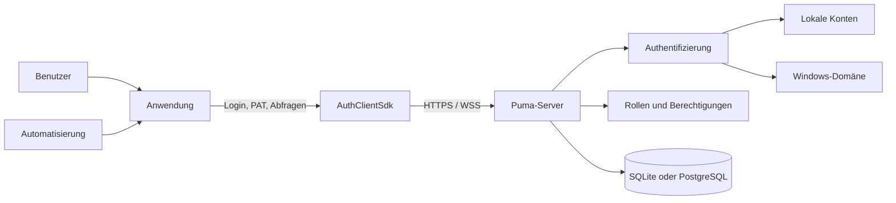

Puma trennt vier Aufgaben:

1. **Identität:** Wer greift zu?
2. **Authentifizierung:** Ist der vorgelegte Nachweis gültig?
3. **Autorisierung:** Welche produktbezogenen Aktionen sind erlaubt?
4. **Persistenz:** Wo werden Benutzer, Rollen, Gruppen, Sitzungen und PATs
   gespeichert?

### 2.1 Varianten des Puma-Servers

| Variante | Datenbank | Typischer Einsatz |
|---|---|---|
| `PumaServerSl` | SQLite | Einzelinstallation, Entwicklung, kleine lokale Installation |
| `PumaServerPg` | PostgreSQL | Zentraler Mehrbenutzerbetrieb und produktive Serverinstallation |

Beide Varianten verwenden dieselbe Puma-Serverbasis. Die jeweilige
Serveranwendung bindet die passenden Repositories und SQL-Skripte für ihre
Datenbank ein.

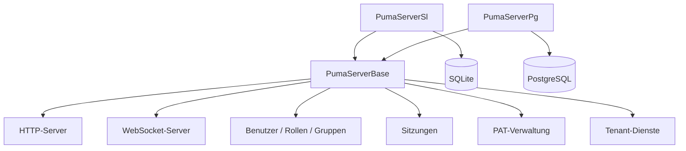

## 3. Rollen- und Berechtigungsmodell

Puma verwaltet Berechtigungen nicht als frei editierbare Eigenschaften eines
Benutzers, sondern über Rollen:

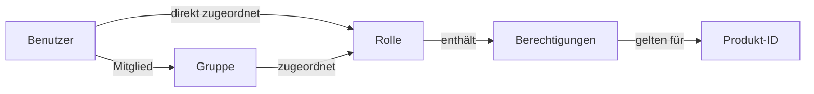

- **Benutzer** besitzen eine interne, stabile Objekt-ID und einen Login-Namen.
- **Rollen** bündeln Berechtigungen und sind produktspezifisch.
- **Gruppen** bündeln Benutzer und erhalten Rollen.
- **Berechtigungen** sind von der Anwendung definierte, groß- und
  kleinschreibungsabhängige IDs.
- **Produkt-ID** begrenzt den Kontext, in dem Rollen und Berechtigungen gelten.

Ein Benutzer erhält die Vereinigungsmenge aus:

- Berechtigungen direkt zugeordneter Rollen und
- Berechtigungen der Rollen seiner Gruppen.

> **Wichtig:** Verwaltungsoperationen verwenden die interne Benutzer-ID, nicht
> den Login-Namen. Eine Anwendung setzt ihre Produkt-ID vor der Anmeldung.

### 3.1 Empfohlenes Administrationsmodell

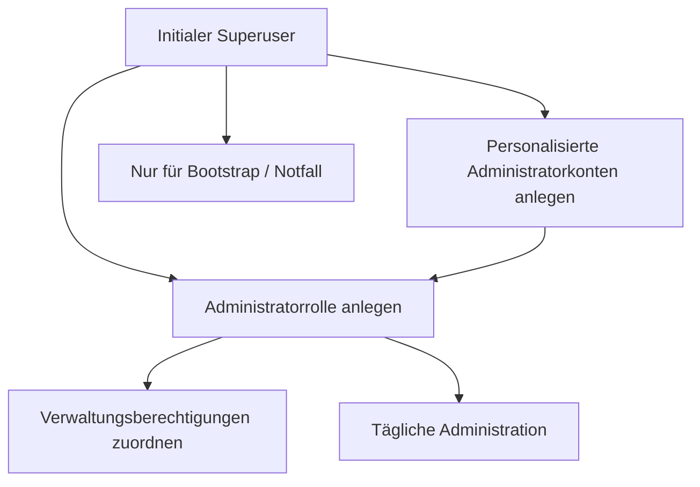

Der Superuser dient zum initialen Aufbau. Für den Alltag sollten
personalisierte Administratorkonten mit einer passenden Administratorrolle
verwendet werden. So müssen Superuser-Zugangsdaten nicht geteilt werden.

## 4. Inbetriebnahme des Puma-Servers

### 4.1 Vorbereitung

1. Servervariante auswählen.
2. Für PostgreSQL Datenbank, Datenbankbenutzer und Erreichbarkeit vorbereiten.
3. HTTP- und WebSocket-Port festlegen.
4. Für produktive Systeme ein Serverzertifikat und einen privaten Schlüssel
   bereitstellen.
5. Firewall nur für die benötigten Ports öffnen.
6. Schreibrechte für Einstellungen, Datenbank und Protokolle prüfen.

Die persistenten Puma-Einstellungen werden standardmäßig unter dem
anwendungsbezogenen Systempfad in
`Puma/Puma Server/PumaServerSettings.xml` abgelegt.

### 4.2 Startablauf

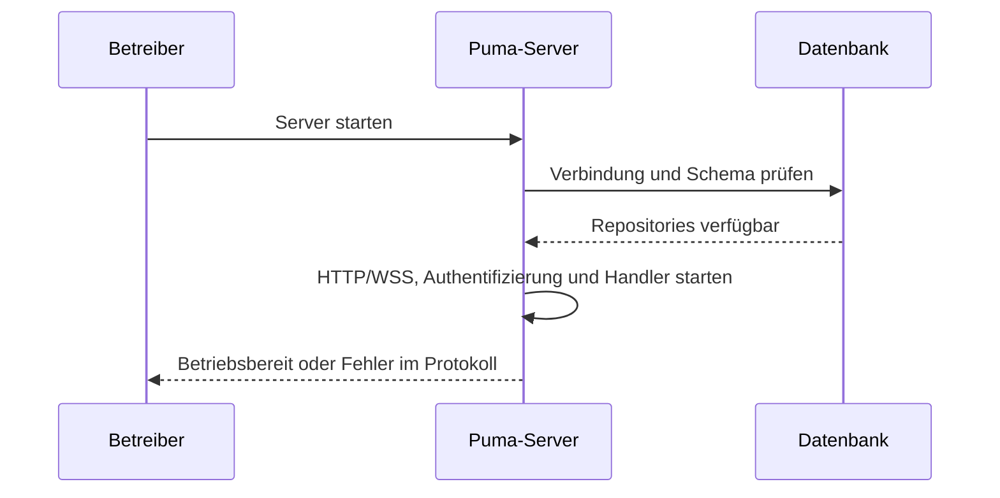

Nach dem Start sind insbesondere zu prüfen:

- Datenbankverbindung erfolgreich,
- HTTP- und WebSocket-Port gebunden,
- Zertifikat und Schlüssel geladen,
- keine Migrations- oder Repositoryfehler,
- Client kann den Server erreichen.

### 4.3 Ersteinrichtung

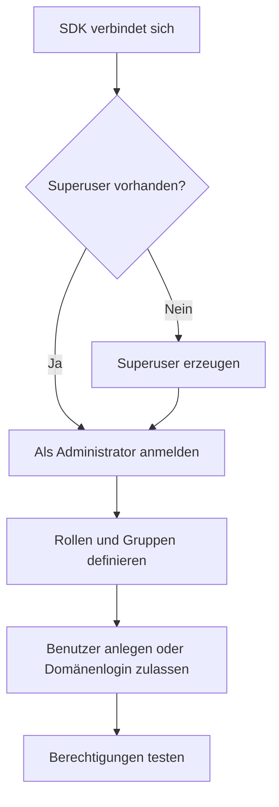

Der SDK-Ablauf besteht aus `SuperuserExists()`, bei Bedarf
`CreateSuperuser()`, danach Login und Aufbau des Rollenmodells. Die
Puma-Tests verwenden für das initiale Konto den Login `su`; produktive
Zugangsdaten müssen davon abweichend sicher gewählt und verwahrt werden.

### 4.4 Transportverschlüsselung

Puma verwendet getrennte Ports für HTTP(S) und WebSocket(S). Sobald Clients
außerhalb eines isolierten Entwicklungsrechners zugreifen, sind HTTPS und WSS
zu verwenden.

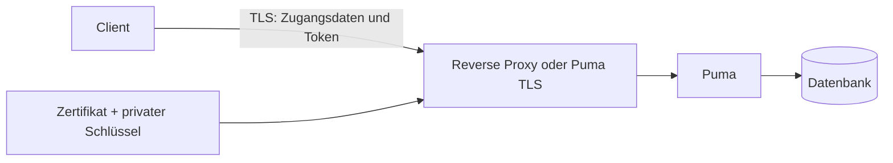

Produktionsregeln:

- TLS 1.2 oder höher einsetzen.
- Zertifikatsprüfung nicht deaktivieren.
- Privaten Schlüssel nur für den Serverprozess lesbar machen.
- Passphrasen nicht in Quellcode oder Präsentationen speichern.
- HTTP/WS ohne TLS nur in kontrollierten Testumgebungen verwenden.

## 5. Detaillierte Use Cases

### UC-01: Lokalen Benutzer anlegen und berechtigen

**Akteur:** Administrator  
**Vorbedingung:** Administrator ist angemeldet und besitzt die nötigen
Verwaltungsberechtigungen.

1. Benutzer mit Anzeigename, eindeutigem Login, Startpasswort und E-Mail
   anlegen.
2. Interne Benutzer-ID aus dem Ergebnis übernehmen.
3. Vorhandene Rolle zuordnen oder zuerst eine Rolle anlegen.
4. Optional den Benutzer einer Gruppe hinzufügen.
5. Benutzer meldet sich an.
6. Anwendung prüft die erwarteten Berechtigungen.

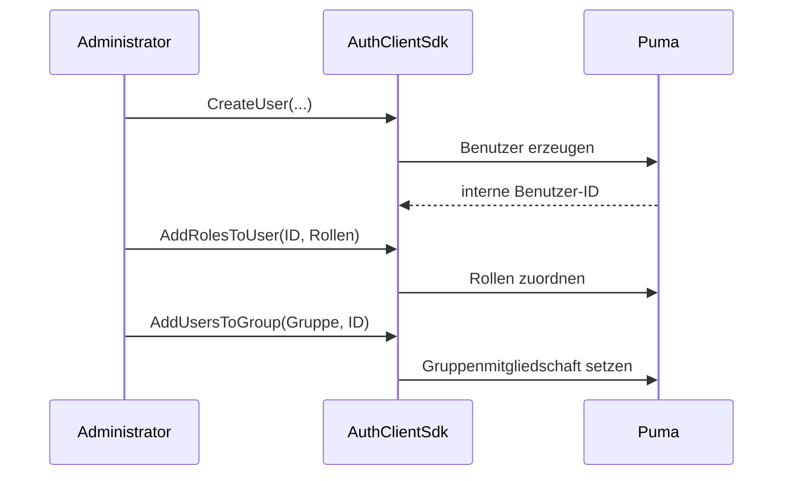

**Ergebnis:** Der Benutzer erhält Berechtigungen aus direkten Rollen und
Gruppenrollen. Ein bereits angemeldeter Benutzer muss sich gegebenenfalls neu
anmelden, damit die Anwendung aktualisierte Sitzungsberechtigungen erhält.

### UC-02: Team über eine Gruppe verwalten

**Akteur:** Administrator

1. Fachliche Rolle mit den benötigten Berechtigungen erstellen.
2. Gruppe für Team oder Abteilung erstellen.
3. Rolle der Gruppe zuordnen.
4. Benutzer zur Gruppe hinzufügen.
5. Beim Austritt Benutzer aus der Gruppe entfernen.

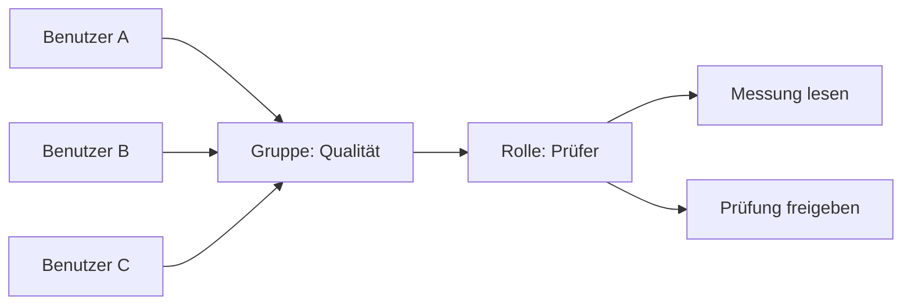

**Nutzen:** Rollenänderungen wirken zentral auf alle Gruppenmitglieder.

### UC-03: Anmeldung und funktionsbezogene Freigabe

**Akteur:** Endbenutzer

1. Anwendung konfiguriert Verbindung und Produkt-ID.
2. Benutzer gibt Login und Passwort ein.
3. Puma validiert die Zugangsdaten.
4. Puma erzeugt eine Sitzung und liefert Token, Benutzername, Produkt-ID und
   Berechtigungen.
5. Anwendung gibt nur erlaubte Funktionen frei.
6. Beim Abmelden invalidiert Puma die Sitzung.

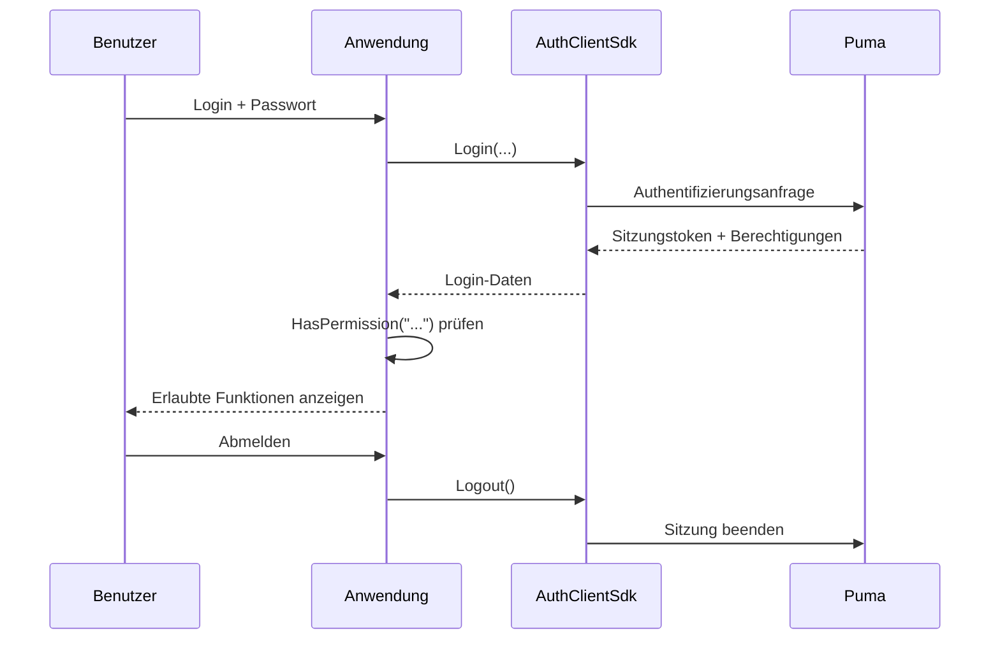

Fehler bei ungültigen Zugangsdaten, gesperrtem Konto, fehlender Verbindung
oder fehlenden Serverkomponenten werden als fehlgeschlagener Login gemeldet.

### UC-04: Berechtigungsänderung

1. Administrator ändert Rollen- oder Gruppenzuordnung.
2. Anwendung beendet alte Sitzung oder fordert erneute Anmeldung.
3. Benutzer meldet sich erneut an.
4. Anwendung baut ihre Oberfläche aus den neuen Berechtigungen auf.

Das Ausblenden einer Schaltfläche ersetzt keine serverseitige Prüfung. Jede
schutzbedürftige Serveroperation muss die Berechtigung nochmals validieren.

### UC-05: Benutzer deaktivieren oder entfernen

Der vorhandene Client-SDK stellt `RemoveUser()` als permanente Löschung bereit.
Vor dem Löschen sind fachliche Aufbewahrungs- und Audit-Anforderungen zu
prüfen. Rollen- und Gruppenzuordnungen werden mit dem Benutzer entfernt.
Für eine zeitweise Sperre ist die in der konkreten Administrationsoberfläche
angebotene Kontostatusfunktion zu verwenden; andernfalls Zugriff über
Rollenzuordnung und Sitzungsmanagement entziehen.

### UC-06: Eigene Anwendung anbinden

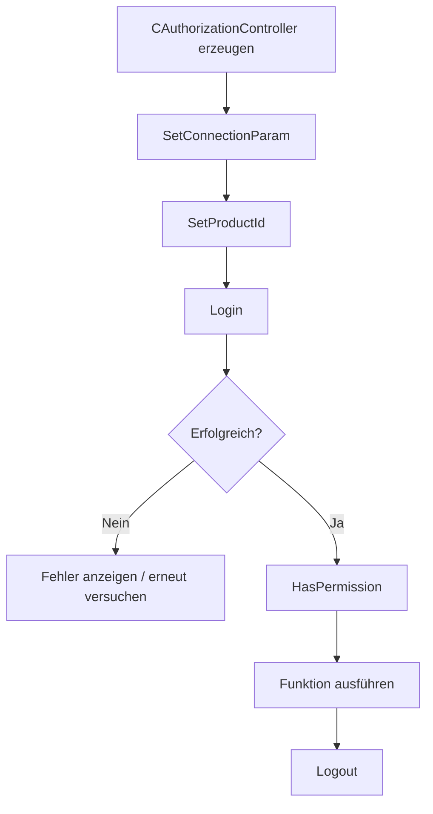

Die minimale Reihenfolge im C++-Client lautet:

```cpp
AuthClientSdk::CAuthorizationController auth;

AuthClientSdk::ServerConfig server;
server.host = "puma.example.org";
server.httpPort = 443;
server.wsPort = 8443;
server.sslConfig = AuthClientSdk::SslConfig{};

auth.SetConnectionParam(server);
auth.SetProductId("MeineAnwendung");

AuthClientSdk::Login session;
if (auth.Login(login, password, session) &&
    auth.HasPermission("messung.lesen")) {
    // Geschützte Funktion freigeben.
}
auth.Logout();
```

Sicherheitsrelevante Hinweise:

- Passwörter nur über TLS übertragen.
- Sitzungstoken nicht protokollieren.
- `Login()` beendet eine vorherige Sitzung des Controllers automatisch.
- `Logout()` explizit aufrufen; der Destruktor versucht zusätzlich eine
  Best-Effort-Abmeldung.
- `Login()` und `Logout()` nicht parallel auf demselben Controller ausführen.

### UC-07: Eigenen autorisierbaren Server anbinden

`AuthServerSdk::CAuthorizableServer` ist für Serveranwendungen vorgesehen, die
eigene Endpunkte anbieten, aber Puma als zentrale Autoritätsquelle verwenden.

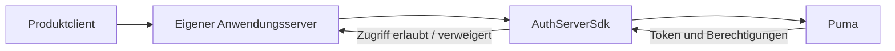

Der Anwendungsserver setzt:

1. seine Produkt-ID,
2. die Verbindung zum zentralen Puma-Server,
3. seine eigenen HTTP-/WebSocket-Ports,
4. optional eine Featuredatei und TLS-Konfiguration,
5. anschließend `Start()` und beim Herunterfahren `Stop()`.

## 6. SDK-Schicht

### 6.1 AuthClientSdk

Die Fassade `AuthClientSdk::CAuthorizationController` bietet:

| Bereich | Zentrale Operationen |
|---|---|
| Verbindung | `SetConnectionParam()`, `SetProductId()` |
| Sitzung | `Login()`, `Logout()`, `GetToken()` |
| Autorisierung | `HasPermission()`, `GetTokenPermissions()` |
| Bootstrap | `SuperuserExists()`, `CreateSuperuser()` |
| Benutzer | Auflisten, lesen, anlegen, löschen, Passwort ändern |
| Rollen | Auflisten, lesen, anlegen, löschen, Berechtigungen zuordnen |
| Gruppen | Auflisten, lesen, anlegen, löschen, Benutzer/Rollen zuordnen |
| PAT | Erstellen, auflisten, validieren und widerrufen |

`ServerConfig` enthält Host, HTTP-Port, WebSocket-Port und optionale
TLS-Einstellungen. Rollen und Berechtigungen sind an die mit
`SetProductId()` konfigurierte Anwendung gebunden.

### 6.2 AuthServerSdk

Das Server-SDK kapselt einen autorisierbaren HTTP-/WebSocket-Server. Seine
Netzwerkverbindung zum Puma-Backend ist von den Ports getrennt, auf denen der
eigene Server Clients bedient. Bei verteilten Installationen müssen daher
beide Verbindungsrichtungen konfiguriert und abgesichert werden.

### 6.3 UI-Komponenten

Puma enthält Widgets beziehungsweise QML-Komponenten für Login und
Administration. Sie bauen auf denselben Authentifizierungs- und
Verwaltungsschnittstellen auf. Eine eigene Oberfläche darf die
serverseitigen Berechtigungsprüfungen nicht ersetzen.

## 7. LDAP-/Windows-Domänenanmeldung

### 7.1 Funktionsweise

Die aktuelle ImtCore-Implementierung verwendet auf Windows die
Windows-Domänenfunktionen, insbesondere die Prüfung über `LogonUser`.
Sie ist damit auf Windows-/Active-Directory-Umgebungen ausgerichtet und kein
allgemein konfigurierbarer OpenLDAP-Client.

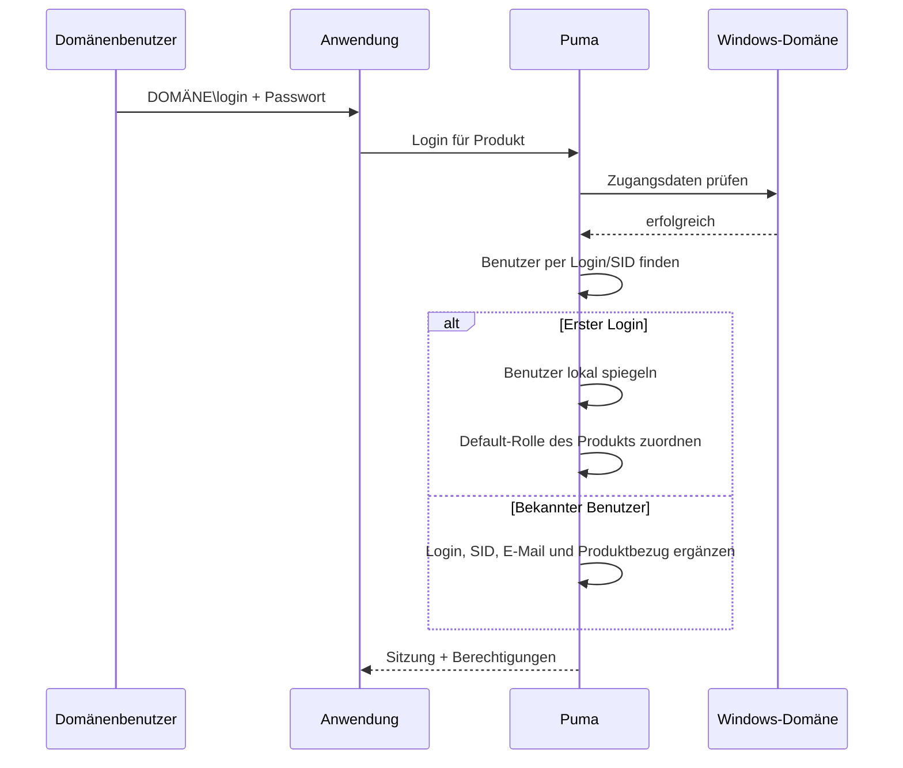

Bei erfolgreichem ersten Domänenlogin:

- legt Puma einen internen Benutzerdatensatz an,
- kennzeichnet das Authentifizierungssystem als `LDAP`,
- übernimmt, soweit verfügbar, SID, Anzeigename und E-Mail,
- erzeugt bei Bedarf die produktbezogenen Rollen `Guest` und `Default`,
- weist dem Benutzer für das Produkt die Default-Rolle zu.

Anschließend können Administratoren dem gespiegelt angelegten Benutzer weitere
Puma-Rollen und Gruppen zuordnen. Das Passwort wird weiterhin gegenüber der
Windows-Domäne geprüft.

### 7.2 Aktivierung und Deaktivierung

`LdapEnabled` ist in der Puma-Standardeinstellung aktiviert und wird über den
Einstellungsbereich **LDAP** bereitgestellt. Wenn ausschließlich lokale
Puma-Konten verwendet werden, sollte die Funktion deaktiviert werden, um
unnötige Domänenprüfungen und irreführende Meldungen zu vermeiden.

### 7.3 Voraussetzungen

- Puma läuft unter Windows.
- Der Server kann die Domäne und einen Domain Controller erreichen.
- Betriebssystem, DNS und Vertrauensstellung sind korrekt konfiguriert.
- Benutzer verwendet einen von Windows akzeptierten Login, typischerweise
  `DOMÄNE\benutzer`.
- LDAP ist in Puma aktiviert.

### 7.4 Fehlersuche

| Symptom | Prüfung |
|---|---|
| Domänenlogin scheitert, lokaler Login funktioniert | Domänenerreichbarkeit, DNS, Uhrzeit, Loginformat und `LdapEnabled` prüfen |
| Benutzer wird doppelt angelegt | Einheitliches Loginformat und SID-Auflösung prüfen |
| Benutzer hat nach erstem Login zu wenig Rechte | Default-Rolle und weitere Rollen-/Gruppenzuordnung prüfen |
| Lokale Logins erzeugen Domänenfehler im Protokoll | LDAP deaktivieren, wenn nicht benötigt |
| Linux-Server authentifiziert nicht gegen AD | Aktuelle Implementierung ist Windows-spezifisch |

## 8. Personal Access Tokens (PAT)

### 8.1 Einsatz

PATs sind langlebige Zugangsnachweise für Automatisierung, CI/CD,
Überwachungsdienste und Service-zu-Service-Kommunikation. Ein PAT gehört zu
einem Benutzer, enthält eine Produkt-ID und explizite Berechtigungsscopes.

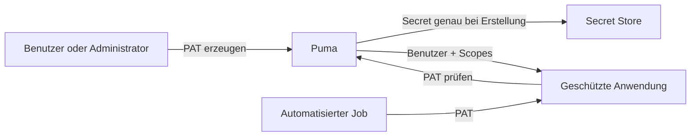

### 8.2 Lebenszyklus

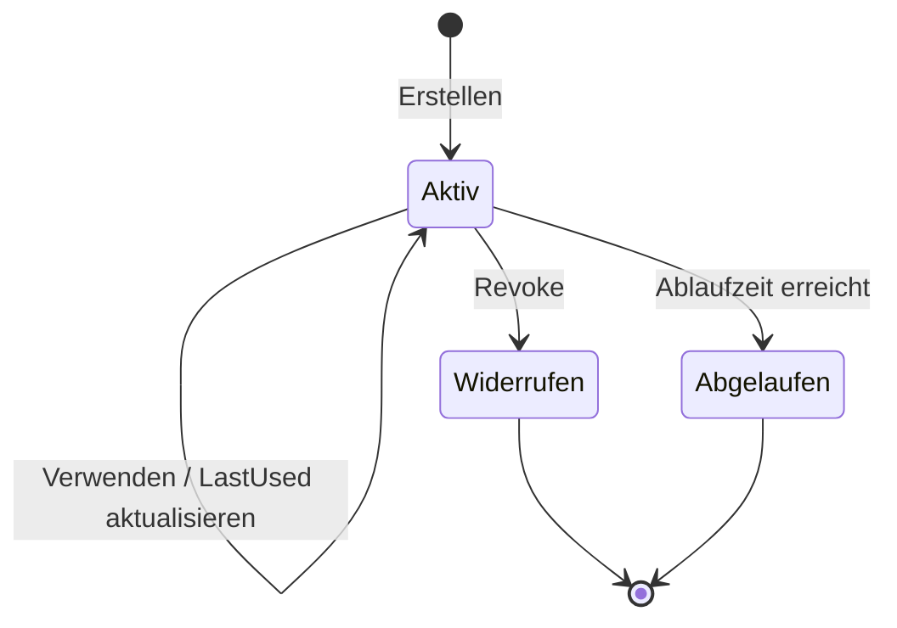

Ein Token ist gültig, wenn es existiert, aktiv, nicht widerrufen und nicht
abgelaufen ist. Widerrufene Datensätze bleiben in der Liste sichtbar und
werden als inaktiv gemeldet.

### 8.3 PAT erstellen

**Vorbedingung:** Der Eigentümer oder ein Administrator ist mit einer
Sitzung angemeldet.

1. Zweckbezogenen Namen vergeben, zum Beispiel `CI Produktion Lesen`.
2. Zielbenutzer und Produkt-ID festlegen.
3. Nur die minimal nötigen Scopes auswählen.
4. Möglichst ein Ablaufdatum im ISO-8601-Format setzen.
5. Secret unmittelbar in einem Secret Store speichern.
6. Secret nicht in Quellcode, Build-Protokolle oder Tickets kopieren.

Anonyme Aufrufer dürfen keine PATs erstellen. Ein normaler Benutzer kann
eigene PATs verwalten, aber nicht die PATs anderer Benutzer. Administratoren
können PATs anderer Benutzer verwalten.

### 8.4 PAT verwenden

Der Client-SDK erkennt nach erfolgreichem Tokenlogin den Typ
`TokenType::PersonalAccessToken`; interaktive Sitzungen haben
`TokenType::Session`. Anwendungen dürfen nur die im PAT enthaltenen Scopes
freigeben und müssen zusätzlich den Produktkontext beachten.

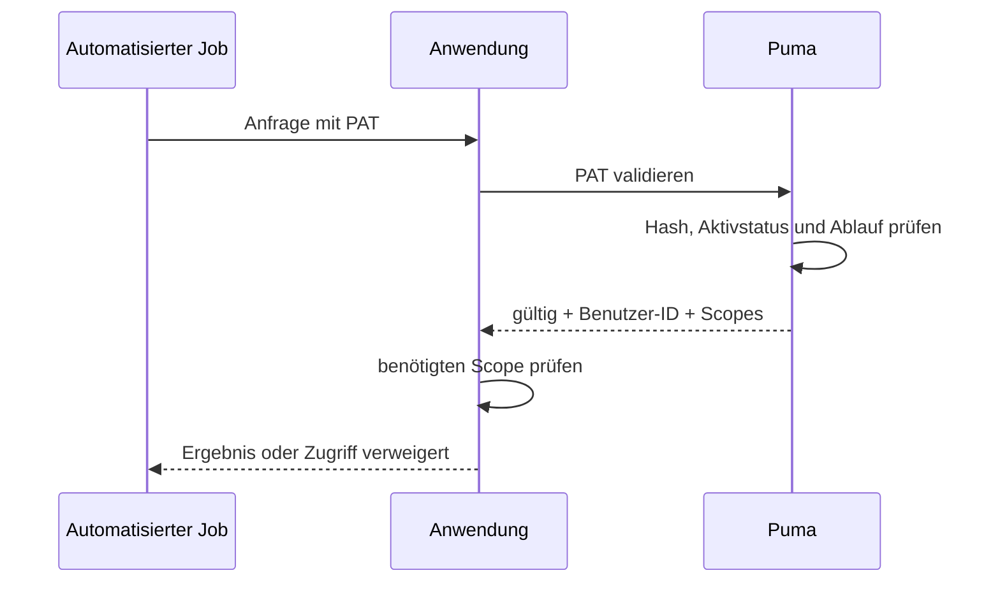

### 8.5 PAT widerrufen

1. Token anhand von Name, Produkt, Erstellungszeit und letzter Nutzung
   identifizieren.
2. Token-ID widerrufen.
3. Validierung muss danach fehlschlagen.
4. Bei vermutetem Secret-Abfluss abhängige Systeme und Protokolle prüfen.
5. Ersatz-PAT mit reduziertem Scope und neuem Ablaufdatum ausstellen.

### 8.6 Bekannte Schnittstelleneigenschaft

Die aktuelle GraphQL-Validierungsantwort liefert Benutzer-ID und Scopes, aber
nicht die Token-ID. Deshalb kann `ValidatePersonalAccessToken()` die
`productId` im Validierungsergebnis derzeit nicht rekonstruieren. Der
Produktkontext muss beim ausstellenden beziehungsweise konsumierenden System
zusätzlich bekannt und geprüft sein.

## 9. Betrieb und Sicherheit

### 9.1 Verantwortlichkeiten

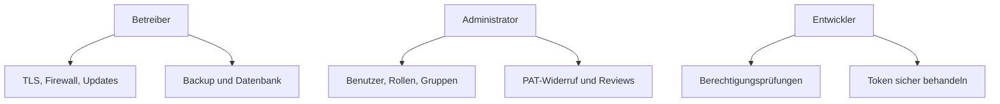

### 9.2 Regelmäßige Kontrollen

- Benutzer ohne aktuellen fachlichen Bedarf entfernen oder sperren.
- Rollen und Gruppen nach dem Least-Privilege-Prinzip prüfen.
- Alte, nie verwendete oder abgelaufene PATs widerrufen.
- Administratorrechte personenbezogen vergeben.
- Datenbank und Einstellungen sichern; Wiederherstellung testen.
- Zertifikatsablauf überwachen.
- Fehlgeschlagene Logins und ungewöhnliche Tokenverwendung untersuchen.
- Server und ImtCore/Puma-Komponenten aktuell halten.

### 9.3 Backup und Wiederherstellung

Ein konsistentes Backup umfasst mindestens Datenbank und Puma-Einstellungen.
Zertifikate und Schlüssel sind getrennt und besonders geschützt zu sichern.
Nach einer Wiederherstellung sind Datenbankmigrationen, Login, Rollen,
Gruppen, Sitzungsbehandlung und PAT-Validierung in einer kontrollierten
Umgebung zu testen.

## 10. Fehlerdiagnose

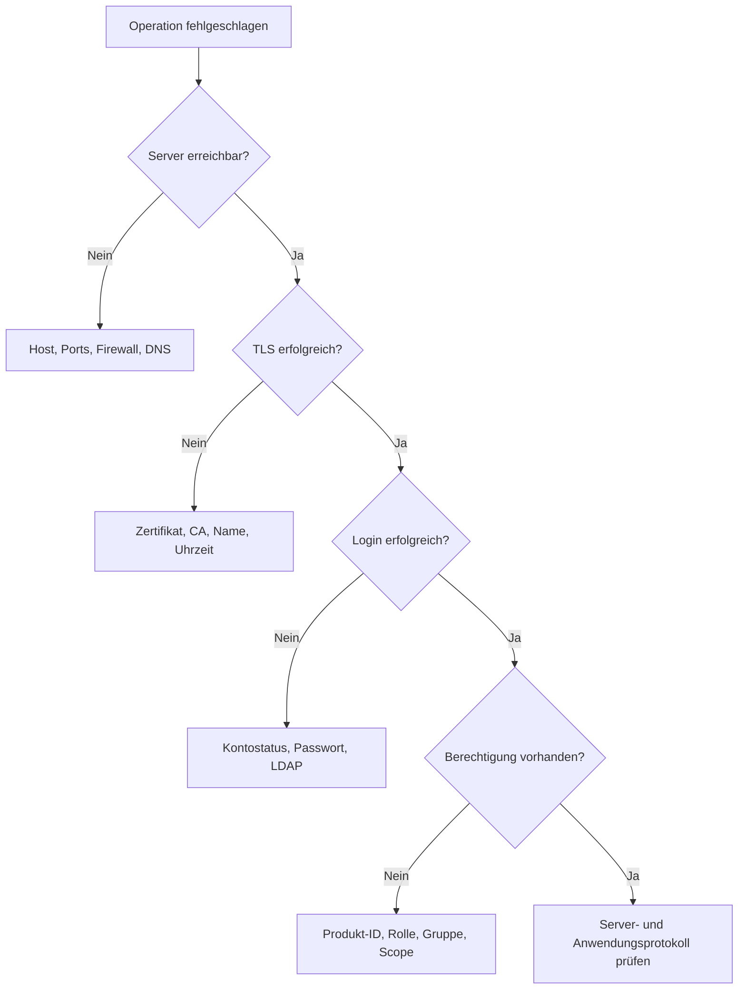

| Problem | Wahrscheinliche Ursache | Maßnahme |
|---|---|---|
| Verbindung abgelehnt | Falscher Host/Port oder Server nicht gestartet | HTTP- und WS-Port sowie Prozess prüfen |
| TLS-Fehler | Zertifikat nicht vertrauenswürdig oder Name falsch | Zertifikatskette, Hostname und Uhrzeit prüfen |
| Login schlägt fehl | Zugangsdaten, Kontostatus oder LDAP | Authentifizierungsweg gezielt prüfen |
| `HasPermission()` bleibt `false` | Falsche Produkt-ID oder fehlende Rolle | Produkt-ID und effektive Rollen prüfen |
| Benutzeroperation liefert leere ID | Login bereits vorhanden oder Rechte fehlen | Eindeutigkeit und Adminrechte prüfen |
| PAT-Erstellung liefert leeres Secret | Nicht angemeldet, falscher Eigentümer oder leere Scopes | Sitzung, Benutzer-ID und Scopes prüfen |
| PAT ist ungültig | Widerrufen, abgelaufen oder verändert | Tokenmetadaten prüfen und neu ausstellen |
| Einstellungen gehen verloren | Fehlende Schreibrechte | Pfad und Dienstkonto prüfen |

## 11. Abnahme-Checklisten

### Server

- [ ] Passende Datenbankvariante gewählt
- [ ] Datenbankverbindung und Migration erfolgreich
- [ ] HTTPS und WSS mit gültigem Zertifikat aktiv
- [ ] Ports und Firewall dokumentiert
- [ ] Backup und Wiederherstellung getestet
- [ ] Protokollüberwachung eingerichtet

### Berechtigungsmodell

- [ ] Eindeutige Produkt-ID festgelegt
- [ ] Berechtigungs-IDs dokumentiert
- [ ] Rollen nach Aufgaben statt Personen modelliert
- [ ] Gruppen für wiederkehrende Teams angelegt
- [ ] Personalisierte Administratorkonten eingerichtet
- [ ] Negativtests für verweigerte Aktionen durchgeführt

### LDAP

- [ ] Windows- und Domänenvoraussetzungen erfüllt
- [ ] Erster Domänenlogin getestet
- [ ] SID und Benutzerdaten korrekt übernommen
- [ ] Default-Rolle geprüft
- [ ] LDAP deaktiviert, falls nicht benötigt

### PAT

- [ ] Least-Privilege-Scopes vergeben
- [ ] Ablaufdatum gesetzt
- [ ] Secret nur im Secret Store gespeichert
- [ ] Widerruf getestet
- [ ] Rotation und Verantwortlicher dokumentiert

## 12. Weiterführende Dokumentation

- [AuthClientSdk-Referenz](../AuthClientSdk.md)
- [AuthServerSdk-Referenz](../AuthServerSdk.md)
- [Abhängigkeiten](../Dependencies.md)
- [Puma-Sicherheitsrichtlinie](../../SECURITY.md)
- [Kompaktpräsentation](Puma_Kompakt_DE.pptx)

