# Puma User Manual

**Language:** English  
**Target audience:** Administrators and operators

## 1. Purpose and Scope

Puma is the central system for authentication and permission management across
multiple applications. Users log in to Puma; applications use the permissions
provided by Puma to decide which functions are enabled. This eliminates the
need to manage users, roles, and groups separately in each application.

This manual describes:

- the Puma server with an SQLite or PostgreSQL database,
- local users, roles, groups, and product-specific permissions,
- the integration of custom Qt/C++ applications via `AuthClientSdk`,
- the integration of custom servers via `AuthServerSdk`,
- Windows domain login via the LDAP layer implemented in ImtCore,
- Personal Access Tokens (PATs) for non-interactive access,
- typical operational, security, and error scenarios.

The description is based on Puma and the underlying authentication
implementation in ImagingTools/ImtCore. It describes the functionality
currently present in the source code; specific menu names may vary depending
on the embedded administration interface.

## 2. Puma at a Glance

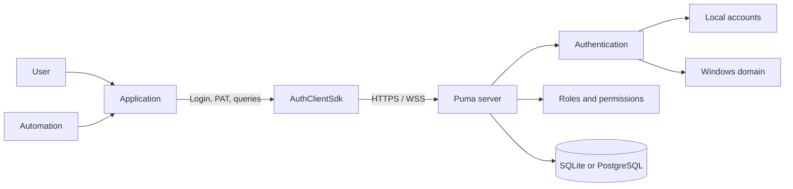

*Figure 1: Overview of the Puma system architecture.*

Puma separates four responsibilities:

1. **Identity:** Who is accessing the system?
2. **Authentication:** Is the presented credential valid?
3. **Authorization:** Which product-specific actions are permitted?
4. **Persistence:** Where are users, roles, groups, sessions, and PATs stored?

### 2.1 Puma Server Variants

| Variant | Database | Typical use |
|---|---|---|
| `PumaServerSl` | SQLite | Single installation, development, small local installation |
| `PumaServerPg` | PostgreSQL | Central multi-user operation and production server installation |

Both variants use the same Puma server base. Each server application includes
the appropriate repositories and SQL scripts for its database.

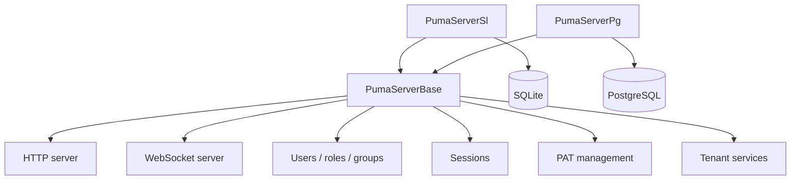

*Figure 2: Shared server base and database-specific variants.*

### 2.2 Interplay Between Puma and the Application

The application embeds Puma administration as a page in its client UI. On this
administration page, authorized administrators set up users, roles, groups, and
permission assignments. The page accesses the Puma server through the SDK; the
data is not managed separately in the application. After login, Puma returns the
effective permissions to the application. The application uses them to enable
functions in its business UI.

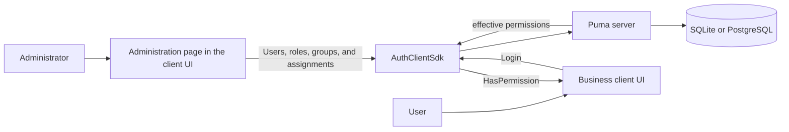

*Figure 3: Central administration and use of permissions in the application.*

Embedding and permission-dependent display of the administration page is the
responsibility of the application. Puma still enforces the permissions for
administrative operations; hiding the page alone is not access control.

## 3. Role and Permission Model

Puma does not manage permissions as freely editable user properties, but
through roles:

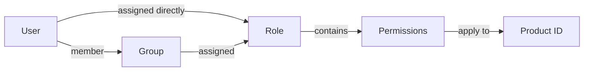

*Figure 4: Relationships between users, groups, roles, and permissions.*

- **Users** have an internal, stable object ID and a login name.
- **Roles** bundle permissions and are product-specific.
- **Groups** bundle users and are assigned roles.
- **Permissions** are case-sensitive IDs defined by the application.
- **Product ID** limits the context in which roles and permissions apply.

A user receives the union of:

- permissions from directly assigned roles and
- permissions from the roles of their groups.

When there are multiple direct roles, multiple groups, or multiple roles per
group, all contained permissions are combined. Duplicate permissions take
effect only once; one assignment does not subtract a permission from another
assignment.

> **Important:** Administrative operations use the internal user ID, not the
> login name. An application sets its product ID before login.

### 3.1 Mandatory and Optional Elements

| Element | Mandatory or optional? |
|---|---|
| Product ID | **Mandatory:** The application sets it before login; roles and permissions apply in this product context. |
| Permission ID | **Mandatory for protected functions:** The application defines and checks it. |
| Role | **Mandatory for granting a permission:** Permissions are granted through roles, not directly to users. A user may exist without a role but then has no role-based permission. |
| Direct role assignment | **Optional:** Suitable for individual tasks. |
| Group | **Optional:** Suitable for bundling recurring team assignments. |
| Group role | **Optional:** Alternative or supplement to direct role assignment. |
| Multiple roles or groups | **Optional:** Their permissions jointly form the union. |

### 3.2 Recommended Administration Model

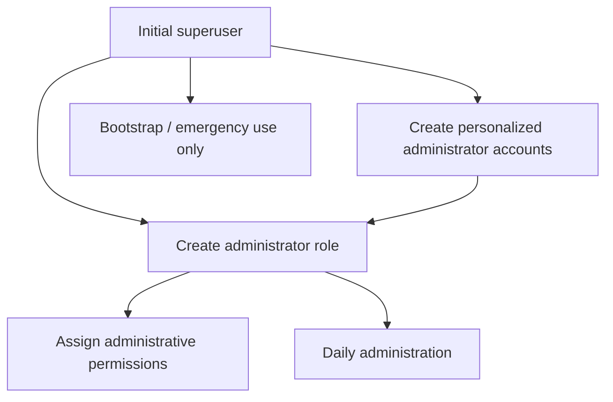

*Figure 5: Recommended model for bootstrap and daily administration.*

The superuser is used for initial setup. For day-to-day work, personalized
administrator accounts with an appropriate administrator role should be used.
This avoids the need to share superuser credentials.

## 4. Commissioning the Puma Server

### 4.1 Preparation

1. Select the server variant.
2. For `PumaServerPg`, prepare the PostgreSQL database, database user, and
   connectivity.
3. For `PumaServerSl`, no separate database server and no database preparation
   are required. The server creates the SQLite database; the service account
   needs write permissions at the designated location.
4. Define the HTTP and WebSocket ports.
5. Provide a server certificate and a private key for production systems.
6. Open the firewall only for the required ports.
7. Verify write permissions for settings, the database, and logs.

By default, persistent Puma settings are stored in
`Puma/Puma Server/PumaServerSettings.xml` under the application-specific
system path.

### 4.2 Startup Sequence

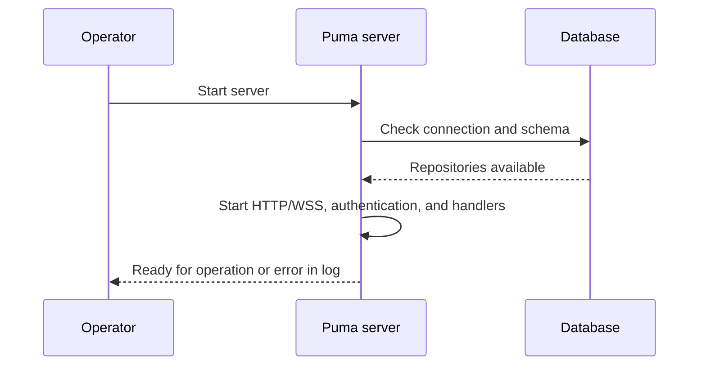

*Figure 6: Technical startup sequence of the Puma server.*

After startup, verify in particular that:

- the database connection was successful,
- the HTTP and WebSocket ports are bound,
- the certificate and key are loaded,
- there are no migration or repository errors,
- the client can reach the server.

### 4.3 Initial Setup

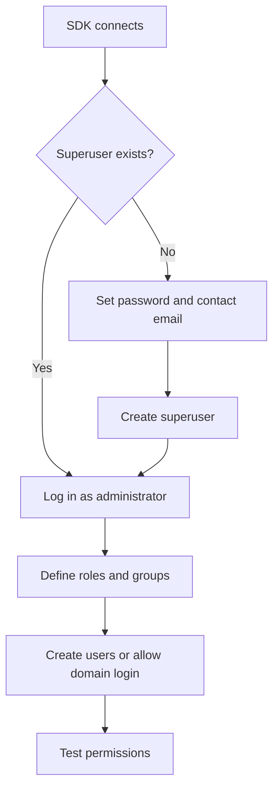

*Figure 7: Initial setup from superuser to permission test.*

The SDK sequence consists of `SuperuserExists()`, followed by
`CreateSuperuser()` if necessary, then login and creation of the role model.
During initialization, the superuser's password and contact email are set.
`CreateSuperuser()` takes the password; the contact email is configured in the
client composition as `SuperuserMail` of the `RemoteSuperuserController` and is
transmitted when the account is created. The Puma tests use the login `su` for
the initial account; production credentials and a reachable contact email must
be chosen securely and kept safe.

### 4.4 Transport Encryption

Puma uses separate ports for HTTP(S) and WebSocket(S). As soon as clients
access the system from outside an isolated development machine, HTTPS and WSS
must be used.

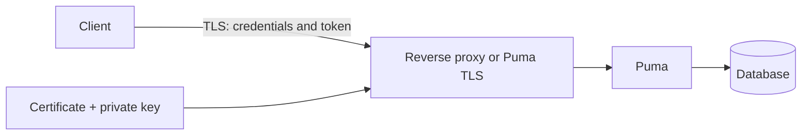

*Figure 8: TLS-protected transport between the client and Puma.*

Production rules:

- Use TLS 1.2 or later.
- Do not disable certificate verification.
- Make the private key readable only by the server process.
- Do not store passphrases in source code or presentations.
- Use HTTP/WS without TLS only in controlled test environments.

## 5. Detailed Use Cases

### UC-01: Create and Authorize a Local User

**Actor:** Administrator  
**Precondition:** The administrator is logged in and has the necessary
administrative permissions.

1. Create a user with a display name, unique login, initial password, and
   email address.
2. Obtain the internal user ID from the result.
3. Assign an existing role or create a role first.
4. Optionally add the user to a group.
5. The user logs in.
6. The application checks the expected permissions.

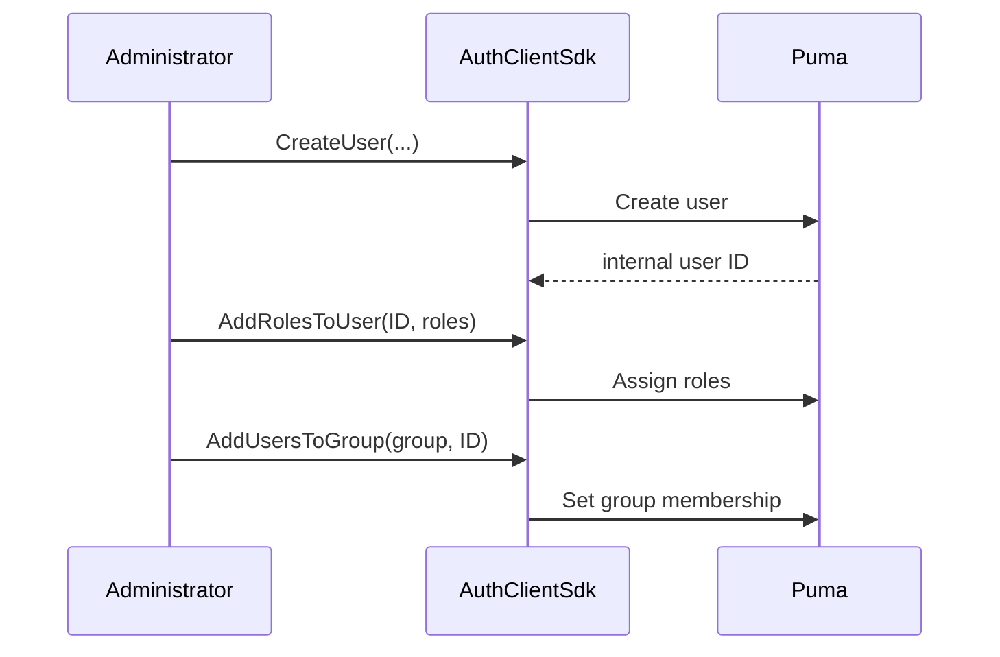

*Figure 9: Creating a local user with role and group assignment.*

**Result:** The user receives permissions from direct roles and group roles.
A user who is already logged in may need to log in again for the application
to receive updated session permissions.

### UC-02: Manage a Team Through a Group

**Actor:** Administrator

1. Create a functional role with the required permissions.
2. Create a group for the team or department.
3. Assign the role to the group.
4. Add users to the group.
5. Remove users from the group when they leave.

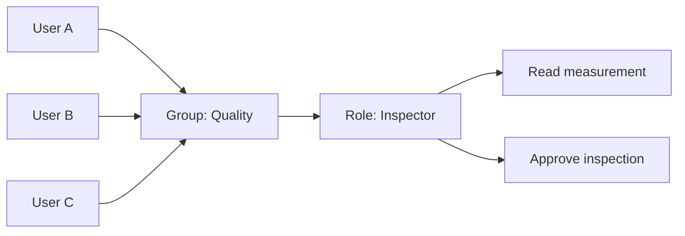

*Figure 10: Shared permission assignment through a group.*

**Benefit:** Role changes apply centrally to all group members.

### UC-03: Login and Function-Specific Access

**Actor:** End user

1. The application configures the connection and product ID.
2. The user enters a login and password.
3. Puma validates the credentials.
4. Puma creates a session and returns the token, user name, product ID, and
   permissions.
5. The application enables only permitted functions.
6. Puma invalidates the session on logout.

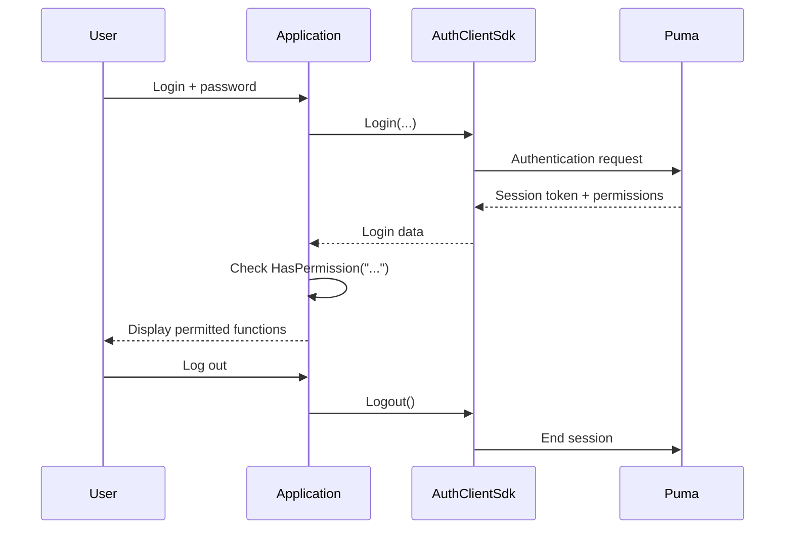

*Figure 11: Login, permission check, and logout of an application.*

Invalid credentials, a locked account, a missing connection, or missing
server components are reported as a failed login.

### UC-04: Change Permissions

1. The administrator changes a role or group assignment.
2. The application ends the old session or requests another login.
3. The user logs in again.
4. The application builds its interface using the new permissions.

Hiding a button is not a substitute for server-side verification. Every
protected server operation must validate the permission again.

### UC-05: Deactivate or Remove a User

The existing client SDK provides `RemoveUser()` for permanent deletion. Before
deleting a user, check the applicable retention and audit requirements. Role
and group assignments are removed with the user. For a temporary lockout, use
the account status function provided by the specific administration interface;
otherwise, revoke access through role assignments and session management.

### UC-06: Integrate a Custom Application

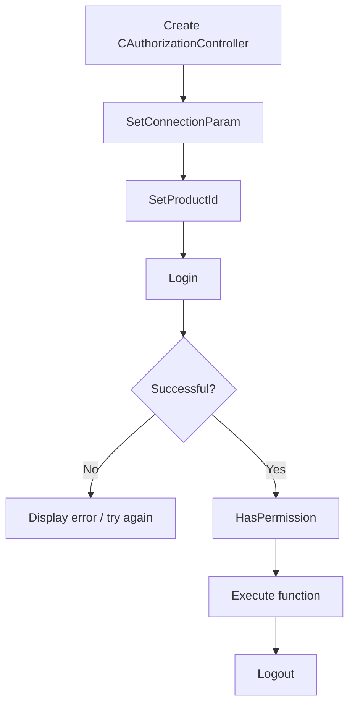

*Figure 12: Minimal sequence of an SDK-based client integration.*

The minimum sequence in the C++ client is:

```cpp
AuthClientSdk::CAuthorizationController auth;

AuthClientSdk::ServerConfig server;
server.host = "puma.example.org";
server.httpPort = 443;
server.wsPort = 8443;
server.sslConfig = AuthClientSdk::SslConfig{};

auth.SetConnectionParam(server);
auth.SetProductId("MeineAnwendung");

AuthClientSdk::Login session;
if (auth.Login(login, password, session) &&
    auth.HasPermission("messung.lesen")) {
    // Enable protected function.
}
auth.Logout();
```

Security-relevant notes:

- Transmit passwords only over TLS.
- Do not log session tokens.
- `Login()` automatically ends a previous session of the controller.
- Call `Logout()` explicitly; the destructor also attempts a best-effort
  logout.
- Do not execute `Login()` and `Logout()` in parallel on the same controller.

### UC-07: Integrate a Custom Authorizable Server

`AuthServerSdk::CAuthorizableServer` is intended for server applications that
provide their own endpoints but use Puma as the central authority.

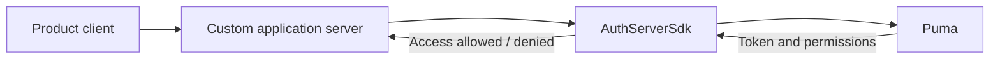

*Figure 13: Puma integration of a custom authorizable server.*

The application server sets:

1. its product ID,
2. the connection to the central Puma server,
3. its own HTTP/WebSocket ports,
4. optionally, a feature file and TLS configuration,
5. then `Start()`, and `Stop()` during shutdown.

## 6. SDK Layer

### 6.1 AuthClientSdk

The `AuthClientSdk::CAuthorizationController` facade provides:

| Area | Core operations |
|---|---|
| Connection | `SetConnectionParam()`, `SetProductId()` |
| Session | `Login()`, `Logout()`, `GetToken()` |
| Authorization | `HasPermission()`, `GetTokenPermissions()` |
| Bootstrap | `SuperuserExists()`, `CreateSuperuser()` |
| Users | List, read, create, delete, change password |
| Roles | List, read, create, delete, assign permissions |
| Groups | List, read, create, delete, assign users/roles |
| PAT | Create, list, validate, and revoke |

`ServerConfig` contains the host, HTTP port, WebSocket port, and optional TLS
settings. Roles and permissions are bound to the application configured with
`SetProductId()`.

### 6.2 AuthServerSdk

The server SDK encapsulates an authorizable HTTP/WebSocket server. Its network
connection to the Puma backend is separate from the ports on which the custom
server serves clients. In distributed installations, both connection
directions must therefore be configured and secured.

### 6.3 UI Components

Puma includes widgets and QML components for login and administration. They
use the same authentication and administration interfaces. A custom interface
must not replace server-side permission checks.

## 7. LDAP/Windows Domain Login

### 7.1 How It Works

On Windows, the current ImtCore implementation uses the Windows domain
functions, in particular verification through `LogonUser`. It is therefore
designed for Windows/Active Directory environments and is not a generally
configurable OpenLDAP client.

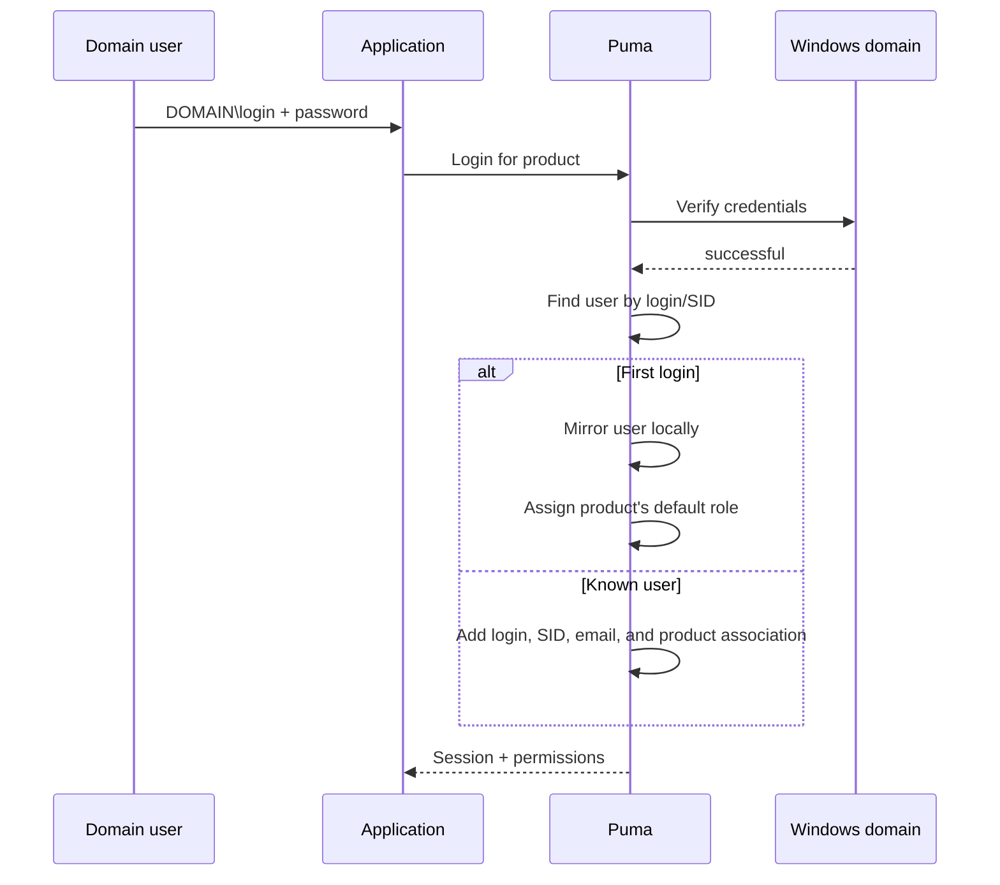

*Figure 14: Login of a Windows domain user through Puma.*

After a successful first domain login, Puma:

- creates an internal user record,
- marks the authentication system as `LDAP`,
- imports the SID, display name, and email address where available,
- creates the product-specific `Guest` and `Default` roles if necessary,
- assigns the default role for the product to the user.

Administrators can then assign additional Puma roles and groups to the mirrored
user. The password continues to be verified against the Windows domain.

### 7.2 Enabling and Disabling

`LdapEnabled` is enabled in Puma's default settings and is provided through the
**LDAP** settings section. If only local Puma accounts are used, the function
should be disabled to avoid unnecessary domain checks and misleading messages.

### 7.3 Prerequisites

- Puma runs on Windows.
- The server can reach the domain and a domain controller.
- The operating system, DNS, and trust relationship are configured correctly.
- The user uses a login accepted by Windows, typically
  `DOMÄNE\benutzer`.
- LDAP is enabled in Puma.

### 7.4 Troubleshooting

| Symptom | Check |
|---|---|
| Domain login fails, local login works | Check domain connectivity, DNS, time, login format, and `LdapEnabled` |
| User is created twice | Check for a consistent login format and SID resolution |
| User has insufficient permissions after first login | Check the default role and additional role/group assignments |
| Local logins produce domain errors in the log | Disable LDAP if it is not required |
| Linux server does not authenticate against AD | The current implementation is Windows-specific |

## 8. Personal Access Tokens (PAT)

### 8.1 Usage

PATs are long-lived credentials for automation, CI/CD, monitoring services,
and service-to-service communication. A PAT belongs to a user, contains a
product ID, and has explicit permission scopes.

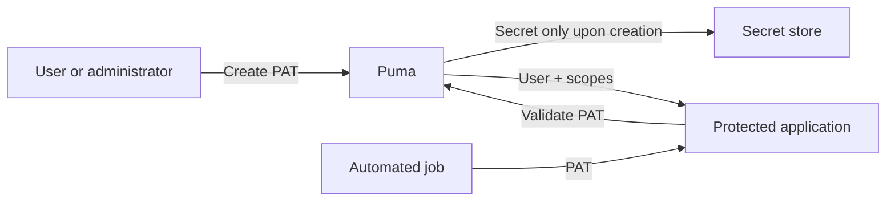

*Figure 15: Creation, storage, and use of a PAT.*

### 8.2 Life Cycle

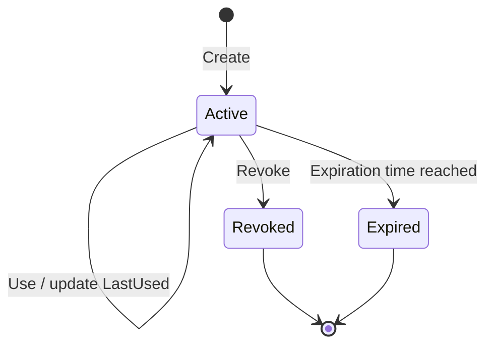

*Figure 16: States in the life cycle of a PAT.*

A token is valid if it exists, is active, has not been revoked, and has not
expired. Revoked records remain visible in the list and are reported as
inactive.

### 8.3 Create a PAT

**Precondition:** The owner or an administrator is logged in with a session.

1. Assign a purpose-specific name, for example `CI Produktion Lesen`.
2. Specify the target user and product ID.
3. Select only the minimum necessary scopes.
4. Set an expiration date in ISO 8601 format whenever possible.
5. Store the secret in a secret store immediately.
6. Do not copy the secret into source code, build logs, or tickets.

Anonymous callers may not create PATs. A regular user can manage their own
PATs, but not those of other users. Administrators can manage PATs belonging
to other users.

### 8.4 Use a PAT

The SDK data model distinguishes between `TokenType::Session` and
`TokenType::PersonalAccessToken`. For non-interactive access, the PAT is
validated using `ValidatePersonalAccessToken()`; the application then uses
only the returned scopes and additionally verifies the product context.

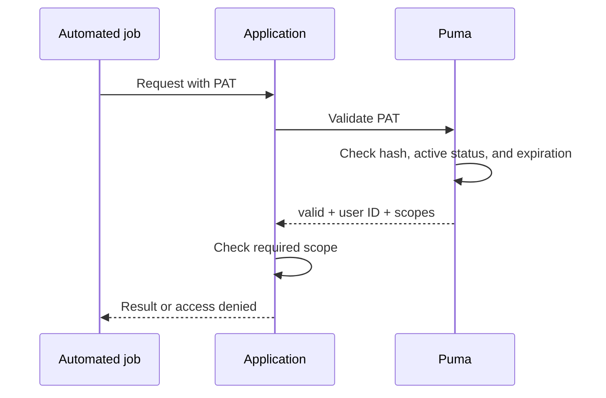

*Figure 17: Validation of a PAT for automated access.*

### 8.5 Revoke a PAT

1. Identify the token by name, product, creation time, and last use.
2. Revoke the token ID.
3. Validation must then fail.
4. If secret exposure is suspected, check dependent systems and logs.
5. Issue a replacement PAT with a reduced scope and a new expiration date.

### 8.6 Known Interface Characteristic

The current GraphQL validation response returns the user ID and scopes, but
not the token ID. Consequently, `ValidatePersonalAccessToken()` currently
cannot reconstruct the `productId` in the validation result. The issuing or
consuming system must additionally know and verify the product context.

## 9. Operations and Security

### 9.1 Responsibilities

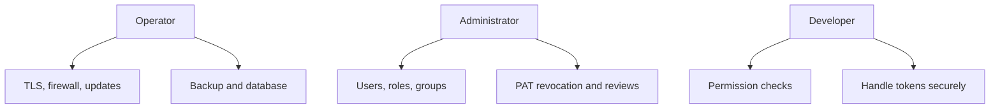

*Figure 18: Division of operational security responsibility.*

### 9.2 Regular Checks

- Remove or lock users who no longer have a current business need.
- Review roles and groups according to the principle of least privilege.
- Revoke old, unused, or expired PATs.
- Assign administrator permissions to named individuals.
- Back up the database and settings; test recovery.
- Monitor certificate expiration.
- Investigate failed logins and unusual token use.
- Keep the server and ImtCore/Puma components up to date.

### 9.3 Backup and Recovery

A consistent backup includes at least the database and Puma settings.
Certificates and keys must be backed up separately with special protection.
After recovery, test database migrations, login, roles, groups, session
handling, and PAT validation in a controlled environment.

## 10. Troubleshooting

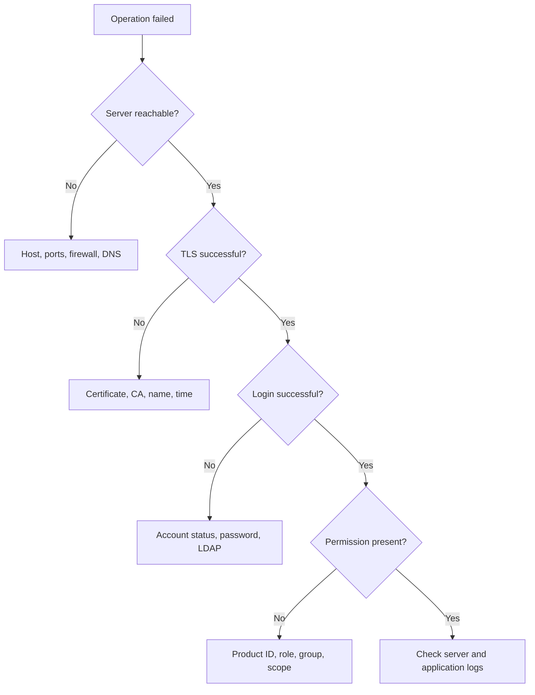

*Figure 19: Decision tree for error diagnosis.*

| Problem | Probable cause | Action |
|---|---|---|
| Connection refused | Incorrect host/port or server not started | Check the HTTP and WS ports and the process |
| TLS error | Certificate is not trusted or name is incorrect | Check the certificate chain, host name, and time |
| Login fails | Credentials, account status, or LDAP | Check the authentication path systematically |
| `HasPermission()` remains `false` | Incorrect product ID or missing role | Check the product ID and effective roles |
| User operation returns an empty ID | Login already exists or permissions are missing | Check uniqueness and administrator permissions |
| PAT creation returns an empty secret | Not logged in, incorrect owner, or empty scopes | Check the session, user ID, and scopes |
| PAT is invalid | Revoked, expired, or modified | Check the token metadata and reissue |
| Settings are lost | Missing write permissions | Check the path and service account |

## 11. Acceptance Checklists

### Server

- [ ] Appropriate database variant selected
- [ ] Database connection and migration successful
- [ ] HTTPS and WSS active with a valid certificate
- [ ] Ports and firewall documented
- [ ] Backup and recovery tested
- [ ] Log monitoring configured

### Permission Model

- [ ] Unique product ID defined
- [ ] Permission IDs documented
- [ ] Roles modeled by tasks rather than individuals
- [ ] Groups created for recurring teams
- [ ] Personalized administrator accounts configured
- [ ] Negative tests performed for denied actions

### LDAP

- [ ] Windows and domain prerequisites met
- [ ] First domain login tested
- [ ] SID and user data imported correctly
- [ ] Default role checked
- [ ] LDAP disabled if not required

### PAT

- [ ] Least-privilege scopes assigned
- [ ] Expiration date set
- [ ] Secret stored only in the secret store
- [ ] Revocation tested
- [ ] Rotation and responsible person documented

## 12. Further Documentation

- [AuthClientSdk reference](../AuthClientSdk.md)
- [AuthServerSdk reference](../AuthServerSdk.md)
- [Dependencies](../Dependencies.md)
- [Puma security policy](../../SECURITY.md)
- [Compact presentation](Puma_Kompakt_DE.pptx)

## 13. Developer Integration

An application can integrate Puma in two ways:

| Variant | Suitable for | Abstraction |
|---|---|---|
| `AuthClientSdk` | Applications that need a stable C++ facade | `AuthClientSdk::CAuthorizationController` |
| Partitura | ACF/ImtCore applications with an authorizable server | `AuthorizableServerFramework.acc` from ImtCore |

In both variants, the application needs the address of the Puma server, a
unique product ID, and the permissions defined for the product. The product ID
must match the administered application. TLS must be used for production
connections.

### 13.1 Integration via the SDK

1. Build `AuthClientSdk` and link it to the application. The CMake example at
   `Impl/AuthClientSdk/CMake/CMakeLists.txt` shows the required Qt and ImtCore
   dependencies.
2. Include `AuthClientSdk/AuthClientSdk.h`.
3. Create a `CAuthorizationController`, use `SetConnectionParam()` to set the
   HTTP/WebSocket endpoint and the TLS configuration, and then use
   `SetProductId()` to set the product context.
4. Log in with `Login()` and enable functions only after a successful check by
   `HasPermission()`.
5. For the administration page, use the user, role, and group operations of the
   same facade. The application decides, based on the administration
   permission, whether it offers the page in the client UI.
6. Call `Logout()` at the end of the session.

A minimal C++ example is in [UC-06](#uc-06-integrate-a-custom-application); the
complete API is described in the
[AuthClientSdk reference](../AuthClientSdk.md). In the current CMake build, the
SDK is only integrated on Windows.

### 13.2 Integration via Partitura

Under `Partitura/ImtHttpServerVoce.arp/AuthorizableServerFramework.acc`, ImtCore
already provides a ready-made base composition for an authorizable server. It
bundles, among other things, the HTTP and WebSocket server, the connection to
Puma, the authentication manager, and the user, role, and group caches. The
application should use this base instead of rebuilding the components
individually.

Integration is carried out in these steps:

1. Make the ImtCore packages and registries known in the application's ACF
   configuration.
2. Instantiate `AuthorizableServerFramework` from the `ImtHttpServerVoce`
   package.
3. Connect the application-specific components for application and version
   information, database, Puma connection, server interfaces, and TLS
   configuration via `Type="Reference"`. Custom request handlers are attached
   as `Type="Factory"`.
4. Configure the product ID and the connection to the central Puma server. The
   product ID must match the application administered in Puma.
5. Connect your own GraphQL handlers to the framework and integrate the HTTP and
   WebSocket servers exported by the framework into the application's server
   controller.
6. After the build, test login, PAT and session validation, and allowed and
   denied permissions against a test instance of Puma.

`Impl/AuthServerSdk/AuthServerSdk.acc` shows a concrete integration of this
ImtCore base composition. The Partitura variant wires it declaratively into the
application, while the SDK variant encapsulates the integration behind a C++
facade.
