# Manual de utilizare Puma

**Limba:** Română  
**Public-țintă:** Administratori și operatori

## 1. Scop și domeniu de aplicare

Puma este sistemul central pentru autentificarea și gestionarea autorizărilor
mai multor aplicații. Utilizatorii se autentifică la Puma; aplicațiile
decid pe baza autorizărilor furnizate de Puma ce funcții
sunt activate. Astfel, utilizatorii, rolurile și grupurile nu trebuie administrate
separat în fiecare aplicație.

Acest manual descrie:

- serverul Puma cu bază de date SQLite sau PostgreSQL,
- utilizatorii locali, rolurile, grupurile și autorizările asociate produselor,
- integrarea propriilor aplicații Qt/C++ prin `AuthClientSdk`,
- integrarea propriilor servere prin `AuthServerSdk`,
- autentificarea în domeniul Windows prin stratul LDAP implementat în ImtCore,
- tokenurile de acces personal (PAT-uri) pentru acces neinteractiv,
- cazurile uzuale de operare, securitate și eroare.

Descrierea se bazează pe Puma și pe implementarea de autentificare
subiacentă din ImagingTools/ImtCore. Aceasta descrie stadiul
funcțiilor existente în codul-sursă; denumirile concrete ale meniurilor pot varia
în funcție de interfața de administrare integrată.

## 2. Puma dintr-o privire

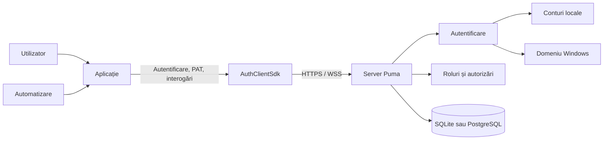

Puma separă patru sarcini:

1. **Identitate:** Cine accesează?
2. **Autentificare:** Dovada prezentată este validă?
3. **Autorizare:** Ce acțiuni asociate produsului sunt permise?
4. **Persistență:** Unde sunt stocate utilizatorii, rolurile, grupurile, sesiunile
   și PAT-urile?

### 2.1 Variante ale serverului Puma

| Variantă | Bază de date | Utilizare tipică |
|---|---|---|
| `PumaServerSl` | SQLite | Instalare individuală, dezvoltare, instalare locală de mici dimensiuni |
| `PumaServerPg` | PostgreSQL | Operare centralizată cu mai mulți utilizatori și instalare de server în producție |

Ambele variante folosesc aceeași bază de server Puma. Aplicația de
server respectivă integrează depozitele și scripturile SQL potrivite pentru
baza sa de date.

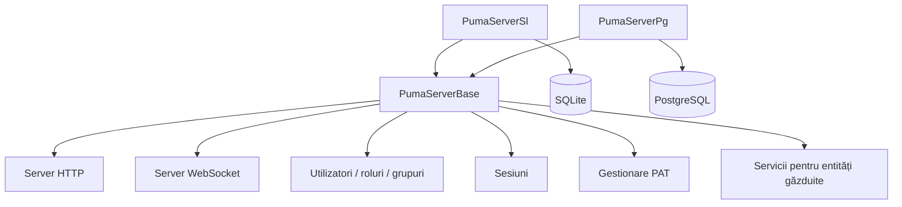

## 3. Modelul de roluri și autorizări

Puma nu gestionează autorizările ca proprietăți liber editabile ale unui
utilizator, ci prin roluri:

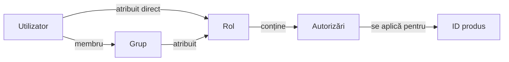

- **Utilizatorii** au un ID de obiect intern și stabil și un nume de autentificare.
- **Rolurile** grupează autorizările și sunt specifice produsului.
- **Grupurile** grupează utilizatorii și primesc roluri.
- **Autorizările** sunt ID-uri definite de aplicație, care țin cont de
  scrierea cu majuscule și minuscule.
- **ID-ul produsului** limitează contextul în care se aplică rolurile și autorizările.

Un utilizator primește reuniunea dintre:

- autorizările rolurilor atribuite direct și
- autorizările rolurilor grupurilor sale.

> **Important:** Operațiunile de administrare folosesc ID-ul intern al utilizatorului, nu
> numele de autentificare. O aplicație își setează ID-ul produsului înainte de autentificare.

### 3.1 Model de administrare recomandat

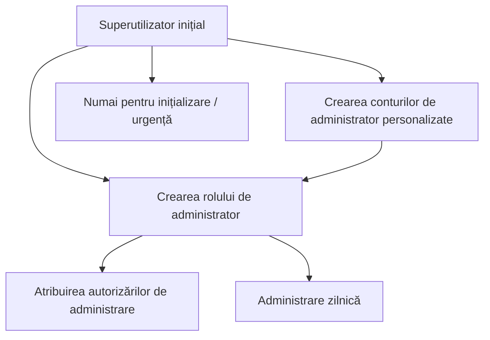

Superutilizatorul servește la configurarea inițială. Pentru activitatea zilnică trebuie
folosite conturi de administrator personalizate, cu un rol de administrator
adecvat. Astfel, datele de acces ale superutilizatorului nu trebuie partajate.

## 4. Punerea în funcțiune a serverului Puma

### 4.1 Pregătire

1. Selectați varianta de server.
2. Pentru PostgreSQL, pregătiți baza de date, utilizatorul bazei de date și accesibilitatea.
3. Stabiliți porturile HTTP și WebSocket.
4. Pentru sistemele de producție, furnizați un certificat de server și
   o cheie privată.
5. Deschideți în firewall numai porturile necesare.
6. Verificați drepturile de scriere pentru setări, baza de date și jurnale.

Setările persistente Puma sunt salvate implicit în calea de sistem
specifică aplicației, în
`Puma/Puma Server/PumaServerSettings.xml`.

### 4.2 Secvența de pornire

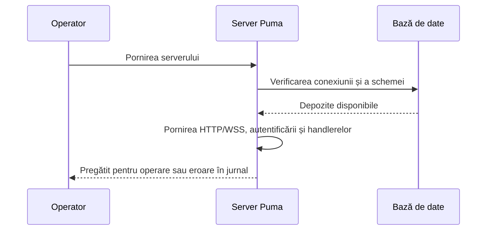

După pornire trebuie verificate în special:

- conexiunea la baza de date a reușit,
- porturile HTTP și WebSocket sunt asociate,
- certificatul și cheia sunt încărcate,
- nu există erori de migrare sau de depozit,
- clientul poate accesa serverul.

### 4.3 Configurarea inițială

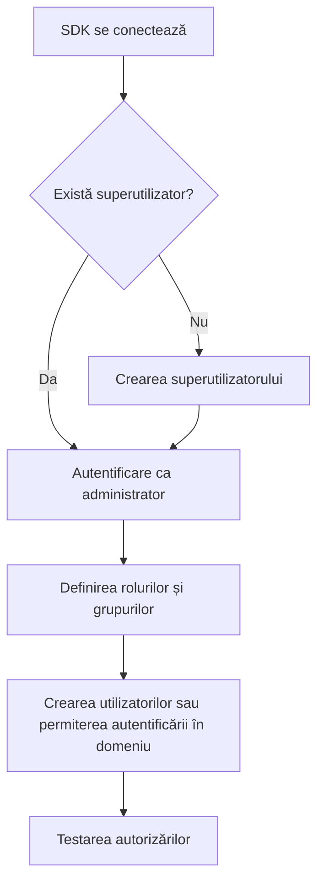

Secvența SDK constă din `SuperuserExists()`, dacă este necesar
`CreateSuperuser()`, apoi autentificarea și construirea modelului de roluri. Testele
Puma folosesc pentru contul inițial numele de autentificare `su`; datele de acces
pentru producție trebuie alese diferit, în mod sigur, și păstrate în siguranță.

### 4.4 Criptarea transportului

Puma folosește porturi separate pentru HTTP(S) și WebSocket(S). Atunci când
clienții accesează serverul din afara unui calculator de dezvoltare izolat, trebuie
utilizate HTTPS și WSS.

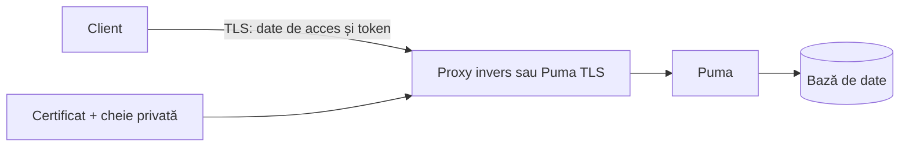

Reguli pentru producție:

- Folosiți TLS 1.2 sau o versiune ulterioară.
- Nu dezactivați verificarea certificatului.
- Faceți cheia privată accesibilă la citire numai procesului server.
- Nu salvați frazele de acces în codul-sursă sau în prezentări.
- Folosiți HTTP/WS fără TLS numai în medii de testare controlate.

## 5. Cazuri de utilizare detaliate

### UC-01: Crearea și autorizarea unui utilizator local

**Actor:** Administrator  
**Precondiție:** Administratorul este autentificat și deține autorizările de
administrare necesare.

1. Creați utilizatorul cu nume afișat, nume de autentificare unic, parolă inițială
   și e-mail.
2. Preluați ID-ul intern al utilizatorului din rezultat.
3. Atribuiți un rol existent sau creați mai întâi un rol.
4. Opțional, adăugați utilizatorul la un grup.
5. Utilizatorul se autentifică.
6. Aplicația verifică autorizările așteptate.

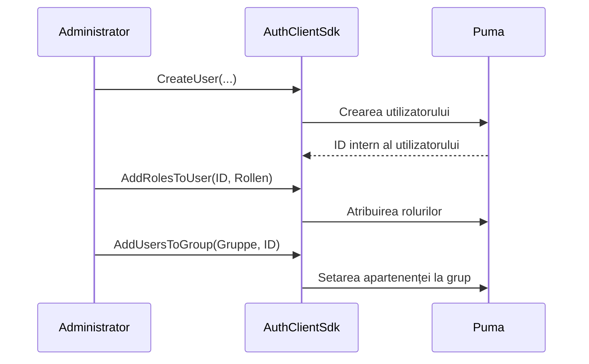

**Rezultat:** Utilizatorul primește autorizări din rolurile directe și din
rolurile grupurilor. Este posibil ca un utilizator deja autentificat să trebuiască să se
autentifice din nou pentru ca aplicația să primească autorizările actualizate ale sesiunii.

### UC-02: Gestionarea unei echipe prin intermediul unui grup

**Actor:** Administrator

1. Creați un rol funcțional cu autorizările necesare.
2. Creați un grup pentru echipă sau departament.
3. Atribuiți rolul grupului.
4. Adăugați utilizatorul la grup.
5. La plecare, eliminați utilizatorul din grup.

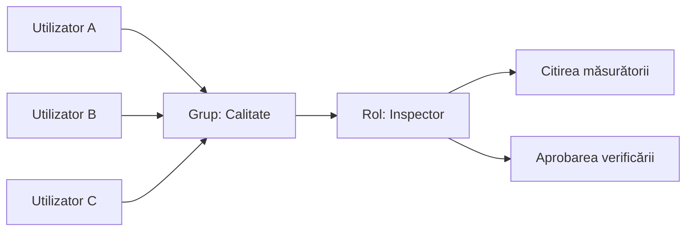

**Beneficiu:** Modificările rolurilor se aplică centralizat tuturor membrilor grupului.

### UC-03: Autentificarea și activarea în funcție de funcționalitate

**Actor:** Utilizator final

1. Aplicația configurează conexiunea și ID-ul produsului.
2. Utilizatorul introduce numele de autentificare și parola.
3. Puma validează datele de acces.
4. Puma creează o sesiune și furnizează tokenul, numele utilizatorului, ID-ul produsului și
   autorizările.
5. Aplicația activează numai funcțiile permise.
6. La deconectare, Puma invalidează sesiunea.

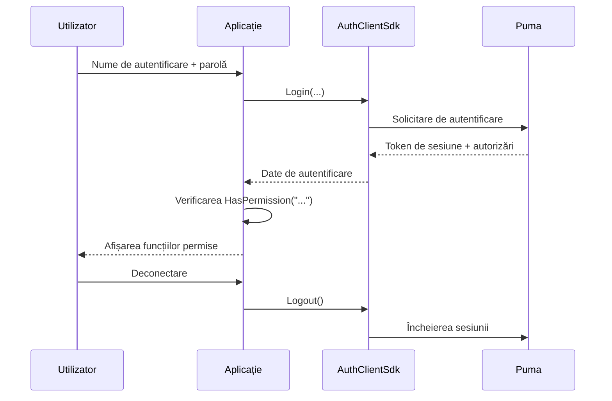

Erorile cauzate de date de acces nevalide, un cont blocat, lipsa conexiunii
sau lipsa componentelor serverului sunt raportate ca autentificare eșuată.

### UC-04: Modificarea autorizărilor

1. Administratorul modifică atribuirea rolurilor sau grupurilor.
2. Aplicația încheie sesiunea veche sau solicită o nouă autentificare.
3. Utilizatorul se autentifică din nou.
4. Aplicația își construiește interfața pe baza noilor autorizări.

Ascunderea unui buton nu înlocuiește verificarea pe server. Fiecare
operațiune de server care necesită protecție trebuie să valideze din nou autorizarea.

### UC-05: Dezactivarea sau eliminarea unui utilizator

SDK-ul client existent oferă `RemoveUser()` pentru ștergerea permanentă.
Înainte de ștergere trebuie verificate cerințele operaționale de
păstrare și audit. Atribuirile de roluri și grupuri sunt eliminate împreună cu utilizatorul.
Pentru o blocare temporară trebuie utilizată funcția de stare a contului oferită
în interfața de administrare concretă; în caz contrar, retrageți accesul prin
atribuirea rolurilor și gestionarea sesiunii.

### UC-06: Integrarea propriei aplicații

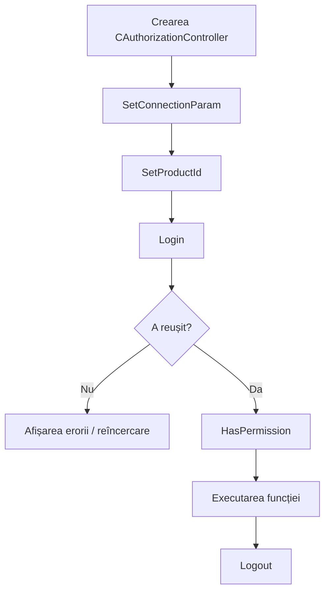

Secvența minimă în clientul C++ este:

```cpp
AuthClientSdk::CAuthorizationController auth;

AuthClientSdk::ServerConfig server;
server.host = "puma.example.org";
server.httpPort = 443;
server.wsPort = 8443;
server.sslConfig = AuthClientSdk::SslConfig{};

auth.SetConnectionParam(server);
auth.SetProductId("MeineAnwendung");

AuthClientSdk::Login session;
if (auth.Login(login, password, session) &&
    auth.HasPermission("messung.lesen")) {
    // Activarea funcției protejate.
}
auth.Logout();
```

Indicații relevante pentru securitate:

- Transmiteți parolele numai prin TLS.
- Nu înregistrați tokenurile de sesiune în jurnale.
- `Login()` încheie automat o sesiune anterioară a controlerului.
- Apelați explicit `Logout()`; destructorul încearcă suplimentar o deconectare
  în măsura posibilului.
- Nu executați `Login()` și `Logout()` în paralel pe același controler.

### UC-07: Integrarea propriului server autorizabil

`AuthServerSdk::CAuthorizableServer` este destinat aplicațiilor server care
oferă propriile endpointuri, dar folosesc Puma ca sursă centrală de autoritate.

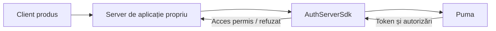

Serverul de aplicație setează:

1. ID-ul produsului său,
2. conexiunea la serverul Puma central,
3. propriile porturi HTTP/WebSocket,
4. opțional, un fișier de funcționalități și configurația TLS,
5. apoi `Start()` și, la oprire, `Stop()`.

## 6. Stratul SDK

### 6.1 AuthClientSdk

Fațada `AuthClientSdk::CAuthorizationController` oferă:

| Domeniu | Operațiuni centrale |
|---|---|
| Conexiune | `SetConnectionParam()`, `SetProductId()` |
| Sesiune | `Login()`, `Logout()`, `GetToken()` |
| Autorizare | `HasPermission()`, `GetTokenPermissions()` |
| Inițializare | `SuperuserExists()`, `CreateSuperuser()` |
| Utilizatori | Listare, citire, creare, ștergere, schimbarea parolei |
| Roluri | Listare, citire, creare, ștergere, atribuirea autorizărilor |
| Grupuri | Listare, citire, creare, ștergere, atribuirea utilizatorilor/rolurilor |
| PAT | Creare, listare, validare și revocare |

`ServerConfig` conține gazda, portul HTTP, portul WebSocket și setările
TLS opționale. Rolurile și autorizările sunt asociate aplicației configurate cu
`SetProductId()`.

### 6.2 AuthServerSdk

SDK-ul server încapsulează un server HTTP/WebSocket autorizabil. Conexiunea sa
de rețea la backendul Puma este separată de porturile pe care
serverul propriu deservește clienții. Prin urmare, în instalările distribuite trebuie
configurate și securizate ambele direcții de conexiune.

### 6.3 Componente UI

Puma conține widgeturi, respectiv componente QML, pentru autentificare și
administrare. Acestea se bazează pe aceleași interfețe de autentificare și
administrare. O interfață proprie nu poate înlocui
verificările autorizărilor de pe server.

## 7. Autentificarea LDAP/în domeniul Windows

### 7.1 Mod de funcționare

Implementarea ImtCore actuală folosește în Windows funcțiile
de domeniu Windows, în special verificarea prin `LogonUser`.
Prin urmare, este orientată către medii Windows/Active Directory și nu este un
client OpenLDAP configurabil în mod general.

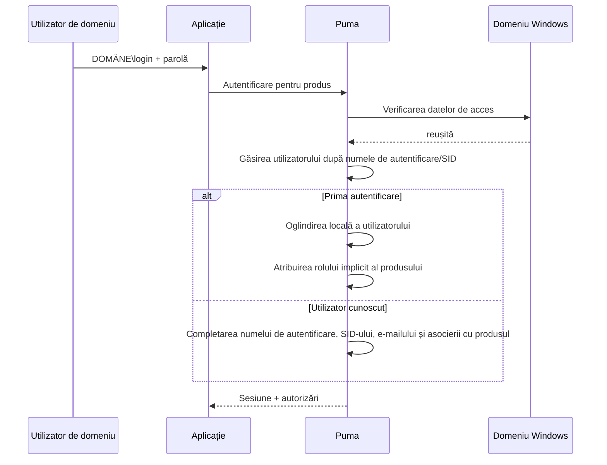

La prima autentificare reușită în domeniu:

- Puma creează o înregistrare internă pentru utilizator,
- marchează sistemul de autentificare drept `LDAP`,
- preia, în măsura în care sunt disponibile, SID-ul, numele afișat și e-mailul,
- creează, dacă este necesar, rolurile asociate produsului `Guest` și `Default`,
- atribuie utilizatorului rolul implicit pentru produs.

Ulterior, administratorii pot atribui utilizatorului oglindit alte
roluri și grupuri Puma. Parola continuă să fie verificată în raport cu
domeniul Windows.

### 7.2 Activare și dezactivare

`LdapEnabled` este activat în setarea implicită Puma și este disponibil în
zona de setări **LDAP**. Dacă sunt utilizate exclusiv conturi Puma
locale, funcția trebuie dezactivată pentru a evita
verificările inutile ale domeniului și mesajele derutante.

### 7.3 Cerințe preliminare

- Puma rulează în Windows.
- Serverul poate accesa domeniul și un controler de domeniu.
- Sistemul de operare, DNS-ul și relația de încredere sunt configurate corect.
- Utilizatorul folosește un nume de autentificare acceptat de Windows, de regulă
  `DOMÄNE\benutzer`.
- LDAP este activat în Puma.

### 7.4 Depanare

| Simptom | Verificare |
|---|---|
| Autentificarea în domeniu eșuează, autentificarea locală funcționează | Verificați accesibilitatea domeniului, DNS-ul, ora, formatul numelui de autentificare și `LdapEnabled` |
| Utilizatorul este creat de două ori | Verificați formatul uniform al numelui de autentificare și rezolvarea SID-ului |
| Utilizatorul are prea puține drepturi după prima autentificare | Verificați rolul implicit și celelalte atribuiri de roluri/grupuri |
| Autentificările locale generează erori de domeniu în jurnal | Dezactivați LDAP dacă nu este necesar |
| Serverul Linux nu se autentifică în AD | Implementarea actuală este specifică Windows |

## 8. Tokenuri de acces personal (PAT)

### 8.1 Utilizare

PAT-urile sunt credențiale de acces cu durată lungă pentru automatizare, CI/CD,
servicii de monitorizare și comunicație între servicii. Un PAT aparține
unui utilizator, conține un ID de produs și scope-uri explicite de autorizare.

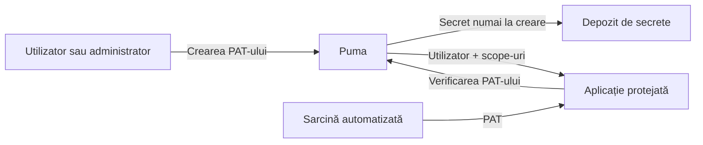

### 8.2 Ciclul de viață

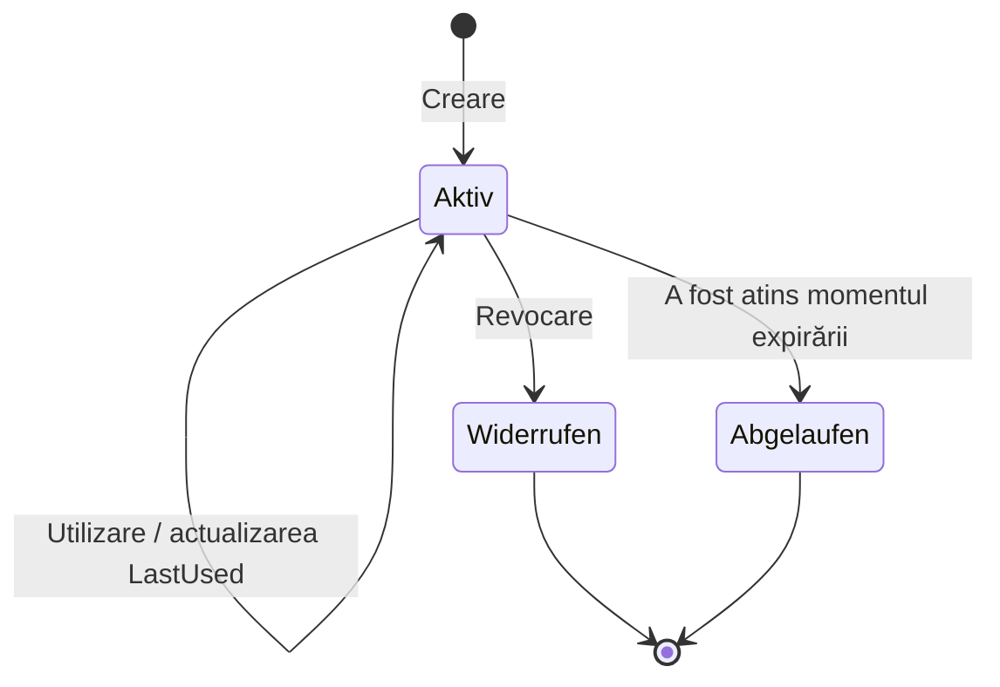

Un token este valid dacă există, este activ, nu este revocat și nu este
expirat. Înregistrările revocate rămân vizibile în listă și
sunt raportate drept inactive.

### 8.3 Crearea unui PAT

**Precondiție:** Proprietarul sau un administrator este autentificat printr-o
sesiune.

1. Atribuiți un nume legat de scop, de exemplu `CI Produktion Lesen`.
2. Stabiliți utilizatorul-țintă și ID-ul produsului.
3. Selectați numai scope-urile minim necesare.
4. Dacă este posibil, setați o dată de expirare în format ISO-8601.
5. Salvați imediat secretul într-un depozit de secrete.
6. Nu copiați secretul în codul-sursă, jurnalele de compilare sau tichete.

Apelanții anonimi nu pot crea PAT-uri. Un utilizator obișnuit își poate
gestiona propriile PAT-uri, dar nu și PAT-urile altor utilizatori. Administratorii
pot gestiona PAT-urile altor utilizatori.

### 8.4 Utilizarea unui PAT

Modelul de date SDK face distincția între `TokenType::Session` și
`TokenType::PersonalAccessToken`. Pentru acces neinteractiv, PAT-ul este
verificat prin `ValidatePersonalAccessToken()`; apoi aplicația folosește
exclusiv scope-urile returnate și verifică suplimentar
contextul produsului.

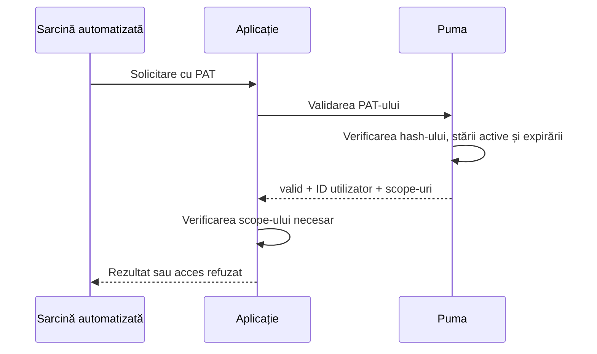

### 8.5 Revocarea unui PAT

1. Identificați tokenul pe baza numelui, produsului, momentului creării
   și ultimei utilizări.
2. Revocați ID-ul tokenului.
3. După aceea, validarea trebuie să eșueze.
4. Dacă suspectați divulgarea secretului, verificați sistemele dependente și jurnalele.
5. Emiteți un PAT înlocuitor cu scope redus și o nouă dată de expirare.

### 8.6 Proprietate cunoscută a interfeței

Răspunsul actual de validare GraphQL furnizează ID-ul utilizatorului și scope-urile, dar
nu și ID-ul tokenului. De aceea, `ValidatePersonalAccessToken()` nu poate
reconstitui în prezent `productId` în rezultatul validării. Contextul
produsului trebuie să fie cunoscut și verificat suplimentar de sistemul emitent,
respectiv de cel consumator.

## 9. Operare și securitate

### 9.1 Responsabilități

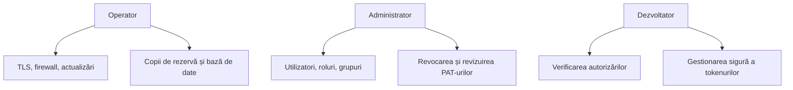

### 9.2 Verificări periodice

- Eliminați sau blocați utilizatorii fără o necesitate operațională actuală.
- Verificați rolurile și grupurile conform principiului privilegiului minim.
- Revocați PAT-urile vechi, neutilizate vreodată sau expirate.
- Atribuiți drepturile de administrator nominal.
- Creați copii de rezervă pentru baza de date și setări; testați restaurarea.
- Monitorizați expirarea certificatelor.
- Investigați autentificările eșuate și utilizarea neobișnuită a tokenurilor.
- Mențineți serverul și componentele ImtCore/Puma actualizate.

### 9.3 Copii de rezervă și restaurare

O copie de rezervă coerentă include cel puțin baza de date și setările Puma.
Certificatele și cheile trebuie salvate separat și protejate în mod special.
După o restaurare, migrările bazei de date, autentificarea, rolurile,
grupurile, gestionarea sesiunilor și validarea PAT-urilor trebuie testate într-un mediu
controlat.

## 10. Diagnosticarea erorilor

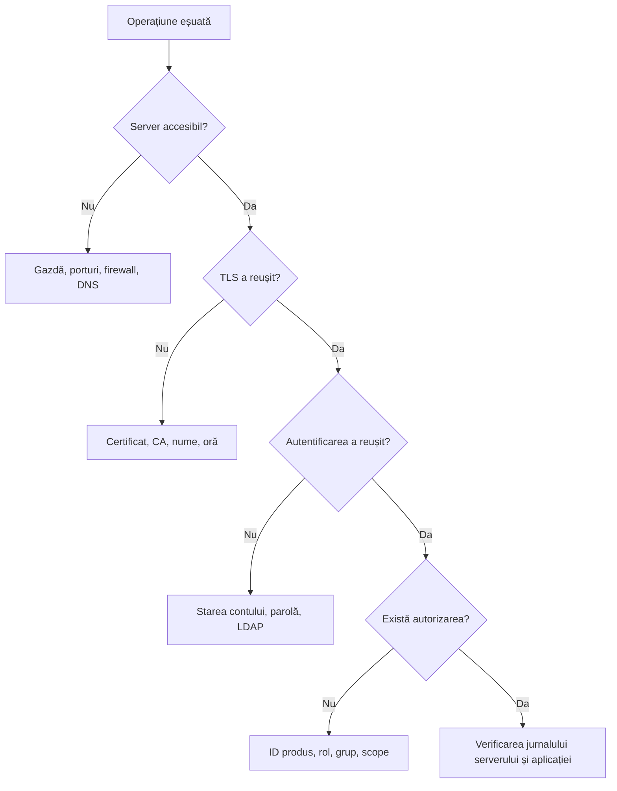

| Problemă | Cauză probabilă | Măsură |
|---|---|---|
| Conexiune refuzată | Gazdă/port greșit sau server nepornit | Verificați porturile HTTP și WS, precum și procesul |
| Eroare TLS | Certificatul nu este de încredere sau numele este greșit | Verificați lanțul de certificate, numele gazdei și ora |
| Autentificarea eșuează | Date de acces, starea contului sau LDAP | Verificați în mod țintit calea de autentificare |
| `HasPermission()` rămâne `false` | ID de produs greșit sau rol lipsă | Verificați ID-ul produsului și rolurile efective |
| Operațiunea asupra utilizatorului furnizează un ID gol | Numele de autentificare există deja sau lipsesc drepturile | Verificați unicitatea și drepturile de administrator |
| Crearea PAT-ului furnizează un secret gol | Lipsa autentificării, proprietar greșit sau scope-uri goale | Verificați sesiunea, ID-ul utilizatorului și scope-urile |
| PAT-ul este nevalid | Revocat, expirat sau modificat | Verificați metadatele tokenului și emiteți unul nou |
| Setările se pierd | Lipsesc drepturile de scriere | Verificați calea și contul serviciului |

## 11. Liste de verificare pentru acceptanță

### Server

- [ ] A fost aleasă varianta potrivită a bazei de date
- [ ] Conexiunea la baza de date și migrarea au reușit
- [ ] HTTPS și WSS sunt active cu un certificat valid
- [ ] Porturile și firewallul sunt documentate
- [ ] Crearea copiei de rezervă și restaurarea au fost testate
- [ ] Monitorizarea jurnalelor este configurată

### Model de autorizare

- [ ] A fost stabilit un ID de produs unic
- [ ] ID-urile autorizărilor sunt documentate
- [ ] Rolurile sunt modelate după sarcini, nu după persoane
- [ ] Au fost create grupuri pentru echipe recurente
- [ ] Au fost configurate conturi de administrator personalizate
- [ ] Au fost efectuate teste negative pentru acțiunile refuzate

### LDAP

- [ ] Cerințele preliminare pentru Windows și domeniu sunt îndeplinite
- [ ] Prima autentificare în domeniu a fost testată
- [ ] SID-ul și datele utilizatorului au fost preluate corect
- [ ] Rolul implicit a fost verificat
- [ ] LDAP este dezactivat dacă nu este necesar

### PAT

- [ ] Au fost atribuite scope-uri conform principiului privilegiului minim
- [ ] Data de expirare este setată
- [ ] Secretul este stocat numai într-un depozit de secrete
- [ ] Revocarea a fost testată
- [ ] Rotația și persoana responsabilă sunt documentate

## 12. Documentație suplimentară

- [Referință AuthClientSdk](../AuthClientSdk.md)
- [Referință AuthServerSdk](../AuthServerSdk.md)
- [Dependențe](../Dependencies.md)
- [Politica de securitate Puma](../../SECURITY.md)
- [Prezentare compactă](Puma_Kompakt_DE.pptx)
