# Руководство пользователя Puma

**Язык:** Русский  
**Целевая аудитория:** администраторы и операторы

## 1. Назначение и область применения

Puma — это централизованная система аутентификации и управления правами доступа
для нескольких приложений. Пользователи входят в систему через Puma; приложения
на основании предоставленных Puma прав доступа определяют, какие функции
доступны. Благодаря этому не требуется отдельно управлять пользователями, ролями
и группами в каждом приложении.

В этом руководстве описаны:

- сервер Puma с базой данных SQLite или PostgreSQL,
- локальные пользователи, роли, группы и права доступа для конкретных продуктов,
- интеграция собственных приложений Qt/C++ через `AuthClientSdk`,
- интеграция собственных серверов через `AuthServerSdk`,
- вход в домен Windows через слой LDAP, реализованный в ImtCore,
- персональные токены доступа (PAT) для неинтерактивного доступа,
- типичные аспекты эксплуатации, безопасности и устранения ошибок.

Описание основано на Puma и базовой реализации аутентификации в
ImagingTools/ImtCore. Оно отражает состояние функций, имеющихся в исходном коде;
конкретные названия пунктов меню могут отличаться в зависимости от встроенного
интерфейса администрирования.

## 2. Краткий обзор Puma

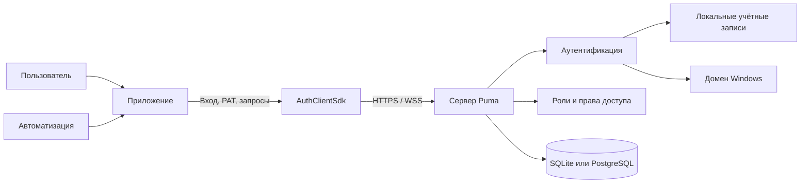

*Рисунок 1: Обзор системной архитектуры Puma.*

Puma разделяет четыре задачи:

1. **Идентификация:** кто получает доступ?
2. **Аутентификация:** действительно ли предъявленные учётные данные подлинны?
3. **Авторизация:** какие действия в контексте продукта разрешены?
4. **Хранение:** где хранятся пользователи, роли, группы,
   сеансы и PAT?

### 2.1 Варианты сервера Puma

| Вариант | База данных | Типичное применение |
|---|---|---|
| `PumaServerSl` | SQLite | Одиночная установка, разработка, небольшая локальная установка |
| `PumaServerPg` | PostgreSQL | Централизованная многопользовательская работа и промышленная серверная установка |

Оба варианта используют одну и ту же базовую реализацию сервера Puma.
Каждое серверное приложение подключает соответствующие репозитории и SQL-скрипты
для своей базы данных.

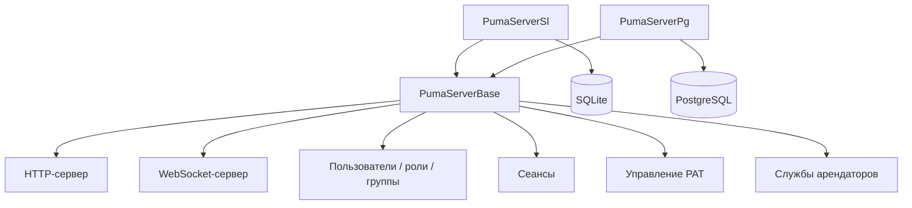

*Рисунок 2: Общая базовая реализация сервера и варианты для конкретных баз
данных.*

### 2.2 Взаимодействие Puma и приложения

Приложение встраивает администрирование Puma как страницу в свой клиентский
интерфейс. На этой странице администрирования уполномоченные администраторы
настраивают пользователей, роли, группы и назначения прав доступа. Страница
обращается к серверу Puma через SDK; данные не хранятся отдельно в приложении.
После входа Puma возвращает приложению действующие права доступа. Приложение
использует их, чтобы разблокировать функции в своём прикладном интерфейсе.

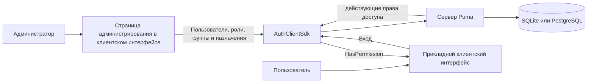

*Рисунок 3: Централизованное администрирование и использование прав доступа в
приложении.*

Встраивание и отображение страницы администрирования в зависимости от прав
доступа — задача приложения. Puma по-прежнему применяет права доступа для
операций администрирования; простое скрытие страницы не является контролем
доступа.

## 3. Модель ролей и прав доступа

Puma управляет правами доступа не как свободно редактируемыми свойствами
пользователя, а посредством ролей:

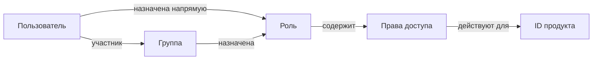

*Рисунок 4: Связи между пользователями, группами, ролями и правами доступа.*

- **Пользователи** имеют внутренний стабильный ID объекта и имя входа.
- **Роли** объединяют права доступа и относятся к конкретному продукту.
- **Группы** объединяют пользователей и получают роли.
- **Права доступа** — это определяемые приложением ID с учётом
  регистра.
- **ID продукта** ограничивает контекст действия ролей и прав доступа.

Пользователь получает объединение:

- прав доступа ролей, назначенных ему напрямую, и
- прав доступа ролей его групп.

При наличии нескольких напрямую назначенных ролей, нескольких групп или
нескольких ролей на группу все содержащиеся права доступа объединяются.
Повторяющиеся права доступа действуют только один раз; одно назначение не
вычитает никаких прав доступа из другого назначения.

> **Важно:** операции администрирования используют внутренний ID пользователя,
> а не имя входа. Приложение задаёт свой ID продукта до входа в систему.

### 3.1 Обязательные и необязательные элементы

| Элемент | Обязательный или необязательный? |
|---|---|
| ID продукта | **Обязательный:** приложение задаёт его до входа; роли и права доступа действуют в этом контексте продукта. |
| ID права доступа | **Обязательный для защищённых функций:** приложение определяет и проверяет его. |
| Роль | **Обязательна для предоставления права доступа:** права доступа предоставляются через роли, а не напрямую пользователям. Пользователь может существовать без роли, но тогда у него нет прав доступа на основе ролей. |
| Прямое назначение роли | **Необязательное:** подходит для индивидуальных задач. |
| Группа | **Необязательная:** подходит для объединения повторяющихся назначений в командах. |
| Роль группы | **Необязательная:** альтернатива или дополнение к прямому назначению роли. |
| Несколько ролей или групп | **Необязательно:** их права доступа совместно образуют объединение. |

### 3.2 Рекомендуемая модель администрирования

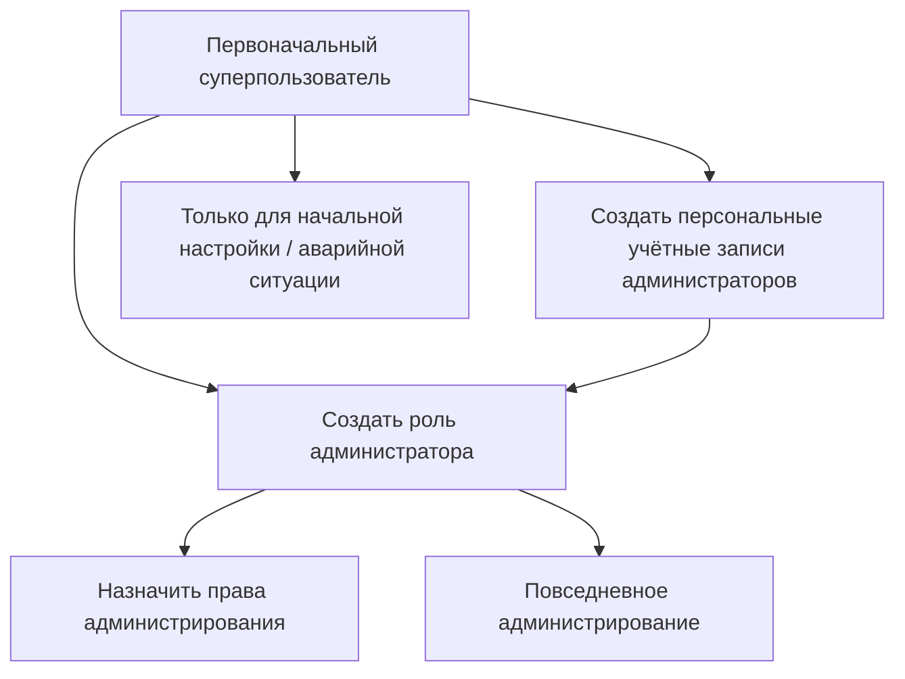

*Рисунок 5: Рекомендуемая модель для начальной настройки и повседневного
администрирования.*

Суперпользователь служит для первоначальной настройки. Для повседневной работы
следует использовать персональные учётные записи администраторов с подходящей
ролью администратора. Это исключает необходимость совместного использования
учётных данных суперпользователя.

## 4. Ввод сервера Puma в эксплуатацию

### 4.1 Подготовка

1. Выбрать вариант сервера.
2. Для `PumaServerPg` подготовить базу данных PostgreSQL, пользователя базы
   данных и сетевую доступность.
3. Для `PumaServerSl` не требуется отдельный сервер базы данных и подготовка
   базы данных. Сервер создаёт базу данных SQLite; служебной учётной записи
   нужны права записи в предусмотренном месте хранения.
4. Задать порты HTTP и WebSocket.
5. Для промышленных систем предоставить сертификат сервера и закрытый
   ключ.
6. Открыть в межсетевом экране только необходимые порты.
7. Проверить права записи для настроек, базы данных и журналов.

Постоянные настройки Puma по умолчанию сохраняются по системному пути приложения
в файле `Puma/Puma Server/PumaServerSettings.xml`.

### 4.2 Последовательность запуска

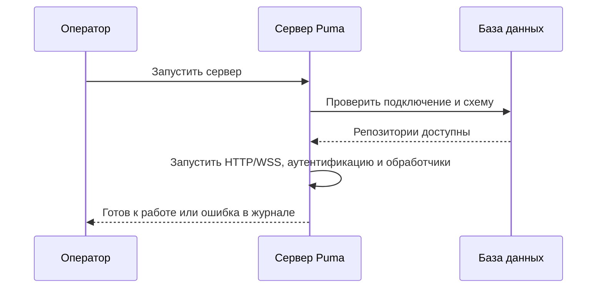

*Рисунок 6: Технический процесс запуска сервера Puma.*

После запуска необходимо проверить прежде всего следующее:

- подключение к базе данных выполнено успешно,
- порты HTTP и WebSocket привязаны,
- сертификат и ключ загружены,
- отсутствуют ошибки миграции или репозиториев,
- клиент может подключиться к серверу.

### 4.3 Первоначальная настройка

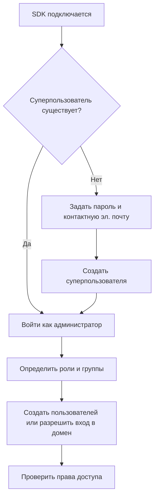

*Рисунок 7: Первоначальная настройка от суперпользователя до проверки прав
доступа.*

Последовательность SDK состоит из `SuperuserExists()`, при необходимости
`CreateSuperuser()`, а затем входа и построения модели ролей. При инициализации
задаются пароль суперпользователя и его контактная электронная почта.
`CreateSuperuser()` принимает пароль; контактная электронная почта настраивается
в композиции клиента как `SuperuserMail` контроллера `RemoteSuperuserController`
и передаётся при создании. В тестах Puma для первоначальной учётной записи
используется имя входа `su`; учётные данные для промышленной среды и доступную
контактную электронную почту необходимо выбрать и безопасно хранить.

### 4.4 Шифрование транспорта

Puma использует раздельные порты для HTTP(S) и WebSocket(S). Если клиенты
подключаются не только с изолированного компьютера разработчика, следует
использовать HTTPS и WSS.

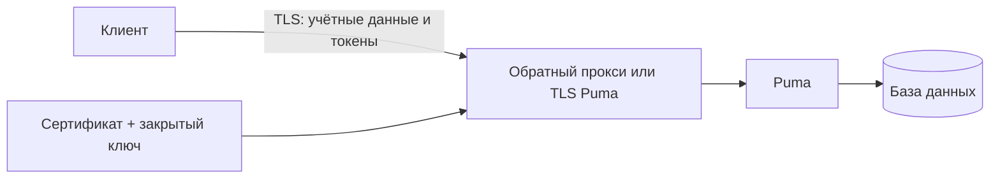

*Рисунок 8: Защищённый TLS транспорт между клиентом и Puma.*

Правила для промышленной среды:

- Использовать TLS 1.2 или выше.
- Не отключать проверку сертификатов.
- Разрешить чтение закрытого ключа только серверному процессу.
- Не хранить парольные фразы в исходном коде или презентациях.
- Использовать HTTP/WS без TLS только в контролируемых тестовых средах.

## 5. Подробные варианты использования

### UC-01: Создание локального пользователя и назначение прав

**Исполнитель:** администратор  
**Предусловие:** администратор вошёл в систему и имеет необходимые
права администрирования.

1. Создать пользователя, указав отображаемое имя, уникальное имя входа,
   начальный пароль и адрес электронной почты.
2. Получить внутренний ID пользователя из результата.
3. Назначить существующую роль или сначала создать роль.
4. При необходимости добавить пользователя в группу.
5. Пользователь входит в систему.
6. Приложение проверяет ожидаемые права доступа.

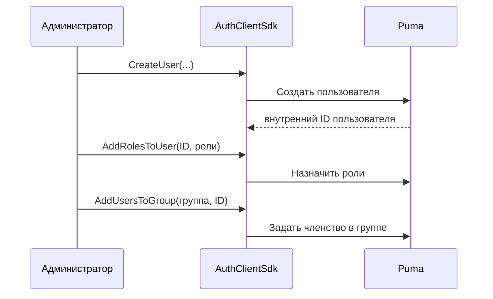

*Рисунок 9: Создание локального пользователя с назначением ролей и группы.*

**Результат:** пользователь получает права доступа из назначенных напрямую ролей
и ролей групп. Пользователю, уже вошедшему в систему, может потребоваться выйти
и войти снова, чтобы приложение получило обновлённые права сеанса.

### UC-02: Управление командой с помощью группы

**Исполнитель:** администратор

1. Создать функциональную роль с необходимыми правами доступа.
2. Создать группу для команды или подразделения.
3. Назначить роль группе.
4. Добавить пользователей в группу.
5. При уходе пользователя удалить его из группы.

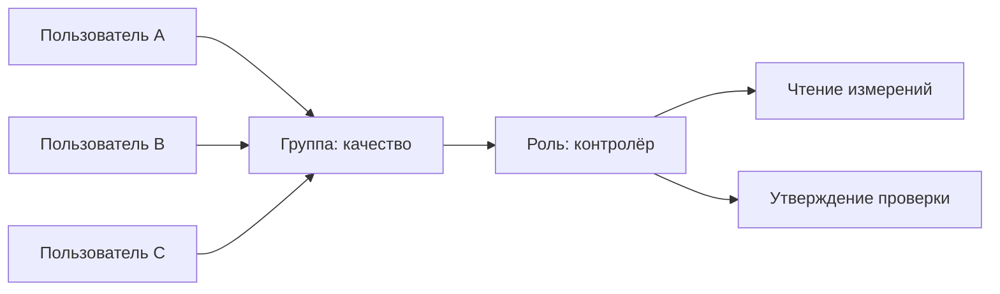

*Рисунок 10: Совместное назначение прав доступа через группу.*

**Преимущество:** изменения ролей централизованно применяются ко всем участникам группы.

### UC-03: Вход и предоставление доступа к функциям

**Исполнитель:** конечный пользователь

1. Приложение настраивает подключение и ID продукта.
2. Пользователь вводит имя входа и пароль.
3. Puma проверяет учётные данные.
4. Puma создаёт сеанс и возвращает токен, имя пользователя, ID продукта и
   права доступа.
5. Приложение предоставляет доступ только к разрешённым функциям.
6. При выходе Puma делает сеанс недействительным.

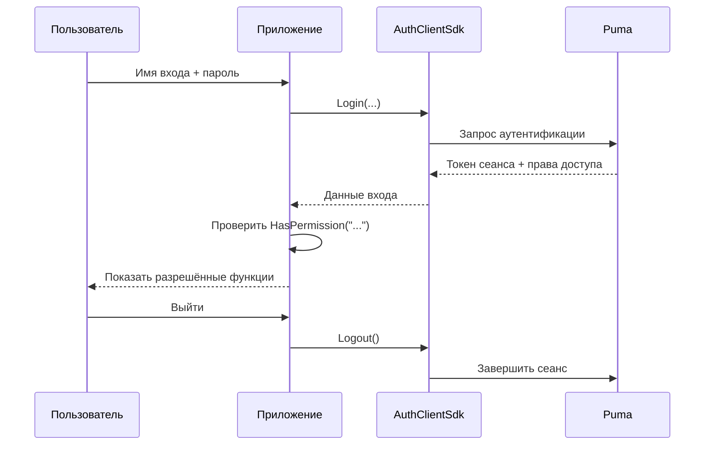

*Рисунок 11: Вход, проверка прав доступа и выход приложения.*

Ошибки, вызванные неверными учётными данными, заблокированной учётной записью,
отсутствием подключения или необходимых серверных компонентов, сообщаются как
неудачный вход.

### UC-04: Изменение прав доступа

1. Администратор изменяет назначение ролей или групп.
2. Приложение завершает старый сеанс или запрашивает повторный вход.
3. Пользователь входит снова.
4. Приложение формирует интерфейс на основе новых прав доступа.

Скрытие кнопки не заменяет проверку на стороне сервера. Каждая защищаемая
серверная операция должна повторно проверять право доступа.

### UC-05: Отключение или удаление пользователя

Существующий клиентский SDK предоставляет `RemoveUser()` для безвозвратного удаления.
Перед удалением следует проверить функциональные требования к хранению данных и
аудиту. Назначения ролей и групп удаляются вместе с пользователем.
Для временной блокировки следует использовать функцию состояния учётной записи,
предоставляемую конкретным интерфейсом администрирования; если такой функции нет,
следует отозвать доступ посредством назначения ролей и управления сеансами.

### UC-06: Подключение собственного приложения

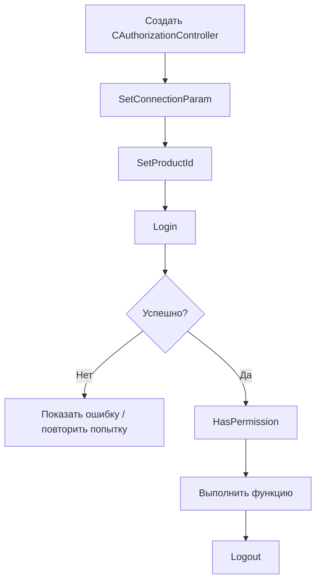

*Рисунок 12: Минимальный процесс подключения клиента на основе SDK.*

Минимальная последовательность действий в клиенте C++ выглядит так:

```cpp
AuthClientSdk::CAuthorizationController auth;

AuthClientSdk::ServerConfig server;
server.host = "puma.example.org";
server.httpPort = 443;
server.wsPort = 8443;
server.sslConfig = AuthClientSdk::SslConfig{};

auth.SetConnectionParam(server);
auth.SetProductId("MeineAnwendung");

AuthClientSdk::Login session;
if (auth.Login(login, password, session) &&
    auth.HasPermission("messung.lesen")) {
    // Geschützte Funktion freigeben.
}
auth.Logout();
```

Указания по безопасности:

- Передавать пароли только через TLS.
- Не записывать токены сеанса в журналы.
- `Login()` автоматически завершает предыдущий сеанс контроллера.
- Явно вызывать `Logout()`; деструктор также предпринимает попытку выхода
  без гарантии результата.
- Не выполнять `Login()` и `Logout()` параллельно на одном контроллере.

### UC-07: Подключение собственного авторизуемого сервера

`AuthServerSdk::CAuthorizableServer` предназначен для серверных приложений,
которые предоставляют собственные конечные точки, но используют Puma как
единый центр авторизации.

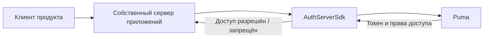

*Рисунок 13: Подключение собственного авторизуемого сервера к Puma.*

Сервер приложений задаёт:

1. свой ID продукта,
2. подключение к центральному серверу Puma,
3. собственные порты HTTP/WebSocket,
4. при необходимости файл функций и конфигурацию TLS,
5. затем вызывает `Start()`, а при завершении работы — `Stop()`.

## 6. Уровень SDK

### 6.1 AuthClientSdk

Фасад `AuthClientSdk::CAuthorizationController` предоставляет:

| Область | Основные операции |
|---|---|
| Подключение | `SetConnectionParam()`, `SetProductId()` |
| Сеанс | `Login()`, `Logout()`, `GetToken()` |
| Авторизация | `HasPermission()`, `GetTokenPermissions()` |
| Начальная настройка | `SuperuserExists()`, `CreateSuperuser()` |
| Пользователи | Просмотр списка, чтение, создание, удаление, изменение пароля |
| Роли | Просмотр списка, чтение, создание, удаление, назначение прав доступа |
| Группы | Просмотр списка, чтение, создание, удаление, назначение пользователей/ролей |
| PAT | Создание, просмотр списка, проверка и отзыв |

`ServerConfig` содержит узел, порт HTTP, порт WebSocket и необязательные
настройки TLS. Роли и права доступа привязаны к приложению, настроенному с помощью
`SetProductId()`.

### 6.2 AuthServerSdk

Серверный SDK инкапсулирует авторизуемый сервер HTTP/WebSocket. Его сетевое
подключение к серверной части Puma отделено от портов, на которых собственный
сервер обслуживает клиентов. Поэтому в распределённых установках необходимо
настроить и защитить оба направления подключения.

### 6.3 Компоненты пользовательского интерфейса

Puma содержит виджеты и компоненты QML для входа и администрирования. Они
основаны на тех же интерфейсах аутентификации и управления. Собственный интерфейс
не должен заменять проверки прав доступа на стороне сервера.

## 7. Вход через LDAP/домен Windows

### 7.1 Принцип работы

Текущая реализация ImtCore в Windows использует функции домена Windows,
в частности проверку посредством `LogonUser`. Поэтому она предназначена для
сред Windows/Active Directory и не является универсально настраиваемым клиентом
OpenLDAP.

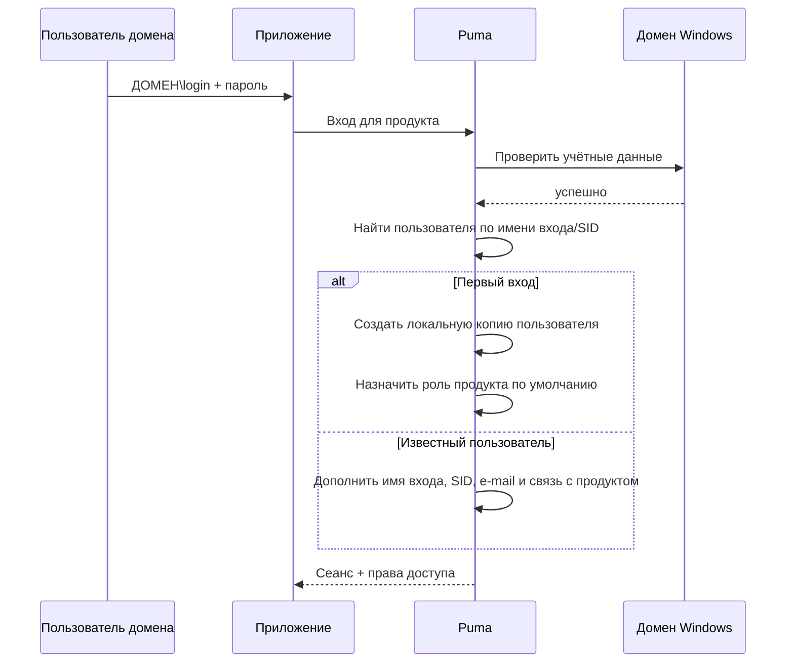

*Рисунок 14: Вход доменного пользователя Windows через Puma.*

При успешном первом входе в домен Puma:

- создаёт внутреннюю запись пользователя,
- указывает `LDAP` в качестве системы аутентификации,
- получает SID, отображаемое имя и адрес электронной почты, если они доступны,
- при необходимости создаёт связанные с продуктом роли `Guest` и `Default`,
- назначает пользователю роль по умолчанию для данного продукта.

После этого администраторы могут назначить созданной локальной копии пользователя
дополнительные роли и группы Puma. Пароль по-прежнему проверяется в домене
Windows.

### 7.2 Включение и отключение

`LdapEnabled` включён в стандартной конфигурации Puma и доступен в разделе
настроек **LDAP**. Если используются исключительно локальные учётные записи
Puma, эту функцию следует отключить, чтобы избежать ненужных проверок домена
и вводящих в заблуждение сообщений.

### 7.3 Предварительные требования

- Puma работает в Windows.
- Сервер может подключиться к домену и контроллеру домена.
- Операционная система, DNS и доверительные отношения настроены правильно.
- Пользователь применяет имя входа, принимаемое Windows, как правило
  `DOMÄNE\benutzer`.
- LDAP включён в Puma.

### 7.4 Устранение ошибок

| Симптом | Проверка |
|---|---|
| Вход в домен не выполняется, локальный вход работает | Проверить доступность домена, DNS, время, формат имени входа и `LdapEnabled` |
| Пользователь создаётся дважды | Проверить единый формат имени входа и разрешение SID |
| После первого входа у пользователя недостаточно прав | Проверить роль по умолчанию и назначение дополнительных ролей/групп |
| Локальные входы приводят к ошибкам домена в журнале | Отключить LDAP, если он не нужен |
| Сервер Linux не выполняет аутентификацию через AD | Текущая реализация предназначена для Windows |

## 8. Персональные токены доступа (PAT)

### 8.1 Применение

PAT — это долгосрочные учётные данные для автоматизации, CI/CD, служб
мониторинга и взаимодействия между службами. PAT принадлежит пользователю,
содержит ID продукта и явно заданные области прав доступа.

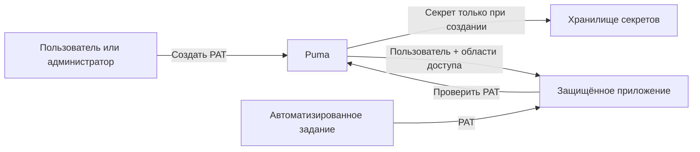

*Рисунок 15: Создание, хранение и использование PAT.*

### 8.2 Жизненный цикл

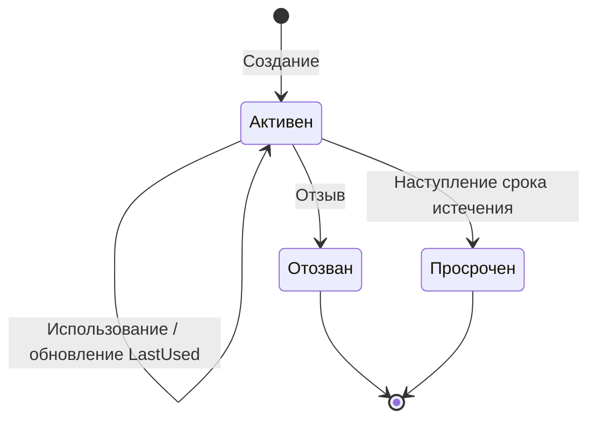

*Рисунок 16: Состояния жизненного цикла PAT.*

Токен действителен, если он существует, активен, не отозван и не просрочен.
Отозванные записи остаются видимыми в списке и отмечаются как неактивные.

### 8.3 Создание PAT

**Предусловие:** владелец или администратор вошёл в систему в рамках
сеанса.

1. Задать имя, отражающее назначение, например `CI Produktion Lesen`.
2. Указать целевого пользователя и ID продукта.
3. Выбрать только минимально необходимые области доступа.
4. По возможности задать дату истечения в формате ISO 8601.
5. Немедленно сохранить секрет в хранилище секретов.
6. Не копировать секрет в исходный код, журналы сборки или заявки.

Анонимные вызывающие стороны не могут создавать PAT. Обычный пользователь может
управлять собственными PAT, но не PAT других пользователей. Администраторы могут
управлять PAT других пользователей.

### 8.4 Использование PAT

Модель данных SDK различает `TokenType::Session` и
`TokenType::PersonalAccessToken`. Для неинтерактивного доступа PAT проверяется
с помощью `ValidatePersonalAccessToken()`; затем приложение использует
исключительно возвращённые области доступа и дополнительно проверяет контекст
продукта.

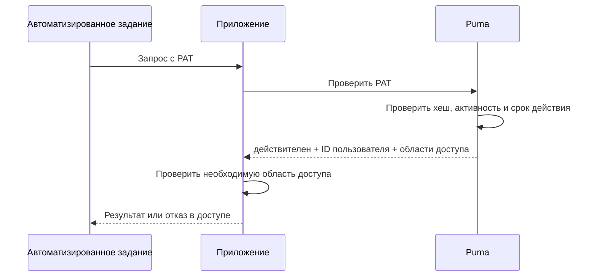

*Рисунок 17: Проверка PAT для автоматизированного доступа.*

### 8.5 Отзыв PAT

1. Идентифицировать токен по имени, продукту, времени создания и последнего
   использования.
2. Отозвать ID токена.
3. После этого проверка должна завершаться неудачей.
4. При подозрении на утечку секрета проверить зависимые системы и журналы.
5. Выпустить новый PAT с сокращённой областью доступа и новым сроком действия.

### 8.6 Известная особенность интерфейса

Текущий ответ проверки GraphQL возвращает ID пользователя и области доступа, но
не ID токена. Поэтому `ValidatePersonalAccessToken()` в настоящее время не может
восстановить `productId` в результате проверки. Система, выпускающая или
использующая токен, должна дополнительно знать и проверять контекст продукта.

## 9. Эксплуатация и безопасность

### 9.1 Обязанности

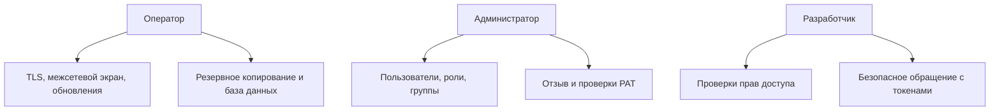

*Рисунок 18: Распределение эксплуатационной ответственности за безопасность.*

### 9.2 Регулярные проверки

- Удалять или блокировать пользователей, у которых больше нет актуальной рабочей необходимости.
- Проверять роли и группы в соответствии с принципом минимальных привилегий.
- Отзывать старые, никогда не использовавшиеся или просроченные PAT.
- Назначать права администратора персонально.
- Резервировать базу данных и настройки; проверять восстановление.
- Контролировать сроки действия сертификатов.
- Расследовать неудачные входы и необычное использование токенов.
- Поддерживать сервер и компоненты ImtCore/Puma в актуальном состоянии.

### 9.3 Резервное копирование и восстановление

Согласованная резервная копия должна включать как минимум базу данных и настройки
Puma. Сертификаты и ключи следует резервировать отдельно с особо строгой защитой.
После восстановления необходимо проверить миграции базы данных, вход, роли,
группы, обработку сеансов и проверку PAT в контролируемой
среде.

## 10. Диагностика ошибок

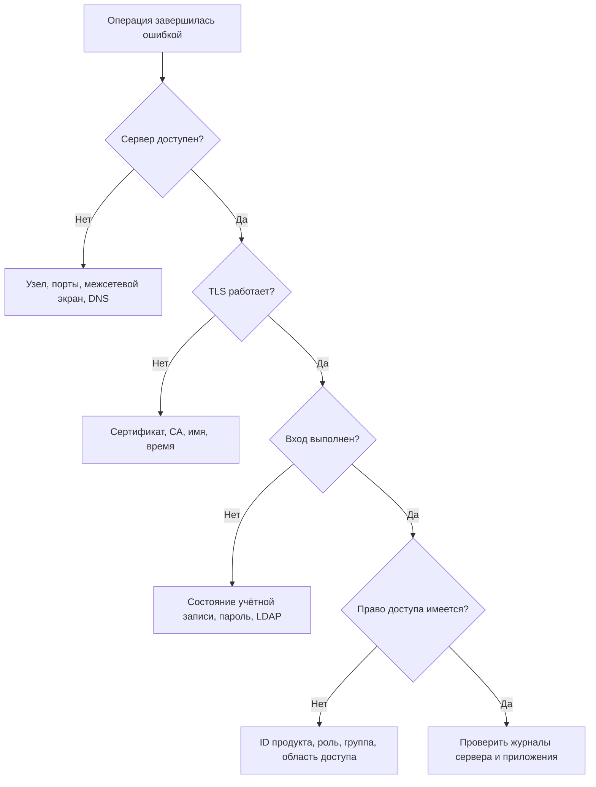

*Рисунок 19: Дерево решений для диагностики ошибок.*

| Проблема | Вероятная причина | Действие |
|---|---|---|
| В подключении отказано | Неверный узел/порт или сервер не запущен | Проверить порты HTTP и WS, а также процесс |
| Ошибка TLS | Сертификат не является доверенным или указано неверное имя | Проверить цепочку сертификатов, имя узла и время |
| Не удаётся войти | Учётные данные, состояние учётной записи или LDAP | Целенаправленно проверить способ аутентификации |
| `HasPermission()` остаётся `false` | Неверный ID продукта или отсутствует роль | Проверить ID продукта и эффективные роли |
| Операция с пользователем возвращает пустой ID | Имя входа уже существует или отсутствуют права | Проверить уникальность и права администратора |
| Создание PAT возвращает пустой секрет | Нет входа в систему, неверный владелец или пустые области доступа | Проверить сеанс, ID пользователя и области доступа |
| PAT недействителен | Отозван, просрочен или изменён | Проверить метаданные токена и выпустить новый |
| Настройки теряются | Отсутствуют права записи | Проверить путь и служебную учётную запись |

## 11. Контрольные списки приёмки

### Сервер

- [ ] Выбран подходящий вариант базы данных
- [ ] Подключение к базе данных и миграция выполнены успешно
- [ ] HTTPS и WSS с действительным сертификатом активны
- [ ] Порты и межсетевой экран задокументированы
- [ ] Резервное копирование и восстановление проверены
- [ ] Настроен мониторинг журналов

### Модель прав доступа

- [ ] Задан уникальный ID продукта
- [ ] ID прав доступа задокументированы
- [ ] Роли смоделированы по задачам, а не по людям
- [ ] Созданы группы для постоянных команд
- [ ] Настроены персональные учётные записи администраторов
- [ ] Выполнены негативные тесты для запрещённых действий

### LDAP

- [ ] Выполнены предварительные требования Windows и домена
- [ ] Проверен первый вход в домен
- [ ] SID и данные пользователя получены правильно
- [ ] Проверена роль по умолчанию
- [ ] LDAP отключён, если не требуется

### PAT

- [ ] Назначены области доступа по принципу минимальных привилегий
- [ ] Задан срок действия
- [ ] Секрет сохранён только в хранилище секретов
- [ ] Отзыв проверен
- [ ] Ротация и ответственное лицо задокументированы

## 12. Дополнительная документация

- [Справочник AuthClientSdk](../AuthClientSdk.md)
- [Справочник AuthServerSdk](../AuthServerSdk.md)
- [Зависимости](../Dependencies.md)
- [Политика безопасности Puma](../../SECURITY.md)
- [Краткая презентация](Puma_Kompakt_DE.pptx)

## 13. Интеграция для разработчиков

Приложение может интегрировать Puma двумя способами:

| Вариант | Подходит для | Абстракция |
|---|---|---|
| `AuthClientSdk` | приложений, которым нужен стабильный фасад C++ | `AuthClientSdk::CAuthorizationController` |
| Partitura | приложений ACF/ImtCore с авторизуемым сервером | `AuthorizableServerFramework.acc` из ImtCore |

В обоих вариантах приложению нужны адрес сервера Puma, уникальный ID продукта и
права доступа, определённые для продукта. ID продукта должен совпадать с
администрируемым приложением. Для промышленных подключений следует использовать
TLS.

### 13.1 Интеграция через SDK

1. Собрать `AuthClientSdk` и подключить его к приложению. Пример CMake в
   `Impl/AuthClientSdk/CMake/CMakeLists.txt` показывает необходимые зависимости
   Qt и ImtCore.
2. Подключить `AuthClientSdk/AuthClientSdk.h`.
3. Создать `CAuthorizationController`, с помощью `SetConnectionParam()` задать
   конечную точку HTTP/WebSocket и конфигурацию TLS, а затем с помощью
   `SetProductId()` задать контекст продукта.
4. Выполнить вход с помощью `Login()` и разблокировать функции только после
   успешной проверки `HasPermission()`.
5. Для страницы администрирования использовать операции с пользователями,
   ролями и группами того же фасада. Приложение на основании права
   администрирования решает, предлагать ли страницу в клиентском интерфейсе.
6. По завершении сеанса вызвать `Logout()`.

Минимальный пример на C++ приведён в
[UC-06](#uc-06-подключение-собственного-приложения); полный API описан в
[справочнике AuthClientSdk](../AuthClientSdk.md). В текущей сборке CMake SDK
подключается только в Windows.

### 13.2 Интеграция через Partitura

В `Partitura/ImtHttpServerVoce.arp/AuthorizableServerFramework.acc` ImtCore уже
предоставляет готовую базовую композицию для авторизуемого сервера. Она
объединяет, среди прочего, сервер HTTP и WebSocket, подключение к Puma, менеджер
аутентификации, а также кэши пользователей, ролей и групп. Приложению следует
использовать эту базу, а не воссоздавать компоненты по отдельности.

Интеграция выполняется в следующие шаги:

1. Объявить пакеты и реестры ImtCore в конфигурации ACF приложения.
2. Инстанцировать `AuthorizableServerFramework` из пакета `ImtHttpServerVoce`.
3. Подключить специфичные для приложения компоненты для сведений о приложении и
   версии, базы данных, подключения к Puma, серверных интерфейсов и
   конфигурации TLS через `Type="Reference"`. Собственные обработчики запросов
   подключаются как `Type="Factory"`.
4. Настроить ID продукта и подключение к центральному серверу Puma. ID продукта
   должен совпадать с приложением, администрируемым в Puma.
5. Соединить собственные обработчики GraphQL с фреймворком и встроить
   экспортируемые фреймворком серверы HTTP и WebSocket в контроллер сервера
   приложения.
6. После сборки проверить вход, проверку PAT и сеансов, а также разрешённые и
   запрещённые права доступа на тестовом экземпляре Puma.

`Impl/AuthServerSdk/AuthServerSdk.acc` показывает конкретную интеграцию этой
базовой композиции ImtCore. Вариант Partitura подключает её декларативно в
приложении, тогда как вариант SDK инкапсулирует интеграцию за фасадом C++.
