# Puma-användarhandbok

**Språk:** Svenska  
**Målgrupp:** Administratörer, applikationsutvecklare och driftansvariga

## 1. Syfte och omfattning

Puma är det centrala systemet för autentisering och behörighetshantering
för flera applikationer. Användare loggar in mot Puma; applikationerna
avgör utifrån behörigheterna som Puma tillhandahåller vilka funktioner
som ska aktiveras. Därmed behöver användare, roller och grupper inte
hanteras separat i varje applikation.

Den här handboken beskriver:

- Puma-servern med SQLite- eller PostgreSQL-databas,
- lokala användare, roller, grupper och produktrelaterade behörigheter,
- integrering av egna Qt/C++-applikationer via `AuthClientSdk`,
- integrering av egna servrar via `AuthServerSdk`,
- Windows-domäninloggning via LDAP-lagret som implementerats i ImtCore,
- Personal Access Tokens (PAT:er) för icke-interaktiv åtkomst,
- typiska drift-, säkerhets- och felsituationer.

Beskrivningen baseras på Puma och den underliggande
autentiseringsimplementeringen i ImagingTools/ImtCore. Den beskriver
de funktioner som finns i källkoden; specifika menynamn kan variera
beroende på det inbäddade administrationsgränssnittet.

## 2. Puma i korthet

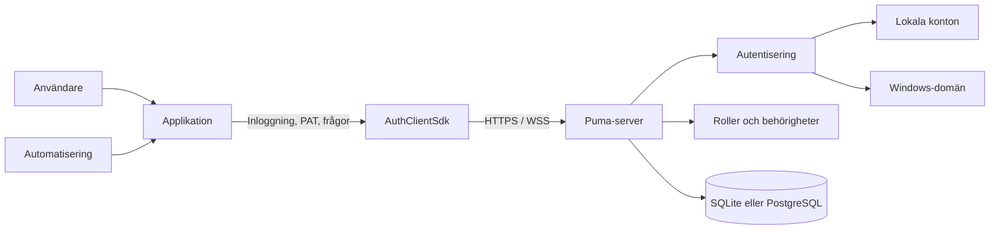

Puma skiljer mellan fyra uppgifter:

1. **Identitet:** Vem begär åtkomst?
2. **Autentisering:** Är den presenterade autentiseringsuppgiften giltig?
3. **Auktorisering:** Vilka produktrelaterade åtgärder är tillåtna?
4. **Persistens:** Var lagras användare, roller, grupper, sessioner och PAT:er?

### 2.1 Varianter av Puma-servern

| Variant | Databas | Typisk användning |
|---|---|---|
| `PumaServerSl` | SQLite | Fristående installation, utveckling, mindre lokal installation |
| `PumaServerPg` | PostgreSQL | Centraliserad fleranvändardrift och produktionsinstallation av servern |

Båda varianterna använder samma bas för Puma-servern. Respektive
serverapplikation inkluderar lämpliga repositories och SQL-skript för sin
databas.

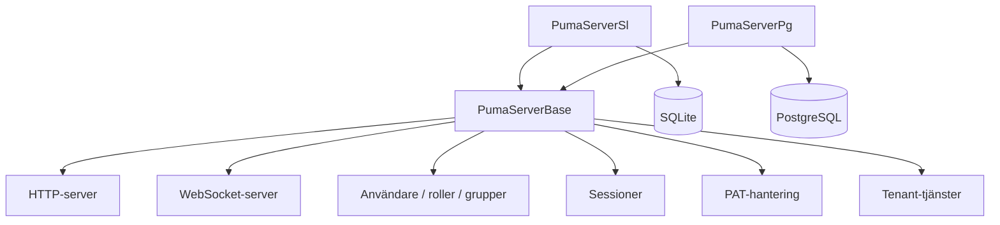

## 3. Roll- och behörighetsmodell

Puma hanterar inte behörigheter som fritt redigerbara egenskaper hos en
användare, utan genom roller:

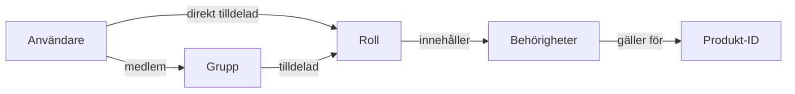

- **Användare** har ett internt, beständigt objekt-ID och ett inloggningsnamn.
- **Roller** samlar behörigheter och är produktspecifika.
- **Grupper** samlar användare och tilldelas roller.
- **Behörigheter** är skiftlägeskänsliga ID:n som definieras av applikationen.
- **Produkt-ID** avgränsar det sammanhang där roller och behörigheter gäller.

En användare får unionen av:

- behörigheter från direkt tilldelade roller och
- behörigheter från rollerna för användarens grupper.

> **Viktigt:** Administrativa åtgärder använder det interna användar-ID:t, inte
> inloggningsnamnet. En applikation anger sitt produkt-ID före inloggningen.

### 3.1 Rekommenderad administrationsmodell

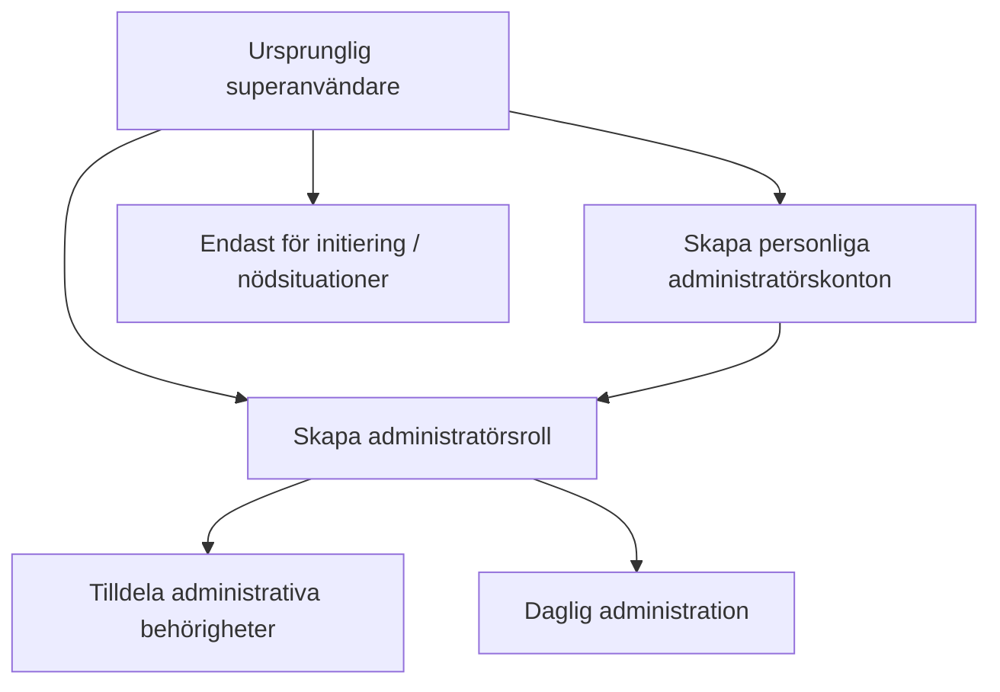

Superanvändaren används för den initiala konfigurationen. För den dagliga
driften bör individuella administratörskonton med en lämplig administratörsroll
användas. På så sätt behöver superanvändarens inloggningsuppgifter inte delas.

## 4. Driftsättning av Puma-servern

### 4.1 Förberedelser

1. Välj servervariant.
2. Förbered databas, databasanvändare och databasåtkomst för PostgreSQL.
3. Ange HTTP- och WebSocket-port.
4. Tillhandahåll ett servercertifikat och en privat nyckel för produktionssystem.
5. Öppna endast de portar som behövs i brandväggen.
6. Kontrollera skrivbehörighet för inställningar, databas och loggar.

De beständiga Puma-inställningarna lagras som standard under den
applikationsspecifika systemsökvägen i
`Puma/Puma Server/PumaServerSettings.xml`.

### 4.2 Startförlopp

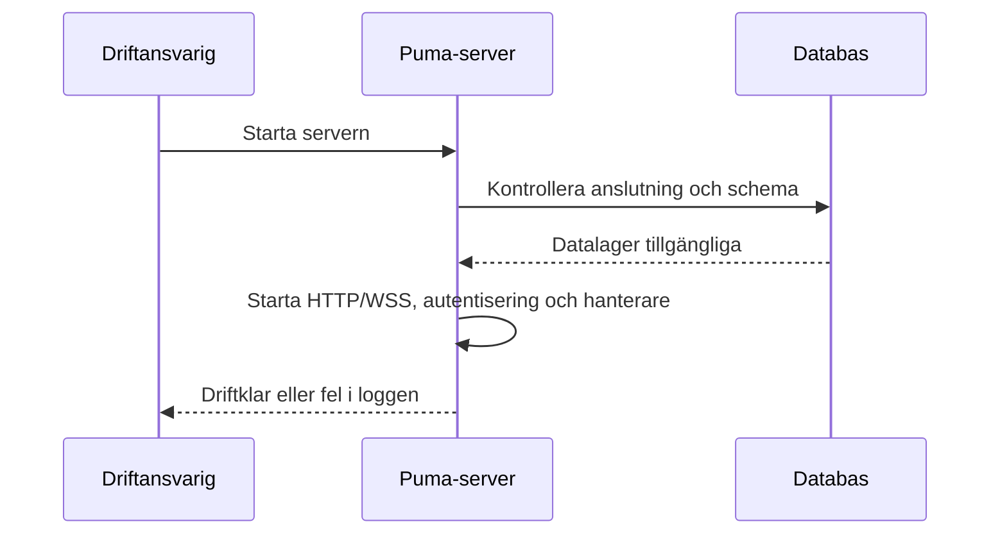

Efter starten ska framför allt följande kontrolleras:

- databasanslutningen lyckades,
- HTTP- och WebSocket-porten är bundna,
- certifikat och nyckel har lästs in,
- inga fel i migreringar eller datalager förekommer,
- klienten kan nå servern.

### 4.3 Initial konfiguration

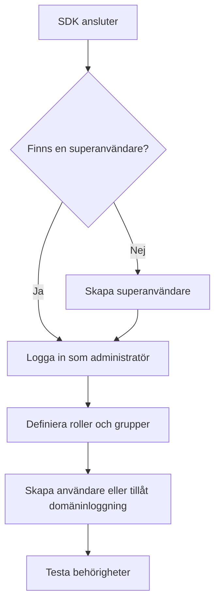

SDK-förloppet består av `SuperuserExists()`, vid behov
`CreateSuperuser()`, därefter inloggning och uppbyggnad av rollmodellen. Puma-
testerna använder inloggningsnamnet `su` för det initiala kontot; i produktion
måste andra, säkra inloggningsuppgifter väljas och förvaras säkert.

### 4.4 Transportkryptering

Puma använder separata portar för HTTP(S) och WebSocket(S). Så snart klienter
ansluter utanför en isolerad utvecklingsdator ska HTTPS och WSS användas.

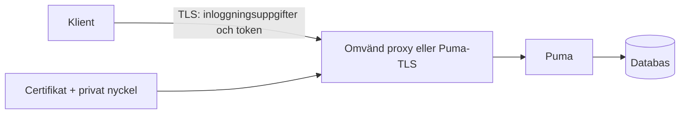

Produktionsregler:

- Använd TLS 1.2 eller senare.
- Inaktivera inte certifikatverifiering.
- Gör den privata nyckeln läsbar endast för serverprocessen.
- Lagra inte lösenfraser i källkod eller presentationer.
- Använd HTTP/WS utan TLS endast i kontrollerade testmiljöer.

## 5. Detaljerade användningsfall

### UC-01: Skapa en lokal användare och tilldela behörigheter

**Aktör:** Administratör  
**Förutsättning:** Administratören är inloggad och har de nödvändiga
administrativa behörigheterna.

1. Skapa användaren med visningsnamn, unikt inloggningsnamn, initialt lösenord
   och e-postadress.
2. Hämta det interna användar-ID:t från resultatet.
3. Tilldela en befintlig roll eller skapa först en roll.
4. Lägg eventuellt till användaren i en grupp.
5. Användaren loggar in.
6. Applikationen kontrollerar de förväntade behörigheterna.

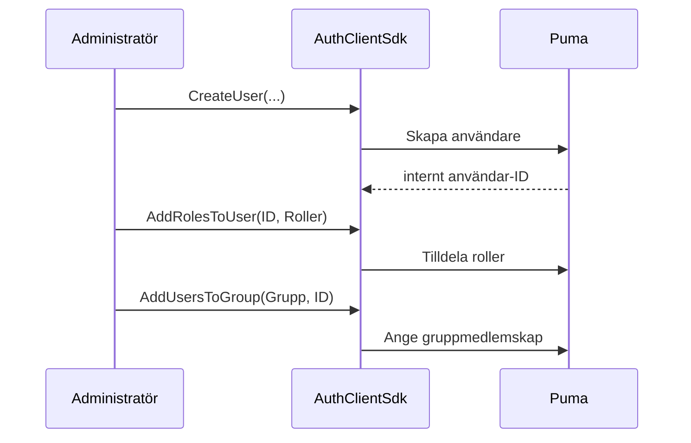

**Resultat:** Användaren får behörigheter från direkt tilldelade roller och
grupproller. En användare som redan är inloggad kan behöva logga in igen
så att applikationen får uppdaterade sessionsbehörigheter.

### UC-02: Hantera ett team genom en grupp

**Aktör:** Administratör

1. Skapa en verksamhetsroll med de behörigheter som behövs.
2. Skapa en grupp för teamet eller avdelningen.
3. Tilldela rollen till gruppen.
4. Lägg till användare i gruppen.
5. Ta bort användare från gruppen när de lämnar teamet.

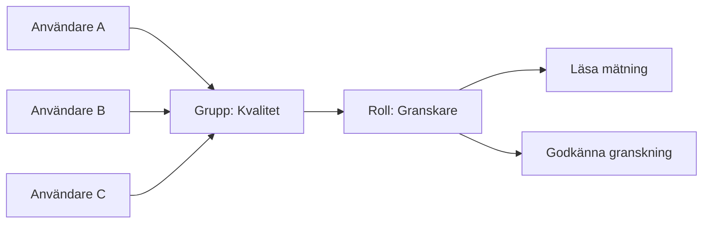

**Fördel:** Rolländringar slår igenom centralt för alla gruppmedlemmar.

### UC-03: Inloggning och funktionsbaserad åtkomst

**Aktör:** Slutanvändare

1. Applikationen konfigurerar anslutning och produkt-ID.
2. Användaren anger inloggningsnamn och lösenord.
3. Puma validerar inloggningsuppgifterna.
4. Puma skapar en session och returnerar token, användarnamn, produkt-ID och
   behörigheter.
5. Applikationen aktiverar endast tillåtna funktioner.
6. Vid utloggning ogiltigförklarar Puma sessionen.

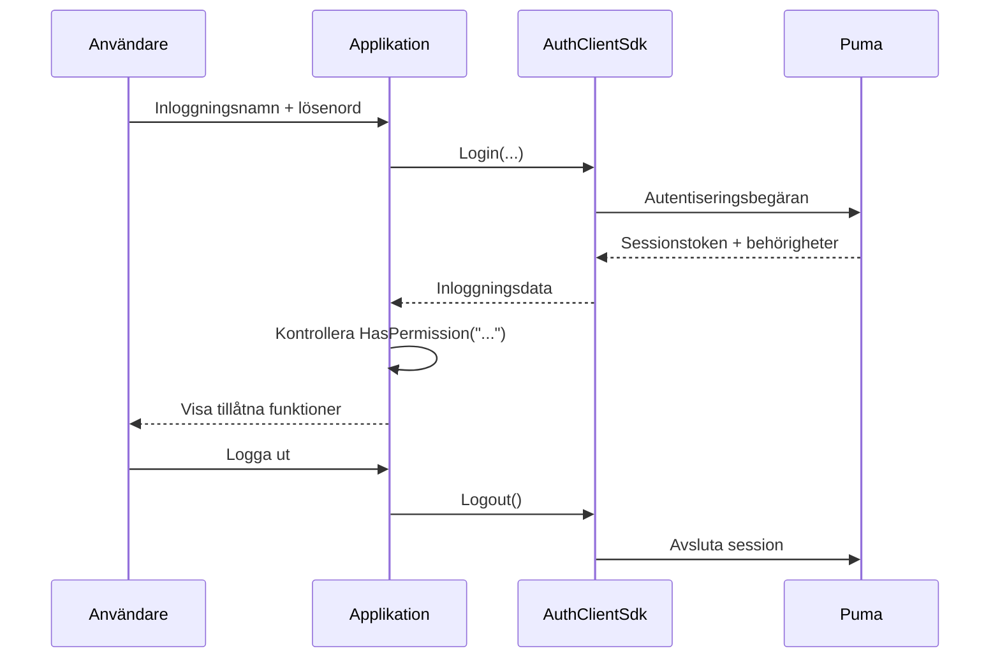

Fel på grund av ogiltiga inloggningsuppgifter, låst konto, saknad anslutning
eller saknade serverkomponenter rapporteras som misslyckad inloggning.

### UC-04: Behörighetsändring

1. Administratören ändrar roll- eller grupptilldelningen.
2. Applikationen avslutar den gamla sessionen eller begär en ny inloggning.
3. Användaren loggar in igen.
4. Applikationen bygger upp sitt gränssnitt utifrån de nya behörigheterna.

Att dölja en knapp ersätter inte en kontroll på serversidan. Varje
skyddsvärd serveråtgärd måste validera behörigheten på nytt.

### UC-05: Inaktivera eller ta bort en användare

Det befintliga klient-SDK:t tillhandahåller `RemoveUser()` för permanent
borttagning. Innan en användare tas bort ska verksamhetens krav på lagring
och revision kontrolleras. Roll- och grupptilldelningar tas bort tillsammans
med användaren. För en tillfällig spärr ska kontostatusfunktionen i det
aktuella administrationsgränssnittet användas; i annat fall ska åtkomsten
återkallas genom ändrade rolltilldelningar och sessionshantering.

### UC-06: Ansluta en egen applikation

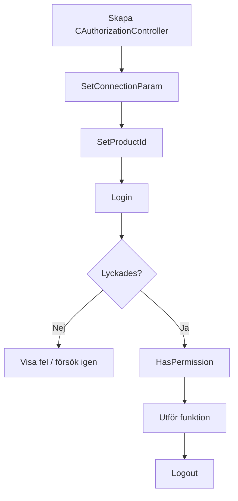

Den minsta sekvensen i C++-klienten är:

```cpp
AuthClientSdk::CAuthorizationController auth;

AuthClientSdk::ServerConfig server;
server.host = "puma.example.org";
server.httpPort = 443;
server.wsPort = 8443;
server.sslConfig = AuthClientSdk::SslConfig{};

auth.SetConnectionParam(server);
auth.SetProductId("MeineAnwendung");

AuthClientSdk::Login session;
if (auth.Login(login, password, session) &&
    auth.HasPermission("messung.lesen")) {
    // Aktivera skyddad funktion.
}
auth.Logout();
```

Säkerhetsrelevanta anvisningar:

- Överför lösenord endast via TLS.
- Logga inte sessionstoken.
- `Login()` avslutar automatiskt en tidigare session för kontrollern.
- Anropa `Logout()` uttryckligen; destruktorn försöker dessutom logga ut efter
  bästa förmåga.
- Kör inte `Login()` och `Logout()` parallellt på samma kontroller.

### UC-07: Ansluta en egen server med auktorisering

`AuthServerSdk::CAuthorizableServer` är avsedd för serverapplikationer som
tillhandahåller egna slutpunkter men använder Puma som central
auktoriseringsinstans.

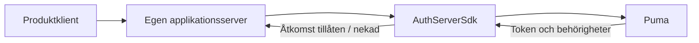

Applikationsservern anger:

1. sitt produkt-ID,
2. anslutningen till den centrala Puma-servern,
3. sina egna HTTP-/WebSocket-portar,
4. eventuellt en feature-fil och TLS-konfiguration,
5. därefter `Start()` och vid avstängning `Stop()`.

## 6. SDK-lager

### 6.1 AuthClientSdk

Fasaden `AuthClientSdk::CAuthorizationController` erbjuder:

| Område | Centrala åtgärder |
|---|---|
| Anslutning | `SetConnectionParam()`, `SetProductId()` |
| Session | `Login()`, `Logout()`, `GetToken()` |
| Auktorisering | `HasPermission()`, `GetTokenPermissions()` |
| Initiering | `SuperuserExists()`, `CreateSuperuser()` |
| Användare | Lista, läsa, skapa, ta bort, ändra lösenord |
| Roller | Lista, läsa, skapa, ta bort, tilldela behörigheter |
| Grupper | Lista, läsa, skapa, ta bort, tilldela användare/roller |
| PAT | Skapa, lista, validera och återkalla |

`ServerConfig` innehåller värd, HTTP-port, WebSocket-port och valfria
TLS-inställningar. Roller och behörigheter är knutna till applikationen som
konfigurerats med `SetProductId()`.

### 6.2 AuthServerSdk

Server-SDK:t kapslar in en HTTP-/WebSocket-server med auktorisering. Dess
nätverksanslutning till Pumas backend är åtskild från portarna där den egna
servern betjänar klienter. Vid distribuerade installationer måste därför
båda anslutningsriktningarna konfigureras och säkras.

### 6.3 UI-komponenter

Puma innehåller widgetkomponenter respektive QML-komponenter för inloggning och
administration. De bygger på samma autentiserings- och
administrationsgränssnitt. Ett eget gränssnitt får inte ersätta
behörighetskontrollerna på serversidan.

## 7. LDAP-/Windows-domäninloggning

### 7.1 Så fungerar det

Den aktuella ImtCore-implementeringen använder Windows-domänfunktionerna
i Windows, särskilt kontrollen via `LogonUser`.
Den är därmed avsedd för Windows-/Active Directory-miljöer och är inte en
allmänt konfigurerbar OpenLDAP-klient.

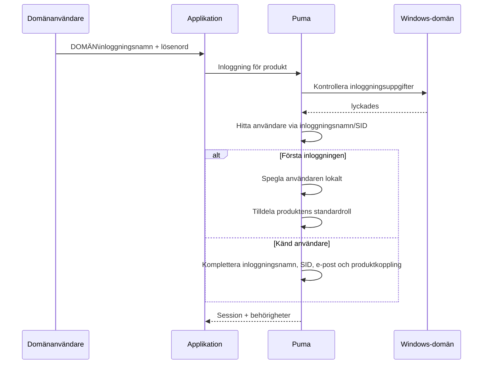

Vid en lyckad första domäninloggning:

- skapar Puma en intern användarpost,
- markeras autentiseringssystemet som `LDAP`,
- hämtas SID, visningsnamn och e-post i den mån de är tillgängliga,
- skapas vid behov de produktrelaterade rollerna `Guest` och `Default`,
- tilldelas användaren produktens standardroll.

Därefter kan administratörer tilldela den speglade användaren ytterligare
Puma-roller och grupper. Lösenordet kontrolleras även fortsättningsvis mot
Windows-domänen.

### 7.2 Aktivering och inaktivering

`LdapEnabled` är aktiverat i Pumas standardinställning och finns under
inställningsområdet **LDAP**. Om endast lokala Puma-konton används
bör funktionen inaktiveras för att undvika onödiga domänkontroller och
missvisande meddelanden.

### 7.3 Förutsättningar

- Puma körs i Windows.
- Servern kan nå domänen och en domänkontrollant.
- Operativsystemet, DNS och förtroenderelationen är korrekt konfigurerade.
- Användaren använder ett inloggningsnamn som accepteras av Windows, vanligtvis
  `DOMÄNE\benutzer`.
- LDAP är aktiverat i Puma.

### 7.4 Felsökning

| Symptom | Kontroll |
|---|---|
| Domäninloggning misslyckas, lokal inloggning fungerar | Kontrollera domänåtkomst, DNS, klockslag, inloggningsformat och `LdapEnabled` |
| Användaren skapas dubbelt | Kontrollera enhetligt inloggningsformat och SID-matchning |
| Användaren har för få rättigheter efter första inloggningen | Kontrollera standardrollen och ytterligare roll-/grupptilldelning |
| Lokala inloggningar skapar domänfel i loggen | Inaktivera LDAP om det inte behövs |
| Linux-server autentiserar inte mot AD | Den aktuella implementeringen är Windows-specifik |

## 8. Personal Access Tokens (PAT)

### 8.1 Användning

PAT:er är långlivade autentiseringsuppgifter för automatisering, CI/CD,
övervakningstjänster och kommunikation mellan tjänster. En PAT tillhör en
användare, innehåller ett produkt-ID och explicita behörighetsomfång.

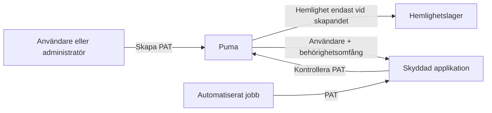

### 8.2 Livscykel

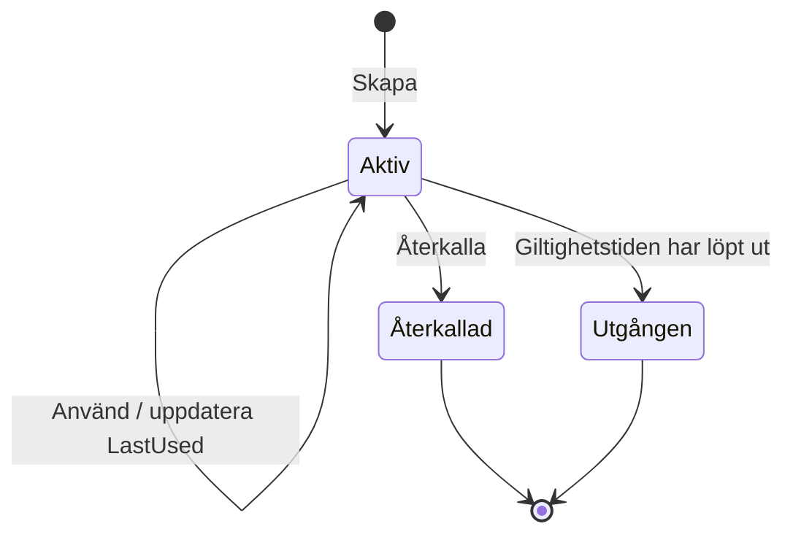

En token är giltig om den finns, är aktiv, inte har återkallats och inte har
löpt ut. Återkallade poster förblir synliga i listan och rapporteras som
inaktiva.

### 8.3 Skapa PAT

**Förutsättning:** Ägaren eller en administratör är inloggad med en
session.

1. Ange ett namn som beskriver syftet, till exempel `CI Produktion Lesen`.
2. Ange målanvändare och produkt-ID.
3. Välj endast de behörighetsomfång som är absolut nödvändiga.
4. Ange om möjligt ett utgångsdatum i ISO 8601-format.
5. Spara omedelbart hemligheten i ett hemlighetslager.
6. Kopiera inte hemligheten till källkod, byggloggar eller ärenden.

Anonyma anropare får inte skapa PAT:er. En vanlig användare kan
hantera sina egna PAT:er, men inte andra användares PAT:er. Administratörer
kan hantera andra användares PAT:er.

### 8.4 Använda PAT

SDK-datamodellen skiljer mellan `TokenType::Session` och
`TokenType::PersonalAccessToken`. För icke-interaktiv åtkomst kontrolleras
PAT:en via `ValidatePersonalAccessToken()`; applikationen använder därefter
enbart de returnerade behörighetsomfången och kontrollerar dessutom
produktkontexten.

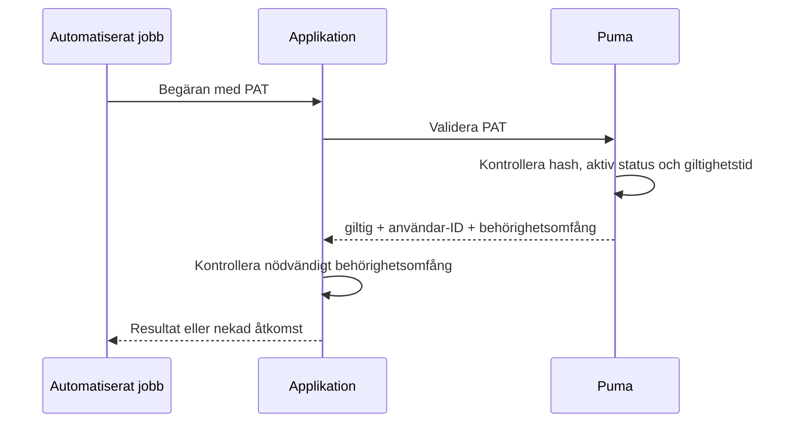

### 8.5 Återkalla PAT

1. Identifiera tokenen utifrån namn, produkt, tidpunkt för skapande och senaste
   användning.
2. Återkalla token-ID:t.
3. Valideringen måste därefter misslyckas.
4. Kontrollera beroende system och loggar vid misstänkt läckage av hemligheten.
5. Utfärda en ersättnings-PAT med snävare behörighetsomfång och nytt
   utgångsdatum.

### 8.6 Känd egenskap hos gränssnittet

Det aktuella GraphQL-valideringssvaret returnerar användar-ID och
behörighetsomfång,
men inte token-ID. Därför kan `ValidatePersonalAccessToken()` för närvarande
inte återskapa `productId` i valideringsresultatet. Produktkontexten måste
dessutom vara känd och kontrolleras av det utfärdande respektive konsumerande
systemet.

## 9. Drift och säkerhet

### 9.1 Ansvarsområden

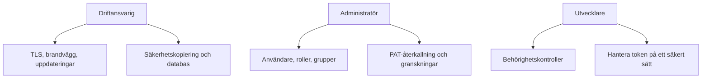

### 9.2 Regelbundna kontroller

- Ta bort eller spärra användare utan aktuellt verksamhetsbehov.
- Kontrollera roller och grupper enligt principen om minsta privilegium.
- Återkalla gamla, aldrig använda eller utgångna PAT:er.
- Tilldela administratörsrättigheter till namngivna personer.
- Säkerhetskopiera databas och inställningar; testa återställningen.
- Övervaka certifikatens utgångsdatum.
- Undersök misslyckade inloggningar och ovanlig tokenanvändning.
- Håll servern och ImtCore-/Puma-komponenterna uppdaterade.

### 9.3 Säkerhetskopiering och återställning

En konsistent säkerhetskopia omfattar minst databasen och Puma-inställningarna.
Certifikat och nycklar ska säkerhetskopieras separat med särskilt starkt skydd.
Efter en återställning ska databasmigreringar, inloggning, roller,
grupper, sessionshantering och PAT-validering testas i en kontrollerad
miljö.

## 10. Feldiagnostik

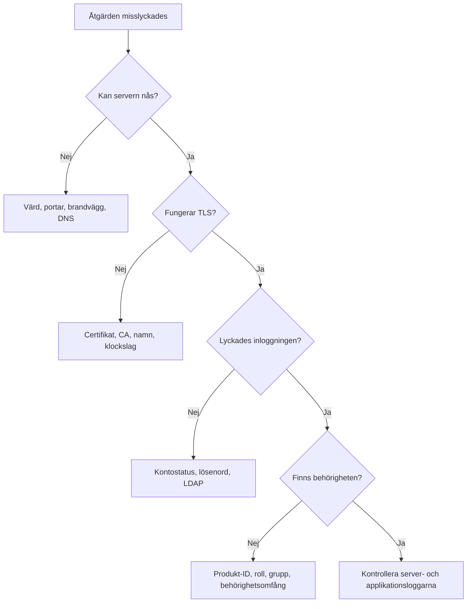

| Problem | Trolig orsak | Åtgärd |
|---|---|---|
| Anslutningen nekas | Fel värd/port eller servern har inte startats | Kontrollera HTTP- och WS-port samt process |
| TLS-fel | Certifikatet är inte betrott eller namnet är fel | Kontrollera certifikatkedja, värdnamn och klockslag |
| Inloggningen misslyckas | Inloggningsuppgifter, kontostatus eller LDAP | Kontrollera autentiseringsvägen specifikt |
| `HasPermission()` förblir `false` | Fel produkt-ID eller roll saknas | Kontrollera produkt-ID och effektiva roller |
| Användaråtgärden returnerar tomt ID | Inloggningsnamnet finns redan eller rättigheter saknas | Kontrollera unikhet och administratörsrättigheter |
| PAT-skapandet returnerar en tom hemlighet | Inte inloggad, fel ägare eller tomma behörighetsomfång | Kontrollera session, användar-ID och behörighetsomfång |
| PAT:en är ogiltig | Återkallad, utgången eller ändrad | Kontrollera tokenmetadata och utfärda en ny |
| Inställningarna går förlorade | Skrivbehörighet saknas | Kontrollera sökväg och tjänstekonto |

## 11. Checklistor för godkännande

### Server

- [ ] Lämplig databasvariant har valts
- [ ] Databasanslutning och migrering har lyckats
- [ ] HTTPS och WSS är aktiva med giltigt certifikat
- [ ] Portar och brandvägg är dokumenterade
- [ ] Säkerhetskopiering och återställning har testats
- [ ] Loggövervakning har konfigurerats

### Behörighetsmodell

- [ ] Unikt produkt-ID har angetts
- [ ] Behörighets-ID:n är dokumenterade
- [ ] Roller har modellerats efter uppgifter i stället för personer
- [ ] Grupper har skapats för återkommande team
- [ ] Personliga administratörskonton har konfigurerats
- [ ] Negativa tester för nekade åtgärder har genomförts

### LDAP

- [ ] Windows- och domänförutsättningarna är uppfyllda
- [ ] Den första domäninloggningen har testats
- [ ] SID och användardata har överförts korrekt
- [ ] Standardrollen har kontrollerats
- [ ] LDAP har inaktiverats om det inte behövs

### PAT

- [ ] Behörighetsomfång enligt principen om minsta privilegium har tilldelats
- [ ] Utgångsdatum har angetts
- [ ] Hemligheten har endast lagrats i ett hemlighetslager
- [ ] Återkallning har testats
- [ ] Rotation och ansvarig person är dokumenterade

## 12. Ytterligare dokumentation

- [AuthClientSdk-referens](../AuthClientSdk.md)
- [AuthServerSdk-referens](../AuthServerSdk.md)
- [Beroenden](../Dependencies.md)
- [Pumas säkerhetspolicy](../../SECURITY.md)
- [Kompakt presentation](Puma_Kompakt_DE.pptx)
