# Puma-användarhandbok

**Språk:** Svenska  
**Målgrupp:** Administratörer och driftansvariga

## 1. Syfte och omfattning

Puma är det centrala systemet för autentisering och behörighetshantering
för flera applikationer. Användare loggar in mot Puma; applikationerna
avgör utifrån behörigheterna som Puma tillhandahåller vilka funktioner
som ska aktiveras. Därmed behöver användare, roller och grupper inte
hanteras separat i varje applikation.

Den här handboken beskriver:

- Puma-servern med SQLite- eller PostgreSQL-databas,
- lokala användare, roller, grupper och produktrelaterade behörigheter,
- integrering av egna Qt/C++-applikationer via `AuthClientSdk`,
- integrering av egna servrar via `AuthServerSdk`,
- Windows-domäninloggning via LDAP-lagret som implementerats i ImtCore,
- Personal Access Tokens (PAT:er) för icke-interaktiv åtkomst,
- lösenordspolicy, kontostatus och spärr efter misslyckade försök,
- typiska drift-, säkerhets- och felsituationer.

Beskrivningen baseras på Puma och den underliggande
autentiseringsimplementeringen i ImagingTools/ImtCore. Den beskriver
de funktioner som finns i källkoden; specifika menynamn kan variera
beroende på det inbäddade administrationsgränssnittet.

## 2. Puma i korthet

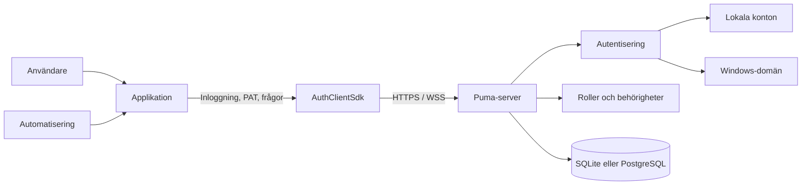
```mermaid
flowchart LR
    U[Användare] --> A[Applikation]
    S[Automatisering] --> A
    A -->|Inloggning, PAT, frågor| SDK[AuthClientSdk]
    SDK -->|HTTPS / WSS| PS[Puma-server]
    PS --> AUTH[Autentisering]
    PS --> RBAC[Roller och behörigheter]
    PS --> DB[(SQLite eller PostgreSQL)]
    AUTH --> LOCAL[Lokala konton]
    AUTH --> AD[Windows-domän]
```

*Figur 1: Översikt över Pumas systemarkitektur.*

Puma skiljer mellan fyra uppgifter:

1. **Identitet:** Vem begär åtkomst?
2. **Autentisering:** Är den presenterade autentiseringsuppgiften giltig?
3. **Auktorisering:** Vilka produktrelaterade åtgärder är tillåtna?
4. **Persistens:** Var lagras användare, roller, grupper, sessioner och PAT:er?

### 2.1 Varianter av Puma-servern

| Variant | Databas | Typisk användning |
|---|---|---|
| `PumaServerSl` | SQLite | Fristående installation, utveckling, mindre lokal installation |
| `PumaServerPg` | PostgreSQL | Centraliserad fleranvändardrift och produktionsinstallation av servern |

Båda varianterna använder samma bas för Puma-servern. Respektive
serverapplikation inkluderar lämpliga repositories och SQL-skript för sin
databas.

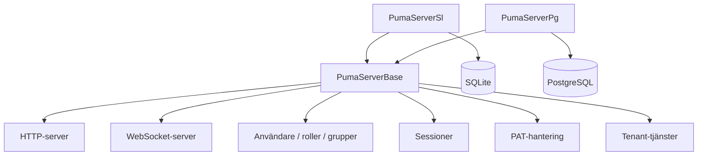
```mermaid
flowchart TB
    BASE[PumaServerBase] --> HTTP[HTTP-server]
    BASE --> WS[WebSocket-server]
    BASE --> USERS[Användare / roller / grupper]
    BASE --> SESS[Sessioner]
    BASE --> PAT[PAT-hantering]
    BASE --> TEN[Tenant-tjänster]
    SL[PumaServerSl] --> BASE
    PG[PumaServerPg] --> BASE
    SL --> SQL[(SQLite)]
    PG --> POST[(PostgreSQL)]
```

*Figur 2: Gemensam serverbas och databasspecifika varianter.*

### 2.2 Samspel mellan Puma och applikationen

Applikationen bäddar in Puma-administrationen som en sida i sitt klient-UI. På
den här administrationssidan konfigurerar behöriga administratörer användare,
roller, grupper och behörighetstilldelningar. Sidan når Puma-servern via SDK:t;
data hanteras inte separat i applikationen. Efter inloggningen returnerar Puma
de effektiva behörigheterna till applikationen. Applikationen använder dem för
att aktivera funktioner i sitt verksamhets-UI.

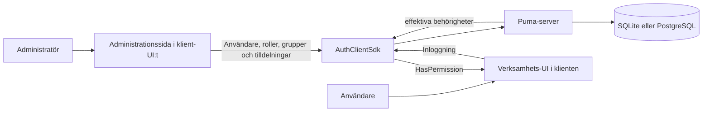
```mermaid
flowchart LR
    ADM[Administratör] --> PAGE[Administrationssida i klient-UI:t]
    PAGE -->|Användare, roller, grupper och tilldelningar| SDK[AuthClientSdk]
    SDK --> P[Puma-server]
    P --> DB[(SQLite eller PostgreSQL)]
    USER[Användare] --> UI[Verksamhets-UI i klienten]
    UI -->|Inloggning| SDK
    P -->|effektiva behörigheter| SDK
    SDK -->|HasPermission| UI
```

*Figur 3: Central administration och användning av behörigheterna i
applikationen.*

Att bädda in och behörighetsberoende visa administrationssidan är applikationens
uppgift. Puma tillämpar fortfarande behörigheterna för administrativa åtgärder;
att enbart dölja sidan är ingen åtkomstkontroll.

## 3. Roll- och behörighetsmodell

Puma hanterar inte behörigheter som fritt redigerbara egenskaper hos en
användare, utan genom roller:

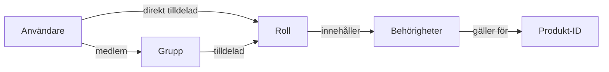
```mermaid
flowchart LR
    U[Användare] -->|direkt tilldelad| R[Roll]
    U -->|medlem| G[Grupp]
    G -->|tilldelad| R
    R -->|innehåller| P[Behörigheter]
    P -->|gäller för| PROD[Produkt-ID]
```

*Figur 4: Relationer mellan användare, grupper, roller och behörigheter.*

- **Användare** har ett internt, beständigt objekt-ID och ett inloggningsnamn.
- **Roller** samlar behörigheter och är produktspecifika.
- **Grupper** samlar användare och tilldelas roller.
- **Behörigheter** är skiftlägeskänsliga ID:n som definieras av applikationen.
- **Produkt-ID** avgränsar det sammanhang där roller och behörigheter gäller.

En användare får unionen av:

- behörigheter från direkt tilldelade roller och
- behörigheter från rollerna för användarens grupper.

Vid flera direkta roller, flera grupper eller flera roller per grupp förenas
alla ingående behörigheter. Dubbletter av behörigheter får verkan endast en
gång; en tilldelning drar inte bort någon behörighet från en annan tilldelning.

> **Viktigt:** Administrativa åtgärder använder det interna användar-ID:t, inte
> inloggningsnamnet. En applikation anger sitt produkt-ID före inloggningen.

Administrationssidan läser och skriver roller och behörigheter enbart i
kontexten för det aktuella produkt-ID:t. Om en användare har behörigheter i
flera produkter förblir tilldelningarna för övriga produkter oförändrade när
användaren sparas.

### 3.1 Obligatoriska och valfria element

| Element | Obligatoriskt eller valfritt? |
|---|---|
| Produkt-ID | **Obligatoriskt:** Applikationen anger det före inloggningen; roller och behörigheter gäller i detta produktsammanhang. |
| Behörighets-ID | **Obligatoriskt för skyddade funktioner:** Applikationen definierar och kontrollerar det. |
| Roll | **Obligatoriskt för att tilldela en behörighet:** Behörigheter tilldelas via roller och inte direkt till användare. En användare får finnas utan roll men har då ingen rollbaserad behörighet. |
| Direkt rolltilldelning | **Valfritt:** Lämpligt för individuella uppgifter. |
| Grupp | **Valfritt:** Lämpligt för att samla återkommande teamtilldelningar. |
| Grupproll | **Valfritt:** Alternativ eller komplement till direkt rolltilldelning. |
| Flera roller eller grupper | **Valfritt:** Deras behörigheter bildar tillsammans unionen. |

### 3.2 Rekommenderad administrationsmodell

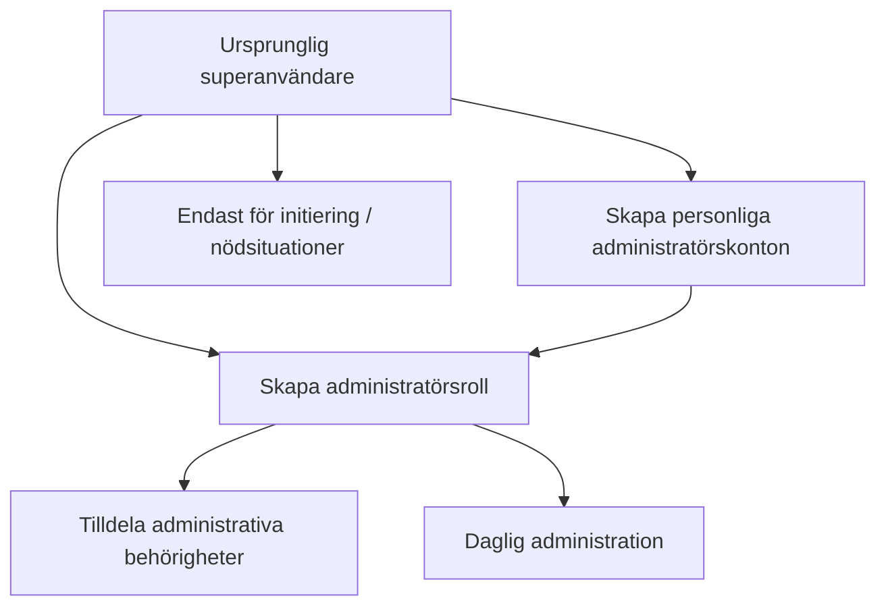
```mermaid
flowchart TD
    SU[Ursprunglig superanvändare] --> AR[Skapa administratörsroll]
    AR --> AP[Tilldela administrativa behörigheter]
    SU --> AU[Skapa personliga administratörskonton]
    AU --> AR
    AR --> DAILY[Daglig administration]
    SU --> EMG[Endast för initiering / nödsituationer]
```

*Figur 5: Rekommenderad modell för initiering och daglig administration.*

Superanvändaren används för den initiala konfigurationen. För den dagliga
driften bör individuella administratörskonton med en lämplig administratörsroll
användas. På så sätt behöver superanvändarens inloggningsuppgifter inte delas.

## 4. Driftsättning av Puma-servern

### 4.1 Förberedelser

1. Välj servervariant.
2. Förbered PostgreSQL-databas, databasanvändare och databasåtkomst för
   `PumaServerPg`.
3. För `PumaServerSl` krävs ingen separat databasserver och ingen förberedelse
   av databasen. Servern skapar SQLite-databasen; tjänstekontot behöver
   skrivbehörighet på den avsedda lagringsplatsen.
4. Ange HTTP- och WebSocket-port.
5. Tillhandahåll ett servercertifikat och en privat nyckel för produktionssystem.
6. Öppna endast de portar som behövs i brandväggen.
7. Kontrollera skrivbehörighet för inställningar, databas och loggar.

De beständiga Puma-inställningarna lagras som standard under den
applikationsspecifika systemsökvägen i
`Puma/Puma Server/PumaServerSettings.xml`.

### 4.2 Startförlopp

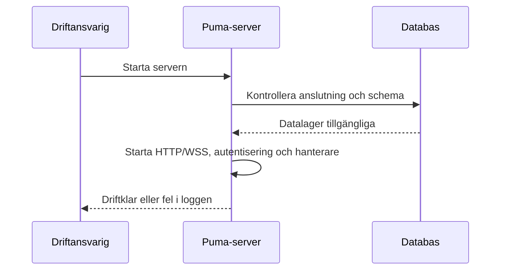
```mermaid
sequenceDiagram
    participant O as Driftansvarig
    participant P as Puma-server
    participant D as Databas
    O->>P: Starta servern
    P->>D: Kontrollera anslutning och schema
    D-->>P: Datalager tillgängliga
    P->>P: Starta HTTP/WSS, autentisering och hanterare
    P-->>O: Driftklar eller fel i loggen
```

*Figur 6: Tekniskt startförlopp för Puma-servern.*

Efter starten ska framför allt följande kontrolleras:

- databasanslutningen lyckades,
- HTTP- och WebSocket-porten är bundna,
- certifikat och nyckel har lästs in,
- inga fel i migreringar eller datalager förekommer,
- klienten kan nå servern.

### 4.3 Initial konfiguration

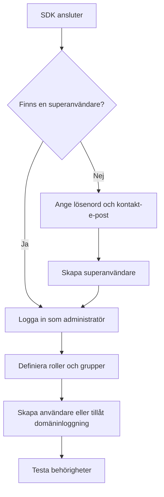
```mermaid
flowchart TD
    A[SDK ansluter] --> B{Finns en superanvändare?}
    B -->|Nej| C[Ange lösenord och kontakt-e-post]
    C --> H[Skapa superanvändare]
    B -->|Ja| D[Logga in som administratör]
    H --> D
    D --> E[Definiera roller och grupper]
    E --> F[Skapa användare eller tillåt domäninloggning]
    F --> G[Testa behörigheter]
```

*Figur 7: Initial konfiguration från superanvändare till behörighetstest.*

SDK-förloppet består av `SuperuserExists()`, vid behov
`CreateSuperuser()`, därefter inloggning och uppbyggnad av rollmodellen. Vid
initieringen anges superanvändarens lösenord och dess kontakt-e-post.
`CreateSuperuser()` tar över lösenordet; kontakt-e-posten konfigureras i
klientkompositionen som `SuperuserMail` för `RemoteSuperuserController` och
överförs vid skapandet. Puma-testerna använder inloggningsnamnet `su` för det
initiala kontot; inloggningsuppgifter för produktion och en nåbar kontakt-e-post
måste väljas säkert och förvaras säkert. Superanvändarens lösenord omfattas
redan av lösenordspolicyn i [avsnitt 9.4](#94-lösenordspolicy).

### 4.4 Transportkryptering

Puma använder separata portar för HTTP(S) och WebSocket(S). Så snart klienter
ansluter utanför en isolerad utvecklingsdator ska HTTPS och WSS användas.

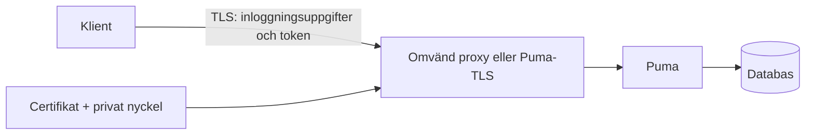
```mermaid
flowchart LR
    C[Klient] -->|TLS: inloggningsuppgifter och token| RP[Omvänd proxy eller Puma-TLS]
    RP --> P[Puma]
    P --> D[(Databas)]
    CERT[Certifikat + privat nyckel] --> RP
```

*Figur 8: TLS-skyddad transport mellan klienten och Puma.*

Produktionsregler:

- Använd TLS 1.2 eller senare.
- Inaktivera inte certifikatverifiering.
- Gör den privata nyckeln läsbar endast för serverprocessen.
- Lagra inte lösenfraser i källkod eller presentationer.
- Använd HTTP/WS utan TLS endast i kontrollerade testmiljöer.

## 5. Detaljerade användningsfall

### UC-01: Skapa en lokal användare och tilldela behörigheter

**Aktör:** Administratör  
**Förutsättning:** Administratören är inloggad och har de nödvändiga
administrativa behörigheterna.

1. Skapa användaren med visningsnamn, unikt inloggningsnamn, initialt lösenord
   och e-postadress.
2. Hämta det interna användar-ID:t från resultatet.
3. Tilldela en befintlig roll eller skapa först en roll.
4. Lägg eventuellt till användaren i en grupp.
5. Användaren loggar in.
6. Applikationen kontrollerar de förväntade behörigheterna.

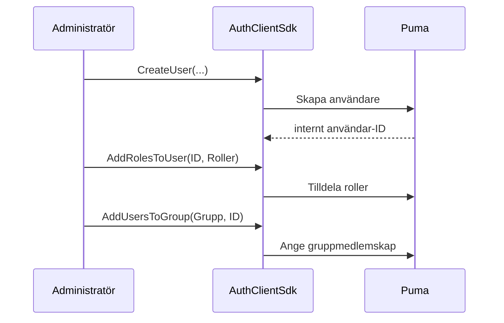
```mermaid
sequenceDiagram
    participant AD as Administratör
    participant SDK as AuthClientSdk
    participant P as Puma
    AD->>SDK: CreateUser(...)
    SDK->>P: Skapa användare
    P-->>SDK: internt användar-ID
    AD->>SDK: AddRolesToUser(ID, Roller)
    SDK->>P: Tilldela roller
    AD->>SDK: AddUsersToGroup(Grupp, ID)
    SDK->>P: Ange gruppmedlemskap
```

*Figur 9: Skapande av en lokal användare med roll- och grupptilldelning.*

**Resultat:** Användaren får behörigheter från direkt tilldelade roller och
grupproller. En användare som redan är inloggad kan behöva logga in igen
så att applikationen får uppdaterade sessionsbehörigheter.

### UC-02: Hantera ett team genom en grupp

**Aktör:** Administratör

1. Skapa en verksamhetsroll med de behörigheter som behövs.
2. Skapa en grupp för teamet eller avdelningen.
3. Tilldela rollen till gruppen.
4. Lägg till användare i gruppen.
5. Ta bort användare från gruppen när de lämnar teamet.

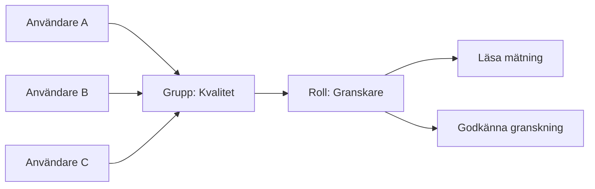
```mermaid
flowchart LR
    U1[Användare A] --> G[Grupp: Kvalitet]
    U2[Användare B] --> G
    U3[Användare C] --> G
    G --> R[Roll: Granskare]
    R --> P1[Läsa mätning]
    R --> P2[Godkänna granskning]
```

*Figur 10: Gemensam behörighetstilldelning via en grupp.*

**Fördel:** Rolländringar slår igenom centralt för alla gruppmedlemmar.

### UC-03: Inloggning och funktionsbaserad åtkomst

**Aktör:** Slutanvändare

1. Applikationen konfigurerar anslutning och produkt-ID.
2. Användaren anger inloggningsnamn och lösenord.
3. Puma validerar inloggningsuppgifterna.
4. Puma skapar en session och returnerar token, användarnamn, produkt-ID och
   behörigheter.
5. Applikationen aktiverar endast tillåtna funktioner.
6. Vid utloggning ogiltigförklarar Puma sessionen.

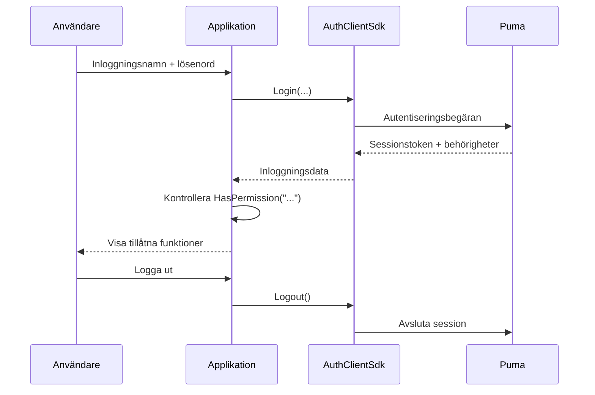
```mermaid
sequenceDiagram
    participant U as Användare
    participant A as Applikation
    participant S as AuthClientSdk
    participant P as Puma
    U->>A: Inloggningsnamn + lösenord
    A->>S: Login(...)
    S->>P: Autentiseringsbegäran
    P-->>S: Sessionstoken + behörigheter
    S-->>A: Inloggningsdata
    A->>A: Kontrollera HasPermission("...")
    A-->>U: Visa tillåtna funktioner
    U->>A: Logga ut
    A->>S: Logout()
    S->>P: Avsluta session
```

*Figur 11: Inloggning, behörighetskontroll och utloggning för en applikation.*

Fel på grund av ogiltiga inloggningsuppgifter, saknad anslutning eller saknade
serverkomponenter rapporteras som misslyckad inloggning. Ett inaktiverat konto
avvisas med ett eget meddelande först efter att inloggningsuppgifterna har
kontrollerats, så att kontostatusen inte kan utforskas via inloggningsförsök
(se [avsnitt 9.5](#95-aktivera-och-inaktivera-konton)).

### UC-04: Behörighetsändring

1. Administratören ändrar roll- eller grupptilldelningen.
2. Applikationen avslutar den gamla sessionen eller begär en ny inloggning.
3. Användaren loggar in igen.
4. Applikationen bygger upp sitt gränssnitt utifrån de nya behörigheterna.

Att dölja en knapp ersätter inte en kontroll på serversidan. Varje
skyddsvärd serveråtgärd måste validera behörigheten på nytt.

### UC-05: Inaktivera eller ta bort en användare

Det finns två sätt att permanent återkalla åtkomsten:

1. **Inaktivera kontot (rekommenderas):** Superanvändaren sätter kontostatusen
   i användarredigeraren till inaktiverad. Användarposten, dess roller och
   grupptilldelningar behålls, men inloggning är inte längre möjlig. Pågående
   sessioner och PAT:er för kontot avvisas omedelbart. Detaljer beskrivs i
   [avsnitt 9.5](#95-aktivera-och-inaktivera-konton).
2. **Ta bort kontot:** Klient-SDK:t tillhandahåller `RemoveUser()` för
   permanent borttagning. Roll- och grupptilldelningar tas bort tillsammans med
   användaren. Innan en användare tas bort ska verksamhetens krav på lagring
   och revision kontrolleras.

Om endast en enskild funktion ska återkallas räcker det att ta bort
motsvarande roll- eller grupptilldelning.

### UC-06: Ansluta en egen applikation

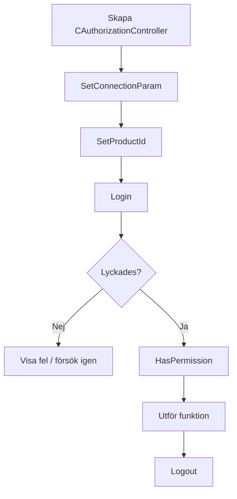
```mermaid
flowchart TD
    C[Skapa CAuthorizationController] --> N[SetConnectionParam]
    N --> P[SetProductId]
    P --> L[Login]
    L --> H{Lyckades?}
    H -->|Nej| E[Visa fel / försök igen]
    H -->|Ja| Q[HasPermission]
    Q --> F[Utför funktion]
    F --> O[Logout]
```

*Figur 12: Minimalt förlopp för en SDK-baserad klientintegrering.*

Den minsta sekvensen i C++-klienten är:

```cpp
AuthClientSdk::CAuthorizationController auth;

AuthClientSdk::ServerConfig server;
server.host = "puma.example.org";
server.httpPort = 443;
server.wsPort = 8443;
server.sslConfig = AuthClientSdk::SslConfig{};

auth.SetConnectionParam(server);
auth.SetProductId("MeineAnwendung");

AuthClientSdk::Login session;
if (auth.Login(login, password, session) &&
    auth.HasPermission("messung.lesen")) {
    // Aktivera skyddad funktion.
}
auth.Logout();
```

Säkerhetsrelevanta anvisningar:

- Överför lösenord endast via TLS.
- Logga inte sessionstoken.
- `Login()` avslutar automatiskt en tidigare session för kontrollern.
- Anropa `Logout()` uttryckligen; destruktorn försöker dessutom logga ut efter
  bästa förmåga.
- Kör inte `Login()` och `Logout()` parallellt på samma kontroller.

### UC-07: Ansluta en egen server med auktorisering

`AuthServerSdk::CAuthorizableServer` är avsedd för serverapplikationer som
tillhandahåller egna slutpunkter men använder Puma som central
auktoriseringsinstans.

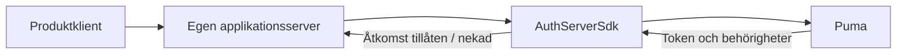
```mermaid
flowchart LR
    CLIENT[Produktklient] --> APP[Egen applikationsserver]
    APP --> ASDK[AuthServerSdk]
    ASDK --> P[Puma]
    P -->|Token och behörigheter| ASDK
    ASDK -->|Åtkomst tillåten / nekad| APP
```

*Figur 13: Puma-integrering av en egen auktoriserbar server.*

Applikationsservern anger:

1. sitt produkt-ID,
2. anslutningen till den centrala Puma-servern,
3. sina egna HTTP-/WebSocket-portar,
4. eventuellt en feature-fil och TLS-konfiguration,
5. därefter `Start()` och vid avstängning `Stop()`.

## 6. SDK-lager

### 6.1 AuthClientSdk

Fasaden `AuthClientSdk::CAuthorizationController` erbjuder:

| Område | Centrala åtgärder |
|---|---|
| Anslutning | `SetConnectionParam()`, `SetProductId()` |
| Session | `Login()`, `Logout()`, `GetToken()` |
| Auktorisering | `HasPermission()`, `GetTokenPermissions()` |
| Initiering | `SuperuserExists()`, `CreateSuperuser()` |
| Användare | Lista, läsa, skapa, ta bort, ändra lösenord |
| Roller | Lista, läsa, skapa, ta bort, tilldela behörigheter |
| Grupper | Lista, läsa, skapa, ta bort, tilldela användare/roller |
| PAT | Skapa, lista, validera och återkalla |

`ServerConfig` innehåller värd, HTTP-port, WebSocket-port och valfria
TLS-inställningar. Roller och behörigheter är knutna till applikationen som
konfigurerats med `SetProductId()`.

### 6.2 AuthServerSdk

Server-SDK:t kapslar in en HTTP-/WebSocket-server med auktorisering. Dess
nätverksanslutning till Pumas backend är åtskild från portarna där den egna
servern betjänar klienter. Vid distribuerade installationer måste därför
båda anslutningsriktningarna konfigureras och säkras.

### 6.3 UI-komponenter

Puma innehåller widgetkomponenter respektive QML-komponenter för inloggning och
administration. De bygger på samma autentiserings- och
administrationsgränssnitt. Ett eget gränssnitt får inte ersätta
behörighetskontrollerna på serversidan.

## 7. LDAP-/Windows-domäninloggning

### 7.1 Så fungerar det

Den aktuella ImtCore-implementeringen använder Windows-domänfunktionerna
i Windows, särskilt kontrollen via `LogonUser`.
Den är därmed avsedd för Windows-/Active Directory-miljöer och är inte en
allmänt konfigurerbar OpenLDAP-klient.

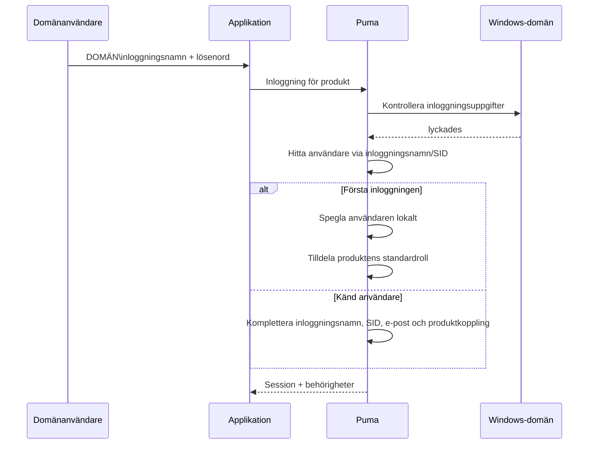
```mermaid
sequenceDiagram
    participant U as Domänanvändare
    participant A as Applikation
    participant P as Puma
    participant W as Windows-domän
    U->>A: DOMÄN\inloggningsnamn + lösenord
    A->>P: Inloggning för produkt
    P->>W: Kontrollera inloggningsuppgifter
    W-->>P: lyckades
    P->>P: Hitta användare via inloggningsnamn/SID
    alt Första inloggningen
        P->>P: Spegla användaren lokalt
        P->>P: Tilldela produktens standardroll
    else Känd användare
        P->>P: Komplettera inloggningsnamn, SID, e-post och produktkoppling
    end
    P-->>A: Session + behörigheter
```

*Figur 14: Inloggning av en Windows-domänanvändare via Puma.*

Vid en lyckad första domäninloggning:

- skapar Puma en intern användarpost,
- markeras autentiseringssystemet som `LDAP`,
- hämtas SID, visningsnamn och e-post i den mån de är tillgängliga,
- skapas vid behov de produktrelaterade rollerna `Guest` och `Default`,
- tilldelas användaren produktens standardroll.

Därefter kan administratörer tilldela den speglade användaren ytterligare
Puma-roller och grupper. Lösenordet kontrolleras även fortsättningsvis mot
Windows-domänen.

### 7.2 Aktivering och inaktivering

`LdapEnabled` är aktiverat i Pumas standardinställning och finns under
inställningsområdet **LDAP**. Om endast lokala Puma-konton används
bör funktionen inaktiveras för att undvika onödiga domänkontroller och
missvisande meddelanden.

### 7.3 Förutsättningar

- Puma körs i Windows.
- Servern kan nå domänen och en domänkontrollant.
- Operativsystemet, DNS och förtroenderelationen är korrekt konfigurerade.
- Användaren använder ett inloggningsnamn som accepteras av Windows, vanligtvis
  `DOMÄNE\benutzer`.
- LDAP är aktiverat i Puma.

### 7.4 Felsökning

| Symptom | Kontroll |
|---|---|
| Domäninloggning misslyckas, lokal inloggning fungerar | Kontrollera domänåtkomst, DNS, klockslag, inloggningsformat och `LdapEnabled` |
| Användaren skapas dubbelt | Kontrollera enhetligt inloggningsformat och SID-matchning |
| Användaren har för få rättigheter efter första inloggningen | Kontrollera standardrollen och ytterligare roll-/grupptilldelning |
| Lokala inloggningar skapar domänfel i loggen | Inaktivera LDAP om det inte behövs |
| Linux-server autentiserar inte mot AD | Den aktuella implementeringen är Windows-specifik |

## 8. Personal Access Tokens (PAT)

### 8.1 Användning

PAT:er är långlivade autentiseringsuppgifter för automatisering, CI/CD,
övervakningstjänster och kommunikation mellan tjänster. En PAT tillhör en
användare, innehåller ett produkt-ID och explicita behörighetsomfång.

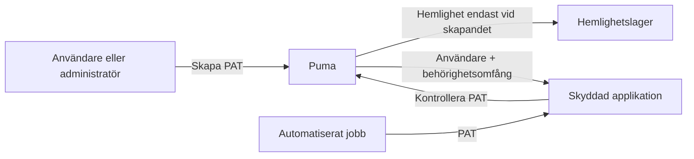
```mermaid
flowchart LR
    OWNER[Användare eller administratör] -->|Skapa PAT| P[Puma]
    P -->|Hemlighet endast vid skapandet| VAULT[Hemlighetslager]
    JOB[Automatiserat jobb] -->|PAT| API[Skyddad applikation]
    API -->|Kontrollera PAT| P
    P -->|Användare + behörighetsomfång| API
```

*Figur 15: Skapande, lagring och användning av en PAT.*

### 8.2 Livscykel

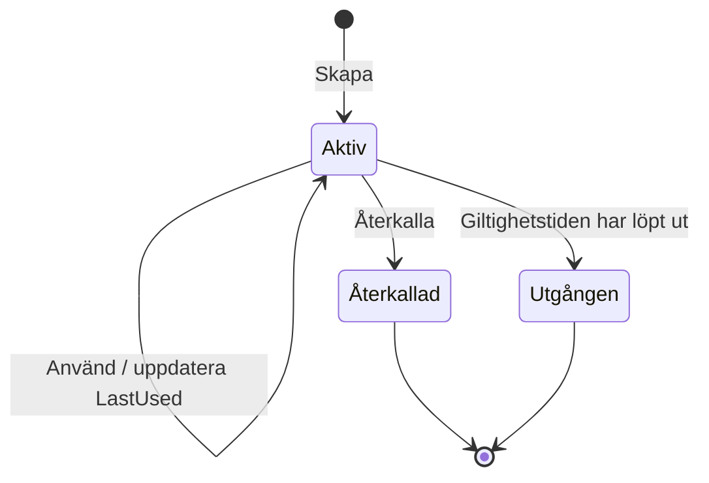
```mermaid
stateDiagram-v2
    state "Utgången" as Abgelaufen
    state "Återkallad" as Widerrufen
    [*] --> Aktiv: Skapa
    Aktiv --> Aktiv: Använd / uppdatera LastUsed
    Aktiv --> Abgelaufen: Giltighetstiden har löpt ut
    Aktiv --> Widerrufen: Återkalla
    Widerrufen --> [*]
    Abgelaufen --> [*]
```

*Figur 16: Tillstånd i en PAT:s livscykel.*

En token är giltig om den finns, är aktiv, inte har återkallats och inte har
löpt ut. Återkallade poster förblir synliga i listan och rapporteras som
inaktiva.

### 8.3 Skapa PAT

**Förutsättning:** Ägaren eller en administratör är inloggad med en
session.

1. Ange ett namn som beskriver syftet, till exempel `CI Produktion Lesen`.
2. Ange målanvändare och produkt-ID.
3. Välj endast de behörighetsomfång som är absolut nödvändiga.
4. Ange om möjligt ett utgångsdatum i ISO 8601-format.
5. Spara omedelbart hemligheten i ett hemlighetslager. Den inleds med det
   prefix som konfigurerats i serverkompositionen, som standard `imt_pat_`.
6. Kopiera inte hemligheten till källkod, byggloggar eller ärenden.

Anonyma anropare får inte skapa PAT:er. En vanlig användare kan
hantera sina egna PAT:er, men inte andra användares PAT:er. Administratörer
kan hantera andra användares PAT:er.

### 8.4 Använda PAT

SDK-datamodellen skiljer mellan `TokenType::Session` och
`TokenType::PersonalAccessToken`. För icke-interaktiv åtkomst kontrolleras
PAT:en via `ValidatePersonalAccessToken()`; applikationen använder därefter
enbart de returnerade behörighetsomfången och kontrollerar dessutom
produktkontexten.

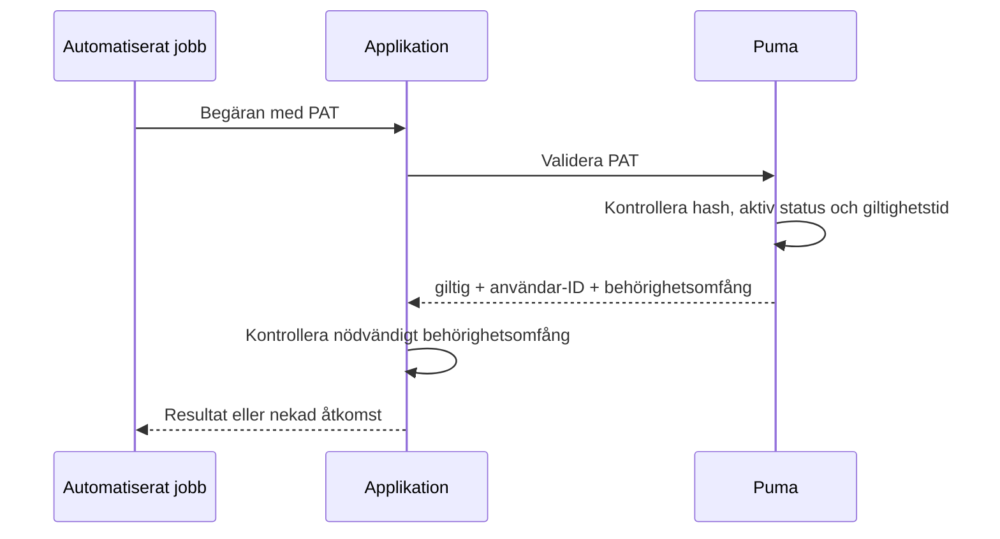
```mermaid
sequenceDiagram
    participant J as Automatiserat jobb
    participant A as Applikation
    participant P as Puma
    J->>A: Begäran med PAT
    A->>P: Validera PAT
    P->>P: Kontrollera hash, aktiv status och giltighetstid
    P-->>A: giltig + användar-ID + behörighetsomfång
    A->>A: Kontrollera nödvändigt behörighetsomfång
    A-->>J: Resultat eller nekad åtkomst
```

*Figur 17: Validering av en PAT för en automatiserad åtkomst.*

`GetTokenPermissions()` accepterar numera både sessionstoken och PAT:er. För en
PAT returnerar servern snittet av användarens behörigheter och tokenens
behörighetsomfång och tar hänsyn till tokenens produktbindning. Behörigheter
som användaren har via en roll men som inte ingår i tokenens omfång returneras
inte. När ett konto inaktiveras avvisas även dess PAT:er.

### 8.5 Återkalla PAT

1. Identifiera tokenen utifrån namn, produkt, tidpunkt för skapande och senaste
   användning.
2. Återkalla token-ID:t.
3. Valideringen måste därefter misslyckas.
4. Kontrollera beroende system och loggar vid misstänkt läckage av hemligheten.
5. Utfärda en ersättnings-PAT med snävare behörighetsomfång och nytt
   utgångsdatum.

### 8.6 Känd egenskap hos gränssnittet

Det aktuella GraphQL-valideringssvaret returnerar användar-ID och
behörighetsomfång,
men inte token-ID. Därför kan `ValidatePersonalAccessToken()` för närvarande
inte återskapa `productId` i valideringsresultatet. Produktkontexten måste
dessutom vara känd och kontrolleras av det utfärdande respektive konsumerande
systemet.

## 9. Drift och säkerhet

### 9.1 Ansvarsområden

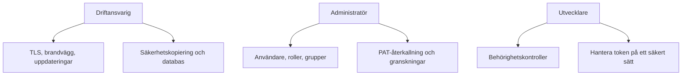
```mermaid
flowchart TB
    OP[Driftansvarig] --> TLS[TLS, brandvägg, uppdateringar]
    OP --> DB[Säkerhetskopiering och databas]
    ADM[Administratör] --> IAM[Användare, roller, grupper]
    ADM --> TOK[PAT-återkallning och granskningar]
    DEV[Utvecklare] --> PERM[Behörighetskontroller]
    DEV --> SEC[Hantera token på ett säkert sätt]
```

*Figur 18: Fördelning av det operativa säkerhetsansvaret.*

### 9.2 Regelbundna kontroller

- Inaktivera eller ta bort användare utan aktuellt verksamhetsbehov.
- Kontrollera roller och grupper enligt principen om minsta privilegium.
- Återkalla gamla, aldrig använda eller utgångna PAT:er.
- Tilldela administratörsrättigheter till namngivna personer.
- Säkerhetskopiera databas och inställningar; testa återställningen.
- Övervaka certifikatens utgångsdatum.
- Undersök misslyckade inloggningar och ovanlig tokenanvändning.
- Håll servern och ImtCore-/Puma-komponenterna uppdaterade.

### 9.3 Säkerhetskopiering och återställning

En konsistent säkerhetskopia omfattar minst databasen och Puma-inställningarna.
Certifikat och nycklar ska säkerhetskopieras separat med särskilt starkt skydd.
Efter en återställning ska databasmigreringar, inloggning, roller,
grupper, sessionshantering och PAT-validering testas i en kontrollerad
miljö.

### 9.4 Lösenordspolicy

Puma kontrollerar lösenord när en användare skapas, när ett lösenord ändras
och när superanvändaren initieras. Kontrollen använder lösenordspolicyn i
ImtCore-användaradministrationen, som redan är inkopplad i den levererade
Puma-kompositionen och verkar utan ytterligare konfiguration:

| Regel | Standardvärde |
|---|---|
| Minsta längd | 8 tecken |
| Största längd | 128 tecken |
| Krav på gemener, versaler, siffror och specialtecken | krävs inte |
| Inloggningsnamn som lösenord | avvisas |
| Blocklista över kända lösenord | inte angiven; kan valfritt läggas in som fil |
| Lösenordshistorik | de senaste 5 lösenorden får inte återanvändas |
| Minsta ålder för lösenordet | 0 dagar, alltså ingen väntetid före nästa ändring |
| Högsta ålder för lösenordet | 0 dagar, alltså ingen utgång |
| Varningstid före utgång | 14 dagar |

Ytterligare anvisningar:

- Ett avvisande anger vilka regler som överträtts, till exempel minsta längd,
  saknad teckenklass, inloggningsnamn som lösenord, post i blocklistan,
  återanvändning eller minsta ålder. Administrationsgränssnittet visar dem som
  klartext.
- Ett blanksteg räknas inte som specialtecken.
- En administratör anger en annan användares lösenord utan dennes gamla
  lösenord och omfattas då inte av kravet på minsta ålder.
- Policyn gäller inte för användare från Windows-domänen; deras lösenord
  hanteras och kontrolleras i domänen.
- Utgångskontrollen vid inloggning och klientens förfrågan om reglerna finns på
  serversidan, men är inte kopplade till inloggningskontrollern i den
  levererade Puma-kompositionen. De får verkan först när policyn även kopplas
  in där.

### 9.5 Aktivera och inaktivera konton

Varje konto har utöver sina roller även en kontostatus. Ett inaktiverat konto
behålls med alla sina tilldelningar men kan inte logga in.

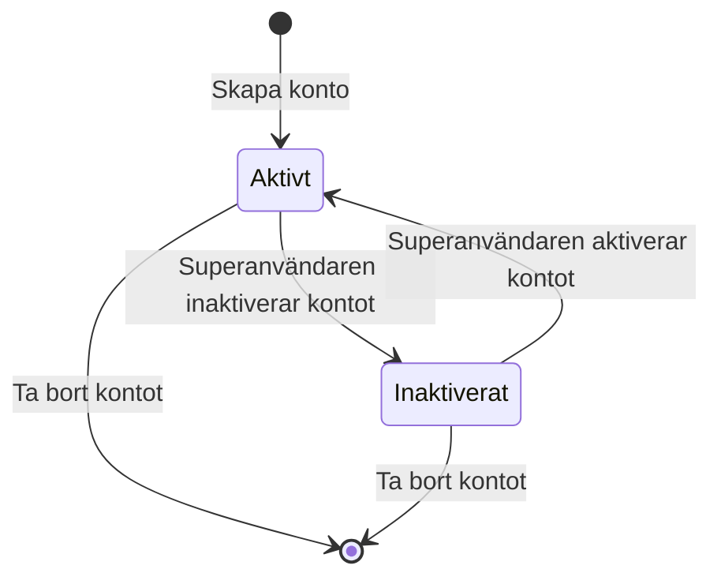
```mermaid
stateDiagram-v2
    [*] --> Aktivt: Skapa konto
    Aktivt --> Inaktiverat: Superanvändaren inaktiverar kontot
    Inaktiverat --> Aktivt: Superanvändaren aktiverar kontot
    Aktivt --> [*]: Ta bort kontot
    Inaktiverat --> [*]: Ta bort kontot
```

*Figur 19: Kontostatus och övergångarna som superanvändaren utlöser.*

Regler:

- Endast superanvändaren ser och hanterar reglaget för kontostatus i
  användarredigeraren. För övriga administratörer visas det inte, och deras
  ändringar av användaren lämnar statusen oförändrad.
- Endast superanvändaren kan skapa ett konto som redan är inaktiverat. En
  självregistrering skapar alltid ett aktivt konto.
- Vid inloggningen kontrolleras först inloggningsuppgifterna. Först därefter
  leder ett inaktiverat konto till ett eget meddelande om att kontot har
  inaktiverats. Ett felaktigt lösenord ger fortfarande det allmänna
  meddelandet, så kontostatusen kan inte fastställas via inloggningsförsök.
- Pågående sessioner och PAT:er för ett inaktiverat konto avvisas omedelbart;
  någon utloggning krävs inte.
- Konton från äldre datamängder utan sparad status betraktas som aktiva.

Inaktivering är att föredra framför borttagning när tilldelningar, underlag
eller ansvarsförhållanden ska bevaras.

### 9.6 Spärr efter misslyckade inloggningsförsök

ImtCore tillhandahåller en kontospärr som tillfälligt avvisar ett konto efter
flera misslyckade försök i följd. Dess standardvärden är:

| Inställning | Standardvärde | Betydelse |
|---|---|---|
| Största antal misslyckade försök | 5 | Antal misslyckade försök i följd före spärren; 0 stänger av spärren |
| Observationsperiod | 300 sekunder | Tidsfönster inom vilket misslyckade försök räknas |
| Spärrtid | 900 sekunder | Avvisningens längd; 0 betyder spärr tills en administratör låser upp kontot |

Räknare och spärrar hålls i minnet och nollställs när servern startas om. En
administratör kan låsa upp ett konto i förtid. Inloggningsvägen via
Windows-domänen räknas inte.

> **Obs:** Spärrkomponenten är inte inkopplad i den levererade
> Puma-kompositionen, och någon automatisk spärr sker därför inte. Om den
> behövs måste den läggas till i serverkompositionen. Fram till dess ska
> misslyckade inloggningar övervakas via loggarna
> (se [avsnitt 9.2](#92-regelbundna-kontroller)).

## 10. Feldiagnostik

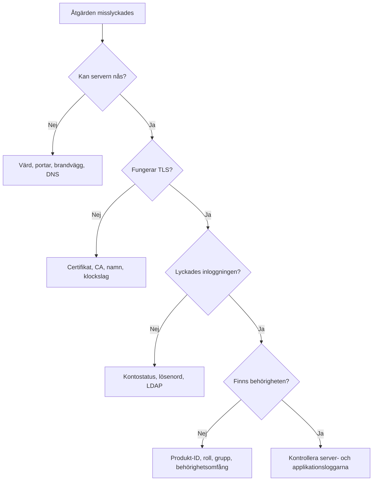
```mermaid
flowchart TD
    X[Åtgärden misslyckades] --> N{Kan servern nås?}
    N -->|Nej| NET[Värd, portar, brandvägg, DNS]
    N -->|Ja| T{Fungerar TLS?}
    T -->|Nej| CERT[Certifikat, CA, namn, klockslag]
    T -->|Ja| A{Lyckades inloggningen?}
    A -->|Nej| ID[Kontostatus, lösenord, LDAP]
    A -->|Ja| P{Finns behörigheten?}
    P -->|Nej| RBAC[Produkt-ID, roll, grupp, behörighetsomfång]
    P -->|Ja| LOG[Kontrollera server- och applikationsloggarna]
```

*Figur 20: Beslutsträd för feldiagnos.*

| Problem | Trolig orsak | Åtgärd |
|---|---|---|
| Anslutningen nekas | Fel värd/port eller servern har inte startats | Kontrollera HTTP- och WS-port samt process |
| TLS-fel | Certifikatet är inte betrott eller namnet är fel | Kontrollera certifikatkedja, värdnamn och klockslag |
| Inloggningen misslyckas | Inloggningsuppgifter, kontostatus eller LDAP | Kontrollera autentiseringsvägen specifikt |
| Inloggningen rapporterar ett inaktiverat konto | Kontot har inaktiverats | Låt superanvändaren kontrollera kontostatusen (avsnitt 9.5) |
| Lösenordsändringen avvisas | Överträdelse av lösenordspolicyn | Utvärdera de rapporterade reglerna (avsnitt 9.4) |
| `HasPermission()` förblir `false` | Fel produkt-ID eller roll saknas | Kontrollera produkt-ID och effektiva roller |
| Användaråtgärden returnerar tomt ID | Inloggningsnamnet finns redan eller rättigheter saknas | Kontrollera unikhet och administratörsrättigheter |
| PAT-skapandet returnerar en tom hemlighet | Inte inloggad, fel ägare eller tomma behörighetsomfång | Kontrollera session, användar-ID och behörighetsomfång |
| PAT:en är ogiltig | Återkallad, utgången eller ändrad | Kontrollera tokenmetadata och utfärda en ny |
| Inställningarna går förlorade | Skrivbehörighet saknas | Kontrollera sökväg och tjänstekonto |

## 11. Checklistor för godkännande

### Server

- [ ] Lämplig databasvariant har valts
- [ ] Databasanslutning och migrering har lyckats
- [ ] HTTPS och WSS är aktiva med giltigt certifikat
- [ ] Portar och brandvägg är dokumenterade
- [ ] Säkerhetskopiering och återställning har testats
- [ ] Loggövervakning har konfigurerats

### Behörighetsmodell

- [ ] Unikt produkt-ID har angetts
- [ ] Behörighets-ID:n är dokumenterade
- [ ] Roller har modellerats efter uppgifter i stället för personer
- [ ] Grupper har skapats för återkommande team
- [ ] Personliga administratörskonton har konfigurerats
- [ ] Rutin för att inaktivera konton som inte längre behövs har fastställts
- [ ] Lösenordspolicyn har granskats och kommunicerats till användarna
- [ ] Negativa tester för nekade åtgärder har genomförts

### LDAP

- [ ] Windows- och domänförutsättningarna är uppfyllda
- [ ] Den första domäninloggningen har testats
- [ ] SID och användardata har överförts korrekt
- [ ] Standardrollen har kontrollerats
- [ ] LDAP har inaktiverats om det inte behövs

### PAT

- [ ] Behörighetsomfång enligt principen om minsta privilegium har tilldelats
- [ ] Utgångsdatum har angetts
- [ ] Hemligheten har endast lagrats i ett hemlighetslager
- [ ] Återkallning har testats
- [ ] Rotation och ansvarig person är dokumenterade

## 12. Ytterligare dokumentation

- [AuthClientSdk-referens](../AuthClientSdk.md)
- [AuthServerSdk-referens](../AuthServerSdk.md)
- [Beroenden](../Dependencies.md)
- [Pumas säkerhetspolicy](../../SECURITY.md)
- [Kompakt presentation](Puma_Kompakt_DE.pptx)

## 13. Utvecklarintegrering

En applikation kan integrera Puma på två sätt:

| Variant | Lämplig för | Abstraktion |
|---|---|---|
| `AuthClientSdk` | Applikationer som behöver en stabil C++-fasad | `AuthClientSdk::CAuthorizationController` |
| Partitura | ACF-/ImtCore-applikationer med en auktoriserbar server | `AuthorizableServerFramework.acc` från ImtCore |

I båda varianterna behöver applikationen adressen till Puma-servern, ett unikt
produkt-ID och de behörigheter som definierats för produkten. Produkt-ID:t
måste stämma överens med den administrerade applikationen. TLS ska användas för
produktionsanslutningar.

### 13.1 Integrering via SDK:t

1. Bygg `AuthClientSdk` och länka det till applikationen. CMake-exemplet i
   `Impl/AuthClientSdk/CMake/CMakeLists.txt` visar de Qt- och ImtCore-beroenden
   som krävs.
2. Inkludera `AuthClientSdk/AuthClientSdk.h`.
3. Skapa en `CAuthorizationController`, ange HTTP-/WebSocket-slutpunkten och
   TLS-konfigurationen med `SetConnectionParam()` och ange därefter
   produktsammanhanget med `SetProductId()`.
4. Logga in med `Login()` och aktivera funktioner först efter en lyckad
   kontroll med `HasPermission()`.
5. Använd samma fasads användar-, roll- och gruppåtgärder för
   administrationssidan. Applikationen avgör utifrån administrationsbehörigheten
   om den erbjuder sidan i klient-UI:t.
6. Anropa `Logout()` när sessionen avslutas.

Ett minimalt C++-exempel finns i
[UC-06](#uc-06-ansluta-en-egen-applikation); hela API:t beskrivs i
[AuthClientSdk-referensen](../AuthClientSdk.md). I den aktuella CMake-byggnaden
integreras SDK:t endast under Windows.

### 13.2 Integrering via Partitura

Under `Partitura/ImtHttpServerVoce.arp/AuthorizableServerFramework.acc`
tillhandahåller ImtCore redan en färdig baskomposition för en auktoriserbar
server. Den samlar bland annat HTTP- och WebSocket-servern, anslutningen till
Puma, autentiseringshanteraren samt användar-, roll- och gruppcacharna.
Applikationen bör använda denna bas i stället för att bygga upp komponenterna
var för sig.

Integreringen sker i följande steg:

1. Gör ImtCore-paketen och -registren kända i applikationens ACF-konfiguration.
2. Instansiera `AuthorizableServerFramework` från paketet `ImtHttpServerVoce`.
3. Anslut de applikationsspecifika komponenterna för applikations- och
   versionsinformation, databas, Puma-anslutning, servergränssnitt och
   TLS-konfiguration via `Type="Reference"`. Egna begäranhanterare ansluts som
   `Type="Factory"`.
4. Konfigurera produkt-ID:t och anslutningen till den centrala Puma-servern.
   Produkt-ID:t måste stämma överens med den applikation som administreras i
   Puma.
5. Anslut dina egna GraphQL-hanterare till ramverket och integrera de HTTP- och
   WebSocket-servrar som ramverket exporterar i applikationens
   server-controller.
6. Testa efter byggnaden inloggning, PAT- och sessionsvalidering samt tillåtna
   och nekade behörigheter mot en testinstans av Puma.

`Impl/AuthServerSdk/AuthServerSdk.acc` visar en konkret integrering av denna
ImtCore-baskomposition. Partitura-varianten kopplar in den deklarativt i
applikationen, medan SDK-varianten kapslar in integreringen bakom en
C++-fasad.
