# Puma 用户手册

**语言：** 简体中文  
**目标读者：** 管理员、应用程序开发者和运维人员

## 1. 目的与适用范围

Puma 是用于多个应用程序的身份验证与权限管理的中央系统。用户向 Puma 进行登录；
应用程序根据 Puma 提供的权限决定开放哪些功能。因此，用户、角色和组无需在
每个应用程序中单独维护。

本手册描述：

- 使用 SQLite 或 PostgreSQL 数据库的 Puma 服务器，
- 本地用户、角色、组以及与产品相关的权限，
- 通过 `AuthClientSdk` 集成自有的 Qt/C++ 应用程序，
- 通过 `AuthServerSdk` 集成自有的服务器，
- 通过 ImtCore 中实现的 LDAP 层进行 Windows 域登录，
- 用于非交互式访问的个人访问令牌（PAT），
- 典型的运维、安全和故障场景。

本说明基于 Puma 以及底层在 ImagingTools/ImtCore 中的身份验证实现。它描述了
源代码中现有功能的状态；具体的菜单名称可能因嵌入的管理界面而有所不同。

## 2. Puma 概览

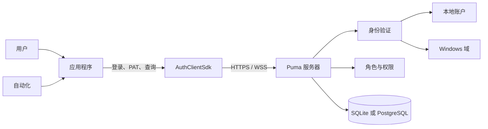

Puma 将四项任务分离：

1. **身份：** 谁在访问？
2. **身份验证：** 所提交的凭证是否有效？
3. **授权：** 允许哪些与产品相关的操作？
4. **持久化：** 用户、角色、组、会话和 PAT 存储在哪里？

### 2.1 Puma 服务器的变体

| 变体 | 数据库 | 典型用途 |
|---|---|---|
| `PumaServerSl` | SQLite | 单机安装、开发、小型本地安装 |
| `PumaServerPg` | PostgreSQL | 中央多用户运行和生产环境服务器安装 |

两种变体使用相同的 Puma 服务器基础。各自的服务器应用程序为其数据库集成
相应的存储库和 SQL 脚本。

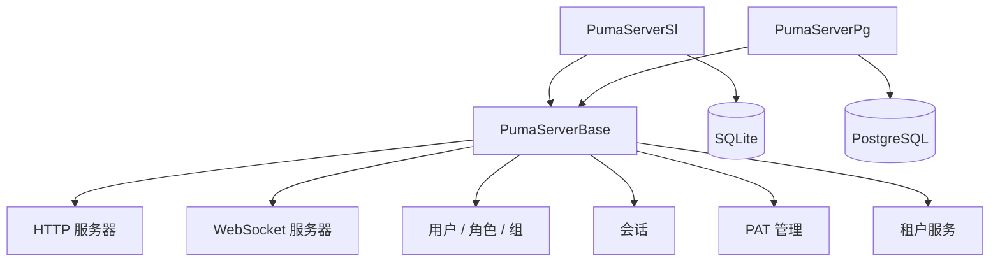

## 3. 角色与权限模型

Puma 不将权限作为用户的可自由编辑属性进行管理，而是通过角色进行管理：

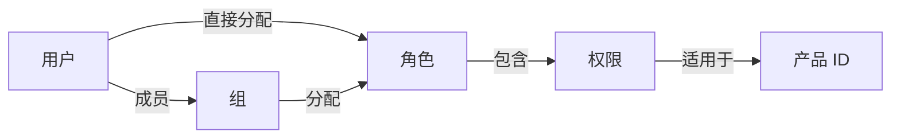

- **用户** 拥有一个内部的、稳定的对象 ID 和一个登录名。
- **角色** 归集权限，并且是产品专属的。
- **组** 归集用户并获得角色。
- **权限** 是由应用程序定义的、区分大小写的 ID。
- **产品 ID** 限定角色和权限适用的上下文。

用户获得以下内容的并集：

- 直接分配的角色的权限，以及
- 其所属组的角色的权限。

> **重要：** 管理操作使用内部用户 ID，而不是登录名。应用程序在登录之前
> 设置其产品 ID。

### 3.1 推荐的管理模型

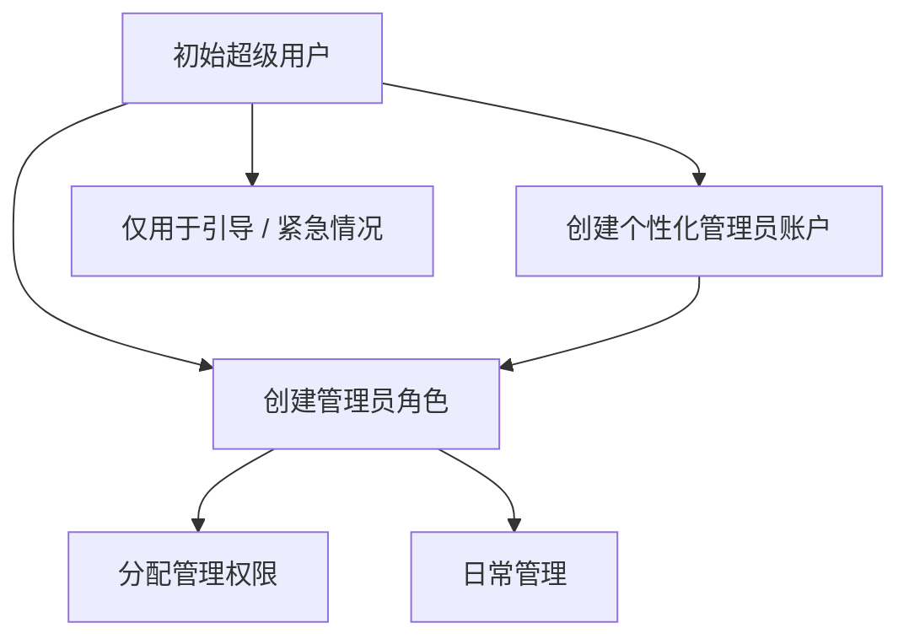

超级用户用于初始搭建。日常应使用带有合适管理员角色的个性化管理员账户。
这样便无需共享超级用户凭证。

## 4. Puma 服务器的投入运行

### 4.1 准备工作

1. 选择服务器变体。
2. 对于 PostgreSQL，准备好数据库、数据库用户和可访问性。
3. 确定 HTTP 和 WebSocket 端口。
4. 对于生产系统，提供服务器证书和私钥。
5. 仅为所需端口打开防火墙。
6. 检查对设置、数据库和日志的写入权限。

Puma 的持久化设置默认存放在与应用程序相关的系统路径下的
`Puma/Puma Server/PumaServerSettings.xml` 中。

### 4.2 启动流程

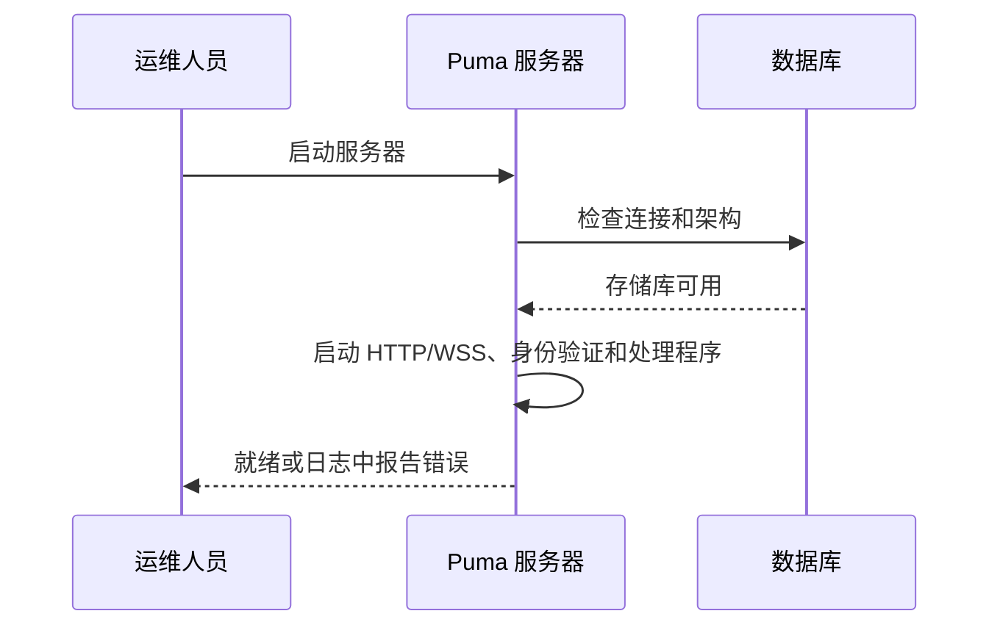

启动后尤其需要检查：

- 数据库连接成功，
- HTTP 和 WebSocket 端口已绑定，
- 证书和密钥已加载，
- 没有迁移或存储库错误，
- 客户端可以访问服务器。

### 4.3 首次设置

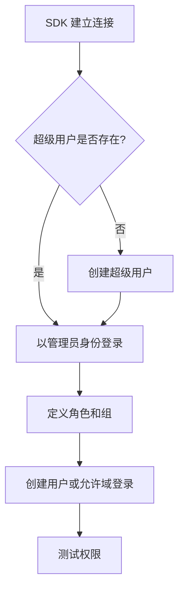

SDK 流程由 `SuperuserExists()`、必要时的 `CreateSuperuser()`，随后是登录并
搭建角色模型组成。Puma 测试对初始账户使用登录名 `su`；生产凭证必须与之
不同，须安全地选择并妥善保管。

### 4.4 传输加密

Puma 为 HTTP(S) 和 WebSocket(S) 使用分开的端口。一旦有客户端从隔离的
开发计算机之外进行访问，就必须使用 HTTPS 和 WSS。

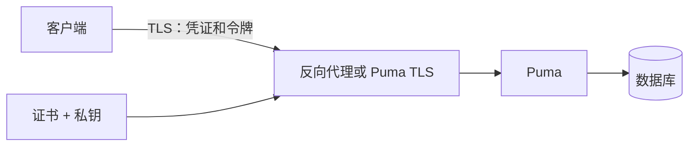

生产规则：

- 使用 TLS 1.2 或更高版本。
- 不要禁用证书验证。
- 使私钥仅对服务器进程可读。
- 不要将口令短语存储在源代码或演示文稿中。
- 仅在受控的测试环境中使用不带 TLS 的 HTTP/WS。

## 5. 详细用例

### UC-01：创建本地用户并授权

**参与者：** 管理员  
**前置条件：** 管理员已登录并拥有所需的管理权限。

1. 使用显示名、唯一登录名、初始密码和电子邮件创建用户。
2. 从结果中获取内部用户 ID。
3. 分配已有角色，或先创建一个角色。
4. 可选地将该用户添加到组。
5. 用户进行登录。
6. 应用程序检查预期的权限。

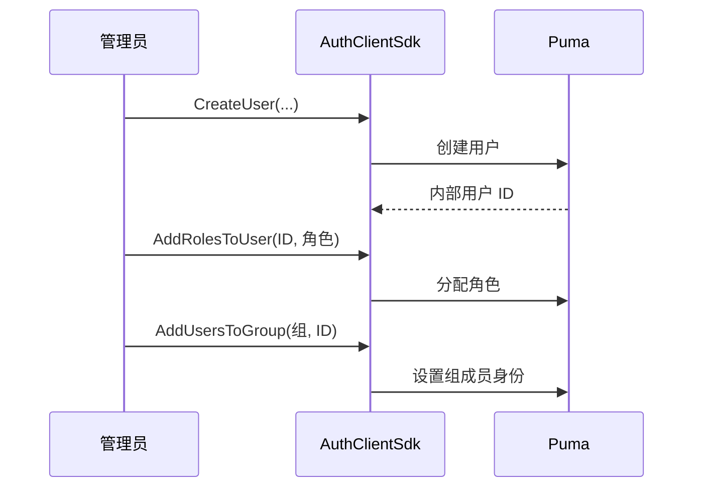

**结果：** 用户从直接角色和组角色中获得权限。已登录的用户可能需要重新
登录，以便应用程序获取更新后的会话权限。

### UC-02：通过组管理团队

**参与者：** 管理员

1. 创建带有所需权限的业务角色。
2. 为团队或部门创建组。
3. 将角色分配给组。
4. 将用户添加到组。
5. 离职时将用户从组中移除。

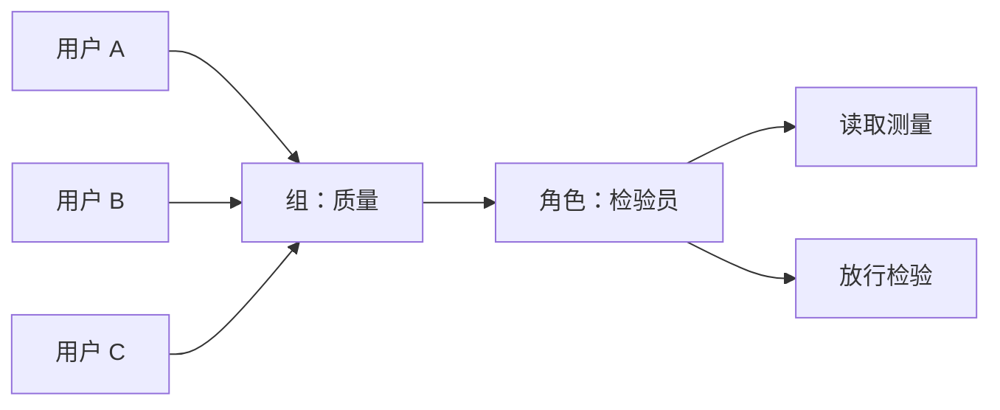

**收益：** 角色变更会集中作用于所有组成员。

### UC-03：登录与基于功能的开放

**参与者：** 最终用户

1. 应用程序配置连接和产品 ID。
2. 用户输入登录名和密码。
3. Puma 验证凭证。
4. Puma 创建会话并返回令牌、用户名、产品 ID 和权限。
5. 应用程序仅开放允许的功能。
6. 注销时 Puma 使会话失效。

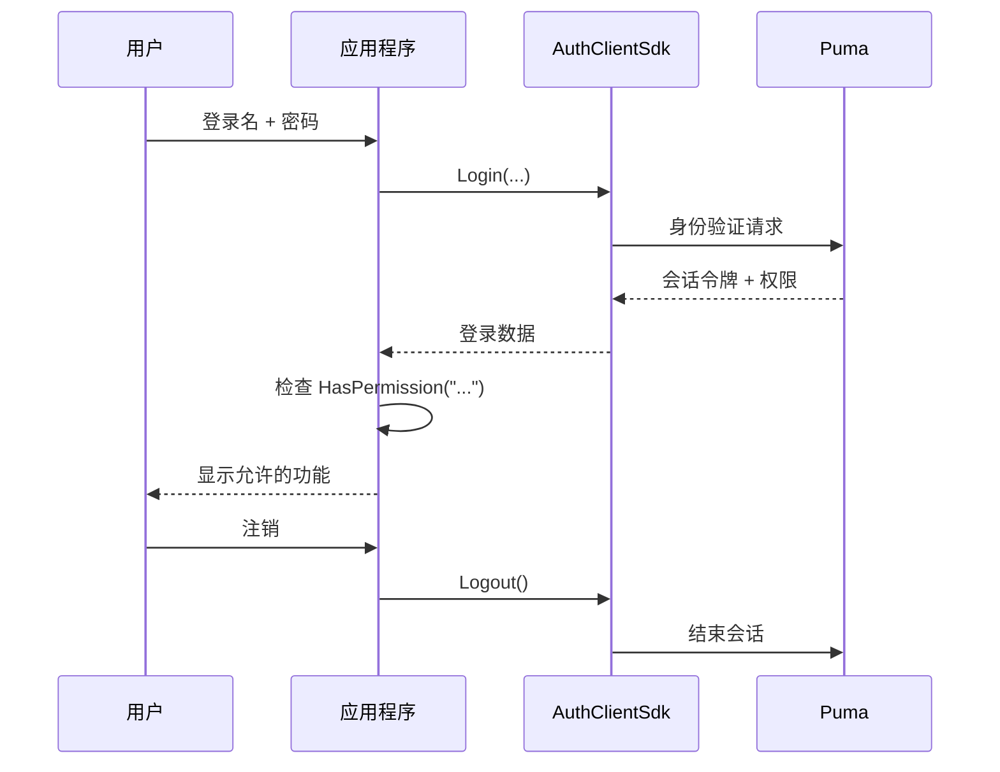

凭证无效、账户被锁定、连接缺失或服务器组件缺失时的错误会被报告为
登录失败。

### UC-04：权限变更

1. 管理员更改角色或组分配。
2. 应用程序结束旧会话或要求重新登录。
3. 用户重新登录。
4. 应用程序根据新权限构建其界面。

隐藏按钮无法取代服务器端的检查。每个需要保护的服务器操作都必须再次
验证权限。

### UC-05：停用或移除用户

现有的客户端 SDK 提供 `RemoveUser()` 作为永久删除。删除之前必须检查
业务上的保留和审计要求。角色和组分配会随用户一并移除。
对于临时封禁，应使用具体管理界面所提供的账户状态功能；否则可通过
角色分配和会话管理来撤销访问。

### UC-06：接入自有应用程序

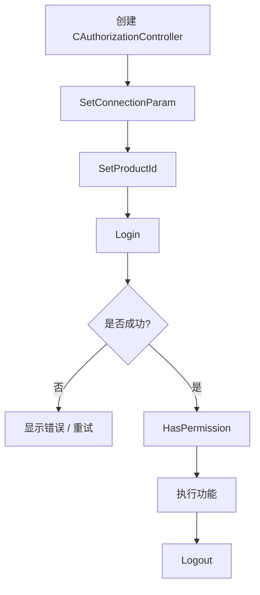

C++ 客户端中的最小顺序为：

```cpp
AuthClientSdk::CAuthorizationController auth;

AuthClientSdk::ServerConfig server;
server.host = "puma.example.org";
server.httpPort = 443;
server.wsPort = 8443;
server.sslConfig = AuthClientSdk::SslConfig{};

auth.SetConnectionParam(server);
auth.SetProductId("MeineAnwendung");

AuthClientSdk::Login session;
if (auth.Login(login, password, session) &&
    auth.HasPermission("messung.lesen")) {
    // 开放受保护的功能。
}
auth.Logout();
```

安全相关提示：

- 仅通过 TLS 传输密码。
- 不要记录会话令牌。
- `Login()` 会自动结束该控制器之前的会话。
- 显式调用 `Logout()`；析构函数会额外尝试尽力而为的注销。
- 不要在同一控制器上并行执行 `Login()` 和 `Logout()`。

### UC-07：接入自有的可授权服务器

`AuthServerSdk::CAuthorizableServer` 面向那些提供自有端点、但将 Puma 用作
中央权威来源的服务器应用程序。

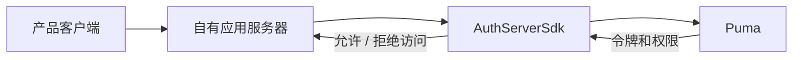

应用服务器设置：

1. 其产品 ID，
2. 与中央 Puma 服务器的连接，
3. 其自有的 HTTP/WebSocket 端口，
4. 可选的功能文件和 TLS 配置，
5. 随后调用 `Start()`，并在关闭时调用 `Stop()`。

## 6. SDK 层

### 6.1 AuthClientSdk

外观类 `AuthClientSdk::CAuthorizationController` 提供：

| 领域 | 核心操作 |
|---|---|
| 连接 | `SetConnectionParam()`、`SetProductId()` |
| 会话 | `Login()`、`Logout()`、`GetToken()` |
| 授权 | `HasPermission()`、`GetTokenPermissions()` |
| 引导 | `SuperuserExists()`、`CreateSuperuser()` |
| 用户 | 列出、读取、创建、删除、修改密码 |
| 角色 | 列出、读取、创建、删除、分配权限 |
| 组 | 列出、读取、创建、删除、分配用户/角色 |
| PAT | 创建、列出、验证和撤销 |

`ServerConfig` 包含主机、HTTP 端口、WebSocket 端口和可选的 TLS 设置。
角色和权限绑定到通过 `SetProductId()` 配置的应用程序。

### 6.2 AuthServerSdk

服务器 SDK 封装了一个可授权的 HTTP/WebSocket 服务器。它与 Puma 后端的
网络连接与其自有服务器为客户端提供服务所用的端口是分开的。因此在分布式
安装中，必须配置并保护这两个连接方向。

### 6.3 UI 组件

Puma 包含用于登录和管理的 Widget 或 QML 组件。它们构建在相同的身份验证
和管理接口之上。自有界面不得替代服务器端的权限检查。

## 7. LDAP / Windows 域登录

### 7.1 工作方式

当前的 ImtCore 实现在 Windows 上使用 Windows 域功能，尤其是通过
`LogonUser` 进行的检查。因此它面向 Windows / Active Directory 环境，
而不是一个可通用配置的 OpenLDAP 客户端。

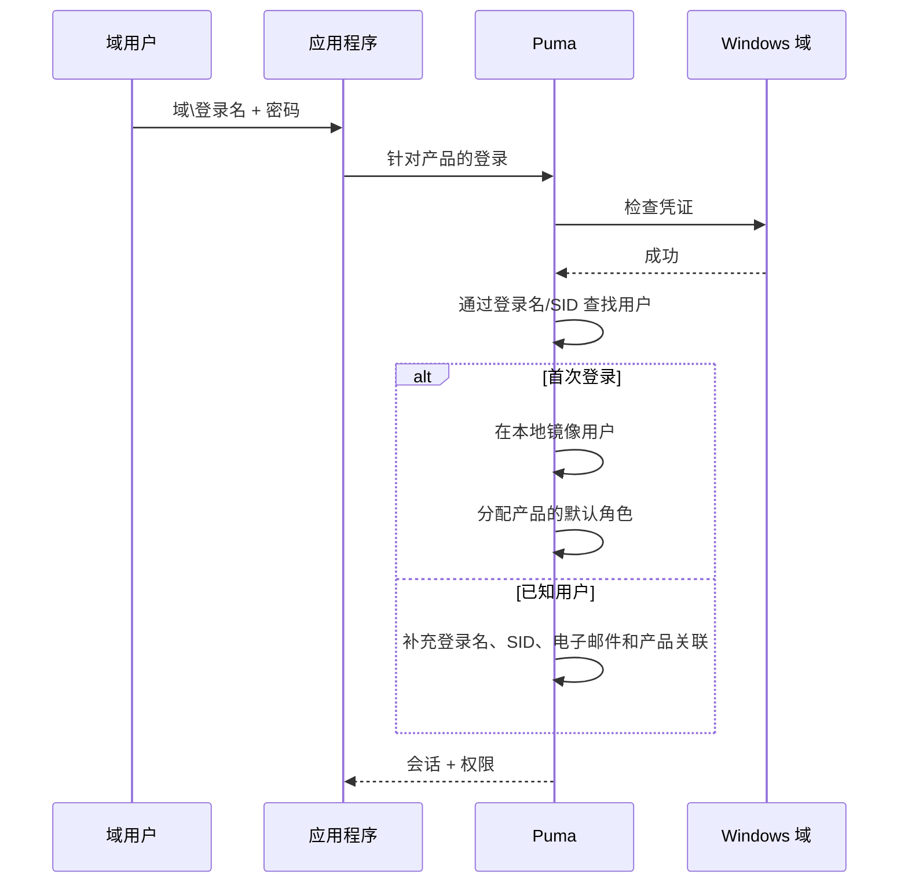

首次域登录成功时：

- Puma 创建一条内部用户记录，
- 将身份验证系统标记为 `LDAP`，
- 在可用范围内采用 SID、显示名和电子邮件，
- 按需创建与产品相关的角色 `Guest` 和 `Default`，
- 为用户分配该产品的默认角色。

随后，管理员可以为该镜像创建的用户分配更多 Puma 角色和组。密码仍将
针对 Windows 域进行检查。

### 7.2 启用与禁用

`LdapEnabled` 在 Puma 默认设置中处于启用状态，并通过设置区域 **LDAP** 提供。
如果仅使用本地 Puma 账户，则应禁用该功能，以避免不必要的域检查和
误导性的消息。

### 7.3 前提条件

- Puma 运行在 Windows 下。
- 服务器能够访问域和域控制器。
- 操作系统、DNS 和信任关系配置正确。
- 用户使用 Windows 接受的登录名，通常为 `DOMÄNE\benutzer`。
- 已在 Puma 中启用 LDAP。

### 7.4 故障排查

| 症状 | 检查 |
|---|---|
| 域登录失败，本地登录正常 | 检查域可访问性、DNS、时间、登录格式和 `LdapEnabled` |
| 用户被重复创建 | 检查统一的登录格式和 SID 解析 |
| 用户首次登录后权限过少 | 检查默认角色以及更多的角色/组分配 |
| 本地登录在日志中产生域错误 | 如不需要则禁用 LDAP |
| Linux 服务器无法对 AD 进行身份验证 | 当前实现是 Windows 专属的 |

## 8. 个人访问令牌（PAT）

### 8.1 用途

PAT 是用于自动化、CI/CD、监控服务和服务间通信的长期凭证。一个 PAT 属于
某个用户，包含一个产品 ID 和明确的权限范围（scope）。

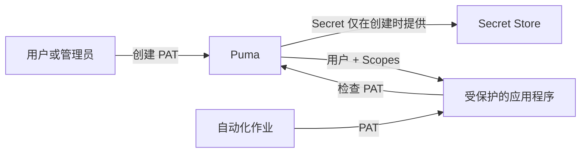

### 8.2 生命周期

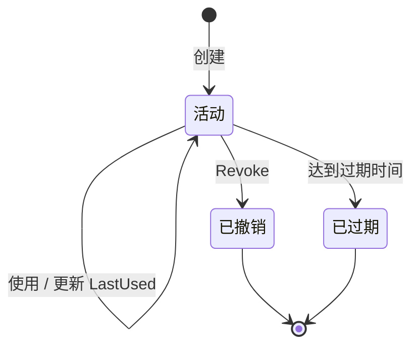

当令牌存在、处于活动状态、未被撤销且未过期时，它是有效的。已撤销的
记录在列表中仍然可见，并被报告为非活动状态。

### 8.3 创建 PAT

**前置条件：** 所有者或管理员已通过会话登录。

1. 分配一个与用途相关的名称，例如 `CI Produktion Lesen`。
2. 确定目标用户和产品 ID。
3. 仅选择最小必要的 scope。
4. 尽可能设置 ISO-8601 格式的过期日期。
5. 立即将 secret 保存到 Secret Store 中。
6. 不要将 secret 复制到源代码、构建日志或工单中。

匿名调用方不得创建 PAT。普通用户可以管理自己的 PAT，但不能管理其他
用户的 PAT。管理员可以管理其他用户的 PAT。

### 8.4 使用 PAT

SDK 数据模型区分 `TokenType::Session` 和 `TokenType::PersonalAccessToken`。
对于非交互式访问，PAT 通过 `ValidatePersonalAccessToken()` 进行检查；应用程序
随后仅使用返回的 scope，并额外检查产品上下文。

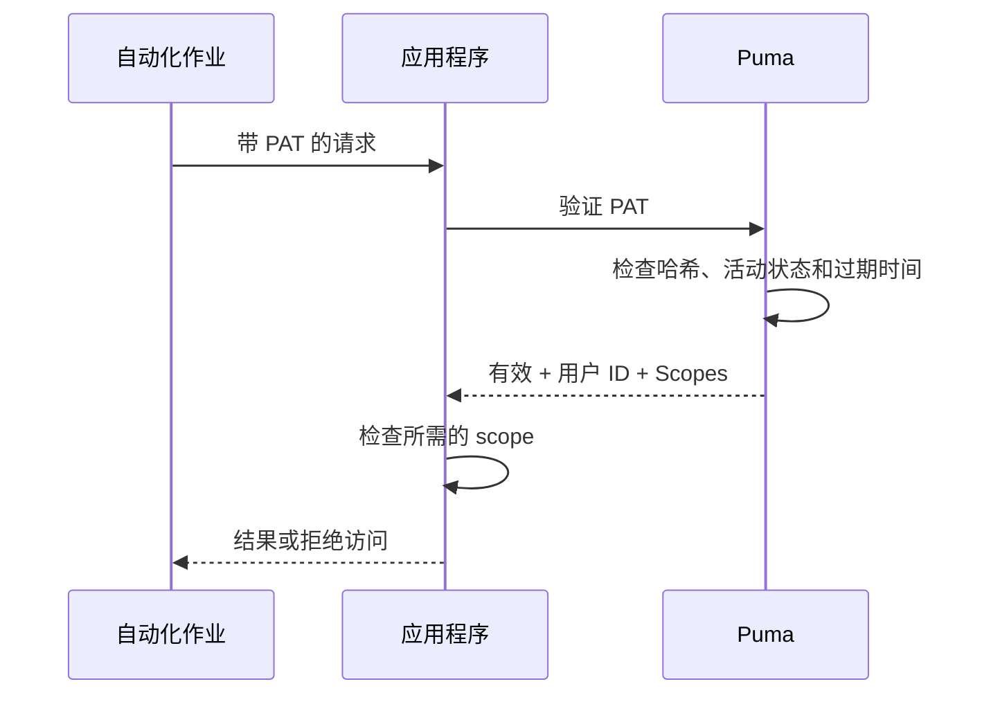

### 8.5 撤销 PAT

1. 根据名称、产品、创建时间和最后使用时间识别令牌。
2. 撤销令牌 ID。
3. 之后验证必须失败。
4. 若怀疑 secret 泄露，检查相关系统和日志。
5. 签发一个 scope 更小、带有新过期日期的替代 PAT。

### 8.6 已知的接口特性

当前的 GraphQL 验证响应会返回用户 ID 和 scope，但不返回令牌 ID。因此
`ValidatePersonalAccessToken()` 目前无法在验证结果中重建 `productId`。
产品上下文必须在签发方或消费方系统处额外知晓并进行检查。

## 9. 运维与安全

### 9.1 职责

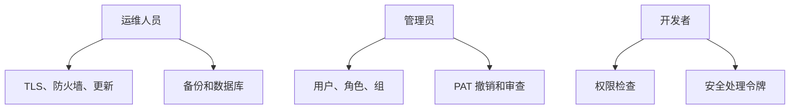

### 9.2 定期检查

- 移除或封禁没有当前业务需求的用户。
- 按最小权限原则检查角色和组。
- 撤销旧的、从未使用或已过期的 PAT。
- 按人分配管理员权限。
- 备份数据库和设置；测试恢复。
- 监控证书过期。
- 调查失败的登录和异常的令牌使用。
- 保持服务器和 ImtCore/Puma 组件为最新。

### 9.3 备份与恢复

一致的备份至少包含数据库和 Puma 设置。证书和密钥应单独备份并特别保护。
恢复之后，必须在受控环境中测试数据库迁移、登录、角色、组、会话处理
以及 PAT 验证。

## 10. 故障诊断

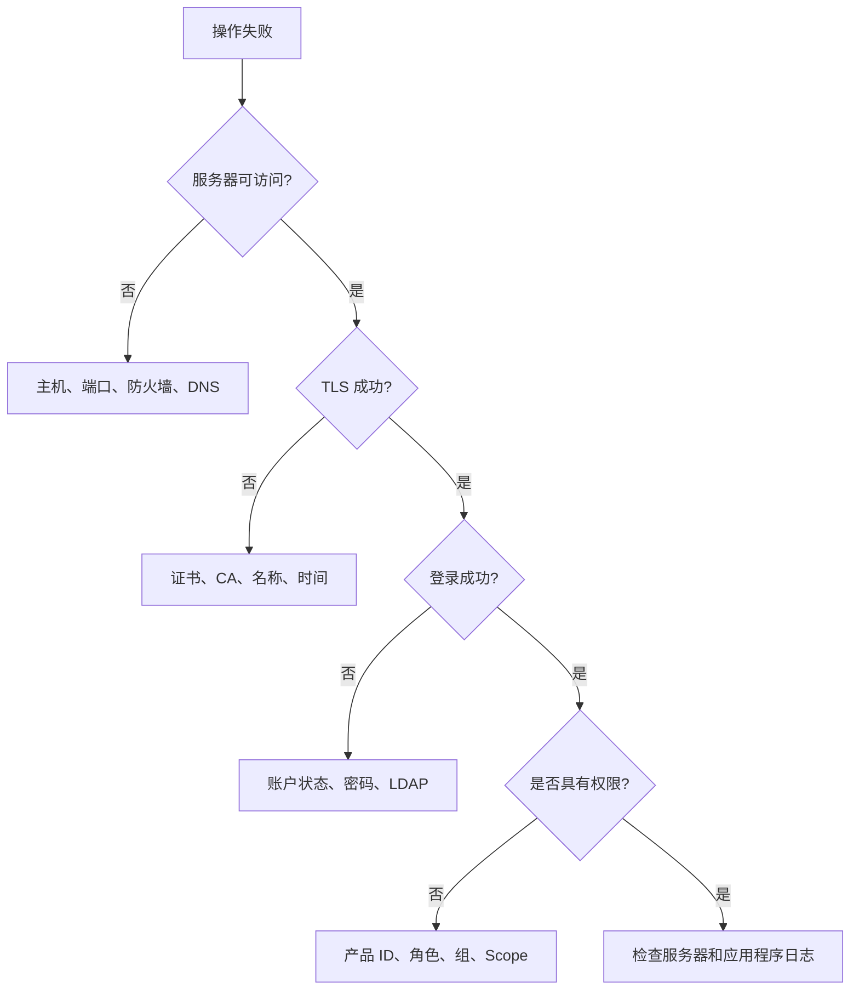

| 问题 | 可能原因 | 措施 |
|---|---|---|
| 连接被拒绝 | 主机/端口错误或服务器未启动 | 检查 HTTP 和 WS 端口以及进程 |
| TLS 错误 | 证书不受信任或名称错误 | 检查证书链、主机名和时间 |
| 登录失败 | 凭证、账户状态或 LDAP | 有针对性地检查身份验证路径 |
| `HasPermission()` 保持为 `false` | 产品 ID 错误或缺少角色 | 检查产品 ID 和有效角色 |
| 用户操作返回空 ID | 登录名已存在或缺少权限 | 检查唯一性和管理员权限 |
| PAT 创建返回空 secret | 未登录、所有者错误或 scope 为空 | 检查会话、用户 ID 和 scope |
| PAT 无效 | 已撤销、已过期或被更改 | 检查令牌元数据并重新签发 |
| 设置丢失 | 缺少写入权限 | 检查路径和服务账户 |

## 11. 验收清单

### 服务器

- [ ] 已选择合适的数据库变体
- [ ] 数据库连接和迁移成功
- [ ] 启用了带有效证书的 HTTPS 和 WSS
- [ ] 已记录端口和防火墙
- [ ] 已测试备份和恢复
- [ ] 已设置日志监控

### 权限模型

- [ ] 已确定唯一的产品 ID
- [ ] 已记录权限 ID
- [ ] 按任务而非按人建模角色
- [ ] 为经常出现的团队创建了组
- [ ] 已设置个性化管理员账户
- [ ] 已针对被拒绝的操作执行负向测试

### LDAP

- [ ] 已满足 Windows 和域的前提条件
- [ ] 已测试首次域登录
- [ ] 已正确采用 SID 和用户数据
- [ ] 已检查默认角色
- [ ] 如不需要则已禁用 LDAP

### PAT

- [ ] 已分配最小权限 scope
- [ ] 已设置过期日期
- [ ] Secret 仅存储在 Secret Store 中
- [ ] 已测试撤销
- [ ] 已记录轮换和负责人

## 12. 延伸文档

- [AuthClientSdk 参考](../AuthClientSdk.md)
- [AuthServerSdk 参考](../AuthServerSdk.md)
- [依赖项](../Dependencies.md)
- [Puma 安全策略](../../SECURITY.md)
- [精简演示文稿](Puma_Kompakt_DE.pptx)
